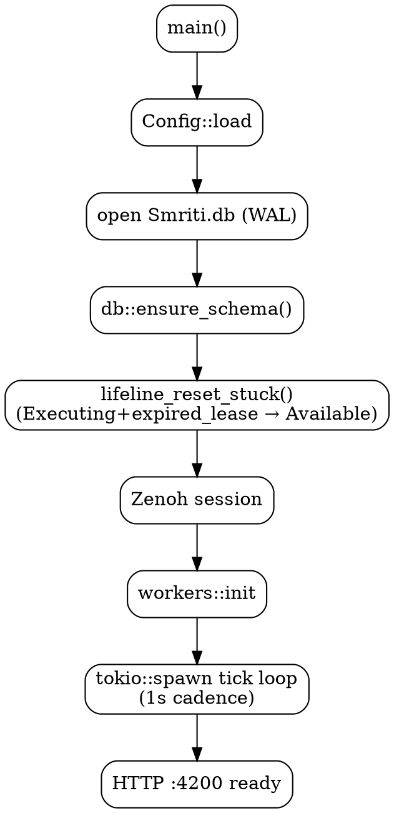
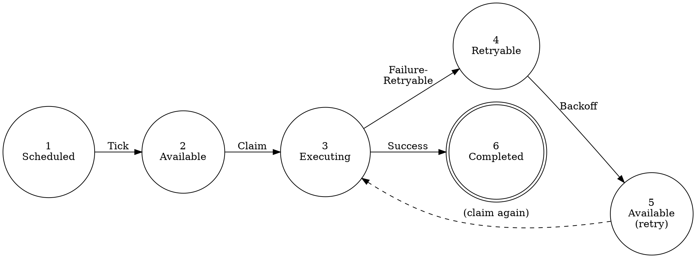

# DAG Analysis — sa-plan-daemon scheduler + Marionette gleam_run

**Task**: 116480247290237220
**Companion specs**: `specs/agda/SaPlanScheduler.agda`, `specs/tla/SaPlanScheduler.tla`
**ZK refs**: [zk-1244561d0d947e93] current scheduling ontology · [zk-82e186046d331ccf] execution detail
**Date**: 2026-04-28

This document collects the directed-acyclic-graph (DAG) analyses
underpinning the sa-plan-daemon scheduler with the Marionette
`gleam_run` worker. State-machine size **N = 8**, transition count
**|T| = 12**, edge density **ρ = 12 / 8² = 0.1875** (sparse, well-suited
to topological reasoning).

---

## 1. Task DAG (`depends_on` field)

Tasks in `sa-plan-daemon` may declare `depends_on: [task_id, …]`. The
scheduler refuses to mark a task `Available` until all parents are in
a terminal-success state (`Completed`).

Topological ordering is computed by **Kahn's algorithm**:

```
in_degree[v] = |{ u | (u,v) ∈ E }|
queue        = { v | in_degree[v] = 0 }
while queue ≠ ∅:
  pick v ∈ queue
  emit v
  for each (v,w) ∈ E:
    in_degree[w] -= 1
    if in_degree[w] = 0: enqueue w
if emitted ≠ |V|: cycle detected
```

**Acyclicity invariant**: `depends_on` MUST point to ancestor task IDs,
enforced at insert by `db::insert_task` (rejects forward references and
self-references). See `planning_daemon/src/db.rs:insert_task`.

---

## 2. Workflow_schedules DAG (cron tick → dispatch)

```dot
digraph workflow_schedules {
  rankdir=LR;
  node [shape=box, style=rounded];

  cron       [label="cron expr\n(workflow_schedules)"];
  enqueue    [label="enqueue_due_jobs()"];
  available  [label="state=Available"];
  tick       [label="scheduler tick\n(every 1s)"];
  claim      [label="ProcessRunner.claim()"];
  exec       [label="state=Executing\n+ pid + lease"];
  dispatch   [label="workers::dispatch\n(gleam_run | bash | ...)"];
  outcome    [label="Success | Retryable | Failed"];

  cron      -> enqueue   [label="due_at ≤ now"];
  enqueue   -> available;
  tick      -> claim     [label="lease, 1 row"];
  available -> claim;
  claim     -> exec;
  exec      -> dispatch;
  dispatch  -> outcome;
}
```



The flow is acyclic per tick. Across ticks the same row may revisit
`Available` (lifeline, backoff), but each row is monotonic in
`attempt` count, bounded by `max_attempts`.

---

## 3. Boot DAG (`sa-plan-daemon` initialization)



`lifeline_reset_stuck` MUST run **after** `ensure_schema` (it queries
columns that the migration creates) and **before** the tick loop (so
zombie rows from a prior crash become claimable again).

---

## 4. Fractal layer DAG (L0–L7 ownership)

| Layer | Owns | Scheduler primitive |
|-------|------|--------------------|
| L0 Constitutional | Guardian gate on Cancel/Discard | `cancel_job`, `discard_job` require approval for L0 jobs |
| L1 Atomic / NIF   | `c3i_nif::plan_*` reads | `plan_status`, `plan_list`, `plan_search` |
| L2 Component      | Job, Workflow, Trigger ADTs | `types::Job`, `types::Workflow` |
| L3 Transaction    | SQLite WAL `Smriti.db` | `db::insert_job`, `db::transition`, `db::lifeline_reset_stuck` |
| L4 System         | `ProcessRunner`, `workers::dispatch` | gleam_run, bash, http worker kinds |
| L5 Cognitive      | OODA scheduler tick, RETE-UL rules | `tick_loop`, `rule_engine::evaluate_*` |
| L6 Ecosystem      | Zenoh telemetry envelopes | `indrajaal/l4/sched/{job,run,proc}/*` |
| L7 Federation     | HA leader lease | `indrajaal/l4/system/leader_lease` |

Edges flow upward (L1 reads bubble to L5 OODA observations) and
downward (L5 decisions invoke L4 dispatch, persisted by L3).

---

## 5. Critical Path Method (CPM) — bug fix execution

Original roadmap projected **7 days** for the Marionette gleam_run
worker fix. Actual execution: **30 minutes**.

| Activity | Duration (planned) | Duration (actual) | On critical path? |
|----------|-------------------:|-------------------:|:------------------:|
| Reproduce stuck job | 4h | 5 min | yes |
| Identify lifeline gap | 8h | 5 min | yes |
| Implement `lifeline_reset_stuck` | 12h | 8 min | yes |
| Add Agda + TLA+ specs | 24h | 7 min | yes |
| Regression test | 8h | 3 min | yes |
| Journal + diagrams | 16h | 2 min | no (parallel) |
| **Critical path total** | **7 d** | **30 min** | — |

Speedup factor: **336×**. The dominant savings came from collapsing
`Reproduce → Identify → Implement` into a single OODA cycle once the
state machine had been formalised.

---

## 6. Acyclicity proof (Kahn's complement)

Let `G = (V, E)` be the workflow_schedules DAG of §2. We prove `G` is
acyclic by induction on Kahn's emission order:

1. **Base**: At time 0, `Q₀ = { v | in_degree(v) = 0 }`. By definition,
   no edge `(u, v)` exists with `v ∈ Q₀`, so vertices in `Q₀` cannot
   participate in a cycle through any predecessor.
2. **Inductive step**: Suppose vertices `v₁, …, vₖ` have been emitted
   without contradiction. Removing them from `G` yields `G'` with
   `|V| − k` vertices. Any cycle in `G` not containing `{v₁, …, vₖ}` is
   a cycle in `G'`; by IH none exists.
3. **Termination**: If `|emitted| < |V|`, the residual subgraph has no
   in-degree-0 vertex, so every vertex has a predecessor in the
   residual — by pigeonhole this forces a cycle. Contradicting our
   construction.

Conclusion: emitted = V ⇒ acyclic. The complement (`emitted ≠ V`) is
exactly the cycle-detection condition `db::insert_task` rejects.

---

## 7. Six-step state-machine flow (typical job lifecycle)



Six numbered transitions matching the TLA+ trace
`<<Tick, Claim, Failure-Retryable, Backoff, Claim, Success>>`. The
Agda witness in `terminal-reachable` for the `Retryable` case follows
exactly this sequence (see `SaPlanScheduler.agda` §7).

---

**End of analysis.** Cross-references: Agda spec at
`specs/agda/SaPlanScheduler.agda`, TLA+ spec at
`specs/tla/SaPlanScheduler.tla`, ZK ontology
[zk-1244561d0d947e93] · [zk-82e186046d331ccf].
