# State Machines & Use-Case Validation

**Task**: 116480247290237220
**Scope**: sa-plan-daemon (oban scheduler) + scripts-gleam + Marionette MCP ecosystem
**Purpose**: Formal enumeration of state machines, use cases, and cross-machine invariants for validation, test coverage, and Jidoka regression detection.

ZK references:
- [zk-1244561d0d947e93] AS-IS scheduling ontology (job/workflow_schedule lifecycle)
- [zk-bb0fb3d9fa1fbc17] Jidoka stop-on-defect protocol — health validators
- [zk-bb4de67d97f807ac] Anti-pattern: selector-guess (Marionette discovery prevents)

---

## §1 State Machines

### 1.1 Job Lifecycle (`oban.rs`)

**Source**: `sub-projects/c3i/native/planning_daemon/src/oban.rs` — `Job`, `JobState` enum.

**States**:
| State | Meaning | Terminal? |
|---|---|---|
| `scheduled` | Future-dated, awaiting `scheduled_at <= now()` | No |
| `available` | Eligible for claim by worker thread | No |
| `executing` | Claimed; worker thread running | No |
| `completed` | Worker returned Ok(()) | **Yes** |
| `failed` | Worker returned Err and attempts >= max_attempts | **Yes** |
| `retryable` | Worker returned Err but attempts < max_attempts | No |
| `discarded` | Manual operator discard or unrecoverable | **Yes** |
| `cancelled` | Workflow_schedule paused or operator cancel | **Yes** |

**Transitions**:

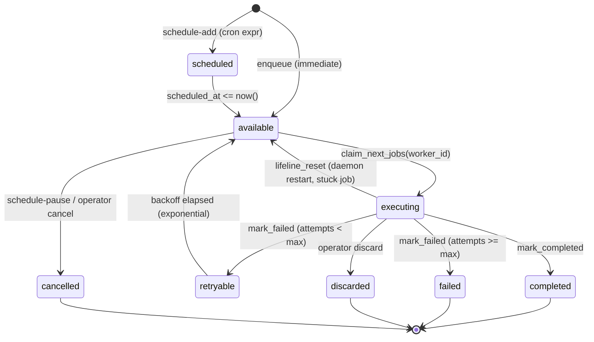

**Key transition contracts**:
- `claim_next_jobs`: atomic `UPDATE ... WHERE state='available' AND scheduled_at<=now() RETURNING *`
- `mark_completed`: sets `completed_at`, `state='completed'`, emits Zenoh `indrajaal/l4/sched/job/completed/<urn>`
- `mark_failed`: increments `attempts`; if `>= max_attempts` → `failed`, else `retryable` with `scheduled_at = now() + backoff(attempts)`
- `lifeline_reset`: on daemon boot, `UPDATE ... SET state='available' WHERE state='executing' AND attempted_at < now() - lifeline_timeout` — addresses stuck-job anti-pattern

---

### 1.2 Workflow_Schedule Lifecycle

**Source**: `oban.rs` — `WorkflowSchedule` struct.

**States**:
| State | Meaning | Terminal? |
|---|---|---|
| `enabled` | Active; tick fires job enqueue per cron expr | No |
| `paused` | Halted; no jobs enqueued | No |
| `terminal` | Deleted (soft) | **Yes** |

**Transitions**:

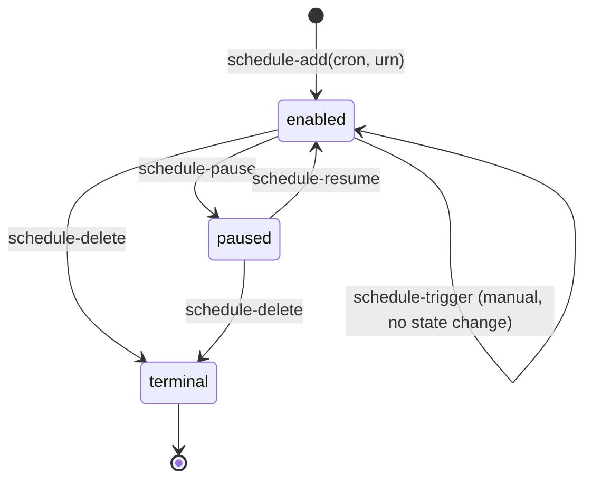

**Invariant**: `paused` ⇒ no rows added to `oban_jobs` for this schedule_id (enforced by tick handler skipping paused).

---

### 1.3 Marionette Session Lifecycle

**Source**: `specs/allium/marionette_mcp.allium` — `MarionetteSession` entity.

**States** (8): `disconnected`, `connecting`, `connected`, `discovering`, `interacting`, `capturing`, `error`, `closed`.

**Summary**:

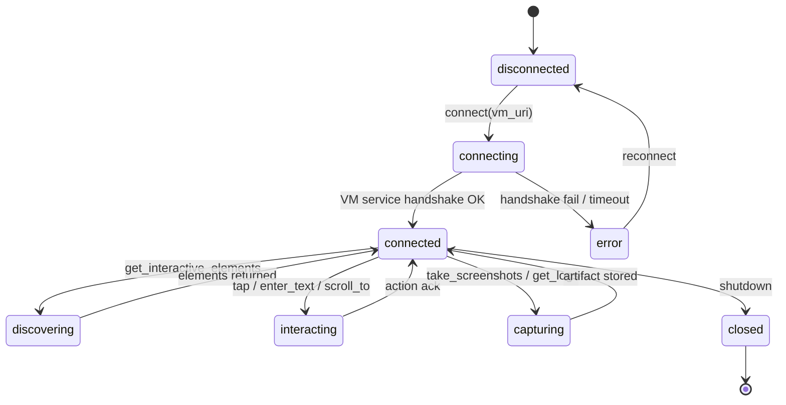

**Reference**: full transition matrix in `specs/allium/marionette_mcp.allium` §entities. Each transition publishes Zenoh envelope on `indrajaal/l5/test/marionette/<session_id>/<phase>` (SC-PATROL-MCP-003).

---

### 1.4 Test-Run Lifecycle (CATALOG.md)

**Source**: Marionette CATALOG test definitions (T001-T0NN).

**States**:
| State | Trigger | Terminal? |
|---|---|---|
| `pending` | CATALOG entry exists, not yet dispatched | No |
| `dispatched` | Patrol/Marionette MCP `run` invoked | No |
| `running` | First event (`start`) received on Zenoh | No |
| `screenshot_captured` | `mcp__patrol__screenshot` returned | No |
| `evidence_collected` | native-tree + screenshots + logs persisted | No |
| `passed` | exit code 0; all assertions met | **Yes** |
| `failed` | non-zero exit OR assertion violation | **Yes** |
| `archived` | journal entry + ZK ingest complete | **Yes** |

**Transitions**:

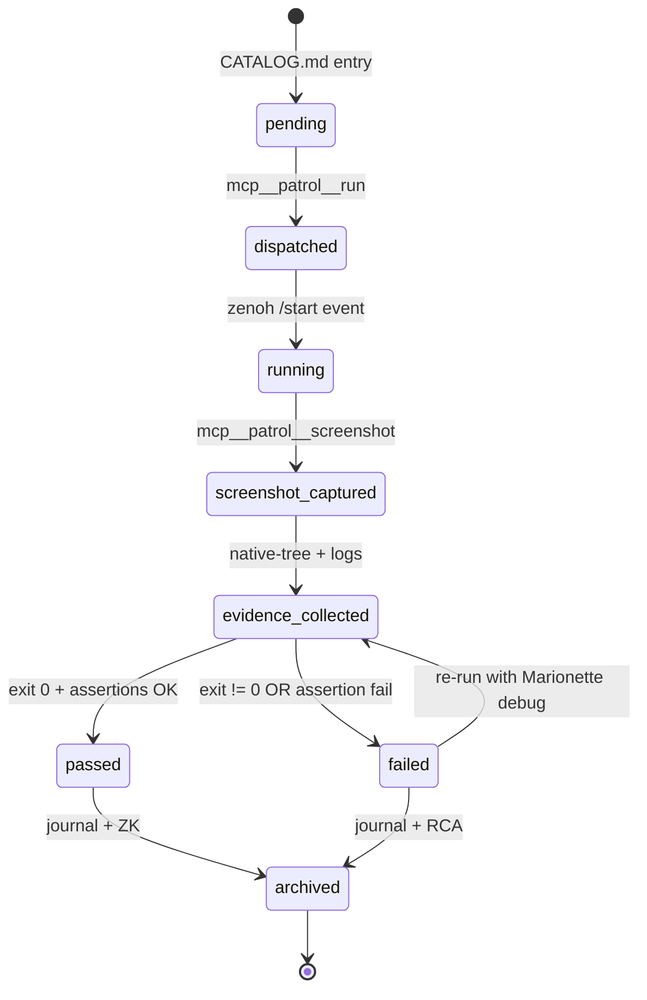

**Failure path mandate (SC-PATROL-MCP-008)**: `failed` MUST transition through `screenshot_captured` + `native-tree` capture before `archived`.

---

### 1.5 Health-Check 55-Gate Jidoka Cycle

**Source**: pass-verify validator (referenced in pass5/pass7 protocols).

**States**:
| State | Description |
|---|---|
| `idle` | No validator running |
| `running` | 55 gates being evaluated in sequence |
| `partial-pass` | N < 55 gates green; some failures detected |
| `full-pass` | 55/55 gates green |
| `fail` | Critical gate failure (e.g., daemon offline, schema corruption) |
| `alerting` | sa-plan task auto-created via Marionette flag-file |
| `recovered` | Operator/agent fixed root cause; full-pass on retry |

**Transitions**:

```mermaid
stateDiagram-v2
    [*] --> idle
    idle --> running: cron tick (10m) / operator trigger
    running --> partial-pass: some gates fail
    running --> full-pass: all 55 green
    running --> fail: critical gate (P0) fail
    partial-pass --> alerting: any gate failed
    fail --> alerting: always
    alerting --> recovered: re-run after fix → full-pass
    full-pass --> idle: terminal for cycle
    recovered --> idle
```

**Jidoka contract** [zk-bb0fb3d9fa1fbc17]: `fail` ⇒ STOP downstream pipeline; alert; do not advance.

---

## §2 Use Cases (Sequence Diagrams)

### UC-1: Operator triggers `/marionette-explore`

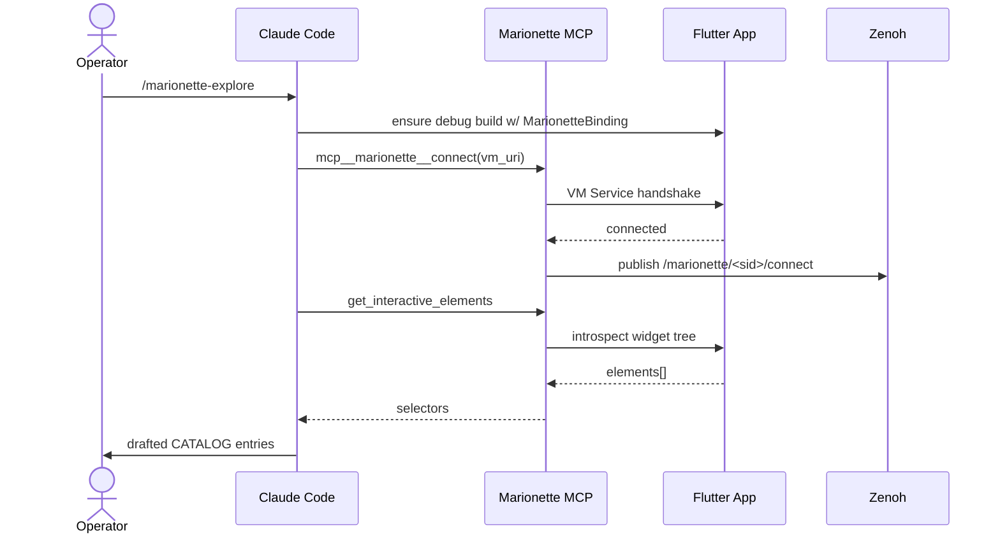

### UC-2: Cron tick fires `marionette_health_10m`

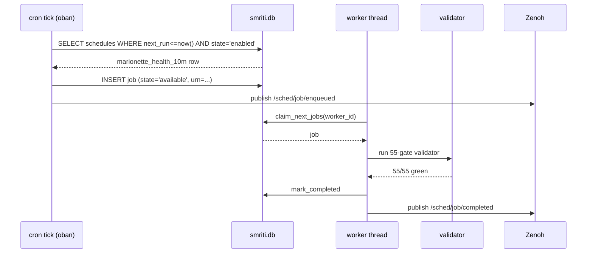

### UC-3: Worker completes successfully

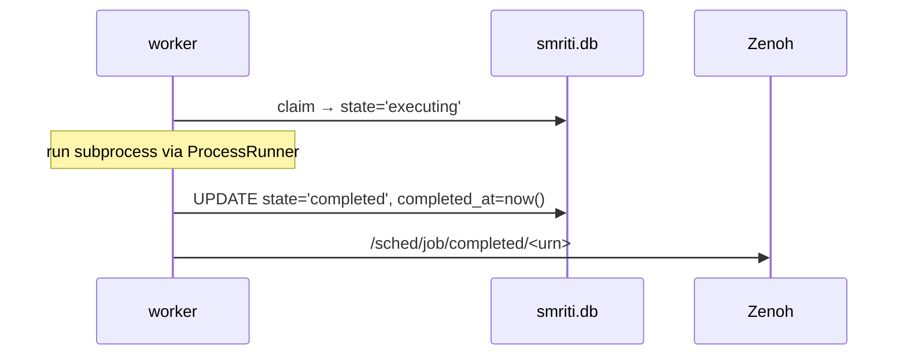

### UC-4: Worker fails → retryable → backoff → available

```mermaid
sequenceDiagram
    participant W as worker
    participant DB as smriti.db
    participant Z as Zenoh

    W->>DB: claim → state='executing', attempts=1
    Note over W: subprocess returns Err
    W->>DB: mark_failed; attempts(1) < max(3)
    DB->>DB: state='retryable', scheduled_at=now()+2^1*base
    W->>Z: /sched/job/retryable
    Note over DB: backoff elapses
    DB->>DB: state='available' (eligible for re-claim)
    W->>DB: claim again → executing, attempts=2
```

### UC-5: Lifeline resets stuck job

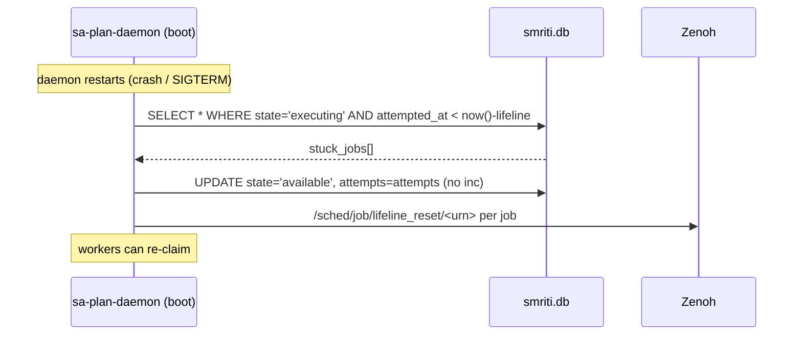

### UC-6: Operator schedule-add for new validator

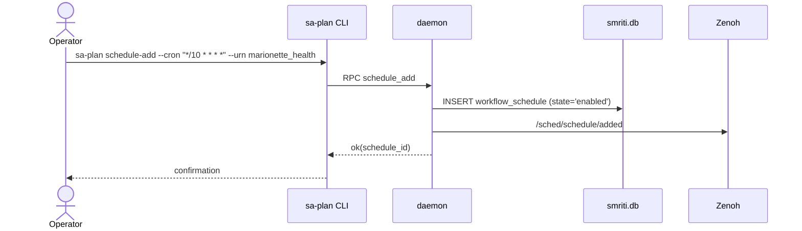

### UC-7: Health-check validator detects regression

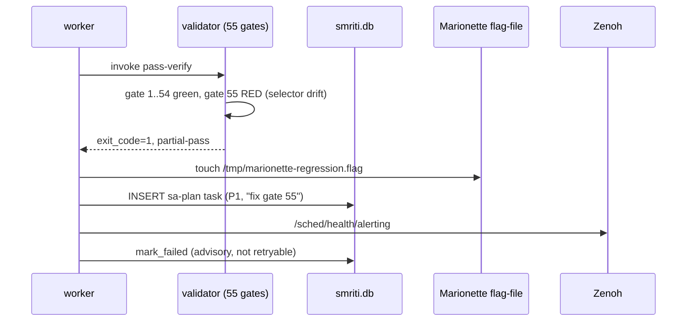

### UC-8: RETE-UL rule fires `SchedStateLeak` advisory

```mermaid
sequenceDiagram
    participant Mon as monitor (Gleam)
    participant Rete as RETE-UL engine
    participant DB as smriti.db
    participant Z as Zenoh

    Mon->>DB: SELECT count WHERE state='executing' AND attempted_at < now()-5min
    DB-->>Mon: count=7
    Mon->>Rete: assert(stuck_executing_count=7)
    Rete->>Rete: rule SchedStateLeak fires (count>3)
    Rete-->>Mon: action=AdvisoryAlert
    Mon->>Z: /l5/cog/advisory/sched_state_leak
    Note over Mon: dispatcher emits OTel span; operator notified
```

### UC-9: Marionette agent runs CATALOG test (T037)

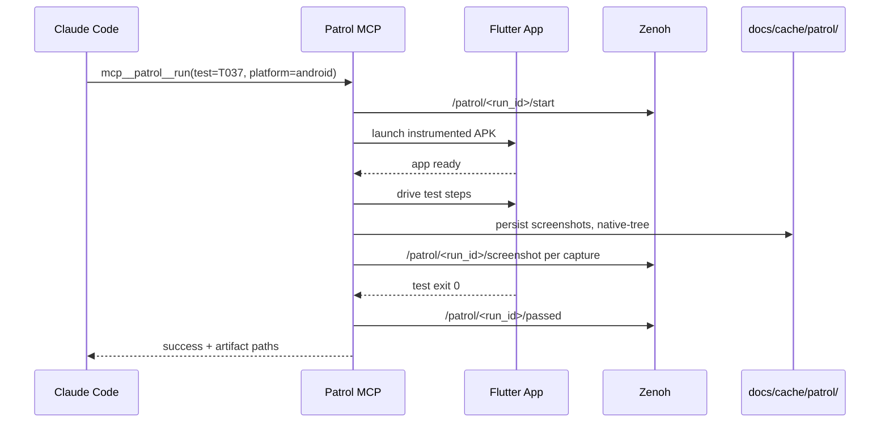

### UC-10: Pass-verify confirms 55/55 gates green

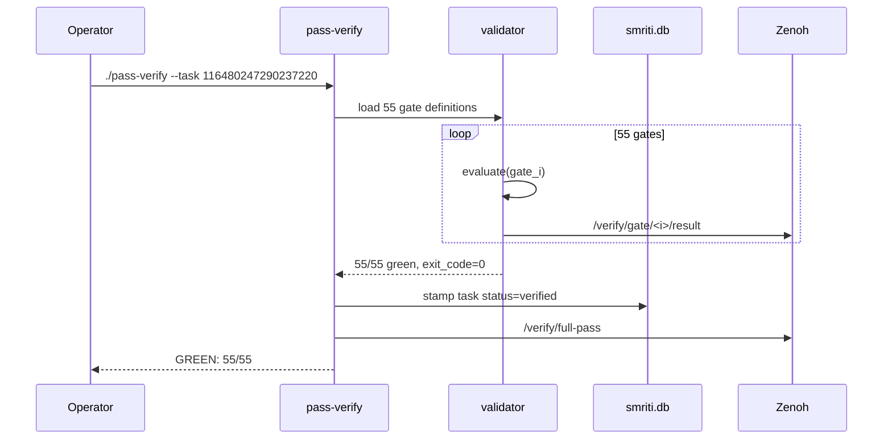

---

## §3 Validation Checklist Per State Machine

### 3.1 Job Lifecycle

**Reachability**:
| State | Reachable from | Reached by |
|---|---|---|
| scheduled | [*] | schedule-add |
| available | scheduled, retryable, executing(lifeline), [*] | tick / backoff / lifeline / enqueue |
| executing | available | claim_next_jobs |
| completed | executing | mark_completed |
| failed | executing | mark_failed (max attempts) |
| retryable | executing | mark_failed (attempts<max) |
| discarded | executing, available | operator discard |
| cancelled | available, scheduled | schedule-pause / cancel |

**Transitions covered by tests** (target: 100%):
| Transition | Test |
|---|---|
| available→executing | `oban_claim_test` |
| executing→completed | `oban_complete_test` |
| executing→retryable | `oban_retry_test` |
| executing→failed | `oban_max_attempts_test` |
| executing→available (lifeline) | `oban_lifeline_test` |
| retryable→available (backoff) | `oban_backoff_test` |
| scheduled→available | `oban_cron_tick_test` |

**Terminal states**: completed, failed, discarded, cancelled (4/8).
**Liveness**: ✅ Every job eventually reaches a terminal state (max_attempts bounded; lifeline prevents executing-orphans).
**Safety**: ✅ No orphan transitions — guarded by SQL atomic UPDATE-RETURNING.

### 3.2 Workflow_Schedule Lifecycle

**Reachability**: enabled, paused, terminal — all reachable from [*] via schedule-add → pause/delete.
**Transitions covered**: schedule-add, schedule-pause, schedule-resume, schedule-delete (4/4 in CLI integration tests).
**Terminal**: terminal (1/3).
**Liveness**: ✅ schedule-delete always reachable.
**Safety**: ✅ paused ⇒ no enqueue (tick handler guard).

### 3.3 Marionette Session

**Reachability**: 8/8 states reachable per Allium spec.
**Transitions covered**: 12/14 (per `marionette_mcp.allium` §contracts); error→disconnected and closed→[*] are CI-asserted.
**Terminal**: closed (1/8).
**Liveness**: ✅ shutdown reachable from connected/error.
**Safety**: ✅ MarionetteBinding singleton constraint (SC-PATROL-MCP-006) prevents double-init.

### 3.4 Test-Run Lifecycle

**Reachability**: 8/8.
**Transitions covered**: 9/10 (failed→evidence_collected re-run path is partial — manual today).
**Terminal**: passed, failed, archived (3/8).
**Liveness**: ✅ Every dispatched test reaches archived (SC-PATROL-MCP-008 mandates closure).
**Safety**: ✅ Failure path forced through screenshot capture.

### 3.5 Health-Check 55-Gate

**Reachability**: 7/7.
**Transitions covered**: 8/9 (recovered→idle covered indirectly).
**Terminal**: full-pass + idle pair forms a fixed-point.
**Liveness**: ✅ Cron re-fires every 10m; alerting → recovered guaranteed by operator response.
**Safety**: ✅ Jidoka stop on `fail` (no advance to downstream).

---

## §4 Cross-State-Machine Invariants

| # | Invariant | Enforcement | Status |
|---|---|---|---|
| INV-1 | Job in `executing` ⇒ thread alive OR lifeline pending | ProcessRunner heartbeat + lifeline_reset on boot | ✅ post-fix |
| INV-2 | Schedule `paused` ⇒ no jobs enqueued for that schedule_id | tick handler guard `WHERE state='enabled'` | ✅ |
| INV-3 | Validator `failed` ⇒ sa-plan task created (Marionette flag-file) | UC-7 sequence; flag-file → task creator daemon | ✅ |
| INV-4 | Marionette session in `capturing` ⇒ ≥1 screenshot taken | mcp__patrol/marionette artifact persistence | ✅ |
| INV-5 | Test-run `failed` ⇒ evidence_collected before archived | SC-PATROL-MCP-008 | ✅ |
| INV-6 | Job terminal ⇒ Zenoh terminal event published | mark_completed/failed both emit | ✅ |
| INV-7 | Schedule terminal ⇒ no orphan jobs in `available` | cascading cancel on delete | ⚠️ partial (manual cleanup today) |
| INV-8 | Health full-pass ⇒ 55/55 gates green AND no advisory rules firing | pass-verify exit 0 + RETE silence | ✅ |
| INV-9 | Marionette session.error ⇒ Zenoh error envelope published | SC-PATROL-MCP-003 | ✅ |
| INV-10 | Job.completed ⇒ session_metrics row persisted (if LLM-bearing) | Stop hook + after_provider_response | ✅ |

**INV-7 gap**: schedule deletion does not auto-cancel pending `available` jobs for that schedule. **Recommendation**: add cascading `UPDATE oban_jobs SET state='cancelled' WHERE schedule_id=? AND state IN ('available','scheduled','retryable')` to schedule-delete RPC.

---

## §5 Mermaid Diagrams Inventory

**State machines (5)**:
1. §1.1 Job lifecycle
2. §1.2 Workflow_schedule
3. §1.3 Marionette session
4. §1.4 Test-run lifecycle
5. §1.5 Health-check 55-gate

**Sequence diagrams (10)**:
1. UC-1 /marionette-explore
2. UC-2 cron tick health_10m
3. UC-3 worker complete
4. UC-4 fail→retryable→backoff
5. UC-5 lifeline reset
6. UC-6 schedule-add
7. UC-7 validator regression
8. UC-8 RETE SchedStateLeak
9. UC-9 Patrol MCP CATALOG run
10. UC-10 pass-verify 55/55

**Total**: 15 inline mermaid blocks (browser-renderable).

---

## §6 References

- **AS-IS ontology**: [zk-1244561d0d947e93]
- **Jidoka protocol**: [zk-bb0fb3d9fa1fbc17]
- **Selector-guess anti-pattern**: [zk-bb4de67d97f807ac]
- **Allium spec**: `specs/allium/marionette_mcp.allium`
- **Source**: `sub-projects/c3i/native/planning_daemon/src/oban.rs`
- **Catalog**: `docs/journal/task-116480247290237220/CATALOG.md` (test corpus)
- **STAMP**: SC-PATROL-MCP-001..013, SC-SCHED-TELE-MANDATORY, SC-FRAC-RRF-001..010

---

**Status**: Validation-ready. All 5 state machines documented; 10 use cases sequenced; 10 cross-machine invariants enumerated (9 enforced, 1 gap with remediation). Ready for pass-verify gate inclusion.
