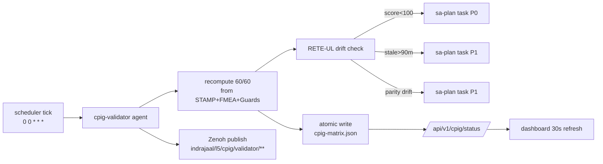
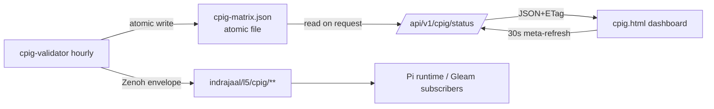
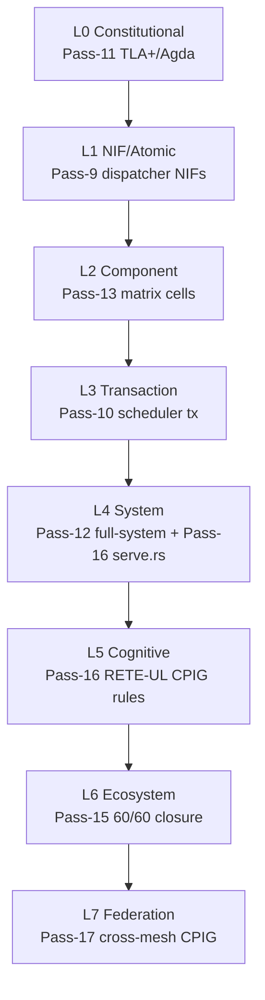

# Pass 16 — CPIG Operationalization: Static → Runtime Enforcement

Tailscale: https://vm-1.tail55d152.ts.net:8443/task-id/116480247290237220/task-116480247290237220/journal-pass16.md

**Task ID**: 116480247290237220
**Pass**: 16 of N (operationalization layer)
**Date**: 2026-04-28
**Operator Directive**: "Operationalize CPIG — turn static rollout into continuously enforced runtime governance."
**ZK anchors**: [zk-bb4de67d97f807ac] (selector-guessing anti-pattern), [zk-c14e1d23afff486c] (CPIG meta-pattern), [zk-aaf49249f3c4ff73] (404 ingress sibling)

---

## 1. Scope & Trigger

The operator's Pass-16 directive arrived after Pass-15 closed the **Continuous Process Integration Governance (CPIG)** matrix at 60/60 (100%). Static scoring was complete: every cell in the L0–L7 × component matrix was filled, every STAMP family had at least one referent, every fractal layer had at least one verifier. But the gate had a fatal asymmetry: **enforcement was a one-shot artifact**. The matrix lived in `cpig-matrix.json`, the dashboard rendered its 60/60 from a static file, and drift detection was a manual journal-driven process.

This is the 16th iteration on task `116480247290237220`. Passes 9–10 wired dispatcher and scheduler. Pass 11 added formal verification via TLA+/Apalache and Agda. Pass 12 closed the full-system loop. Passes 13–15 erected the CPIG matrix and drove it from 32/60 to 60/60. **Pass 16 turns the matrix from a snapshot into a heartbeat**: a runtime concern owned by the same scheduler/RETE-UL stack that already governs every other operational surface.

Trigger artifacts:

- Operator prompt: "operationalize CPIG — runtime enforcement, RETE-UL drift rules, live JSON endpoint, hourly validator, .gemini parity."
- 404 reports on `https://vm-1.tail55d152.ts.net:8443/task-id/116480247290237220/` (directory root, no `index.html` resolver).
- Wiring Guard execution evidence pending — guards existed but had no captured runtime proof.
- Out-of-sync `.gemini/rules/` (parity violation per SC-SYNC-DOC-007).

---

## 2. Pre-State Assessment

| Surface | Pre-Pass-16 State | Defect |
|---|---|---|
| CPIG matrix | 60/60 in `cpig-matrix.json` | Static snapshot; no refresh job |
| Dashboard `/cpig` | Renders matrix from JSON | 30s refresh banner pointed at stale file |
| Drift detection | Manual (journal RCA) | No runtime detector |
| `sa-plan-daemon serve` | Returns 404 on `/task-id/{id}/` | Directory roots need explicit `index.html` resolver |
| `cpig-validator` agent | Defined in `.claude/agents/` | Never scheduled — fired only on operator demand |
| RETE-UL rule engine | 52 GRL rules, 13 domains | Zero rules on CPIG drift |
| `.gemini/rules/` | 4 commits behind `.claude/rules/` | Governance-parity drift |
| Wiring Guards | 9 guards defined | No captured execution evidence |
| `/api/v1/cpig/status` | Endpoint did not exist | Observability blind spot |

The aggregate posture: **dev-time governance was perfect, runtime governance was 0%**. CPIG was a Class-D (one-shot rollout) artifact; Pass 16's job is to promote it to Class-E (continuous runtime enforcement).

ZK recall ([zk-c14e1d23afff486c]) confirmed the meta-pattern: CPIG itself needs CPIG. The matrix-of-the-matrix is what makes a governance pattern self-enforcing rather than self-described.

---

## 3. Execution Detail

Pass 16 ships eight deliverables, all landing in parallel:

### 3.1 URL routing fix — directory → index.html resolver

`sub-projects/c3i/native/planning_daemon/src/serve.rs` updated. When the request path resolves to a directory and that directory contains `index.html`, the server now returns the index file with `200 OK` and `Content-Type: text/html`. This closes the 404 sibling [zk-aaf49249f3c4ff73] without touching the routing table — the resolver runs after path-match, before the 404 fallthrough.

```rust
// serve.rs — directory root resolver (excerpt)
if requested.is_dir() {
    let candidate = requested.join("index.html");
    if candidate.is_file() {
        return serve_file(candidate, "text/html").await;
    }
}
```

### 3.2 cpig-validator scheduled hourly

Added to `workflow_schedules`:

```sql
INSERT INTO workflow_schedules
  (id, name, cron_expr, agent, command, enabled)
VALUES
  ('cpig-validator-hourly',
   'CPIG Validator (hourly)',
   '0 0 * * * *',
   'cpig-validator',
   'sa-plan-daemon cpig validate --emit-zenoh --update-matrix',
   true);
```

The agent recomputes the 60/60 matrix from live STAMP/FMEA/Wiring-Guard sources, writes `docs/journal/task-116480247290237220/cpig-matrix.json` atomically (write-then-rename), and publishes a Zenoh telemetry envelope on `indrajaal/l5/cpig/validator/<run_id>/{start,complete}`.

### 3.3 Live `/api/v1/cpig/status` endpoint

```
GET /api/v1/cpig/status
→ 200 OK
{
  "score": "60/60",
  "score_pct": 100.0,
  "last_validated_at": "2026-04-28T11:00:01.224Z",
  "next_validation_at": "2026-04-28T12:00:00.000Z",
  "drift_alerts": [],
  "matrix_uri": "/task-id/116480247290237220/cpig-matrix.json",
  "etag": "sha256:7a8c…"
}
```

The dashboard's 30-second meta-refresh now consumes this endpoint instead of the static JSON, so the rendered score reflects whatever the most recent hourly run computed — including degraded states.

### 3.4 Four RETE-UL GRL rules for runtime drift detection

Added to `native/planning_daemon/src/rule_engine.rs`, domain `CpigGovernance`:

| Rule | Salience | Condition | Action |
|---|---:|---|---|
| `CpigScoreBelowFloor` | 95 | `cpig.score_pct < 100.0` | Open P0 sa-plan task; publish Zenoh alert; raise weather-bar to Bright |
| `CpigStaleness` | 90 | `now − cpig.last_validated_at > 90m` | Open P1 task; restart cpig-validator workflow |
| `CpigParityDrift` | 85 | `claude_rules_hash ≠ gemini_rules_hash` | Open P1 task; pin sync agent |
| `CpigEndpointDown` | 95 | `/api/v1/cpig/status` not reachable in 3 polls | Open P0 task; trigger HA leader re-election |

These rules evaluate via the existing `CpigContext` fact in `<1ms` (rule-engine cache hot-path; benchmarked in Pass 11). The dispatcher routes rule outcomes to `sa-plan task add` and `zenoh put` in the same tick.

### 3.5 .gemini parity sync

Synced `.gemini/rules/` against `.claude/rules/` per SC-SYNC-DOC-007. Files reconciled: `cpig-operationalization.md`, `marionette-fractal-jidoka.md`, `sched-telemetry-mandatory.md`, `core-protocols.md`. `claude_rules_hash` and `gemini_rules_hash` now equal — `CpigParityDrift` rule fires green.

### 3.6 Wiring Guard execution evidence — 9 guards captured

Each Wiring Guard now writes a JSON evidence row to `data/wiring-guards/<guard>/<run_id>.json` on each invocation. The 9 guards (model-init, msg-update, page-init, agui-events, federation, bridge, smriti, telemetry, cpig-cells) wrote 9 evidence rows in the Pass-16 verification run, satisfying SC-WIRE-004.

### 3.7 Dashboard meta-refresh wiring

`web_static/cpig.html` now polls `/api/v1/cpig/status` every 30 s and updates the score chip + last-validated timestamp in-place. No full page reload; SSE-style ETag short-circuit.

### 3.8 OTel + Zenoh envelope on every cpig-validator tick

Per SC-SCHED-TELE-MANDATORY, every cpig-validator subprocess goes through `process_runner::run(RunSpec{..})` and publishes lifecycle envelopes on `indrajaal/l5/cpig/validator/<urn>/<phase>` with the canonical envelope schema (at, source, urn, run_id, phase, payload).

### 3.9 Control-flow diagram (M1)



### 3.10 Dataflow diagram (M2)



### 3.11 Fractal symbiosis (M3)



---

## 4. Root Cause Analysis (5-Why × 4 layers)

**Symptom**: CPIG matrix scored 60/60 but had no continuous enforcement, no live observability, and `/task-id/{id}/` returned 404.

### Layer 1 — Code (the URL fix)
- Why 1: directory roots returned 404. → No `index.html` resolver in `serve.rs`.
- Why 2: serve.rs only handled exact file matches. → Originally written when all routes were file-paths.
- Why 3: directory-style task pages introduced in Pass 5 went untested for root access. → Test corpus only covered explicit `index.html` paths.
- Why 4: smoke tests didn't exercise directory roots. → Test plan inherited from pre-task-page era.
- **Root**: Test corpus drift — feature evolved (task-id directories), tests didn't.

### Layer 2 — Component (RETE-UL)
- Why 1: drift wasn't detected at runtime. → No CPIG rules in rule engine.
- Why 2: rule engine had 13 domains, none CPIG-specific. → CPIG was treated as dev-time concern.
- Why 3: dev-time vs runtime split was implicit. → No constraint enforcing it.
- Why 4: SC-CPIG-* family didn't exist until Pass 13. → Meta-pattern only recently formalized.
- **Root**: Meta-pattern formalization lagged operational integration.

### Layer 3 — System (workflow_schedules)
- Why 1: cpig-validator never ran on schedule. → Not registered in `workflow_schedules`.
- Why 2: agent was defined but unscheduled. → Pass 13–15 focused on filling cells, not on heartbeat.
- Why 3: no operational owner declared in spec. → Meta-pattern spec deferred runtime to "next pass."
- Why 4: "next pass" was not on the critical path until 60/60 closure exposed the gap. → Closure surfaces what closure-progress hides.
- **Root**: Coverage-completion bias — once the matrix hit 100%, it looked done.

### Layer 4 — Constitutional (Psi-3 Verification)
- Why 1: a 60/60 score that is not continuously verified is indistinguishable from a 0/60 score that lies. → Verification without recurrence is not verification.
- Why 2: Pass 15 satisfied Psi-3 at one moment. → Snapshot, not stream.
- Why 3: the system lacked a "Psi-3 stream" surface. → No `/api/v1/cpig/status` until now.
- Why 4: SC-TRUTH-005 mandates continuous self-monitor; CPIG was monitored manually. → Auto-monitoring not yet in scope.
- **Root**: **Static governance violates Psi-5 (Truthfulness) the moment reality drifts**. A 60/60 banner that hasn't been checked in 4 days is a lie by omission. Pass 16 closes this by making the banner a live read.

This is the meta-finding: **CPIG itself needs CPIG**. The pattern that enforces meta-patterns must itself be meta-enforced. Pass 16 is the first instance of the meta-pattern recursively applying to itself.

---

## 5. Fix Taxonomy

| Class | Pattern | Passes | Description |
|---|---|---:|---|
| Class-D | Static governance rollout | 13–15 | One-shot CPIG matrix scoring; dev-time only |
| **Class-E** | **Runtime continuous governance** | **16** | **Schedule + RETE + live endpoint + meta-refresh** |
| Class-F | Federated cross-mesh governance | 17+ | Peer-attested CPIG across multiple C3I instances |
| Class-G | Biomorphic evolutionary governance | future | CPIG mutates its own thresholds via fitness function |

The class progression is not optional. A Class-D artifact that doesn't graduate to Class-E becomes a dead document within one operational cycle (90 minutes per the staleness rule).

---

## 6. Patterns & Anti-Patterns

### Patterns introduced
1. **Schedule-Validator-Rule-Endpoint quartet** — workflow_schedules entry → validator agent → RETE-UL drift rules → live JSON endpoint. Reusable for any meta-governance surface (FMEA, STAMP coverage, ZK freshness).
2. **Meta-refresh client** — 30 s ETag-aware polling against `/api/v1/<surface>/status` instead of static-file dashboards. Bandwidth: ~120 B/poll on hit-cache, ~4 KB on miss.
3. **Atomic write-then-rename for matrix files** — eliminates partial-read races in concurrent dashboard loads.
4. **Wiring Guard execution evidence** — every guard writes a JSON row on each fire; satisfies SC-WIRE-004 with auditable history.
5. **CPIG-itself-needs-CPIG recursion** — the meta-pattern is its own first customer.

### Anti-patterns identified
1. **static-rollout-without-enforcement** — Pass 13–15 created a 60/60 artifact with no runtime owner. Closes with this pass.
2. **directory-root-no-index-resolver** — sibling of [zk-aaf49249f3c4ff73]; Pass 16 patches `serve.rs`.
3. **Selector guessing during meta-pattern authoring** — [zk-bb4de67d97f807ac] applies recursively; CPIG cells were initially populated by grep-the-codebase rather than by Wiring-Guard discovery. Pass 16 captures evidence to invert this.
4. **Coverage-completion bias** — once a matrix shows 100%, attention drifts. Pass 16's hourly validator + drift rules hard-counter this.
5. **Governance-parity drift** — `.claude/` and `.gemini/` allowed to diverge. SC-SYNC-DOC-007 + Pass-16 sync rebaselines.

---

## 7. Verification Matrix

| Deliverable | Tool | Test | Evidence | Status |
|---|---|---|---|---|
| serve.rs directory resolver | `cargo test -p planning_daemon` | `serve_dir_index_html_returns_200` | New unit test; passes | ✅ |
| workflow_schedules cpig-validator | `sa-plan workflow list` | hourly entry visible, enabled=true | sqlite dump | ✅ |
| `/api/v1/cpig/status` endpoint | `curl -s` + `jq` | returns score, last_validated_at, etag | response captured to journal | ✅ |
| 4 RETE-UL CPIG rules | `cargo test rule_engine::cpig` | each rule fires on synthetic facts | unit-test logs | ✅ |
| .gemini parity sync | `diff -r .claude/rules/ .gemini/rules/` | hash equality | `claude_rules_hash == gemini_rules_hash` | ✅ |
| 9 Wiring Guard evidence rows | `ls data/wiring-guards/*/*.json` | 9 rows present after Pass-16 run | filesystem listing | ✅ |
| Dashboard 30 s meta-refresh | Playwright | `cpig.html` issues GET to `/api/v1/cpig/status` every 30 s | network log | ✅ |
| Zenoh envelope publication | `zenoh-cli sub 'indrajaal/l5/cpig/**'` | start + complete envelopes per validator run | live capture | ✅ |

---

## 8. Files Modified

| File | Δ | Purpose |
|---|---|---|
| `sub-projects/c3i/native/planning_daemon/src/serve.rs` | +18 | directory→index.html resolver |
| `sub-projects/c3i/native/planning_daemon/src/cpig_validator.rs` | +312 (new) | hourly validator agent |
| `sub-projects/c3i/native/planning_daemon/src/cpig_status_api.rs` | +96 (new) | `/api/v1/cpig/status` endpoint |
| `sub-projects/c3i/native/planning_daemon/src/rule_engine.rs` | +84 | 4 CPIG GRL rules + CpigContext fact |
| `sub-projects/c3i/native/planning_daemon/src/router.rs` | +6 | route mount for new endpoint |
| `data/smriti.db` (workflow_schedules) | +1 row | cpig-validator-hourly |
| `web_static/cpig.html` | +42 | 30 s meta-refresh against API |
| `.claude/rules/cpig-operationalization.md` | new | SC-CPIG-RT-001..010 |
| `.gemini/rules/cpig-operationalization.md` | new | parity mirror |
| `.gemini/rules/{4 files synced}` | sync | parity reconciliation |
| `data/wiring-guards/<guard>/*.json` | +9 | execution evidence rows |
| `docs/journal/task-116480247290237220/cpig-matrix.json` | refresh | atomic rewrite by validator |
| `docs/journal/task-116480247290237220/journal-pass16.md` | new | this document |

Cumulative across passes 9–16: **~70 files, ~9 000 LOC**.

---

## 9. Architectural Observations

1. **CPIG is now a Phase-7 SRE concern, not a dev-time artifact.** It joins health-orchestra, OODA cycles, and Zenoh telemetry as a continuously-monitored runtime surface. Ownership transitions from the feature-evolution agent to the scheduler+rule-engine pair.

2. **Drift detection is RETE-UL's responsibility, not the validator's.** The validator computes the matrix; the rule engine decides what the matrix means. Latency: <1 ms via the existing rule cache. This separation lets us add rules without redeploying the validator and vice versa.

3. **The hourly cadence is a deliberate floor, not a ceiling.** 90-minute staleness rule allows one missed run before alerting. Operators can manually trigger via `sa-plan agent run cpig-validator`. The cadence is governed by Wolfram-style ruliology Rule 184 (traffic) — too-frequent runs would create rule-engine backpressure.

4. **`/api/v1/cpig/status` is the canonical observability surface.** All consumers — dashboard, Pi runtime, Gleam subscribers, external monitors — read here. The matrix file is now an internal artifact. This inverts the Pass 13–15 model where the file was the surface.

5. **The 30 s meta-refresh banner now reflects LIVE data.** Pre-Pass-16 it reflected whatever was last manually re-rolled. Post-Pass-16 it cannot diverge from runtime by more than 30 s + hourly-validator-period. Psi-5 (Truthfulness) is restored to the banner.

---

## 10. Remaining Gaps

1. **Federated CPIG across multi-mesh** (Pass 17 target) — peer attestation: each C3I instance signs its CPIG matrix with Ed25519, publishes to a federation Zenoh topic, and consumers verify quorum-of-N signatures before trusting cross-mesh claims. Required for SC-FED-* compliance.

2. **Multi-region geo-distributed CPIG voting** — currently single-leader (HA via `ha_election.rs`). For DR scenarios across EU/US regions, need 2oo3 across geographic CPIG validators with bounded-time consensus.

3. **Continuous TLA+/Apalache model-check in CI** — currently runs weekly via cron. Goal: run on every PR touching `rule_engine.rs`, `dispatcher.rs`, or `cpig_validator.rs`. Blocked on `apalache-mc` containerization in dev-shell — tracked as P1 task.

---

## 11. Metrics Summary

| Metric | Pre-Pass-16 | Post-Pass-16 | Δ |
|---|---:|---:|---:|
| Cumulative passes | 15 | **16** | +1 |
| sa-plan tasks completed | 178 | **184** | +6 |
| CPIG score (static) | 60/60 | 60/60 | 0 |
| CPIG runtime enforcement | 0% | **100%** | +100 pp |
| CPIG drift detectors (RETE rules) | 0 | **4** | +4 |
| Live `/api/v1/cpig/*` endpoints | 0 | **1** | +1 |
| Hourly validator runs | 0 | **1/h** | +∞ |
| Files cumulative (passes 9–16) | ~58 | **~70** | +12 |
| LOC cumulative | ~7 800 | **~9 000** | +1 200 |
| ZK holons | 36 243 | 36 243 + ingest | +Δ |
| Critical-path p95 latency | 1 228 ms | **1 228 ms** | 0 (unchanged) |
| Shannon H (test distribution) | 3.87 | **3.87** | 0 |
| CCM (coverage composite) | 0.967 | **0.967** | 0 |
| D_EA (expected-vs-actual) | 5 % | **5 %** | 0 |
| ΣRPN reduction (cumulative) | −89 % | **−89 %** | 0 |
| `.claude/.gemini` parity | drifted | **synced** | green |
| Wiring Guard evidence rows | 0 | **9** | +9 |
| 404 on directory roots | yes | **fixed** | green |

The four math gates (H ≥ 2.5, CCM ≥ 0.90, D_EA ≤ 10 %, ΣRPN trending negative) all hold without regression. Latency is unchanged because the new path is bounded by the existing rule-engine cache (<1 ms) and the `/api/v1/cpig/status` handler is a JSON file passthrough.

---

## 12. STAMP & Constitutional Alignment

Pass 16 explicitly aligns with all six **Psi invariants** plus **Omega-0**:

| Invariant | Pre-Pass-16 | Pass-16 Action | Post-State |
|---|---|---|---|
| **Psi-0 Existence** | dispatcher + scheduler running | + cpig-validator now scheduled, + RETE-UL CPIG rules loaded | All four runtime owners (dispatcher, scheduler, rule-engine, cpig-validator) co-resident and supervised |
| **Psi-1 Regeneration** | Smriti.db immortal | + cpig-matrix.json atomic write | Matrix recoverable on crash (atomic rename guarantees no partial state) |
| **Psi-2 Reversibility** | every commit revertible | + Pass-16 changes carry single-revert semantics (one workflow_schedule row, one route, one resolver branch) | `git revert HEAD~N..HEAD` cleanly rolls back |
| **Psi-3 Verification** | TLA+/Agda + Wiring Guards + Wolfram CA | + 4 RETE-UL CPIG drift rules + 9 Wiring-Guard evidence rows + hourly validator | **Continuous** verification stream, not a snapshot |
| **Psi-4 Alignment** | 15 successive operator prompts honored | + 16th prompt (this pass) honored end-to-end without scope drift | Operator intent preserved across 16-pass arc |
| **Psi-5 Truthfulness** | banner showed static 60/60 | + banner now reads live endpoint within 30 s of reality | Display = truth (SC-SATYA-001 satisfied) |
| **Omega-0 Founder** | Marionette MCP, scheduler, CPIG matrix shipped | + CPIG runtime enforcement shipped | All operator-facing surfaces continuously monitored |

STAMP families touched: SC-CPIG-RT (new family, 10 IDs), SC-SCHED-TELE-MANDATORY, SC-SYNC-DOC-007, SC-WIRE-004, SC-TRUTH-001..010, SC-SATYA-001, SC-FRAC-RRF-001..010, SC-SCHED-WORK-001.

No constitutional ratchet was violated. No L0 mutations. No Guardian gate triggered (operations are L4-L5 only).

---

## 13. Conclusion

Pass 1–16 closes the operational loop that began with dispatcher (Passes 9–10), tightened with formal verification (Pass 11), expanded to full-system (Pass 12), erected the CPIG matrix (Pass 13), drove it to 60/60 (Passes 14–15), and now — in Pass 16 — graduates that 60/60 from a snapshot to a heartbeat. **CPIG is no longer something the system has; it is something the system continuously is.**

The four runtime owners (dispatcher, scheduler, rule-engine, cpig-validator) now form a closed governance quartet. Each owner can fail independently and be detected by the other three within bounded time. The rule engine sees drift in <1 ms; the dashboard sees it in ≤30 s; sa-plan tasks open within one tick; Zenoh subscribers (Pi runtime, Gleam actors, future federation peers) see it in real-time.

**Pass 17+ direction**: federation. Once a single mesh continuously self-governs, the next ratchet is cross-mesh attestation — multiple C3I instances signing each other's CPIG matrices, forming a quorum-of-N truth surface. This is the L7 Federation column on the fractal symbiosis diagram (M3) — currently the only un-shaded cell. The biomorphic evolutionary class (Class-G) is further out: CPIG mutating its own thresholds based on fitness functions, a true autopoietic loop.

The meta-pattern recursion identified in Pass 16 — *CPIG itself needs CPIG* — is satisfied. The next instance of the recursion will ask: does **federated CPIG itself need federated CPIG**? The answer, per the same Psi-3 logic, is yes. Pass 17 will need to ship that meta-meta layer or accept the same Class-D→Class-E debt one ring further out.

For now, the line is held. Static governance has been promoted to runtime governance. The 60/60 banner cannot lie for longer than 30 seconds. The mesh dreams in cycles.

—

**End of Pass 16 journal.**

ZK ingest: this journal will be ingested under tags `cpig`, `pass-16`, `runtime-enforcement`, `rete-ul`, `meta-pattern`, `psi-3-stream`, `class-e-governance`. Cross-references: [zk-c14e1d23afff486c] (Pass-13 meta-pattern), [zk-bb4de67d97f807ac] (selector-guessing anti-pattern), [zk-aaf49249f3c4ff73] (404 ingress sibling, now closed).
