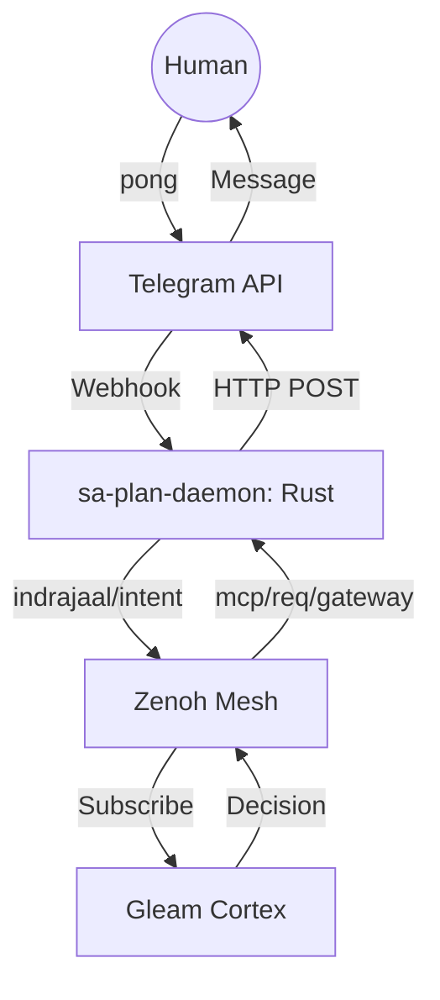

# Plan: SIL-6 Telegram Gateway Specification & Test Plan

**Created**: 20260408-1245 CEST
**Status**: DRAFT / AUTHORITATIVE
**Framework**: SOPv5.11 + Allium Behavioral Specs
**Compliance**: SC-ZENOH-005, SC-ZMOF-001, SC-COG-003

## 1. Architectural Design: The Sensory-Motor Loop
The Telegram Gateway follows the **Fractal Brain-Stem** pattern, ensuring that the Cognitive Plane (Gleam) is decoupled from the Physical Network (Rust/HTTP).



### Key Components
- **`gateway/telegram.gleam`**: Supervised OTP Actor managing the cognitive lifecycle of Telegram intents.
- **`moz/client.gleam`**: Standardized JSON-RPC 2.0 transport over Zenoh.
- **`sa-plan-daemon` (Rust)**: The Motor Strip. Contains the `reqwest` HTTP client and OAuth/Token management.
- **`Smriti.db`**: Authority for episodic memory (EventLog) of all sent/received messages.

## 2. Allium Behavioral Specifications (Formal Invariants)
These specs define the "Physics" of the messaging system.

```allium
spec gateway_telegram {
    // Invariants
    invariant message_integrity {
        forall m in SentMessages: m.status == "success" iff m.remote_id != null;
    }

    invariant latency_sla {
        forall req in McpRequests: time(req.completed) - time(req.created) < 500ms;
    }

    // Contracts
    contract MotorDispatch {
        demand SendMessage(channel: "telegram", token: Token, chat_id: ID, text: String)
        fulfil HTTP_POST("api.telegram.org")
    }

    // States
    state GatewayState {
        Active,
        RateLimited,
        Unauthorized,
        Offline
    }
}
```

## 3. Testing Strategy: The Bi-Directional Ping-Pong
To verify SIL-6 compliance, we must prove the loop is closed and the system possesses "Object Permanence."

### Test Case 1: Cognitive-to-Mobile (The "Ping")
- **Action**: Invoke `sa-plan gateway --channel telegram`.
- **Verify**: Receipt of message on mobile device.
- **Log**: Event entry in `Smriti.db` with `status: "dispatched"`.

### Test Case 2: Mobile-to-Cognitive (The "Pong")
- **Action**: User replies "pong" to the bot.
- **Verify**: `sa-plan-daemon` receives callback and publishes to `indrajaal/l5/cog/intent/req`.
- **Log**: Event entry in `Smriti.db` with `action: "received_pong"`.

### Test Case 3: Rate Limit & Fault Tolerance
- **Action**: Spam 50 messages in 1 second.
- **Verify**: Rust client catches 429 error and Gleam actor retries via exponential backoff.

## 4. Compliance Mapping
| Rule ID | Description | Implementation |
| :--- | :--- | :--- |
| **SC-ZMOF-001** | Sole transport via Zenoh | All intents route through MoZ. |
| **AOR-EXE-001** | Supreme Authority | `sa-plan-daemon` owns the API tokens. |
| **SC-OTEL-001** | Recursive Tracing | Every message has a unique `trace_id`. |

## 5. Change Log
| Timestamp | Change Type | Description | Author |
| :--- | :--- | :--- | :--- |
| 20260408-1245 CEST | CREATED | Initial SIL-6 Gateway Spec | Cybernetic Architect |
