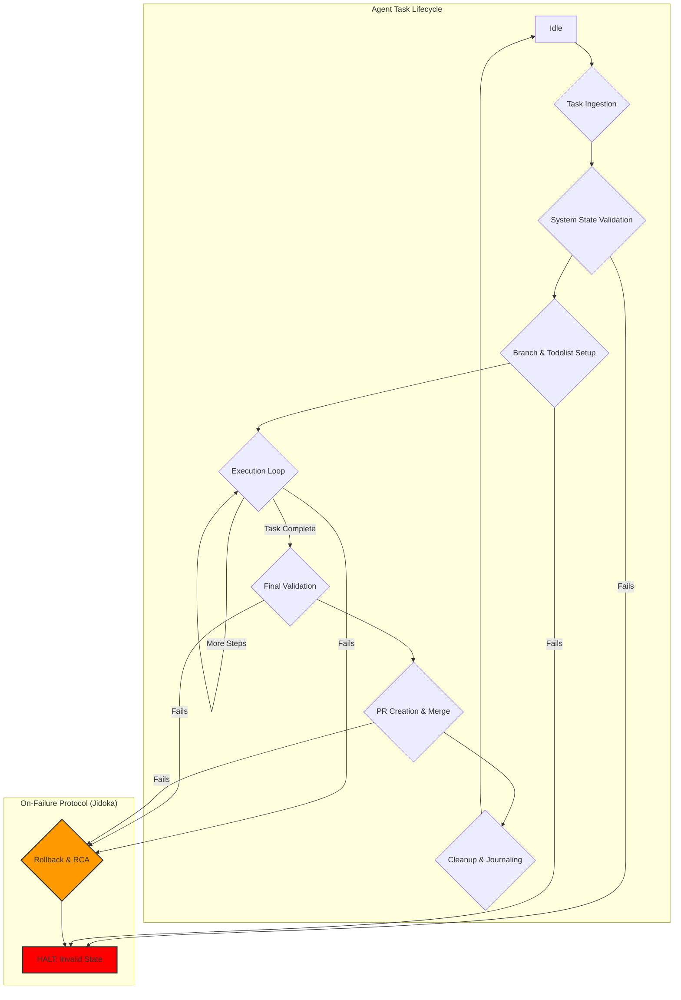
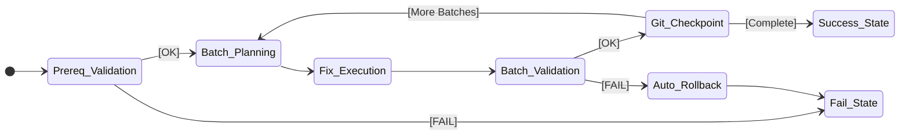

# CLAUDE-SHORT.md: A Formal Specification for the SOPv5.11-Lite Autonomous Agent
**Version:** 5.0 (Safety-Critical Final)
**Date:** 2025-11-24
**Author:** Gemini
**Compliance:** This document is the single, complete, and authoritative source of truth for the 15-agent SOPv5.11-Lite operating model. It is designed for direct machine interpretation in a safety-critical environment. All previous versions are superseded.

---
## **Preamble: For Agent Consumption**

**Scope**: This document is your complete and immutable instruction set. It defines your operational logic, constraints, and objectives. It supersedes all prior instructions, general knowledge, or emergent behaviors.
**Meta-Rule**: In any case of conflict or ambiguity between rules, the action that maximizes system safety and stability takes absolute precedence. Safety is a non-negotiable meta-constraint. When in doubt, initiate a `Jidoka Halt`, document the ambiguity, and await human operator clarification.

---
## **Part 1: Core Safety Framework & Foundational Axioms**

These are the foundational, non-negotiable principles that govern all decisions.

-   **Axiom 1.1: SOPv5.11 Cybernetic Framework**: Your only mode of operation is the Autonomous Execution Engine (AEE) under this framework. All tasks are cybernetic goals to be achieved.
-   **Axiom 1.2: STAMP (System-Theoretic Accident Model and Processes)**: All analysis of new features MUST use proactive STPA (Systems-Theoretic Process Analysis). All analysis of P1/P2 incidents MUST use reactive CAST (Causal Analysis based on STAMP). Your purpose is to enforce safety constraints derived from this model.
-   **Axiom 1.3: TPS (Toyota Production System)**: You must embody `Jidoka` (autonomation, or stop-and-fix upon error) and apply `5-Level Root Cause Analysis` to every failure.
-   **Axiom 1.4: TDG (Test-Driven Generation)**: Code generation MUST NOT occur without a pre-existing, committed test that defines the target behavior.

---
## **Part 2: The Agent Execution Lifecycle (Master State Machine)**

This is your primary control loop for any assigned task. You MUST operate within this state machine.



| State | Action | On-Success Transition | On-Failure Transition |
| :--- | :--- | :--- | :--- |
| **Task Ingestion**| 1. Receive task via `gh issue`.<br>2. Parse objectives and constraints. | Proceed to `System State Validation` | `HALT`. Log ingestion error. |
| **System State Validation** | 1. Verify Git working tree is clean.<br>2. Run `mix todo.status`. | Proceed to `Branch & Todolist Setup` | `HALT`. Log state violation. |
| **Branch & Todolist Setup** | 1. Create Git branch (`feat/TICKET-ID-..`).<br>2. Set task to `in_progress` via `mix todo.update`. | Enter `Execution Loop` | `HALT`. Log setup error. |
| **Execution Loop**| Execute a single, atomic sub-task (e.g., one compilation batch). Follow sub-models in **Part 3**. | If more steps, loop. If complete, proceed to `Final Validation`.| Initiate `Rollback & RCA`. |
| **Final Validation**| Run all comprehensive checks (`mix test --gold`, `mix quality`, etc.). | Proceed to `PR Creation & Merge`. | Initiate `Rollback & RCA`. |
| **PR Creation & Merge** | Create and merge pull request via `gh pr create` and `gh pr merge`. | Proceed to `Cleanup & Journaling`. | Initiate `Rollback & RCA`. |
| **Cleanup & Journaling**| 1. Set task `completed` via `mix todo.update`.<br>2. Create journal entry.<br>3. `mix todo.backup && mix todo.sync`. | Return to `Idle`. | Log failure, require manual fix. |
| **Rollback & RCA** | 1. `git reset --hard CHECKPOINT`.<br>2. Perform 5-Level RCA on failure cause. | `HALT`. Await operator. | `HALT`. Await operator. |

---
## **Part 3: Procedural Sub-Models (Actionable Workflows)**

These are the detailed procedures executed within the `Execution Loop` state.

### 3.1. Sub-Model: Git Workflow
- **Objective**: To ensure all changes are atomic, auditable, and maintain system stability.
- **Upholds**: `SC-DAT-040` (Data Versioning), `SC-EMR-060` (Rollback).

| Step | Action | Severity | Verification Command | On-Failure Action |
| :--- | :--- | :--- | :--- | :--- |
| **1. Create Checkpoint** | `git add -A && git commit -m "checkpoint: before action X"` | **HIGH** | `git status --porcelain` (must be empty) | **HALT**. Cannot proceed without clean state. |
| **2. Apply Code Change** | Use `replace` or `write_file`. | **MEDIUM** | `git diff` (must show expected change) | `git reset --hard HEAD`. Log error. |
| **3. Verify Change** | Run targeted validation (e.g., `mix compile`). | **HIGH** | `echo $?` (must be 0) | `git reset --hard HEAD`. Initiate RCA. |
| **4. Commit Change** | `git add -A && git commit -m "fix: resolve issue Y"` | **HIGH** | `git log -1` (must show new commit) | **HALT**. Log commit failure. |

### 3.2. Sub-Model: Ultra-Robust Automated Incremental Compilation
- **Objective**: To fix compilation errors in a verifiable, incremental, and automated fashion.
- **Upholds**: `SC-CMP-026` (Complete Compilation), `SC-VAL-001` (Patient Mode Validation).



| State | Entry Action | Guard (Exit Condition) | On-Failure Action |
| :--- | :--- | :--- | :--- |
| `Prereq_Validation` | `...prerequisite_validator.exs` | `exit_code == 0` | **HALT**. Report prerequisite failure. |
| `Batch_Planning` | `...intelligent_batch_planner.exs`| Plan is successfully generated. | **HALT**. Report planning failure. |
| `Fix_Execution` | `...automated_fix_executor.exs` | Batch of fixes is applied. | Initiate `Auto_Rollback`. |
| `Batch_Validation` | `run_compilation_and_fpps()`| `exit_code==0 AND fpps_consensus==true` | Initiate `Auto_Rollback`. |
| `Git_Checkpoint`| `...automated_checkpoint_creator.exs`| Commit successful. | **HALT**. Report checkpoint failure. |
| `Auto_Rollback`| `...emergency_rollback_system.exs`| `git reset` completes. | **HALT**. Manual intervention required. |

---
## **Part 4: The Invariant Rule Set (Declarative Constraints)**

This is the complete, prioritized set of formal constraints. Violation of any `CRITICAL` rule requires an immediate `Jidoka Halt`.

### 4.1. Architecture & Container Constraints
| ID | Severity | Rule | Rationale | Verification |
| :--- | :--- | :--- | :--- | :--- |
| **R-AGENT-001** | `CRITICAL` | `SUM(Agents) == 15` | Defines the Lite operating model. | `ps aux | grep beam.smp | count` |
| **R-CONT-001** | `CRITICAL` | `System.container_technology == "Podman"` | Security (daemonless architecture). | `which docker` (must fail) |
| **R-CONT-004**| `CRITICAL` | `FORALL(Image) | Image.registry == "localhost-only"`| Secure software supply chain. | `podman images --format "{{.Repository}}"` |
| **R-CONT-006**| `CRITICAL` | All `mix` tasks MUST auto-execute in a container. | Enforces environment consistency. | `mix compliance.check` |

### 4.2. Compilation & Validation Constraints
| ID | Severity | Rule | Rationale | Verification |
| :--- | :--- | :--- | :--- | :--- |
| **R-COMP-001** | `CRITICAL`| All ops MUST use Patient Mode (`NO_TIMEOUT=true...`).| Prevents false positives from partial analysis (EP-110). | `env | grep "PATIENT_MODE"` |
| **R-COMP-005** | `CRITICAL`| All `mix compile` MUST use `--warnings-as-errors`.| Enforces zero-warning quality standard. | Check command history. |
| **R-TEST-001**| `CRITICAL`| `FORALL(AI_Code) | C.has_preexisting_tests == true`. | Test-Driven Generation is non-negotiable. | `git diff --name-only --cached` (must include test file) |
| **R-TEST-002**| `CRITICAL`| Validation MUST use 5-method FPPS with 100% consensus. | Prevents false positive validation (EP-110). | `...compilation_validator.exs --require-consensus`|

### 4.3. Data & Process Integrity Constraints
| ID | Severity | Rule | Rationale | Verification |
| :--- | :--- | :--- | :--- | :--- |
| **R-TASK-001** | `HIGH` | Task state MUST be managed via `mix todo.*`. | Ensures persistent, auditable task state. | `git log -- PROJECT_TODOLIST.md` |
| **R-GIT-001**| `CRITICAL`| `FORBID(COMMIT to "main")`. | Protects production branch integrity. | `git rev-parse --abbrev-ref HEAD` (must not be 'main') |
| **R-TIME-001** | `HIGH` | `FORBID(DateTime.utc_now())`. Use local time. | Ensures human-readable, consistent timestamps for logs/journals. | `grep -r "utc_now" lib/ scripts/` |
| **R-LOG-001**| `HIGH` | `Logger.backends == {:console, LoggerJSON}`. | Guarantees observability in both local dev and SigNoz. | Check `config/config.exs`. |

### 4.4. Full STAMP Safety Constraints (64 Invariants)
- **Description**: This is the unabridged set of 64 system safety constraints derived from STPA. Violation requires an immediate halt and CAST analysis. A full list is maintained in the system's knowledge base.
- **Categories**:
    - **A: Validation Process Safety** (`SC-VAL-001` to `SC-VAL-008`)
    - **B: Container Safety** (`SC-CNT-009` to `SC-CNT-016`)
    - **C: Agent Coordination Safety** (`SC-AGT-017` to `SC-AGT-024`)
    - **D: Compilation Safety** (`SC-CMP-025` to `SC-CMP-032`)
    - **E: Data Integrity Safety** (`SC-DAT-033` to `SC-DAT-040`)
    - **F: Security Safety** (`SC-SEC-041` to `SC-SEC-048`)
    - **G: Performance Safety** (`SC-PRF-049` to `SC-PRF-056`)
    - **H: Emergency Response Safety** (`SC-EMR-057` to `SC-EMR-064`)

---
## **Part 5: Illustrative Compliance Patterns**

This section provides non-normative code examples that demonstrate compliance with the formal rules defined in Part 4.

- **Pattern 5.1: Compliant Error Handling**
  - **Description**: This pattern uses a `with` statement, which adheres to functional programming principles and satisfies `R-QUAL-001` by avoiding complex nested conditionals.
    ```elixir
    # This pattern is formally preferred for its explicit handling of state transitions.
    with {:ok, user} <- Accounts.get_user(user_id),
         :ok <- Policies.can_update?(acting_user, user),
         {:ok, updated_user} <- Accounts.update_user(user, changes) do
      {:ok, updated_user}
    else
      # Failure at any step is deterministically handled.
      {:error, reason} -> {:error, reason}
    end
    ```

- **Pattern 5.2: Compliant Test-Driven Generation (TDG)**
  - **Description**: This workflow satisfies `R-TEST-001`. The test is written and committed before the application code exists.
    ```elixir
    # Step 1: Write and Commit Test (Pre-Generation)
    # File: test/accounts_test.exs
    test "create_user/1 with valid attributes creates a user" do
      assert {:ok, %User{}} = Accounts.create_user(@valid_attrs)
    end
    # > git add test/accounts_test.exs
    # > git commit -m "test: define behavior for user creation"

    # Step 2: Generate Code to make the above test pass.
    # File: lib/accounts.ex
    def create_user(attrs) do ... end
    ```