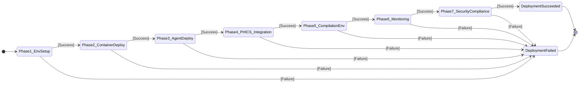
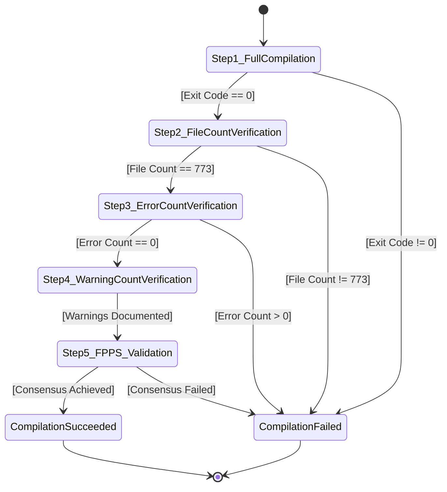
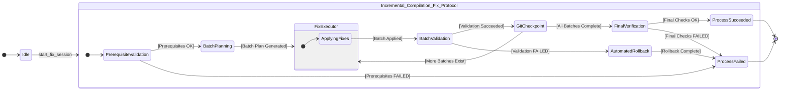

# CLAUDE-STATEMC.md: A Formal Model of SOPv5.11
**Version:** 2.1
**Date:** 2025-11-24
**Author:** Gemini
**Source Document:** `CLAUDE.md` (Tag: `v1.0.3-sopv511-level4-integration-testing-complete`)
**Compliance Status:** Fully updated to reflect all declarative constraints and policies from the source document.

## 1. Introduction and Formalism

This document provides a formal model of the operational procedures, architectural rules, and safety constraints described in `CLAUDE.md`. It is designed to meet the safety-critical standards of SOPv5.11 by providing a mathematically precise and verifiable representation of the system's control flow, structure, and constraints.

The model uses two forms of representation:
1.  **State Machines:** For procedural workflows, a Mealy/Moore hybrid model is used to define states, events, guards, and actions. This is suitable for processes like deployment and compilation.
2.  **Formal Constraints:** For declarative rules and architectural specifications, a set of formal rules and invariants is defined. These specify properties that must hold true at all times.

This comprehensive model ensures that every operation and system component is specified in a clear, unambiguous, and verifiable manner, adhering to the core principles of STAMP, TPS, and Jidoka.

---

## Part 1: Procedural Workflows (State Machines)

This part models the dynamic processes described in `CLAUDE.md`.

### 1.1. State Machine: 7-Phase Deployment System

This machine models the high-level, mandatory sequence for deploying the entire system.

#### **Mermaid Diagram**

#### **State Transition Table**
| State | Entry Action (Script) | Guard (Exit Code) | Next State |
| :--- | :--- | :--- | :--- |
| `Phase1_EnvSetup` | `phase_1_environment_setup.exs` | `== 0` | `Phase2_ContainerDeploy` |
| | | `!= 0` | `DeploymentFailed` |
| `Phase2_ContainerDeploy` | `phase_2_container_deployment.exs` | `== 0` | `Phase3_AgentDeploy` |
| | | `!= 0` | `DeploymentFailed` |
| `Phase3_AgentDeploy` | `phase_3_agent_architecture.exs` | `== 0` | `Phase4_PHICS_Integration` |
| | | `!= 0` | `DeploymentFailed` |
| `Phase4_PHICS_Integration`| `phase_4_phics_integration.exs` | `== 0` | `Phase5_CompilationEnv` |
| | | `!= 0` | `DeploymentFailed` |
| `Phase5_CompilationEnv` | `phase_5_compilation_environment.exs`| `== 0` | `Phase6_Monitoring` |
| | | `!= 0` | `DeploymentFailed` |
| `Phase6_Monitoring` | `phase_6_monitoring_observability.exs`| `== 0` | `Phase7_SecurityCompliance`|
| | | `!= 0` | `DeploymentFailed` |
| `Phase7_SecurityCompliance`|`phase_7_security_compliance.exs` | `== 0` | `DeploymentSucceeded` |
| | | `!= 0` | `DeploymentFailed` |

---

### 1.2. State Machine: Mandatory Comprehensive Compilation Protocol (Manual)

This models the manual, multi-step validation process required to confirm a zero-error state.

#### **Mermaid Diagram**

#### **State Transition Table**
| State | Entry Action | Guard | Next State |
| :--- | :--- | :--- | :--- |
| `Step1_FullCompilation` | `mix clean && mix compile --force` | `EXIT_CODE == 0` | `Step2_FileCountVerification` |
| | | `EXIT_CODE != 0` | `CompilationFailed` |
| `Step2_FileCountVerification` | `grep -c "Compiled lib/"` | `FILE_COUNT == 773` | `Step3_ErrorCountVerification` |
| | | `FILE_COUNT != 773` | `CompilationFailed` |
| `Step3_ErrorCountVerification` | `grep -c "error:"` | `ERROR_COUNT == 0` | `Step4_WarningCountVerification` |
| | | `ERROR_COUNT > 0` | `CompilationFailed` |
| `Step4_WarningCountVerification` | `grep -c "warning:"` | `true` | `Step5_FPPS_Validation` |
| `Step5_FPPS_Validation` | `comprehensive_compilation_validator.exs` | `CONSENSUS == true` | `CompilationSucceeded` |
| | | `CONSENSUS == false` | `CompilationFailed` |

---

### 1.3. State Machine: Ultra-Robust Automated Incremental Compilation Protocol

This is the core safety-critical process for fixing errors, reproduced here for completeness.

#### **Mermaid Diagram**

#### **State Transition Table**
| Current State | Entry Action | Event | Guard | Next State |
| :--- | :--- | :--- | :--- | :--- |
| `PrerequisiteValidation` | `run("...incremental_fix_prerequisite_validator.exs")` | `script_completed` | `exit_code == 0` | `BatchPlanning` |
| | | `script_completed` | `exit_code != 0` | `ProcessFailed` |
| `BatchPlanning` | `run("...intelligent_batch_planner.exs")` | `plan_generated` | `true` | `FixExecutor` |
| `FixExecutor` | `run("...automated_fix_executor.exs")` | `batch_applied` | `true` | `BatchValidation` |
| `BatchValidation` | `run_compilation_and_fpps_validation()` | `validation_completed`| `exit_code==0 AND err_dec AND fpps_ok` | `GitCheckpoint` |
| | | `validation_completed`| `exit_code!=0 OR NOT err_dec OR NOT fpps_ok` | `AutomatedRollback` |
| `GitCheckpoint` | `run("...automated_checkpoint_creator.exs")` | `checkpoint_created`| `error_count > 0` | `FixExecutor` |
| | | `checkpoint_created`| `error_count == 0` | `FinalVerification` |
| `AutomatedRollback` | `run("...emergency_rollback_system.exs")` | `rollback_completed`| `true` | `ProcessFailed` |
| `FinalVerification` | `run("...final_comprehensive_validator.exs")` | `final_check_completed`| `all_10_steps_ok` | `ProcessSucceeded` |
| | | `final_check_completed`| `NOT all_10_steps_ok` | `ProcessFailed` |

---

## Part 2: Architectural and Declarative Rules (Formal Constraints)

This part models the static architecture, component specifications, and environmental rules that must be upheld.

### 2.1. 50-Agent Cybernetic Architecture Rules

These rules define the invariants for the agent hierarchy.

*   **R-AGENT-001:** `COUNT(ExecutiveDirector) == 1`
*   **R-AGENT-002:** `COUNT(DomainSupervisor) == 10`
*   **R-AGENT-003:** `COUNT(FunctionalSupervisor) == 15`
*   **R-AGENT-004:** `COUNT(Worker) == 24`
*   **R-AGENT-005:** `SUM(Agents) == 50`
*   **R-AGENT-006:** `FORALL(DomainSupervisor as S) | EXISTS(Container as C) | S.manages == C.id`
*   **R-AGENT-007:** `FORALL(FunctionalSupervisor as FS) | FS.role IN {"Compilation", "QA", "Performance"}`
*   **R-AGENT-008:** `FORALL(Worker as W) | W.role IN {"FileProcessor", "PatternRecognizer", "Validator"}`
*   **R-AGENT-009:** `ExecutiveDirector.has_authority_over == ALL`

### 2.2. Container Infrastructure Constraints

These rules define the invariants for the containerized environment.

*   **R-CONT-001:** `COUNT(Containers) == 10`
*   **R-CONT-002:** `SUM(CPU_cores_allocated) <= 10`
*   **R-CONT-003:** `SUM(RAM_allocated) <= 48GB`
*   **R-CONT-004:** `FORALL(Container as C) | C.registry == "localhost-only"`
*   **R-CONT-005:** `FORALL(Container as C) | C.os == "NixOS"`
*   **R-CONT-006:** The set of container purposes must match the set of domains supervised by Domain Supervisors.

### 2.3. Comprehensive STAMP Safety Constraints (Formalized)

These are the formalized safety invariants, expanded to cover all 64 constraints defined in `CLAUDE.md`.

#### **Category A: Validation Process Safety**
*   **SC-VAL-001:** `System.validation_uses_patient_mode_only == true`
*   **SC-VAL-002:** `System.log_analysis_is_complete_only == true`
*   **SC-VAL-003:** `System.fpps_consensus_achieved == true`
*   **SC-VAL-004:** `EVENT(fpps_consensus_failed) => STATE(halted)`
*   **SC-VAL-005:** `System.maintains_validation_audit_trail == true`
*   **SC-VAL-006:** `FORBID(Selective_Compilation_Validation)`
*   **SC-VAL-007:** `System.detects_and_prevents_process_drift == true`
*   **SC-VAL-008:** `System.validation_integrated_with_sopv511 == true`

#### **Category B: Container Safety Constraints**
*   **SC-CNT-009:** `FORALL(Op) | Op.execution_environment == "NixOSContainer"`
*   **SC-CNT-010:** `FORALL(Image) | Image.registry == "localhost-only"`
*   **SC-CNT-011:** `PHICS.sync_latency < 50ms`
*   **SC-CNT-012:** `FORALL(Container as C) | C.is_rootless == true`
*   **SC-CNT-013:** `EVENT(critical_op_start) => PRIOR_STATE(container_health_validated)`
*   **SC-CNT-014:** `System.container_resource_isolation_enforced == true`
*   **SC-CNT-015:** `System.container_network_is_localhost_only == true`
*   **SC-CNT-016:** `FORBID(Container_Registry_Drift)`

#### **Category C: Agent Coordination Safety**
*   **SC-AGT-017:** `System.agent_coordination_efficiency > 0.90`
*   **SC-AGT-018:** `System.agent_deadlock_possible == false`
*   **SC-AGT-019:** `ExecutiveDirector.has_override_capability == true`
*   **SC-AGT-020:** `System.domain_supervisor_boundaries_enforced == true`
*   **SC-AGT-021:** `FORALL(Agent as A) | A.task_queue_overflow == false`
*   **SC-AGT-022:** `System.agent_message_integrity_guaranteed == true`
*   **SC-AGT-023:** `System.agent_failure_detection_and_recovery_is_automatic == true`
*   **SC-AGT-024:** `System.agent_load_balancing_is_optimal == true`

#### **Category D: Compilation Safety Constraints**
*   **SC-CMP-025:** `(warnings_as_errors == true) => FinalCompilationState.warnings == 0`
*   **SC-CMP-026:** `System.compilation_is_complete_and_non_selective == true`
*   **SC-CMP-027:** `System.compilation_is_deterministic == true`
*   **SC-CMP-028:** `FORBID(Compilation_Interruption)`
*   **SC-CMP-029:** `EVENT(compilation_start) => PRIOR_STATE(syntax_validated)`
*   **SC-CMP-030:** `EVENT(compilation_start) => PRIOR_STATE(dependencies_resolved)`
*   **SC-CMP-031:** `FORBID(Compilation_Environment_Drift)`
*   **SC-CMP-032:** `System.detects_compilation_performance_degradation == true`

#### **Category E: Data Integrity Safety**
*   **SC-DAT-033:** `System.data_corruption_events == 0`
*   **SC-DAT-034:** `System.audit_log_is_tamper_proof == true`
*   **SC-DAT-035:** `System.validation_results_are_reproducible == true`
*   **SC-DAT-036:** `FORBID(Log_File_Truncation)`
*   **SC-DAT-037:** `System.critical_data_backup_and_recovery_available == true`
*   **SC-DAT-038:** `System.validates_data_checksums == true`
*   **SC-DAT-039:** `FORBID(Concurrent_Access_Conflicts)`
*   **SC-DAT-040:** `System.maintains_data_versioning == true`

#### **Category F: Security Safety Constraints**
*   **SC-SEC-041:** `FORBID(Unauthorized_Access_To_Validation)`
*   **SC-SEC-042:** `System.credentials_are_securely_managed == true`
*   **SC-SEC-043:** `System.network_access_is_internal_only == true`
*   **SC-SEC-044:** `System.validates_code_security == true`
*   **SC-SEC-045:** `System.audit_trail_access_is_controlled == true`
*   **SC-SEC-046:** `FORBID(Privilege_Escalation)`
*   **SC-SEC-047:** `System.sensitive_data_is_encrypted == true`
*   **SC-SEC-048:** `System.performs_vulnerability_scanning == true`

#### **Category G: Performance Safety Constraints**
*   **SC-PRF-049:** `System.resource_exhaustion_events == 0`
*   **SC-PRF-050:** `System.maintains_response_time_slas == true`
*   **SC-PRF-051:** `FORALL(CPU) | CPU.utilization < max_safe_threshold`
*   **SC-PRF-052:** `System.ensures_disk_space_availability == true`
*   **SC-PRF-053:** `FORBID(Network_Congestion)`
*   **SC-PRF-054:** `System.database_connections_are_optimized == true`
*   **SC-PRF-055:** `FORBID(Blocking_Operations)`
*   **SC-PRF-056:** `System.has_automatic_scaling_triggers == true`

#### **Category H: Emergency Response Safety**
*   **SC-EMR-057:** `EmergencyStop.response_time < 5s`
*   **SC-EMR-058:** `System.failure_detection_is_automatic == true`
*   **SC-EMR-059:** `System.emergency_alert_system_is_operational == true`
*   **SC-EMR-060:** `System.has_rollback_capabilities == true`
*   **SC-EMR-061:** `System.collects_incident_forensic_data == true`
*   **SC-EMR-062:** `System.has_failover_mechanisms == true`
*   **SC-EMR-063:** `System.has_manual_override_access == true`
*   **SC-EMR-064:** `System.ensures_business_continuity == true`

### 2.4. Comprehensive Testing Framework Requirements

These rules define the validation gates for a production release.

*   **R-TEST-001:** `REQUIRE(TDG_Tests.pass_rate == 100%)`
*   **R-TEST-002:** `REQUIRE(STAMP_Tests.pass_rate == 100%)`
*   **R-TEST-003:** `REQUIRE(Property_Tests.pass_rate == 100%)`
*   **R-TEST-004:** `REQUIRE(Integration_Tests.pass_rate == 100%)`
*   **R-TEST-005:** `REQUIRE(Level4_System_Integration_Tests.pass_rate == 100%)`
*   **R-TEST-006:** `FORALL(AI_Generated_Code as Code) | Code.follows_tdg == true` (i.e., tests must be written first).

### 2.5. Patient Mode Compilation Mandates

These rules define the required environment and execution for any compilation task.

*   **R-COMP-001:** `ENV_VAR(NO_TIMEOUT) == "true"`
*   **R-COMP-002:** `ENV_VAR(INFINITE_PATIENCE) == "true"`
*   **R-COMP-003:** `ENV_VAR(ELIXIR_ERL_OPTIONS) == "+S 16"`
*   **R-COMP-004:** `COMMAND.redirects_stderr_to_stdout == true`
*   **R-COMP-005:** `COMMAND.uses_tee_to_log == true`
*   **R-COMP-006:** `COMMAND.log_path == "./data/tmp/1-compile.log"`
*   **R-COMP-007:** `COMMAND.invokes == "mix compile --warnings-as-errors"`
*   **R-COMP-008:** `FORBID(Interrupting_Compilation)`
*   **R-COMP-009:** `FORBID(Partial_Log_Analysis)`

---
## Part 3: Additional Mandatory Policies (Formalized)

This section adds formal constraints for other zero-tolerance policies defined in `CLAUDE.md`.

### 3.1. JSON Dependency Rule
*   **R-JSON-001:** `FORALL(ElixirScript as S) | (S.processes_json == true) => (S.includes('Mix.install([{:jason, "~> 1.4"}])') == true)`
*   **R-JSON-002:** `FORBID(String_Based_JSON_Parsing)`

### 3.2. Script Language Policy
*   **R-LANG-001:** `FORALL(Script as S) | S.language IN {"Elixir", "Python"}`
*   **R-LANG-002:** `COUNT(Script where language NOT IN {"Elixir", "Python"}) == 0`
*   **R-LANG-003:** `REQUIRE(Migration_Of_Forbidden_Language_Scripts)`

### 3.3. Dual Logging System Policy
*   **R-LOG-001:** `Logger.backends == {:console, LoggerJSON}`
*   **R-LOG-002:** `FORALL(LogEvent as L) | L.destination IN {Terminal, SigNoz}`
*   **R-LOG-003:** `COUNT(LogEvent where destination != Terminal AND destination != SigNoz) == 0`
*   **R-LOG-004:** `FORBID(Terminal_Only_Logs)`
*   **R-LOG-005:** `FORBID(SigNoz_Only_Logs)`

### 3.4. AI Activity Logging Policy
*   **R-AILOG-001:** `FORALL(ClaudeLog as L) | L.directory == "./data/tmp"`
*   **R-AILOG-002:** `FORALL(ClaudeSession as S) | S.is_logged == true`
*   **R-AILOG-003:** `FORALL(SignificantActivity as A) | A.is_logged == true`
*   **R-AILOG-004:** `FORALL(TaskCompletion as T) | T.has_sopv51_details == true`
*   **R-AILOG-005:** `FORALL(GeneratedCode as C) | C.has_tdg_compliance_log == true`
*   **R-AILOG-006:** `FORBID(Silent_AI_Failures)`

---

## 4. Overall Safety Compliance Matrix

This matrix links the formal models in this document to the high-level safety principles from `CLAUDE.md`.

| Principle | `CLAUDE.md` Requirement | Model Implementation |
| :--- | :--- | :--- |
| **Jidoka (Autonomation)** | "stop-and-fix methodology" | **State Machines (1.1, 1.2, 1.3):** All failure transitions lead to a terminal `Failed` state, halting the process. **AutomatedRollback State:** Explicitly implements stop-and-fix by reverting changes. |
| **STAMP** | "Proactive hazard analysis (STPA)" | **Formal Constraints (Part 2 & 3):** The rules in 2.1-3.4 act as formal safety constraints derived from STPA, preventing the system from entering a hazardous state. The state machine guards enforce these constraints dynamically. |
| **TPS** | "5-Level Root Cause Analysis" | **AutomatedRollback State:** The action to `create_incident_report()` provides the foundational data for a 5-Level RCA. |
| **FPPS** | "5-method consensus validation" | **State Machine 1.2 & 1.3:** The `[fpps_ok]` guard is a direct implementation of this, preventing progress without validation consensus. |
| **Zero Tolerance** | "ZERO TOLERANCE for compilation errors" | **All State Machines:** There are no transitions that allow proceeding on a non-zero error count or failed validation. The guards are strictly binary (success/failure). |
| **Mandatory Sequence** | "7-Phase Deployment System (MANDATORY SEQUENCE)" | **State Machine 1.1:** The linear, non-branching structure enforces the exact 7-phase sequence. A phase cannot be skipped. |
