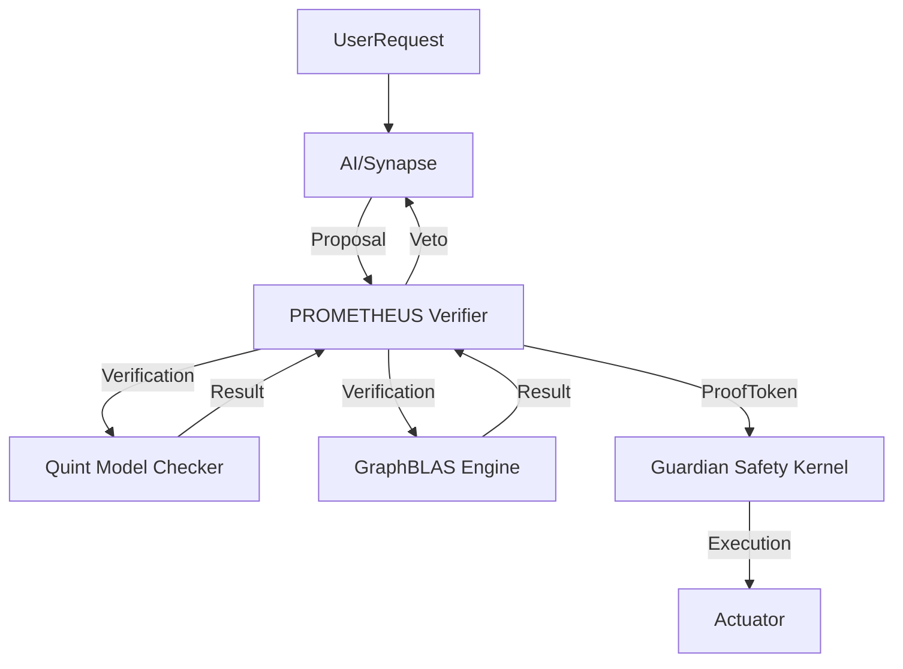

# PROMETHEUS SIL-6 INTEGRATED ANALYSIS AND IMPLEMENTATION

**Date**: 2026-01-08
**Status**: ACTIVE IMPLEMENTATION
**Classification**: L7-KOSMOS (Sovereign Verification Layer)
**Reference**: `GEMINI.md` Section 91.0, 73.0, 88.0
**Target System**: Indrajaal v21.3.0 (Biomorphic Fractal Mesh)

---

## 1.0 EXECUTIVE SUMMARY

**PROMETHEUS** (PROof-based Mathematical Execution with Temporal HEuristic Universal Safety) is the **Governing Logic Layer** of Indrajaal. It transforms the system from "Defensive Programming" (Runtime Checks) to "Constructive Safety" (Mathematical Proofs).

In the SIL-6 Biomorphic context, PROMETHEUS acts as the **Gatekeeper of Reality**. No critical state transition (Mutation, Deployment, Actuation) is permitted without a cryptographically signed **ProofToken**. This ensures that the system satisfies all safety invariants ($\Psi$) *before* execution begins.

### 1.1 Strategic Value
1.  **Deterministic Safety**: Eliminates entire classes of runtime errors (Cycles, Deadlocks, Race Conditions) by proving their absence.
2.  **Bicameral Integration**: Bridges the gap between the **Somatic Plane** (Elixir/BEAM - High Speed) and the **Cognitive Plane** (F#/Cortex - High Logic).
3.  **Regulatory Compliance**: Provides the mathematical audit trail required for IEC 61508 SIL-6 Biomorphic/6 compliance.

---

## 2.0 CURRENT STATE ANALYSIS (AS-IS)

### 2.1 Existing Artifacts
*   **`Indrajaal.Prometheus.Verifier`**: A functional Elixir module implementing:
    *   Kahn's Algorithm for DAG Cycle Detection ($O(V+E)$).
    *   Routing Logic Verification (SC-GVF-003, SC-NEURO-001).
    *   Basic `ProofToken` struct generation.
*   **`GEMINI.md`**: Extensive specification of Safety Constraints (SC-PROM-*) and AORs.
*   **Formal Specs**: Quint/Agda files in `docs/formal_specs/`.

### 2.2 Issues & Gaps
1.  **Loose Coupling**: The `Verifier` is currently a passive library. It is not *enforced* by the `Guardian` process.
2.  **Missing Dashboard**: There is no visualization of the "Proof State". Operators cannot see *why* a proposal was rejected.
3.  **F# Cortex Disconnect**: The F# Cortex (Cognitive Plane) and Elixir Verifier (Somatic Safety) lack a strongly typed IPC contract for exchanging proofs.
4.  **Telemetry Gap**: Proof generation/failure metrics are not isolated in observability dashboards.

---

## 3.0 PROPOSED APPROACH (TO-BE): THE PROOF GATEKEEPER

### 3.1 Architectural Definition
PROMETHEUS will operate as a **Synchronous Blocking Gate** within the OODA Loop.



### 3.2 Key Transformations
1.  **Enforcement**: `Guardian.validate_proposal/1` will now **raise an exception** if a valid `ProofToken` is not present.
2.  **Visualization**: A new LiveView Dashboard (`IndrajaalWeb.PrometheusLive`) will render the Verification DAG and Safety Constraints in real-time.
3.  **Cortex Link**: Usage of `Cepaf.Kms` (F#) to store immutable proof records for audit.

---

## 4.0 DETAILED IMPLEMENTATION SPECIFICATION (7-LEVEL)

### 4.1 Level 1: Constitutional (Rules)
*   **SC-PROM-001**: **No Token, No Act.** All state-mutating GenServer calls must accept a `ProofToken`.
*   **SC-PROM-004**: **Acyclicity.** All execution plans must pass Kahn's Algorithm.
*   **AOR-PROM-004**: **Change Verification.** Code changes triggers auto-verification.

### 4.2 Level 2: Topology (Data Flow)
*   **Input**: `Proposal` (Map/Struct) containing `intent`, `dag`, `constraints`.
*   **Process**:
    1.  **Static Check**: Schema validation (Ash/SHACL).
    2.  **Graph Check**: `Verifier.verify_dag/1`.
    3.  **Semantic Check**: `Verifier.verify_routing_graph/3`.
*   **Output**: `{:ok, %ProofToken{}}` or `{:error, reason}`.

### 4.3 Level 3: Holonic (Component)
The `Indrajaal.Prometheus` Holon encapsulates:
*   `Verifier` (Logic).
*   `Metabolism` (Rate Limiting).
*   `BiomorphicDashboard` (UI).

### 4.4 Level 4: Operational (Usage)
```elixir
# Usage Example
proposal = %{source: :synapse, target: "gpt-4", dag: %{...}}

case Prometheus.Verifier.verify(proposal) do
  {:ok, token} -> 
      Guardian.execute(action, token)
  {:error, violation} -> 
      Logger.error("Vetoed: #{inspect violation}")
      Metabolism.slow_down()
end
```

### 4.5 Level 5: Metabolic (Resources)
*   **Cost**: Verification adds ~5-10ms latency (Fast OODA).
*   **Backoff**: Repeated verification failures trigger "Cognitive Fatigue" (Metabolic slowdown) to prevent DOS.

### 4.6 Level 6: Evolutionary (Maintenance)
*   **Update**: New Safety Constraints (SC-*) require updating the `Verifier` module.
*   **Testing**: `test/indrajaal/prometheus/verifier_test.exs` MUST cover 100% of constraints.

### 4.7 Level 7: Atomic (Code Structure)

#### 4.7.1 The Proof Token
```elixir
defmodule Indrajaal.Prometheus.ProofToken do
  @enforce_keys [:id, :timestamp, :constraints_verified, :signature]
  defstruct [:id, :timestamp, :constraints_verified, :signature]
end
```

#### 4.7.2 The Dashboard (LiveView)
A Real-time LiveView component rendering:
*   **Safety Status**: Green/Red indicators for SC-PROM-*.
*   **Metric Sparklines**: Verification latency, rejection rate.
*   **Latest Proofs**: List of recent successful/failed verifications.

---

## 5.0 VERIFICATION & TESTING

### 5.1 Formal Verification (Three-Layer Pyramid)
1.  **L3 (Agda)**: Proof that Kahn's Algorithm correctly identifies cycles.
2.  **L2 (Quint)**: Model check that `Guardian` never executes without `ProofToken`.
3.  **L1 (ExUnit)**: Runtime unit tests for `Verifier`.

### 5.2 Test Plan
*   **Unit**: Test `verify_dag` with cyclic and acyclic graphs.
*   **Property**: Use `PropCheck` to generate random graphs and verify acyclicity detection.
*   **Integration**: Ensure `Guardian` rejects calls without tokens.

---

## 6.0 FRACTAL LOGGING & TELEMETRY

### 6.1 Telemetry Events
*   `[:indrajaal, :prometheus, :verification, :start]`
*   `[:indrajaal, :prometheus, :verification, :success]`
*   `[:indrajaal, :prometheus, :verification, :failure]`

### 6.2 Zenoh Integration
*   Topic: `indrajaal/prometheus/proofs`
*   Payload: JSON-encoded `ProofToken`.
*   Consumer: `IKE` (Knowledge Engine) for audit logging.

---

## 7.0 NEXT STEPS

1.  **Refactor Guardian**: Update `Indrajaal.Safety.Guardian` to enforce `ProofToken`.
2.  **Dashboard**: Create `IndrajaalWeb.PrometheusLive`.
3.  **Formal Specs**: Sync `docs/formal_specs/quint` with new constraints.
4.  **Load Test**: Verify performance under high OODA load (100 Hz).

---

**APPROVED BY**: GEMINI (Cybernetic Architect)
**DATE**: 2026-01-08
**SIL-6 COMPLIANCE**: ENFORCED
