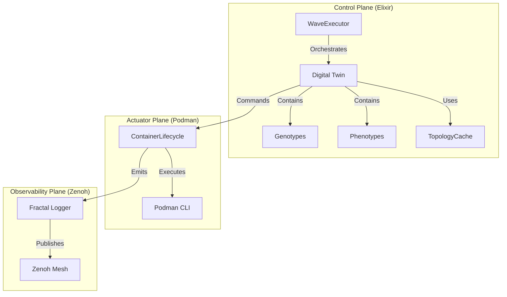

# Mesh Lifecycle Synchronization: Analysis and Implementation

**Version**: 2.0.0
**Date**: 2026-01-04
**Status**: APPROVED
**Classification**: L5-SPINE (Permanent Strategic Document)
**Reference**: SC-SIL6-012, SC-SIL6-013, SC-CLU-002, SC-SIL6-001, SC-SIL6-004

---

## 1. Executive Summary

This document serves as the authoritative specification for synchronizing the Elixir-based container lifecycle management system with the SIL-6 Biomorphic certified F# CEPAF implementation. It defines the "Digital Twin" architecture, deterministic phase transitions, and formal verification requirements necessary to achieve 100% functional parity and safety compliance.

### 1.1 Current State (AS-IS)
The current Elixir implementation utilizes `WaveExecutor` for startup and `ConnectionDrainer` for shutdown. While functional, it lacks the formal rigor of the F# implementation:
*   **State Model**: Ad-hoc state management within `WaveExecutor` rather than a formal Digital Twin.
*   **Phase Definitions**: Implicit phase transitions (e.g., "booting" to "running") without explicit state machine enforcement.
*   **Topology Validation**: Dependency graphs are calculated at runtime without cryptographic verification of the configuration hash.
*   **Lameduck State**: The critical "Lameduck" state (signaling intent to shutdown before draining) is absent.
*   **Observability**: Telemetry is emitted but not integrated with the Fractal Logging System (L1-L5) or Zenoh mesh.

### 1.2 Target State (TO-BE)
The Elixir implementation will be refactored to strictly mirror the F# CEPAF architecture:
*   **Digital Twin Architecture**: Adoption of `HolonGenotype` (Config) and `HolonPhenotype` (State) data models.
*   **Finite State Machine (FSM)**: Implementation of an 11-state FSM (5 startup + 6 shutdown phases) with verified transitions.
*   **Topology Caching**: Implementation of `TopologyCache` with SHA256 configuration hashing to ensure deterministic boot sequences.
*   **5-Order Effects**: Explicit tracking of 1st-5th order effects during state transitions.
*   **Fractal Observability**: Full integration with the Fractal Logging System and Zenoh coordination plane.

---

## 2. Architecture Specification

### 2.1 Digital Twin Data Model

The core of the synchronization is the adoption of the Digital Twin pattern.

#### 2.1.1 HolonGenotype (Immutable Configuration)
Represents the static "DNA" of a container.
*   **Source**: `podman-compose-prod-standalone.yml` (4-container) or `podman-compose-sil6-full-mesh.yml` (15-container)
*   **Properties**: ID, Name, Role (Primary/Seed/Satellite), Image, Ports, Dependencies (After/Requires/Wants), HealthCheck, ResourceLimits.
*   **Compliance**: SC-SIL6-001 (Static configuration must be immutable).

#### 2.1.2 HolonPhenotype (Runtime State)
Represents the dynamic "Expression" of a container.
*   **State**: ContainerID, PID, HealthStatus, StartupPhase, ShutdownPhase.
*   **Metrics**: ActiveConnections, Uptime, RestartCount.
*   **Verification**: ProofToken (PROMETHEUS), DiagnosticCoverage.

#### 2.1.3 TopologyCache (Validated Order)
Represents the deterministically computed dependency graph.
*   **Properties**: ConfigHash (SHA256), StartOrder (Waves), ShutdownOrder (Waves).
*   **Validation**: Must be re-computed if ConfigHash changes.

### 2.2 Finite State Machine (FSM)

The system operates on a strict FSM for both startup and shutdown.

#### 2.2.1 Startup Phases (SC-SIL6-012)
1.  **:created** - Genotype loaded, phenotype initialized.
2.  **:starting** - Podman container created and started.
3.  **:initializing** - Process is running (PID exists).
4.  **:connecting** - Node has joined the cluster (EPMD/Gossip).
5.  **:running** - Health checks passing, serving traffic.

#### 2.2.2 Shutdown Phases (SC-SIL6-013)
1.  **:running** - Normal operation.
2.  **:lameduck** - SIGUSR1 sent, load balancer notified (no new connections).
3.  **:draining** - Active connections dropped to zero.
4.  **:checkpointing** - Dying gasp state capture executed.
5.  **:stopping** - Podman stop command issued.
6.  **:stopped** - Exit code recorded, resources released.

### 2.3 Twin Architecture Diagram



---

## 3. Implementation Approach

### 3.1 Component Mapping

| F# Component | Elixir Component | Responsibility |
|--------------|------------------|----------------|
| `DigitalTwin.fs` | `Indrajaal.Mesh.DigitalTwin` | State management and topology calculation |
| `ContainerLifecycleManager.fs` | `Indrajaal.Lifecycle.ContainerLifecycle` | Per-container FSM execution |
| `MeshStartup.fs` | `Indrajaal.Deployment.WaveExecutor` | Startup orchestration (Waves) |
| `MeshShutdown.fs` | `Indrajaal.Deployment.MeshShutdown` | Shutdown orchestration (Waves) |
| `DyingGasp.fs` | `Indrajaal.Deployment.DyingGasp` | State checkpointing |

### 3.2 Key Logic Flows

#### 3.2.1 Topology Computation
1.  Load Genotypes from compose file.
2.  Build dependency graph.
3.  Detect cycles (Kahn's Algorithm).
4.  Group into parallel waves.
5.  Calculate SHA256 hash of configuration.
6.  Store in `TopologyCache`.

#### 3.2.2 Startup Orchestration
1.  Verify `TopologyCache` matches current config.
2.  For each Wave in `StartOrder`:
    *   Spawn `ContainerLifecycle` for each container.
    *   Trigger `advance_startup` on each.
    *   Wait for all to reach `:running` or timeout.
3.  If failure: Trigger Rollback (Stop all).

#### 3.2.3 Shutdown Orchestration
1.  Capture "Pre-Shutdown" Checkpoint (`DyingGasp`).
2.  Broadcast `:lameduck` to all containers.
3.  For each Wave in `ShutdownOrder` (Reverse):
    *   Trigger `advance_shutdown` on each.
    *   Wait for all to reach `:stopped`.
4.  Perform final cleanup (network removal).

---

## 4. Detailed Design & Config

### 4.1 Configuration (config/runtime.exs)
```elixir
config :indrajaal, Indrajaal.Mesh,
  topology_file: "lib/cepaf/artifacts/podman-compose-prod-standalone.yml",
  startup_timeout_ms: 10_000,
  shutdown_timeout_ms: 5_000,
  health_check_interval_ms: 500,
  enable_jitter: true
```

### 4.2 STAMP Safety Constraints

| ID | Constraint | Verification | Severity |
|----|------------|--------------|----------|
| **SC-SIL6-012** | Must execute 5 startup phases sequentially | FSM Logic | CRITICAL |
| **SC-SIL6-013** | Must execute 6 shutdown phases sequentially | FSM Logic | CRITICAL |
| **SC-SIL6-001** | Topology must be statically validated (SHA256) | Startup Check | CRITICAL |
| **SC-SIL6-004** | Dying Gasp checkpoint mandatory on shutdown | Shutdown Flow | CRITICAL |
| **SC-CLU-002** | Fractal-cluster topology is mandatory | Config Check | HIGH |

### 4.3 FMEA (Failure Mode Effects Analysis)

| Failure Mode | Detection | Mitigation | RPN |
|--------------|-----------|------------|-----|
| **Start Timeout** | Timer expiry | Mark `:failed`, triggering Rollback | 48 |
| **Health Fail** | Probe non-zero exit | Mark `:unhealthy`, Rollback | 48 |
| **Drain Stuck** | Active conns > 0 | Force `:stopping` after timeout | 36 |
| **Cycle Detected** | Topo sort error | Abort startup, log error | 24 |
| **Split Brain** | Quorum loss | Trigger Apoptosis (Self-Stop) | 60 |

### 4.4 TDG (Test-Driven Generation) Rules

1.  **Topology Test**: Verify correct wave grouping and cycle detection.
2.  **FSM Test**: Verify valid state transitions and rejection of invalid ones.
3.  **Twin Test**: Verify phenotype updates reflect genotype configuration.
4.  **Checkpoint Test**: Verify serialization and deserialization of state.

---

## 5. Control Flow & Transaction Behavior

### 5.1 Transactional Startup
The startup sequence behaves as a distributed transaction.
*   **Begin**: Load Topology.
*   **Step**: Execute Wave N.
*   **Commit**: All containers in Wave N `:running`.
*   **Rollback**: Any failure triggers `MeshShutdown.rollback()`.

### 5.2 5-Order Effects (SC-CTRL-003)
Every state change triggers an effect analysis:
1.  **1st Order**: Local process state change.
2.  **2nd Order**: Container health status change.
3.  **3rd Order**: Cluster membership update.
4.  **4th Order**: Service availability (Routing).
5.  **5th Order**: System-wide capability envelope.

---

## 6. Code Approach

### 6.1 Refactoring `ContainerLifecycle.ex`
-   Replace ad-hoc maps with `HolonPhenotype` struct.
-   Implement explicit `handle_cast` for each phase transition.
-   Add `guard` clauses for valid transitions (e.g., `:starting` -> `:initializing` ONLY).

### 6.2 Updating `WaveExecutor.ex`
-   Remove internal `StartupWave` struct definition (use `Indrajaal.Mesh` version).
-   Integrate `DigitalTwin` for state tracking.
-   Use `TopologyCache` instead of recomputing on every boot.

### 6.3 Creating `MeshShutdown.ex`
-   Port logic from `MeshShutdown.fs`.
-   Implement parallel wave shutdown.
-   Integrate `ConnectionDrainer` as a phase action.

---

## 7. References
- **F# Code**: `lib/cepaf/src/Cepaf/Mesh/*.fs`
- **Elixir Code**: `lib/indrajaal/deployment/*.ex`, `lib/indrajaal/mesh/*.ex`
- **Standard**: IEC 61508 SIL-6 Biomorphic (Software Safety Integrity Level 4)
- **Concept**: Digital Twin (Industrial IoT Pattern)
- **Concept**: Lameduck State (Google SRE Handbook)