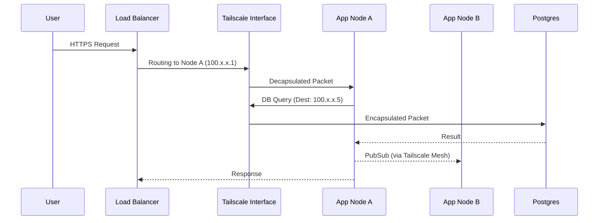

# Indrajaal HA Cluster Transition Specification (v1.1.0) - Tailscale Edition

**Classification**: 🛡️ IMMUTABLE ARCHITECTURE AXIOMS
**Status**: APPROVED FOR IMPLEMENTATION
**Framework**: SOPv5.1 + STAMP + HA-Mesh + Tailscale
**Date**: 2025-12-17

---

## 1.0 Executive Summary

This specification defines the architectural transformation of `Indrajaal` into a High Availability (HA) Distributed Mesh secured by **Tailscale**. This architecture leverages WireGuard-based overlay networking for secure, zero-trust peer discovery and communication, replacing traditional VPC/VPN complexity with identity-based networking.

### 1.1 Core Axioms of the Cluster
1.  **Identity is Network**: Access is granted based on Tailscale identity, not network location.
2.  **Quorum is King**: The system prefers Read-Only degradation over Split-Brain writes.
3.  **Database is Truth**: No persistent state resides in process memory; all critical state flows to PostgreSQL.
4.  **Encryption by Default**: All inter-node traffic is encrypted via WireGuard (Tailscale).

---

## 2.0 Infrastructure Scaling & Topology

### 2.1 Container Expansion Plan
To achieve HA with Tailscale, the infrastructure expands as follows:

| Component | Current | Target | Role |
| :--- | :--- | :--- | :--- |
| **Indrajaal App** | 1 | **3** | Core app. Connected to Tailnet. |
| **Tailscale Sidecar** | 0 | **3** | One per App container (if containerized) or Host-level Daemon. |
| **PgBouncer** | 0 | **1** | Connection pooling. Accessible via Tailscale IP. |
| **Load Balancer** | 0 | **1** | Ingress point. Distributes to Tailscale IPs of App nodes. |
| **TimescaleDB** | 1 | **1** | Primary DB. Accessible via Tailscale IP. |

**Total Additional Containers**: +2 App Instances, +3 Sidecars (if using sidecar pattern), +1 Load Balancer.

---

## 3.0 5-Level System Detail Analysis

### Level 1: System Purpose (The "What")
*   **Goal**: Secure, global HA cluster without complex VPNs or public port exposure.
*   **Mechanism**: Distributed Erlang over Tailscale Mesh.

### Level 2: Component Interaction (The "How")
*   **Peer Discovery**: `libcluster` using `Cluster.Strategy.Epmd` or `Tailscale API`.
    *   Nodes register with Tailscale coordination server.
    *   DNS names: `app-1`, `app-2`, `app-3` (MagicDNS).
*   **Safety Monitor**: `Indrajaal.Cluster.Sentinel` (GenServer).
*   **Traffic Flow**: Ingress $\rightarrow$ LB $\rightarrow$ `tailscale0` $\rightarrow$ Node $\rightarrow$ `tailscale0` $\rightarrow$ DB.

### Level 3: Protocol & Logic
*   **Transport**: UDP (WireGuard) encapsulation.
*   **Addressing**: IPv4/IPv6 from 100.x.y.z CGNAT range.
*   **Discovery Logic**:
    *   Topology: `epmd` scans `app-*.tailnet-name.ts.net`.
    *   Or custom `TailscaleStrategy` querying local `tailscaled` socket.

### Level 4: Code Execution Path
*   **Startup**:
    1.  Tailscale daemon starts, authenticates (Auth Key).
    2.  App starts. `env.sh` sets `RELEASE_NODE=indrajaal@$(tailscale ip -4)`.
    3.  `Cluster.Supervisor` starts.
    4.  Nodes connect via full mesh.
*   **Shutdown**: Graceful leave triggers `tailscale logout` (optional) or just disconnect.

### Level 5: Binary & Network Physics
*   **Interface**: `tailscale0` (tun device).
*   **Ports**:
    *   EPMD (4369) bound to `tailscale0`.
    *   Dist (9000-9100) bound to `tailscale0`.
*   **Security**: Mutual TLS (mTLS) provided inherently by WireGuard. No need for `inet_tls` unless "Defense in Depth" required.

---

## 4.0 Control Flow & State Synchronization

### 4.1 State Management Strategy
Consistent with v1.0.0, but transport is now WireGuard-secured.

| Data Type | Consistency | Transport |
| :--- | :--- | :--- |
| **User/Alarm Data** | Strong (ACID) | TCP over WireGuard to Postgres |
| **Cluster Topology** | Causal | Tailscale Control Plane + EPMD |

### 4.2 Data Flow Diagram

---

## 5.0 Lifecycle Management (Startup & Shutdown)

### 5.1 Tailscale-Integrated Startup
1.  **Container Start**: Entrypoint script runs.
2.  **Tailscale Init**: `tailscaled --tun=userspace-networking ...` (if sidecar) or verify host socket.
3.  **Auth**: `tailscale up --authkey=$TS_AUTHKEY --hostname=app-$REPLICA_ID`.
4.  **IP Resolution**: `export RELEASE_NODE=indrajaal@$(tailscale ip -4)`.
5.  **App Start**: BEAM starts, binds to Tailscale IP.
6.  **Clustering**: `libcluster` connects to peers via MagicDNS names.

### 5.2 Shutdown
1.  **SIGTERM**: Kubernetes stops pod.
2.  **App Drain**: `Indrajaal.Cluster.Sentinel` broadcasts leave.
3.  **Tailscale Down**: `tailscale logout` to remove ephemeral node from coordination server (prevents stale peers).

---

## 6.0 SRE & Chaos Engineering Behavior

### 6.1 Scenario A: Tailscale Coordination Down
*   **Impact**: New nodes cannot join. MagicDNS updates delayed.
*   **Resilience**: Existing WireGuard tunnels persist (P2P). Cluster remains stable.
*   **Risk**: If IPs change during outage, connectivity lost.

### 6.2 Scenario B: Node Isolation
*   **Situation**: Node A's `tailscale0` interface fails.
*   **Sentinel Action**:
    *   Peer nodes see TCP disconnect.
    *   Debounce 5s.
    *   Remove Node A from cluster.
*   **Recovery**: Node A restarts, re-auths with Tailscale, gets (potentially new) IP, rejoins.

---

## 7.0 Implementation Plan (Tailscale Specifics)

- [ ] **1. Infrastructure**
    - [ ] Obtain Tailscale Auth Key (Reusable, Ephemeral).
    - [ ] Update `Containerfile` to include `tailscale` (or use sidecar pattern).

- [ ] **2. Configuration**
    - [ ] Update `env.sh.eex` to resolve `RELEASE_NODE` via `tailscale ip`.
    - [ ] Update `runtime.exs` `libcluster` topology to use DNS strategy with MagicDNS names (`app-1`, `app-2`...).

- [ ] **3. Security**
    - [ ] ACLs: Restrict Tailnet access. Only `tag:prod` can talk to `tag:db`.
    - [ ] Bind EPMD to Tailscale IP only (`-kernel inet_dist_use_interface`).

- [ ] **4. Code**
    - [ ] Implement `Sentinel` as per v1.0.0 (Logic remains same).

---

**Approval**:
*   **Security**: Checked against SC-SEC-043 (Network Isolation via WireGuard).
*   **Reliability**: Checked against SC-REL-001 (Quorum).
*   **Observability**: Checked against SC-OBS-065 (Logging).