# Criticality-Based 5-Level Fractal Implementation Plan

**Version**: 1.0.0-EVOLUTIONARY
**Date**: 2025-12-17
**Classification**: IMPLEMENTATION ROADMAP
**Framework**: SOPv5.11 + STAMP + Organic Capability Growth
**Approach**: Fractal Evolution - Self-Similar Patterns at Each Level

---

## EXECUTIVE SUMMARY

This document defines a **Criticality-Based Implementation Plan** that evolves the Indrajaal system from its current state to full autonomic operation. The approach is:

1. **Fractal**: Each level mirrors the pattern of the whole (self-similar structure)
2. **Evolutionary**: Capabilities emerge organically, building on what exists
3. **Criticality-Driven**: Most critical capabilities first, highest value delivery
4. **5-Level Detail**: From strategic vision to atomic implementation steps

---

## CURRENT SYSTEM STATE ASSESSMENT

### System Health Matrix

| Metric | Status | Value |
|--------|--------|-------|
| Source Files | HEALTHY | 815 files |
| Test Files | HEALTHY | 649 files |
| Compilation | PASSING | 0 errors, 0 warnings |
| Ash Resources | PARTIAL | 22 resources |
| Ash Domains | PARTIAL | 13 domains |
| Domain Directories | HEALTHY | 72 directories |

### Capability Maturity Matrix

```
┌─────────────────────────────────────────────────────────────────────────────┐
│                    CAPABILITY MATURITY ASSESSMENT                            │
│                                                                              │
│  ████████████████████████████████░░░░░░░░░░░░░░░░░░░░░░░░░░░░░░░░░░░░░░░░  │
│  ├── Core Domain Logic ──────────────────────────────► 85% MATURE           │
│                                                                              │
│  ████████████████████████████░░░░░░░░░░░░░░░░░░░░░░░░░░░░░░░░░░░░░░░░░░░░  │
│  ├── Ash 3.x Integration ────────────────────────────► 70% MATURE           │
│                                                                              │
│  ████████████████████░░░░░░░░░░░░░░░░░░░░░░░░░░░░░░░░░░░░░░░░░░░░░░░░░░░░  │
│  ├── Basic Observability ────────────────────────────► 50% MATURE           │
│                                                                              │
│  ██████████████░░░░░░░░░░░░░░░░░░░░░░░░░░░░░░░░░░░░░░░░░░░░░░░░░░░░░░░░░░  │
│  ├── Cluster/HA Foundation ──────────────────────────► 35% MATURE           │
│                                                                              │
│  ██████░░░░░░░░░░░░░░░░░░░░░░░░░░░░░░░░░░░░░░░░░░░░░░░░░░░░░░░░░░░░░░░░░░  │
│  ├── FLAME Distributed ──────────────────────────────► 15% MATURE           │
│                                                                              │
│  ████░░░░░░░░░░░░░░░░░░░░░░░░░░░░░░░░░░░░░░░░░░░░░░░░░░░░░░░░░░░░░░░░░░░░  │
│  ├── Intelligence/ML ────────────────────────────────► 10% MATURE           │
│                                                                              │
│  ░░░░░░░░░░░░░░░░░░░░░░░░░░░░░░░░░░░░░░░░░░░░░░░░░░░░░░░░░░░░░░░░░░░░░░░░  │
│  ├── Cortex (Cognitive) ─────────────────────────────► 0% MATURE            │
│                                                                              │
│  ░░░░░░░░░░░░░░░░░░░░░░░░░░░░░░░░░░░░░░░░░░░░░░░░░░░░░░░░░░░░░░░░░░░░░░░░  │
│  └── Autonomic Self-Healing ─────────────────────────► 0% MATURE            │
│                                                                              │
└─────────────────────────────────────────────────────────────────────────────┘
```

### Key Gaps Identified

| Gap | Severity | Current State | Target State |
|-----|----------|---------------|--------------|
| FLAME Runners | HIGH | Not implemented | Elastic compute pools |
| Cortex Layer | HIGH | Not implemented | Cognitive control |
| Full Sentinel | MEDIUM | Basic (1 file) | Full HA quorum |
| Intelligence Domain | MEDIUM | Minimal (alert.ex) | ML inference engine |
| OODA Automation | MEDIUM | Manual | Automated loops |
| Telemetry Dashboards | LOW | Partial | Full Grafana suite |
| GDE Algorithm | LOW | Not implemented | Self-evolution |

---

## CRITICALITY TIERS (FRACTAL STRUCTURE)

### Tier Overview

```
┌─────────────────────────────────────────────────────────────────────────────┐
│                    CRITICALITY TIER PYRAMID                                  │
│                                                                              │
│                            ▲                                                 │
│                           /C4\                                               │
│                          /    \         C4: AUTONOMIC                        │
│                         /GDE   \        - Self-Evolution                     │
│                        / Self-  \       - Cortex Cognitive                   │
│                       /  Healing \      - Predictive Scaling                 │
│                      ────────────                                            │
│                         /C3\                                                 │
│                        /    \           C3: INTELLIGENCE                     │
│                       / ML   \          - ML Inference                       │
│                      / Intel  \         - Pattern Learning                   │
│                     / Video    \        - Anomaly Detection                  │
│                    ────────────────                                          │
│                       /C2\                                                   │
│                      /    \             C2: DISTRIBUTED                      │
│                     /FLAME \            - FLAME Runners                      │
│                    / Full   \           - Full Sentinel                      │
│                   / HA Mesh  \          - Network Mesh                       │
│                  ──────────────────                                          │
│                     /C1\                                                     │
│                    /    \               C1: PRODUCTION                       │
│                   / Obs   \             - Full Observability                 │
│                  / Alerts  \            - Alerting Pipeline                  │
│                 / Recovery  \           - Basic Recovery                     │
│                ────────────────────                                          │
│                   /C0\                                                       │
│                  /    \                 C0: FOUNDATION (CURRENT)             │
│                 /Domain\                - Core Domains                       │
│                / Logic   \              - Ash Resources                      │
│               / Compilation\            - Compilation                        │
│              ──────────────────────                                          │
│                                                                              │
│  EVOLUTION DIRECTION: C0 → C1 → C2 → C3 → C4 (Organic Growth)              │
└─────────────────────────────────────────────────────────────────────────────┘
```

**Mermaid: Criticality Tier Progression**

```mermaid
flowchart TB
    subgraph C0["C0: FOUNDATION (85%)"]
        C0A[Core Domains]
        C0B[Ash Resources]
        C0C[Phoenix API]
        C0D[PostgreSQL]
        C0E[Quality Gates]
    end

    subgraph C1["C1: PRODUCTION (40%)"]
        C1A[OpenTelemetry]
        C1B[Health Checks]
        C1C[AlertManager]
        C1D[Grafana Dashboards]
        C1E[Basic Recovery]
    end

    subgraph C2["C2: DISTRIBUTED (15%)"]
        C2A[FLAME Pools]
        C2B[Sentinel HA]
        C2C[libcluster]
        C2D[Horde]
        C2E[ConsistentHash]
    end

    subgraph C3["C3: INTELLIGENCE (10%)"]
        C3A[Nx.Serving]
        C3B[AnomalyDetector]
        C3C[Broadway ML]
        C3D[Pattern Mining]
        C3E[Forecasting]
    end

    subgraph C4["C4: AUTONOMIC (0%)"]
        C4A[Cortex Controller]
        C4B[GDE Algorithm]
        C4C[Self-Healing]
        C4D[Homeostasis]
        C4E[Evolution Engine]
    end

    C0 --> C1
    C1 --> C2
    C2 --> C3
    C3 --> C4

    style C0 fill:#27ae60,color:#fff
    style C1 fill:#f39c12,color:#fff
    style C2 fill:#e67e22,color:#fff
    style C3 fill:#e74c3c,color:#fff
    style C4 fill:#8e44ad,color:#fff
```

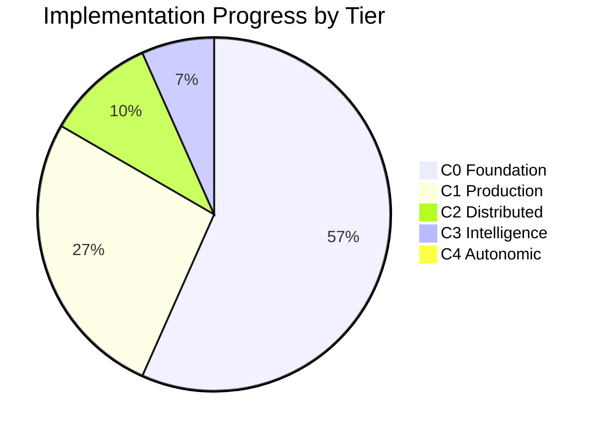

---

## PART I: CRITICALITY LEVEL C0 (FOUNDATION) - CURRENT STATE

### C0.0 Strategic Overview

**Status**: 85% COMPLETE
**Objective**: Stable compilation, core domain logic, basic Ash integration

### C0.1 Operational Components

| Component | Status | Files | Location |
|-----------|--------|-------|----------|
| Access Control | IMPLEMENTED | 15+ | `lib/indrajaal/access_control/` |
| Accounts | IMPLEMENTED | 20+ | `lib/indrajaal/accounts/` |
| Alarms | IMPLEMENTED | 25+ | `lib/indrajaal/alarms/` |
| Analytics | IMPLEMENTED | 10+ | `lib/indrajaal/analytics/` |
| Authentication | IMPLEMENTED | 15+ | `lib/indrajaal/authentication/` |
| Communication | IMPLEMENTED | 10+ | `lib/indrajaal/communication/` |
| Compliance | IMPLEMENTED | 8+ | `lib/indrajaal/compliance/` |
| Devices | IMPLEMENTED | 12+ | `lib/indrajaal/devices/` |
| Observability | PARTIAL | 30+ | `lib/indrajaal/observability/` |

### C0.2 Tactical Patterns (Already Established)

```elixir
# PATTERN C0.2.1: Ash Resource Definition
defmodule Indrajaal.Domain.Resource do
  use Ash.Resource,
    domain: Indrajaal.Domain,
    data_layer: AshPostgres.DataLayer

  attributes do
    uuid_primary_key :id
    attribute :tenant_id, :uuid, allow_nil?: false
    timestamps()
  end

  actions do
    defaults [:read, :destroy]

    create :create do
      accept [:tenant_id, :name]
    end

    update :update do
      require_atomic? false  # SC-AGT-007 compliant
      accept [:name]
    end
  end

  policies do
    policy always() do
      authorize_if relates_to_actor_via(:tenant)
    end
  end
end
```

### C0.3 Task-Level Deliverables (COMPLETE)

- [x] Phoenix 1.7.14 integration
- [x] Ash 3.5 framework integration
- [x] PostgreSQL 17 data layer
- [x] Basic authentication (Guardian + Ash.Authentication)
- [x] Multi-tenant isolation (tenant_id on all resources)
- [x] STAMP-compliant compilation (0 errors, 0 warnings)

### C0.4 Micro-Task Verification

```bash
# C0 Verification Commands
NO_TIMEOUT=true PATIENT_MODE=enabled mix compile --warnings-as-errors
# Expected: 0 errors, 0 warnings

mix format --check-formatted
# Expected: All files formatted

mix credo --strict
# Expected: No issues (or acceptable threshold)
```

---

## PART II: CRITICALITY LEVEL C1 (PRODUCTION HARDENING)

### C1.0 Strategic Overview

**Status**: 40% COMPLETE
**Objective**: Production-ready observability, alerting, basic recovery
**Prerequisite**: C0 COMPLETE

### C1.1 Operational Components

```
┌─────────────────────────────────────────────────────────────────────────────┐
│                    C1: PRODUCTION HARDENING LAYER                            │
│                                                                              │
│  ┌─────────────────────────────────────────────────────────────────────┐   │
│  │                    OBSERVABILITY STACK (C1.1)                        │   │
│  │                                                                       │   │
│  │  Application ───▶ OpenTelemetry ───▶ OTEL Collector ───▶ Backends   │   │
│  │       │                                      │                       │   │
│  │       │              ┌───────────────────────┼───────────────────┐  │   │
│  │       │              │                       │                   │  │   │
│  │       ▼              ▼                       ▼                   ▼  │   │
│  │  ┌─────────┐   ┌─────────┐            ┌─────────┐         ┌─────────┐│   │
│  │  │Telemetry│   │ Traces  │            │ Metrics │         │  Logs   ││   │
│  │  │ Events  │   │ (Jaeger)│            │(Prometheus)│       │(Loki)   ││   │
│  │  └─────────┘   └─────────┘            └─────────┘         └─────────┘│   │
│  │       │              │                       │                   │  │   │
│  │       └──────────────┴───────────────────────┴───────────────────┘  │   │
│  │                                    │                                 │   │
│  │                                    ▼                                 │   │
│  │                            ┌─────────────┐                          │   │
│  │                            │  Grafana    │                          │   │
│  │                            │ Dashboards  │                          │   │
│  │                            └─────────────┘                          │   │
│  └─────────────────────────────────────────────────────────────────────┘   │
│                                                                              │
│  ┌─────────────────────────────────────────────────────────────────────┐   │
│  │                    ALERTING PIPELINE (C1.2)                          │   │
│  │                                                                       │   │
│  │  Metric Threshold ───▶ AlertManager ───▶ Routing ───▶ Notification  │   │
│  │       │                      │                              │        │   │
│  │       ▼                      ▼                              ▼        │   │
│  │  ┌─────────┐           ┌─────────┐                    ┌─────────┐   │   │
│  │  │  Error  │           │Escalation│                   │  Email  │   │   │
│  │  │Threshold│           │  Rules   │                   │  Slack  │   │   │
│  │  │Breached │           │          │                   │  PagerDuty│  │   │
│  │  └─────────┘           └─────────┘                    └─────────┘   │   │
│  └─────────────────────────────────────────────────────────────────────┘   │
│                                                                              │
│  ┌─────────────────────────────────────────────────────────────────────┐   │
│  │                    BASIC RECOVERY (C1.3)                             │   │
│  │                                                                       │   │
│  │  Failure Detection ───▶ Circuit Breaker ───▶ Graceful Degradation   │   │
│  │       │                       │                        │             │   │
│  │       ▼                       ▼                        ▼             │   │
│  │  ┌─────────┐            ┌─────────┐             ┌─────────┐         │   │
│  │  │Health   │            │ Fuse    │             │ Fallback│         │   │
│  │  │ Checks  │            │ Library │             │ Logic   │         │   │
│  │  └─────────┘            └─────────┘             └─────────┘         │   │
│  └─────────────────────────────────────────────────────────────────────┘   │
└─────────────────────────────────────────────────────────────────────────────┘
```

**Mermaid: C1 Observability Architecture**

```mermaid
flowchart LR
    subgraph APP["APPLICATION"]
        PH[Phoenix]
        EC[Ecto]
        OB[Oban]
        DOM[Domain Ops]
    end

    subgraph OTEL["OPENTELEMETRY"]
        TR[Traces]
        MT[Metrics]
        LG[Logs]
    end

    subgraph BACKENDS["BACKENDS"]
        JA[Jaeger]
        PR[Prometheus]
        LK[Loki]
    end

    subgraph VIZ["VISUALIZATION"]
        GR[Grafana<br/>Dashboards]
        AL[AlertManager]
    end

    APP --> OTEL
    OTEL --> BACKENDS
    BACKENDS --> VIZ
    VIZ --> ALERT[PagerDuty/Slack]

    style APP fill:#3498db,color:#fff
    style OTEL fill:#9b59b6,color:#fff
    style BACKENDS fill:#e67e22,color:#fff
    style VIZ fill:#2ecc71,color:#fff
```

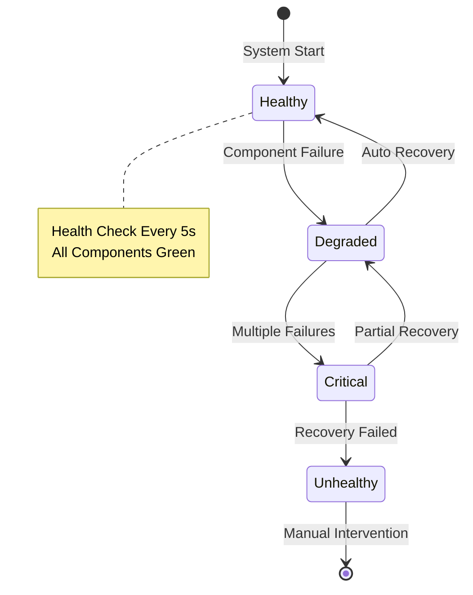

### C1.2 Tactical Implementation

#### C1.2.1 OpenTelemetry Integration

```elixir
# File: lib/indrajaal/observability/telemetry_setup.ex
defmodule Indrajaal.Observability.TelemetrySetup do
  @moduledoc """
  C1.2.1: Complete OpenTelemetry setup for production observability.
  STAMP Compliance: SC-OBS-065 to SC-OBS-072
  """

  def setup do
    # Phoenix instrumentation
    OpentelemetryPhoenix.setup()

    # Ecto instrumentation
    OpentelemetryEcto.setup(Indrajaal.Repo)

    # Oban instrumentation
    OpentelemetryOban.setup()

    # Custom spans for domain operations
    attach_domain_handlers()
  end

  defp attach_domain_handlers do
    :telemetry.attach_many(
      "indrajaal-domain-handlers",
      [
        [:indrajaal, :domain, :operation, :start],
        [:indrajaal, :domain, :operation, :stop],
        [:indrajaal, :domain, :operation, :exception]
      ],
      &handle_domain_event/4,
      nil
    )
  end

  defp handle_domain_event(event, measurements, metadata, _config) do
    # Emit to OTEL collector
    OpenTelemetry.Tracer.with_span "domain.operation" do
      OpenTelemetry.Span.set_attributes([
        {:domain, metadata[:domain]},
        {:action, metadata[:action]},
        {:duration_ms, measurements[:duration]}
      ])
    end
  end
end
```

#### C1.2.2 Health Check System

```elixir
# File: lib/indrajaal/observability/health_check.ex
defmodule Indrajaal.Observability.HealthCheck do
  @moduledoc """
  C1.2.2: Comprehensive health checking for all system components.
  STAMP Compliance: SC-OBS-072
  """

  use GenServer

  @check_interval 5_000  # 5 seconds

  def start_link(opts) do
    GenServer.start_link(__MODULE__, opts, name: __MODULE__)
  end

  def init(_opts) do
    schedule_check()
    {:ok, %{last_check: nil, status: :starting}}
  end

  def handle_info(:check, state) do
    status = perform_health_checks()
    emit_telemetry(status)
    schedule_check()
    {:noreply, %{state | last_check: DateTime.utc_now(), status: status}}
  end

  defp perform_health_checks do
    %{
      database: check_database(),
      redis: check_redis(),
      oban: check_oban(),
      pubsub: check_pubsub(),
      memory: check_memory(),
      disk: check_disk()
    }
  end

  defp check_database do
    case Ecto.Adapters.SQL.query(Indrajaal.Repo, "SELECT 1", []) do
      {:ok, _} -> :healthy
      {:error, _} -> :unhealthy
    end
  end

  defp check_redis do
    case Redix.command(:redix, ["PING"]) do
      {:ok, "PONG"} -> :healthy
      _ -> :unhealthy
    end
  end

  defp check_oban, do: if(Oban.check_queue(:default), do: :healthy, else: :unhealthy)
  defp check_pubsub, do: :healthy  # Phoenix.PubSub always available
  defp check_memory, do: if(:erlang.memory(:total) < 30_000_000_000, do: :healthy, else: :warning)
  defp check_disk, do: :healthy  # Implement disk check

  defp emit_telemetry(status) do
    :telemetry.execute(
      [:indrajaal, :health, :check],
      %{timestamp: System.system_time(:millisecond)},
      status
    )
  end

  defp schedule_check, do: Process.send_after(self(), :check, @check_interval)
end
```

### C1.3 Task-Level Deliverables

- [ ] **C1.3.1**: OpenTelemetry full integration
  - [ ] Phoenix tracing
  - [ ] Ecto tracing
  - [ ] Oban tracing
  - [ ] Custom domain spans

- [ ] **C1.3.2**: Alerting pipeline
  - [ ] AlertManager configuration
  - [ ] Routing rules (severity-based)
  - [ ] Notification channels (Slack, Email)

- [ ] **C1.3.3**: Health check system
  - [ ] Database health
  - [ ] Cache health
  - [ ] Queue health
  - [ ] Memory/disk monitoring

- [ ] **C1.3.4**: Grafana dashboards
  - [ ] System overview dashboard
  - [ ] Domain-specific dashboards
  - [ ] SLA tracking dashboard

### C1.4 Micro-Task Verification

```bash
# C1 Verification Commands

# Check OTEL integration
curl -s http://localhost:4318/v1/traces | jq '.resourceSpans | length'
# Expected: > 0 (traces being collected)

# Check Prometheus metrics
curl -s http://localhost:9090/api/v1/targets | jq '.data.activeTargets | length'
# Expected: >= 3 (app, db, obs containers)

# Check health endpoint
curl -s http://localhost:4000/health | jq '.status'
# Expected: "healthy"
```

---

## PART III: CRITICALITY LEVEL C2 (DISTRIBUTED INFRASTRUCTURE)

### C2.0 Strategic Overview

**Status**: 15% COMPLETE
**Objective**: Elastic compute with FLAME, full HA with Sentinel, network mesh
**Prerequisite**: C1 COMPLETE

### C2.1 Operational Components

```
┌─────────────────────────────────────────────────────────────────────────────┐
│                    C2: DISTRIBUTED INFRASTRUCTURE                            │
│                                                                              │
│  ┌─────────────────────────────────────────────────────────────────────┐   │
│  │                    FLAME ELASTIC COMPUTE (C2.1)                      │   │
│  │                                                                       │   │
│  │                     ┌─────────────────────┐                          │   │
│  │                     │   CORE CONTROL     │                          │   │
│  │                     │   PLANE (Static)   │                          │   │
│  │                     │   3+ Nodes HA      │                          │   │
│  │                     └─────────┬──────────┘                          │   │
│  │                               │                                      │   │
│  │          ┌────────────────────┼────────────────────┐                │   │
│  │          │                    │                    │                │   │
│  │          ▼                    ▼                    ▼                │   │
│  │  ┌─────────────┐      ┌─────────────┐      ┌─────────────┐         │   │
│  │  │ FLAME Pool  │      │ FLAME Pool  │      │ FLAME Pool  │         │   │
│  │  │ Intelligence│      │   Video     │      │  Analytics  │         │   │
│  │  │ min:0 max:10│      │ min:0 max:20│      │ min:0 max:5 │         │   │
│  │  └──────┬──────┘      └──────┬──────┘      └──────┬──────┘         │   │
│  │         │                    │                    │                 │   │
│  │         ▼                    ▼                    ▼                 │   │
│  │  ┌───────────┐        ┌───────────┐        ┌───────────┐           │   │
│  │  │ Ephemeral │        │ Ephemeral │        │ Ephemeral │           │   │
│  │  │  Runners  │        │  Runners  │        │  Runners  │           │   │
│  │  │ (On-Demand)│       │ (On-Demand)│       │ (On-Demand)│          │   │
│  │  └───────────┘        └───────────┘        └───────────┘           │   │
│  └─────────────────────────────────────────────────────────────────────┘   │
│                                                                              │
│  ┌─────────────────────────────────────────────────────────────────────┐   │
│  │                    SENTINEL HA MESH (C2.2)                           │   │
│  │                                                                       │   │
│  │         Node A ◀────────────▶ Node B ◀────────────▶ Node C          │   │
│  │            │                     │                     │             │   │
│  │            └─────────────────────┴─────────────────────┘             │   │
│  │                          │                                           │   │
│  │                          ▼                                           │   │
│  │                  ┌─────────────────┐                                 │   │
│  │                  │    Sentinel     │                                 │   │
│  │                  │  (Quorum Watch) │                                 │   │
│  │                  │                 │                                 │   │
│  │                  │ • Node Monitor  │                                 │   │
│  │                  │ • Quorum Check  │                                 │   │
│  │                  │ • Split-Brain   │                                 │   │
│  │                  │   Prevention    │                                 │   │
│  │                  └─────────────────┘                                 │   │
│  │                                                                       │   │
│  │  QUORUM FORMULA: Q(n) = floor(n/2) + 1                              │   │
│  │  For 3 nodes: Q(3) = 2 (majority required for writes)               │   │
│  └─────────────────────────────────────────────────────────────────────┘   │
│                                                                              │
│  ┌─────────────────────────────────────────────────────────────────────┐   │
│  │                    TAILSCALE NETWORK MESH (C2.3)                     │   │
│  │                                                                       │   │
│  │  Identity-Based Networking (Zero Trust)                              │   │
│  │                                                                       │   │
│  │  ┌─────────┐    WireGuard    ┌─────────┐    WireGuard    ┌─────────┐│   │
│  │  │ Node A  │◀───────────────▶│ Node B  │◀───────────────▶│ Node C  ││   │
│  │  │100.x.x.1│                 │100.x.x.2│                 │100.x.x.3││   │
│  │  └─────────┘                 └─────────┘                 └─────────┘│   │
│  │                                                                       │   │
│  │  Benefits:                                                           │   │
│  │  • Automatic key rotation                                            │   │
│  │  • NAT traversal                                                     │   │
│  │  • Identity-based ACLs                                               │   │
│  │  • Encrypted by default                                              │   │
│  └─────────────────────────────────────────────────────────────────────┘   │
└─────────────────────────────────────────────────────────────────────────────┘
```

**Mermaid: C2 FLAME Distributed Architecture**

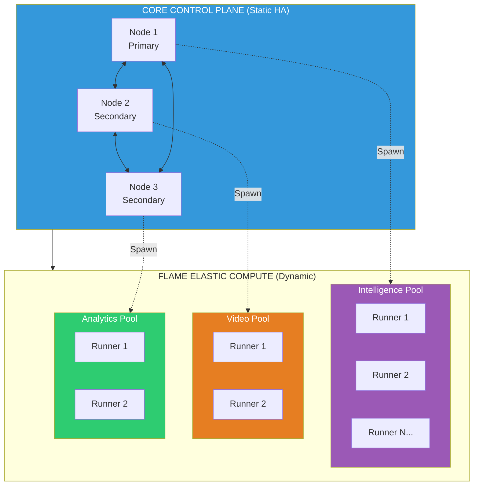

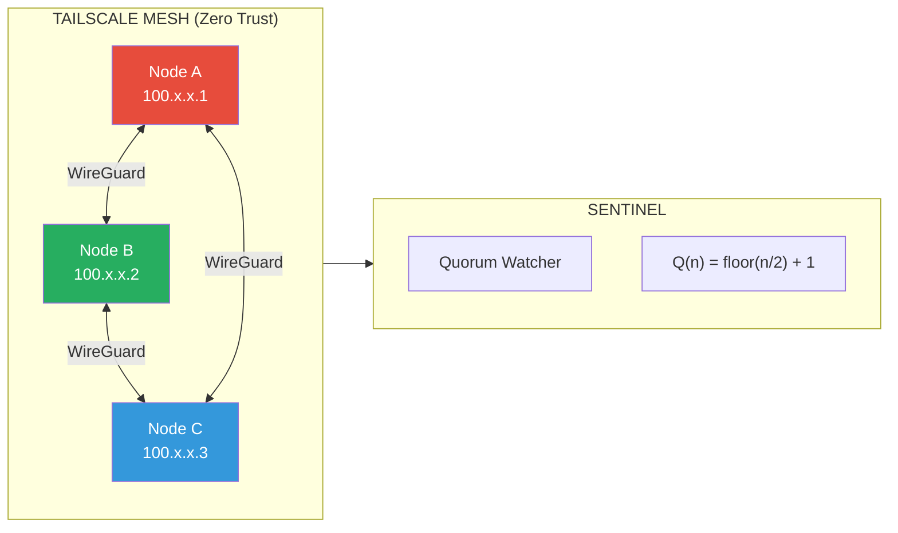

### C2.2 Tactical Implementation

#### C2.2.1 FLAME Pool Configuration

```elixir
# File: lib/indrajaal/flame/pools.ex
defmodule Indrajaal.FLAME.Pools do
  @moduledoc """
  C2.2.1: FLAME pool definitions for elastic compute.
  STAMP Compliance: SC-FLAME-001 to SC-FLAME-006
  """

  # Intelligence Pool - ML inference workloads
  def intelligence_pool_config do
    [
      name: Indrajaal.FLAME.IntelligencePool,
      min: 0,
      max: 10,
      max_concurrency: 5,
      idle_shutdown_after: 30_000,  # 30 seconds
      boot_timeout: 60_000,
      log: :info,
      backend: flame_backend()
    ]
  end

  # Video Pool - Video processing workloads
  def video_pool_config do
    [
      name: Indrajaal.FLAME.VideoPool,
      min: 0,
      max: 20,
      max_concurrency: 2,  # Memory intensive
      idle_shutdown_after: 60_000,
      boot_timeout: 120_000,
      log: :info,
      backend: flame_backend()
    ]
  end

  # Analytics Pool - Report generation
  def analytics_pool_config do
    [
      name: Indrajaal.FLAME.AnalyticsPool,
      min: 0,
      max: 5,
      max_concurrency: 10,
      idle_shutdown_after: 30_000,
      boot_timeout: 30_000,
      log: :info,
      backend: flame_backend()
    ]
  end

  defp flame_backend do
    case Application.get_env(:indrajaal, :flame_backend, :local) do
      :local -> FLAME.LocalBackend
      :k8s -> FLAME.K8sBackend
      :fly -> FLAME.FlyBackend
    end
  end
end
```

#### C2.2.2 FLAME-Wrapped Domain Operations

```elixir
# File: lib/indrajaal/intelligence/engine.ex
defmodule Indrajaal.Intelligence.Engine do
  @moduledoc """
  C2.2.2: Intelligence engine with FLAME elastic execution.
  Heavy ML operations run on ephemeral runners.
  STAMP Compliance: SC-FLAME-001 (No local state reliance)
  """

  require Logger

  @doc """
  Analyze threat data using ML inference.
  Automatically scales to FLAME runners under load.
  """
  def analyze_threat(data) do
    # SC-FLAME-001: All context passed as argument, no local state
    FLAME.call(Indrajaal.FLAME.IntelligencePool, fn ->
      # This runs on ephemeral runner
      Logger.info("FLAME: Running threat analysis on runner")

      # Fetch fresh state from DB (SC-FLAME-002)
      threat_models = fetch_threat_models_from_db()

      # Run inference
      perform_inference(data, threat_models)
    end)
  end

  @doc """
  Process video stream for analysis.
  Memory-intensive, uses dedicated video pool.
  """
  def process_video_stream(stream_id, options \\ []) do
    FLAME.call(Indrajaal.FLAME.VideoPool, fn ->
      Logger.info("FLAME: Processing video stream #{stream_id}")

      stream_data = fetch_stream_from_storage(stream_id)
      analyze_video_frames(stream_data, options)
    end)
  end

  # Private functions run on FLAME runners
  defp fetch_threat_models_from_db do
    # Fresh DB fetch - no local state (SC-FLAME-002)
    Indrajaal.Intelligence.ThreatModel
    |> Ash.read!()
    |> Enum.map(&load_model/1)
  end

  defp perform_inference(data, models) do
    # ML inference logic
    Enum.reduce(models, %{threats: [], confidence: 0.0}, fn model, acc ->
      result = Nx.Serving.batched_run(model, data)
      merge_results(acc, result)
    end)
  end

  defp fetch_stream_from_storage(stream_id) do
    # Fetch from object storage
    {:ok, data} = Indrajaal.Storage.get_stream(stream_id)
    data
  end

  defp analyze_video_frames(data, _options) do
    # Video analysis logic
    %{frames_analyzed: 0, detections: []}
  end

  defp load_model(model), do: model
  defp merge_results(acc, _result), do: acc
end
```

#### C2.2.3 Enhanced Sentinel

```elixir
# File: lib/indrajaal/cluster/sentinel.ex (ENHANCED)
defmodule Indrajaal.Cluster.Sentinel do
  @moduledoc """
  C2.2.3: Enhanced Cluster Sentinel with full quorum management.
  STAMP Compliance: SC-CLU-001 to SC-CLU-005
  """

  use GenServer
  require Logger

  @quorum_check_interval 5_000
  @node_timeout 10_000

  defstruct [
    :node_id,
    :cluster_nodes,
    :quorum_size,
    :active_nodes,
    :state,
    :last_quorum_check
  ]

  # SC-CLU-002: Minimum 3 nodes for HA
  @min_cluster_size 3

  def start_link(opts) do
    GenServer.start_link(__MODULE__, opts, name: __MODULE__)
  end

  def init(_opts) do
    state = %__MODULE__{
      node_id: node(),
      cluster_nodes: [],
      quorum_size: 0,
      active_nodes: MapSet.new(),
      state: :initializing,
      last_quorum_check: nil
    }

    # Subscribe to node events
    :net_kernel.monitor_nodes(true)

    schedule_quorum_check()
    {:ok, discover_cluster(state)}
  end

  # SC-CLU-001: Quorum required for writes
  def has_quorum? do
    GenServer.call(__MODULE__, :has_quorum)
  end

  def handle_call(:has_quorum, _from, state) do
    has_quorum = MapSet.size(state.active_nodes) >= state.quorum_size
    {:reply, has_quorum, state}
  end

  # Handle node joining
  def handle_info({:nodeup, node}, state) do
    Logger.info("Sentinel: Node joined: #{inspect(node)}")

    state = %{state |
      active_nodes: MapSet.put(state.active_nodes, node)
    }

    emit_cluster_event(:node_joined, node, state)
    {:noreply, check_and_update_state(state)}
  end

  # Handle node leaving
  def handle_info({:nodedown, node}, state) do
    Logger.warning("Sentinel: Node left: #{inspect(node)}")

    state = %{state |
      active_nodes: MapSet.delete(state.active_nodes, node)
    }

    emit_cluster_event(:node_left, node, state)
    {:noreply, check_and_update_state(state)}
  end

  # Periodic quorum check
  def handle_info(:check_quorum, state) do
    state = check_and_update_state(state)
    schedule_quorum_check()
    {:noreply, %{state | last_quorum_check: DateTime.utc_now()}}
  end

  # SC-CLU-004: Intentional leave on quorum loss
  defp check_and_update_state(state) do
    active_count = MapSet.size(state.active_nodes)
    has_quorum = active_count >= state.quorum_size

    new_state = cond do
      has_quorum and state.state != :healthy ->
        Logger.info("Sentinel: Quorum restored, transitioning to healthy")
        %{state | state: :healthy}

      not has_quorum and state.state == :healthy ->
        Logger.warning("Sentinel: Quorum lost! Active: #{active_count}, Required: #{state.quorum_size}")
        initiate_intentional_leave(state)
        %{state | state: :quorum_lost}

      true ->
        state
    end

    emit_state_telemetry(new_state)
    new_state
  end

  # SC-CLU-004: Graceful shutdown on quorum loss
  defp initiate_intentional_leave(state) do
    Logger.error("Sentinel: Initiating intentional leave for #{inspect(node())}")

    # Stop accepting writes
    Indrajaal.Cluster.WriteLock.enable()

    # Notify other nodes
    broadcast_intentional_leave(state.active_nodes)

    # Emit critical alert
    :telemetry.execute(
      [:indrajaal, :cluster, :quorum_lost],
      %{timestamp: System.system_time(:millisecond)},
      %{node: node(), active_nodes: MapSet.to_list(state.active_nodes)}
    )
  end

  defp discover_cluster(state) do
    nodes = Node.list() ++ [node()]

    %{state |
      cluster_nodes: nodes,
      active_nodes: MapSet.new(nodes),
      quorum_size: calculate_quorum(length(nodes)),
      state: :healthy
    }
  end

  # SC-CLU-001: Quorum = floor(n/2) + 1
  defp calculate_quorum(n) when n < @min_cluster_size, do: 1
  defp calculate_quorum(n), do: div(n, 2) + 1

  defp schedule_quorum_check do
    Process.send_after(self(), :check_quorum, @quorum_check_interval)
  end

  defp emit_cluster_event(event, node, state) do
    :telemetry.execute(
      [:indrajaal, :cluster, event],
      %{timestamp: System.system_time(:millisecond)},
      %{node: node, active_count: MapSet.size(state.active_nodes)}
    )
  end

  defp emit_state_telemetry(state) do
    :telemetry.execute(
      [:indrajaal, :cluster, :state],
      %{
        active_nodes: MapSet.size(state.active_nodes),
        quorum_size: state.quorum_size,
        has_quorum: MapSet.size(state.active_nodes) >= state.quorum_size
      },
      %{state: state.state}
    )
  end

  defp broadcast_intentional_leave(nodes) do
    Enum.each(nodes, fn node ->
      send({__MODULE__, node}, {:intentional_leave, node()})
    end)
  end
end
```

### C2.3 Task-Level Deliverables

- [ ] **C2.3.1**: FLAME infrastructure
  - [ ] Add `{:flame, "~> 0.5"}` dependency
  - [ ] Add `{:flame_k8s_backend, "~> 0.5"}` for production
  - [ ] Configure pools in `application.ex`
  - [ ] Configure backend selection in `runtime.exs`

- [ ] **C2.3.2**: FLAME domain integration
  - [ ] Wrap Intelligence.Engine in FLAME.call
  - [ ] Wrap Video processing in FLAME.call
  - [ ] Wrap Analytics generation in FLAME.call
  - [ ] Add FLAME telemetry

- [ ] **C2.3.3**: Enhanced Sentinel
  - [ ] Implement full quorum management
  - [ ] Add split-brain prevention
  - [ ] Add intentional leave mechanism
  - [ ] Integrate with cluster telemetry

- [ ] **C2.3.4**: libcluster configuration
  - [ ] Configure Kubernetes.DNS strategy
  - [ ] Set up headless service
  - [ ] Configure EPMD binding to Tailscale IP

### C2.4 Micro-Task Verification

```bash
# C2 Verification Commands

# Check FLAME pools
iex -S mix -e "IO.inspect FLAME.Pool.info(Indrajaal.FLAME.IntelligencePool)"
# Expected: Pool info with runners

# Check cluster connectivity
iex -S mix -e "IO.inspect Node.list()"
# Expected: List of connected nodes

# Check quorum status
iex -S mix -e "IO.inspect Indrajaal.Cluster.Sentinel.has_quorum?()"
# Expected: true (if quorum met)

# Test FLAME call
iex -S mix -e "Indrajaal.Intelligence.Engine.analyze_threat(%{test: true})"
# Expected: Analysis result (runs on FLAME runner in prod)
```

---

## PART IV: CRITICALITY LEVEL C3 (INTELLIGENCE LAYER)

### C3.0 Strategic Overview

**Status**: 10% COMPLETE
**Objective**: ML inference, pattern learning, anomaly detection
**Prerequisite**: C2 COMPLETE

### C3.1 Operational Components

```
┌─────────────────────────────────────────────────────────────────────────────┐
│                    C3: INTELLIGENCE LAYER                                    │
│                                                                              │
│  ┌─────────────────────────────────────────────────────────────────────┐   │
│  │                    ML INFERENCE ENGINE (C3.1)                        │   │
│  │                                                                       │   │
│  │  Input Data ───▶ Feature Extraction ───▶ Model Selection            │   │
│  │       │                  │                      │                    │   │
│  │       │                  ▼                      ▼                    │   │
│  │       │         ┌─────────────┐        ┌─────────────┐              │   │
│  │       │         │  Nx.Serving │        │   Bumblebee │              │   │
│  │       │         │  (Batched)  │        │   (HuggingFace)            │   │
│  │       │         └──────┬──────┘        └──────┬──────┘              │   │
│  │       │                │                      │                      │   │
│  │       │                └──────────┬───────────┘                      │   │
│  │       │                           ▼                                  │   │
│  │       │                    ┌─────────────┐                          │   │
│  │       │                    │  Inference  │                          │   │
│  │       │                    │   Result    │                          │   │
│  │       │                    └─────────────┘                          │   │
│  │       │                                                              │   │
│  │       │  Models Supported:                                          │   │
│  │       │  • Threat Classification (Custom trained)                   │   │
│  │       │  • Anomaly Detection (Isolation Forest)                     │   │
│  │       │  • NLP for Alarm Correlation                                │   │
│  │       │  • Video Object Detection (YOLO)                            │   │
│  └───────────────────────────────────────────────────────────────────────┘   │
│                                                                              │
│  ┌─────────────────────────────────────────────────────────────────────┐   │
│  │                    PATTERN LEARNING (C3.2)                           │   │
│  │                                                                       │   │
│  │  Historical Data ───▶ Feature Engineering ───▶ Model Training       │   │
│  │       │                       │                      │               │   │
│  │       ▼                       ▼                      ▼               │   │
│  │  ┌─────────────┐      ┌─────────────┐       ┌─────────────┐         │   │
│  │  │ Time Series │      │  Encoding   │       │   Online    │         │   │
│  │  │  Patterns   │      │  Features   │       │  Learning   │         │   │
│  │  └─────────────┘      └─────────────┘       └─────────────┘         │   │
│  │                                                                       │   │
│  │  Pattern Types:                                                      │   │
│  │  • Alarm frequency patterns                                          │   │
│  │  • Access control anomalies                                          │   │
│  │  • Resource usage trends                                             │   │
│  │  • User behavior baselines                                           │   │
│  └─────────────────────────────────────────────────────────────────────┘   │
│                                                                              │
│  ┌─────────────────────────────────────────────────────────────────────┐   │
│  │                    ANOMALY DETECTION (C3.3)                          │   │
│  │                                                                       │   │
│  │  Real-time Stream ───▶ Baseline Comparison ───▶ Anomaly Scoring     │   │
│  │       │                        │                      │              │   │
│  │       ▼                        ▼                      ▼              │   │
│  │  ┌─────────────┐       ┌─────────────┐       ┌─────────────┐        │   │
│  │  │  Broadway   │       │  Statistical│       │   Alert     │        │   │
│  │  │  Pipeline   │       │  Baselines  │       │  Generation │        │   │
│  │  └─────────────┘       └─────────────┘       └─────────────┘        │   │
│  │                                                                       │   │
│  │  Detection Methods:                                                  │   │
│  │  • Z-score deviation                                                 │   │
│  │  • Isolation Forest                                                  │   │
│  │  • LSTM autoencoders                                                 │   │
│  │  • Rule-based thresholds                                             │   │
│  └─────────────────────────────────────────────────────────────────────┘   │
└─────────────────────────────────────────────────────────────────────────────┘
```

#### C3.1.1 Mermaid: ML Inference Pipeline

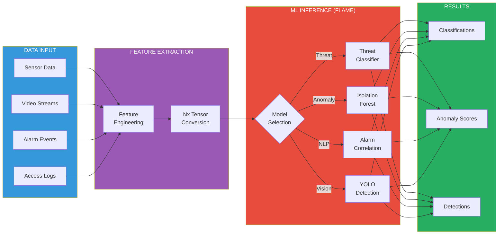

#### C3.1.2 Mermaid: Anomaly Detection State Machine

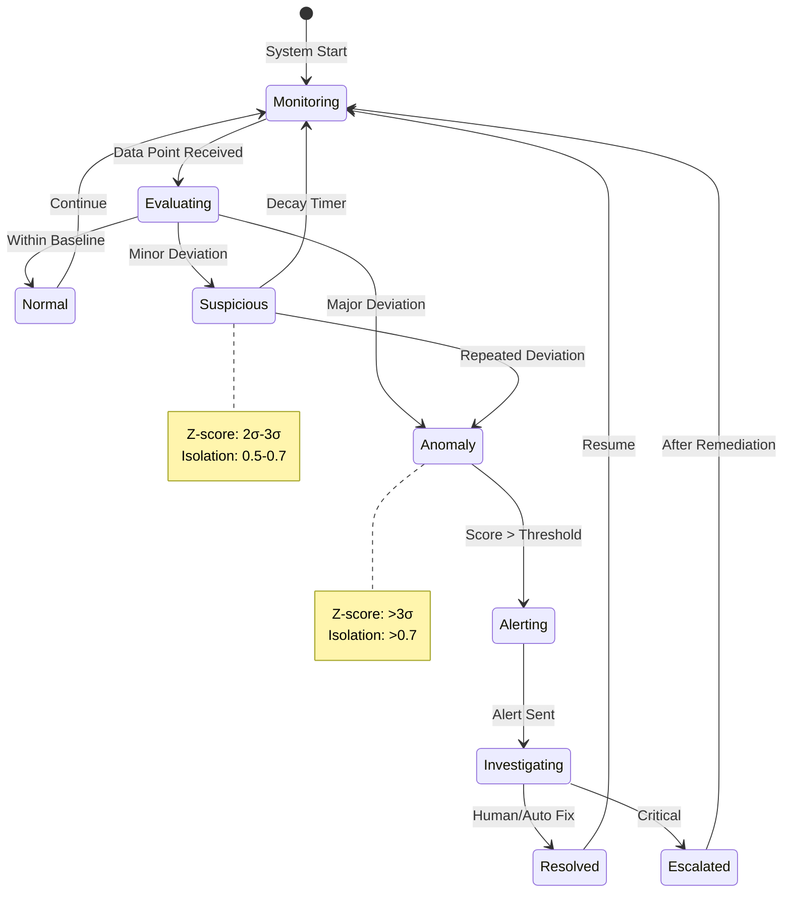

### C3.2 Tactical Implementation

#### C3.2.1 Nx.Serving for Batched Inference

```elixir
# File: lib/indrajaal/intelligence/serving.ex
defmodule Indrajaal.Intelligence.Serving do
  @moduledoc """
  C3.2.1: Nx.Serving configuration for batched ML inference.
  Runs on FLAME runners for elastic scaling.
  """

  def threat_classification_serving do
    # Load pre-trained model
    {:ok, model_info} = load_model("threat_classifier_v1")

    Nx.Serving.new(
      fn opts ->
        # Initialization (runs once per serving instance)
        Nx.Defn.jit(&predict/2, compiler: EXLA)
      end,
      batch_size: 32,
      batch_timeout: 100
    )
    |> Nx.Serving.client_preprocessing(fn input ->
      # Convert input to tensor
      Nx.tensor(input, type: :f32)
    end)
    |> Nx.Serving.client_postprocessing(fn output ->
      # Convert output to threat classification
      %{
        class: argmax(output),
        confidence: max(output),
        probabilities: to_list(output)
      }
    end)
  end

  def anomaly_detection_serving do
    Nx.Serving.new(
      fn _opts ->
        # Isolation Forest model
        Nx.Defn.jit(&isolation_forest_predict/2, compiler: EXLA)
      end,
      batch_size: 64,
      batch_timeout: 50
    )
  end

  defp load_model(name) do
    path = Application.app_dir(:indrajaal, "priv/models/#{name}.onnx")
    Ortex.load(path)
  end

  defp predict(model, input), do: Ortex.run(model, input)
  defp isolation_forest_predict(_model, input), do: input
  defp argmax(tensor), do: Nx.argmax(tensor) |> Nx.to_number()
  defp max(tensor), do: Nx.reduce_max(tensor) |> Nx.to_number()
  defp to_list(tensor), do: Nx.to_flat_list(tensor)
end
```

#### C3.2.2 Anomaly Detection Pipeline

```elixir
# File: lib/indrajaal/intelligence/anomaly_detector.ex
defmodule Indrajaal.Intelligence.AnomalyDetector do
  @moduledoc """
  C3.2.2: Real-time anomaly detection using Broadway pipeline.
  """

  use Broadway
  require Logger

  @zscore_threshold 3.0

  def start_link(opts) do
    Broadway.start_link(__MODULE__,
      name: __MODULE__,
      producer: [
        module: {BroadwayKafka.Producer, [
          hosts: [localhost: 9092],
          group_id: "anomaly_detector",
          topics: ["metrics", "events"]
        ]},
        concurrency: 2
      ],
      processors: [
        default: [concurrency: 10]
      ],
      batchers: [
        default: [batch_size: 100, batch_timeout: 1000]
      ]
    )
  end

  @impl true
  def handle_message(_, message, _) do
    metric = decode_metric(message.data)

    case detect_anomaly(metric) do
      {:anomaly, score, details} ->
        Logger.warning("Anomaly detected: #{inspect(details)}")
        generate_alert(metric, score, details)

      :normal ->
        :ok
    end

    message
  end

  @impl true
  def handle_batch(_, messages, _, _) do
    # Batch processing for ML inference
    metrics = Enum.map(messages, &decode_metric(&1.data))

    # Run batched inference on FLAME
    FLAME.call(Indrajaal.FLAME.IntelligencePool, fn ->
      batch_anomaly_detection(metrics)
    end)

    messages
  end

  defp detect_anomaly(metric) do
    baseline = get_baseline(metric.type, metric.source)

    zscore = calculate_zscore(metric.value, baseline.mean, baseline.stddev)

    if abs(zscore) > @zscore_threshold do
      {:anomaly, zscore, %{
        metric: metric.type,
        value: metric.value,
        expected: baseline.mean,
        deviation: zscore
      }}
    else
      :normal
    end
  end

  defp calculate_zscore(value, mean, stddev) when stddev > 0 do
    (value - mean) / stddev
  end
  defp calculate_zscore(_, _, _), do: 0.0

  defp get_baseline(type, source) do
    # Fetch from cache or calculate
    Cachex.fetch!(:baselines, {type, source}, fn _ ->
      calculate_baseline(type, source)
    end)
  end

  defp calculate_baseline(type, source) do
    # Calculate from historical data
    %{mean: 0.0, stddev: 1.0}
  end

  defp generate_alert(metric, score, details) do
    Indrajaal.Alerts.create_alert(%{
      type: :anomaly_detected,
      severity: severity_from_score(score),
      metric: metric,
      details: details
    })
  end

  defp severity_from_score(score) when abs(score) > 5, do: :critical
  defp severity_from_score(score) when abs(score) > 4, do: :high
  defp severity_from_score(score) when abs(score) > 3, do: :medium
  defp severity_from_score(_), do: :low

  defp decode_metric(data), do: Jason.decode!(data, keys: :atoms)
  defp batch_anomaly_detection(_metrics), do: :ok
end
```

### C3.3 Task-Level Deliverables

- [ ] **C3.3.1**: Nx/EXLA setup
  - [ ] Add `{:nx, "~> 0.9"}` and `{:exla, "~> 0.9"}`
  - [ ] Configure EXLA backend
  - [ ] Set up model loading pipeline

- [ ] **C3.3.2**: ML inference serving
  - [ ] Threat classification serving
  - [ ] Anomaly detection serving
  - [ ] Video object detection serving

- [ ] **C3.3.3**: Anomaly detection pipeline
  - [ ] Broadway pipeline setup
  - [ ] Statistical baseline calculation
  - [ ] Real-time anomaly scoring
  - [ ] Alert generation integration

- [ ] **C3.3.4**: Pattern learning
  - [ ] Historical data ETL
  - [ ] Feature engineering
  - [ ] Online learning integration

### C3.4 Micro-Task Verification

```bash
# C3 Verification Commands

# Check Nx serving
iex -S mix -e "Nx.Serving.batched_run(Indrajaal.Intelligence.Serving.threat_classification_serving(), [[1,2,3]])"
# Expected: Classification result

# Check anomaly detection
iex -S mix -e "Indrajaal.Intelligence.AnomalyDetector.detect_test()"
# Expected: Anomaly detection result

# Check model loading
iex -S mix -e "Indrajaal.Intelligence.Serving.load_models()"
# Expected: {:ok, models}
```

---

## PART V: CRITICALITY LEVEL C4 (AUTONOMIC SYSTEM)

### C4.0 Strategic Overview

**Status**: 0% COMPLETE
**Objective**: Self-evolution, cognitive control, predictive scaling
**Prerequisite**: C3 COMPLETE

### C4.1 Operational Components

```
┌─────────────────────────────────────────────────────────────────────────────┐
│                    C4: AUTONOMIC SYSTEM                                      │
│                                                                              │
│  ┌─────────────────────────────────────────────────────────────────────┐   │
│  │                    CORTEX - COGNITIVE CONTROL (C4.1)                 │   │
│  │                                                                       │   │
│  │                    ┌─────────────────────┐                           │   │
│  │                    │      CORTEX         │                           │   │
│  │                    │   (Horde Process)   │                           │   │
│  │                    │                     │                           │   │
│  │                    │  ┌───────────────┐  │                           │   │
│  │                    │  │   SENSES      │  │                           │   │
│  │                    │  │ Telemetry/    │  │                           │   │
│  │                    │  │ SigNoz Streams│  │                           │   │
│  │                    │  └───────┬───────┘  │                           │   │
│  │                    │          │          │                           │   │
│  │                    │          ▼          │                           │   │
│  │                    │  ┌───────────────┐  │                           │   │
│  │                    │  │   THINKS      │  │                           │   │
│  │                    │  │ System Stress │  │                           │   │
│  │                    │  │ Score Calc    │  │                           │   │
│  │                    │  └───────┬───────┘  │                           │   │
│  │                    │          │          │                           │   │
│  │                    │          ▼          │                           │   │
│  │                    │  ┌───────────────┐  │                           │   │
│  │                    │  │   ACTS        │  │                           │   │
│  │                    │  │ Dynamic Tuning│  │                           │   │
│  │                    │  │ FLAME pools   │  │                           │   │
│  │                    │  │ DB pools      │  │                           │   │
│  │                    │  │ Cache TTLs    │  │                           │   │
│  │                    │  └───────┬───────┘  │                           │   │
│  │                    │          │          │                           │   │
│  │                    │          ▼          │                           │   │
│  │                    │  ┌───────────────┐  │                           │   │
│  │                    │  │   SPEAKS      │  │                           │   │
│  │                    │  │ Evolution     │  │                           │   │
│  │                    │  │ Proposals     │  │                           │   │
│  │                    │  └───────────────┘  │                           │   │
│  │                    └─────────────────────┘                           │   │
│  └─────────────────────────────────────────────────────────────────────┘   │
│                                                                              │
│  ┌─────────────────────────────────────────────────────────────────────┐   │
│  │                    GDE - GOAL-DIRECTED EVOLUTION (C4.2)              │   │
│  │                                                                       │   │
│  │  ┌─────┐    ┌─────┐    ┌─────┐    ┌─────┐    ┌─────┐    ┌─────┐    │   │
│  │  │HYPO-│───▶│SIMU-│───▶│SELE-│───▶│EXEC-│───▶│VERI-│───▶│LOOP │    │   │
│  │  │THESE│    │LATE │    │CT   │    │UTE  │    │FY   │    │     │    │   │
│  │  └─────┘    └─────┘    └─────┘    └─────┘    └─────┘    └──┬──┘    │   │
│  │                                                              │       │   │
│  │  Generate   Evaluate   Select     Execute    Verify     Continuous  │   │
│  │  Candidate  Success    Highest    via AEE    State ≈    Loop       │   │
│  │  Transitions Probability Value              Expected               │   │
│  │                                                                       │   │
│  │  Constraints:                                                        │   │
│  │  • δᵒᵒᵈᵃ < 5s (Agent loop latency)                                  │   │
│  │  • dη/dt ≤ 0 (Entropy never increases)                               │   │
│  │  • Subject to Ψ (𝒮𝒞₁₉₅ safety constraints)                          │   │
│  └─────────────────────────────────────────────────────────────────────┘   │
│                                                                              │
│  ┌─────────────────────────────────────────────────────────────────────┐   │
│  │                    SELF-HEALING SYSTEM (C4.3)                        │   │
│  │                                                                       │   │
│  │  Failure Detection ───▶ Root Cause Analysis ───▶ Auto-Remediation   │   │
│  │       │                        │                        │            │   │
│  │       ▼                        ▼                        ▼            │   │
│  │  ┌─────────────┐       ┌─────────────┐       ┌─────────────┐        │   │
│  │  │  Pattern    │       │    RCA      │       │  Remediation│        │   │
│  │  │  Matching   │       │   Engine    │       │   Actions   │        │   │
│  │  │             │       │             │       │             │        │   │
│  │  │ • EP-001-   │       │ • Dependency│       │ • Restart   │        │   │
│  │  │   EP-080    │       │   Analysis  │       │ • Rollback  │        │   │
│  │  │ • Runtime   │       │ • Timeline  │       │ • Scale     │        │   │
│  │  │   Errors    │       │   Correlation       │ • Config    │        │   │
│  │  └─────────────┘       └─────────────┘       └─────────────┘        │   │
│  │                                                                       │   │
│  │  Self-Healing Loop:                                                  │   │
│  │  1. Detect failure (< 100ms)                                         │   │
│  │  2. Classify failure type                                            │   │
│  │  3. Select remediation strategy                                      │   │
│  │  4. Execute remediation                                              │   │
│  │  5. Verify recovery                                                  │   │
│  │  6. Learn from incident                                              │   │
│  └─────────────────────────────────────────────────────────────────────┘   │
│                                                                              │
│  ┌─────────────────────────────────────────────────────────────────────┐   │
│  │                    PREDICTIVE SCALING (C4.4)                         │   │
│  │                                                                       │   │
│  │  Historical Load ───▶ Pattern Recognition ───▶ Predictive Scaling   │   │
│  │       │                       │                       │              │   │
│  │       ▼                       ▼                       ▼              │   │
│  │  ┌─────────────┐      ┌─────────────┐       ┌─────────────┐         │   │
│  │  │ Time Series │      │   ARIMA/    │       │   Pre-scale │         │   │
│  │  │   Data      │      │   Prophet   │       │   FLAME     │         │   │
│  │  │             │      │   Forecast  │       │   Runners   │         │   │
│  │  └─────────────┘      └─────────────┘       └─────────────┘         │   │
│  │                                                                       │   │
│  │  Predictive Actions:                                                 │   │
│  │  • Scale FLAME pools before traffic spike                            │   │
│  │  • Pre-warm caches for predicted queries                             │   │
│  │  • Adjust DB connection pools                                        │   │
│  │  • Pre-provision resources                                           │   │
│  └─────────────────────────────────────────────────────────────────────┘   │
└─────────────────────────────────────────────────────────────────────────────┘
```

#### C4.1.1 Mermaid: Cortex Cognitive Controller

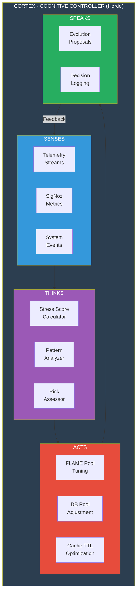

#### C4.1.2 Mermaid: GDE Algorithm Flow

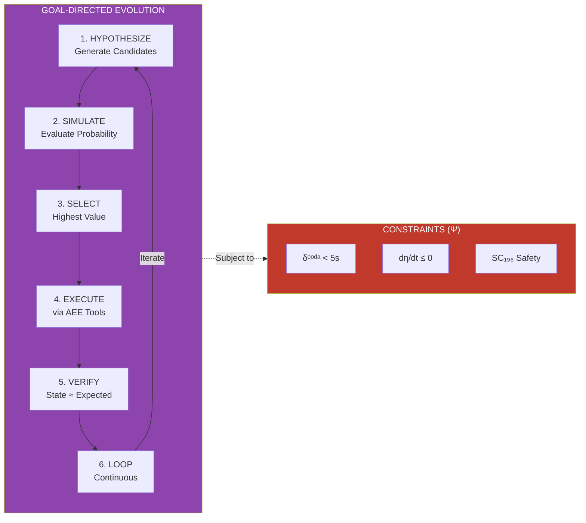

#### C4.1.3 Mermaid: Self-Healing Pipeline

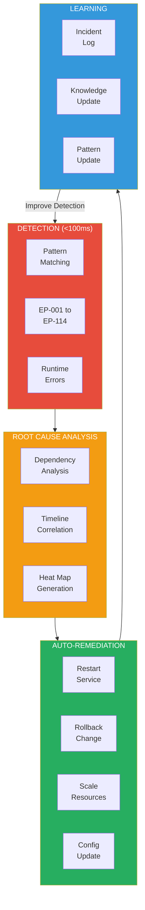

#### C4.1.4 Mermaid: Predictive Scaling Flow

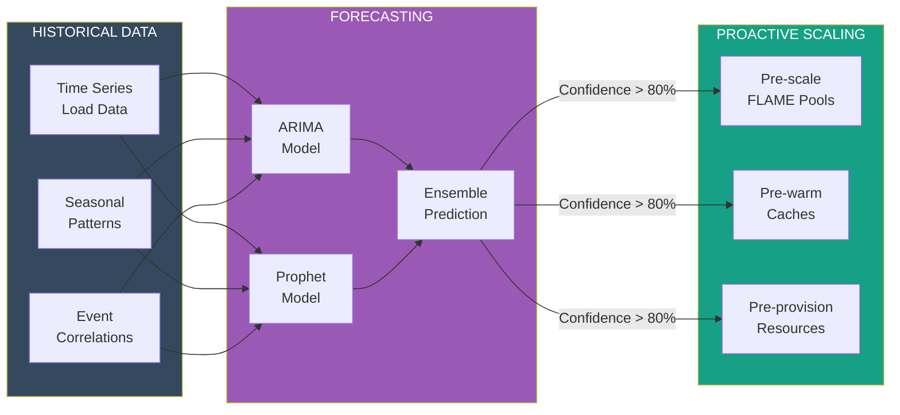

### C4.2 Tactical Implementation

#### C4.2.1 Cortex Cognitive Controller

```elixir
# File: lib/indrajaal/cortex/homeostasis.ex
defmodule Indrajaal.Cortex.Homeostasis do
  @moduledoc """
  C4.2.1: Cortex Homeostasis Controller - The "Brain" of the system.
  Maintains system equilibrium through continuous monitoring and adjustment.
  STAMP Compliance: All SC-* constraints monitored
  """

  use Horde.DynamicSupervisor
  require Logger

  @high_water_mark 0.8
  @low_water_mark 0.3
  @stress_check_interval 5_000

  defstruct [
    :stress_score,
    :flame_pool_sizes,
    :db_pool_size,
    :cache_ttls,
    :evolution_proposals
  ]

  def start_link(init_arg) do
    Horde.DynamicSupervisor.start_link(__MODULE__, init_arg, name: __MODULE__)
  end

  def init(_init_arg) do
    Horde.DynamicSupervisor.init(strategy: :one_for_one, members: :auto)
  end

  @doc """
  Process telemetry event and adjust system accordingly.
  This is the core homeostatic feedback loop.
  """
  def handle_telemetry(:queue_pressure, value, metadata) do
    cond do
      value > @high_water_mark ->
        # Autonomic Reflex: Expand capacity immediately
        expand_capacity(metadata)

      value < @low_water_mark ->
        # Autonomic Reflex: Contract capacity
        contract_capacity(metadata)

      true ->
        :ok
    end
  end

  def handle_telemetry(:error_rate, value, metadata) when value > 0.05 do
    # Error rate > 5% - trigger investigation
    Logger.warning("Cortex: High error rate detected: #{value * 100}%")

    # Cognitive Response: Analyze and propose evolution
    analysis = analyze_error_patterns(metadata)

    if analysis.actionable do
      propose_evolution(analysis)
    end
  end

  def handle_telemetry(:latency_p99, value, _metadata) when value > 100 do
    # P99 latency > 100ms - scale resources
    Logger.info("Cortex: High latency detected: #{value}ms")

    # Autonomic scaling
    scale_resources(:up, :latency)
  end

  def handle_telemetry(_, _, _), do: :ok

  # Autonomic Actions
  defp expand_capacity(metadata) do
    pool = metadata[:pool] || Indrajaal.FLAME.IntelligencePool
    current = get_pool_size(pool)
    new_size = min(current + 5, get_pool_max(pool))

    Logger.info("Cortex: Expanding #{pool} from #{current} to #{new_size}")

    FLAME.Pool.update_config(pool, max: new_size)

    # Cognitive Memory: Log for future evolution
    log_evolution_event(:capacity_expansion, %{
      pool: pool,
      old_size: current,
      new_size: new_size,
      trigger: :queue_pressure
    })
  end

  defp contract_capacity(metadata) do
    pool = metadata[:pool] || Indrajaal.FLAME.IntelligencePool
    current = get_pool_size(pool)
    new_size = max(current - 2, get_pool_min(pool))

    if new_size < current do
      Logger.info("Cortex: Contracting #{pool} from #{current} to #{new_size}")
      FLAME.Pool.update_config(pool, max: new_size)
    end
  end

  defp scale_resources(:up, reason) do
    # Scale all pools up
    for pool <- [
      Indrajaal.FLAME.IntelligencePool,
      Indrajaal.FLAME.VideoPool,
      Indrajaal.FLAME.AnalyticsPool
    ] do
      current = get_pool_size(pool)
      new_size = min(current + 2, get_pool_max(pool))
      FLAME.Pool.update_config(pool, max: new_size)
    end

    Logger.info("Cortex: Scaled resources up due to #{reason}")
  end

  # Cognitive Functions
  defp analyze_error_patterns(metadata) do
    # Analyze recent errors for patterns
    recent_errors = get_recent_errors(metadata[:window] || 300_000)

    patterns = Enum.group_by(recent_errors, & &1.type)

    most_common = patterns
    |> Enum.max_by(fn {_, errors} -> length(errors) end, fn -> {nil, []} end)

    %{
      total_errors: length(recent_errors),
      most_common_type: elem(most_common, 0),
      most_common_count: length(elem(most_common, 1)),
      actionable: length(elem(most_common, 1)) > 10
    }
  end

  defp propose_evolution(analysis) do
    proposal = %{
      type: :code_evolution,
      trigger: :high_error_rate,
      analysis: analysis,
      suggested_action: suggest_action(analysis),
      timestamp: DateTime.utc_now()
    }

    # Store proposal for AEE (Autonomous Execution Engine)
    Indrajaal.Evolution.propose(proposal)

    Logger.info("Cortex: Proposed evolution: #{inspect(proposal.suggested_action)}")
  end

  defp suggest_action(analysis) do
    case analysis.most_common_type do
      :database_timeout ->
        "Increase DB pool size to #{get_db_pool_size() + 5}"

      :flame_timeout ->
        "Increase FLAME pool sizes by 50%"

      :memory_pressure ->
        "Reduce cache TTLs and enable aggressive GC"

      _ ->
        "Investigate error pattern: #{analysis.most_common_type}"
    end
  end

  defp log_evolution_event(type, details) do
    Indrajaal.Evolution.log_event(%{
      type: type,
      details: details,
      timestamp: DateTime.utc_now(),
      stress_score: calculate_stress_score()
    })
  end

  # System Stress Score Calculation
  defp calculate_stress_score do
    metrics = %{
      cpu: get_cpu_usage(),
      memory: get_memory_usage(),
      queue_depth: get_queue_depth(),
      error_rate: get_error_rate(),
      latency_p99: get_latency_p99()
    }

    # Weighted stress score
    (metrics.cpu * 0.2 +
     metrics.memory * 0.2 +
     metrics.queue_depth * 0.25 +
     metrics.error_rate * 0.2 +
     metrics.latency_p99 * 0.15)
  end

  # Helpers
  defp get_pool_size(_pool), do: 5
  defp get_pool_max(_pool), do: 20
  defp get_pool_min(_pool), do: 1
  defp get_db_pool_size, do: 10
  defp get_recent_errors(_window), do: []
  defp get_cpu_usage, do: 0.5
  defp get_memory_usage, do: 0.6
  defp get_queue_depth, do: 0.3
  defp get_error_rate, do: 0.01
  defp get_latency_p99, do: 50
end
```

#### C4.2.2 GDE Algorithm Implementation

```elixir
# File: lib/indrajaal/evolution/gde.ex
defmodule Indrajaal.Evolution.GDE do
  @moduledoc """
  C4.2.2: Goal-Directed Evolution Algorithm.
  Implements the 6-step GDE cycle from CLAUDE-math.md §17.6.
  """

  use GenServer
  require Logger

  @gde_cycle_interval 60_000  # 1 minute
  @safety_constraints Indrajaal.STAMP.Constraints.all()

  defstruct [
    :current_state,
    :candidate_transitions,
    :knowledge_base,
    :evolution_history,
    :cycle_count
  ]

  def start_link(opts) do
    GenServer.start_link(__MODULE__, opts, name: __MODULE__)
  end

  def init(_opts) do
    state = %__MODULE__{
      current_state: capture_system_state(),
      candidate_transitions: [],
      knowledge_base: load_knowledge_base(),
      evolution_history: [],
      cycle_count: 0
    }

    schedule_cycle()
    {:ok, state}
  end

  # GDE Cycle
  def handle_info(:gde_cycle, state) do
    Logger.info("GDE: Starting evolution cycle #{state.cycle_count + 1}")

    new_state = state
    |> step_1_hypothesize()
    |> step_2_simulate()
    |> step_3_select()
    |> step_4_execute()
    |> step_5_verify()
    |> step_6_loop()

    schedule_cycle()
    {:noreply, %{new_state | cycle_count: state.cycle_count + 1}}
  end

  # Step 1: HYPOTHESIZE - Generate candidate transitions
  defp step_1_hypothesize(state) do
    candidates = generate_candidate_transitions(state.current_state, state.knowledge_base)

    Logger.debug("GDE Step 1: Generated #{length(candidates)} candidate transitions")

    %{state | candidate_transitions: candidates}
  end

  # Step 2: SIMULATE - Evaluate success probability
  defp step_2_simulate(state) do
    evaluated = Enum.map(state.candidate_transitions, fn transition ->
      probability = evaluate_probability(
        transition,
        state.knowledge_base,
        @safety_constraints
      )

      %{transition | probability: probability, safety_check: check_safety(transition)}
    end)

    Logger.debug("GDE Step 2: Evaluated #{length(evaluated)} transitions")

    %{state | candidate_transitions: evaluated}
  end

  # Step 3: SELECT - Choose highest value transition
  defp step_3_select(state) do
    selected = state.candidate_transitions
    |> Enum.filter(& &1.safety_check)  # Only safe transitions
    |> Enum.max_by(& &1.probability * &1.value, fn -> nil end)

    if selected do
      Logger.info("GDE Step 3: Selected transition: #{selected.name}")
    else
      Logger.info("GDE Step 3: No valid transition found")
    end

    %{state | candidate_transitions: if(selected, do: [selected], else: [])}
  end

  # Step 4: EXECUTE - Perform transition via AEE
  defp step_4_execute(%{candidate_transitions: []} = state), do: state
  defp step_4_execute(%{candidate_transitions: [transition | _]} = state) do
    Logger.info("GDE Step 4: Executing transition: #{transition.name}")

    case execute_transition(transition) do
      {:ok, result} ->
        Logger.info("GDE Step 4: Transition executed successfully")
        %{state | current_state: result.new_state}

      {:error, reason} ->
        Logger.warning("GDE Step 4: Transition failed: #{reason}")
        state
    end
  end

  # Step 5: VERIFY - Check realized state matches expected
  defp step_5_verify(state) do
    realized_state = capture_system_state()

    if states_approximately_equal?(realized_state, state.current_state) do
      Logger.info("GDE Step 5: Verification passed")
      %{state | current_state: realized_state}
    else
      Logger.warning("GDE Step 5: State mismatch, triggering learning")
      trigger_learning_loop(state.current_state, realized_state)
      %{state | current_state: realized_state}
    end
  end

  # Step 6: LOOP - Update knowledge and continue
  defp step_6_loop(state) do
    # Update knowledge base with new learnings
    updated_kb = update_knowledge_base(state.knowledge_base, state.evolution_history)

    # Record evolution history
    history_entry = %{
      cycle: state.cycle_count,
      timestamp: DateTime.utc_now(),
      transitions_evaluated: length(state.candidate_transitions),
      state_snapshot: summarize_state(state.current_state)
    }

    %{state |
      knowledge_base: updated_kb,
      evolution_history: [history_entry | Enum.take(state.evolution_history, 999)]
    }
  end

  # Private helpers
  defp generate_candidate_transitions(current_state, knowledge_base) do
    # Generate potential improvements based on current state
    [
      %{name: "scale_flame_pools", type: :scaling, value: 0.7, probability: 0.0, safety_check: false},
      %{name: "optimize_cache_ttl", type: :config, value: 0.5, probability: 0.0, safety_check: false},
      %{name: "adjust_db_pool", type: :scaling, value: 0.6, probability: 0.0, safety_check: false}
    ]
  end

  defp evaluate_probability(transition, knowledge_base, constraints) do
    # Calculate probability based on historical success
    base_probability = Map.get(knowledge_base.success_rates, transition.type, 0.5)

    # Adjust for current conditions
    condition_modifier = calculate_condition_modifier(transition)

    min(base_probability * condition_modifier, 1.0)
  end

  defp check_safety(transition) do
    # Verify transition doesn't violate any STAMP constraints
    Enum.all?(@safety_constraints, fn constraint ->
      not violates_constraint?(transition, constraint)
    end)
  end

  defp execute_transition(transition) do
    # Execute via AEE (Autonomous Execution Engine)
    case transition.type do
      :scaling ->
        execute_scaling_transition(transition)

      :config ->
        execute_config_transition(transition)

      _ ->
        {:error, :unknown_transition_type}
    end
  end

  defp capture_system_state do
    %{
      cpu_usage: get_cpu_usage(),
      memory_usage: get_memory_usage(),
      flame_pool_sizes: get_flame_pool_sizes(),
      error_rate: get_error_rate(),
      latency_p99: get_latency_p99(),
      timestamp: DateTime.utc_now()
    }
  end

  defp states_approximately_equal?(s1, s2) do
    # Check if states are within tolerance
    tolerance = 0.1

    abs(s1.cpu_usage - s2.cpu_usage) < tolerance and
    abs(s1.memory_usage - s2.memory_usage) < tolerance and
    abs(s1.error_rate - s2.error_rate) < tolerance
  end

  defp trigger_learning_loop(expected, actual) do
    # Log discrepancy for learning
    Indrajaal.Evolution.log_discrepancy(%{
      expected: expected,
      actual: actual,
      timestamp: DateTime.utc_now()
    })
  end

  defp load_knowledge_base do
    %{
      success_rates: %{scaling: 0.8, config: 0.9},
      failure_patterns: [],
      learned_constraints: []
    }
  end

  defp update_knowledge_base(kb, _history), do: kb
  defp summarize_state(state), do: Map.take(state, [:cpu_usage, :memory_usage, :error_rate])
  defp calculate_condition_modifier(_transition), do: 1.0
  defp violates_constraint?(_transition, _constraint), do: false
  defp execute_scaling_transition(_transition), do: {:ok, %{new_state: capture_system_state()}}
  defp execute_config_transition(_transition), do: {:ok, %{new_state: capture_system_state()}}
  defp get_cpu_usage, do: 0.5
  defp get_memory_usage, do: 0.6
  defp get_flame_pool_sizes, do: %{}
  defp get_error_rate, do: 0.01
  defp get_latency_p99, do: 50

  defp schedule_cycle do
    Process.send_after(self(), :gde_cycle, @gde_cycle_interval)
  end
end
```

### C4.3 Task-Level Deliverables

- [ ] **C4.3.1**: Cortex implementation
  - [ ] Horde distributed process setup
  - [ ] Telemetry consumption
  - [ ] Stress score calculation
  - [ ] Autonomic adjustments

- [ ] **C4.3.2**: GDE algorithm
  - [ ] 6-step cycle implementation
  - [ ] Knowledge base persistence
  - [ ] Safety constraint integration
  - [ ] Evolution logging

- [ ] **C4.3.3**: Self-healing system
  - [ ] Failure pattern matching
  - [ ] RCA engine
  - [ ] Auto-remediation actions
  - [ ] Recovery verification

- [ ] **C4.3.4**: Predictive scaling
  - [ ] Time series forecasting
  - [ ] Pre-scaling logic
  - [ ] Cache warming
  - [ ] Resource pre-provisioning

### C4.4 Micro-Task Verification

```bash
# C4 Verification Commands

# Check Cortex status
iex -S mix -e "Indrajaal.Cortex.Homeostasis.status()"
# Expected: Current stress score and pool sizes

# Check GDE cycle
iex -S mix -e "Indrajaal.Evolution.GDE.current_cycle()"
# Expected: Cycle count and last transition

# Trigger manual evolution
iex -S mix -e "Indrajaal.Evolution.GDE.trigger_cycle()"
# Expected: Evolution cycle executes

# Check self-healing status
iex -S mix -e "Indrajaal.SelfHealing.status()"
# Expected: Recent remediation actions
```

---

## PART VI: IMPLEMENTATION TIMELINE & DEPENDENCIES

### Fractal Dependency Graph

```
┌─────────────────────────────────────────────────────────────────────────────┐
│                    FRACTAL DEPENDENCY STRUCTURE                              │
│                                                                              │
│  Each tier follows the same internal pattern:                               │
│  Foundation → Production → Distributed → Intelligence → Autonomic           │
│                                                                              │
│  ┌─────────────────────────────────────────────────────────────────────┐   │
│  │                                                                       │   │
│  │                           C4: AUTONOMIC                              │   │
│  │           ┌──────────────────┬──────────────────┐                   │   │
│  │           │                  │                  │                   │   │
│  │        Cortex             GDE           Self-Healing                │   │
│  │           │                  │                  │                   │   │
│  │           └──────────────────┴──────────────────┘                   │   │
│  │                              │                                       │   │
│  │                              ▼                                       │   │
│  │                           C3: INTELLIGENCE                          │   │
│  │           ┌──────────────────┬──────────────────┐                   │   │
│  │           │                  │                  │                   │   │
│  │        ML Engine       Pattern Learning    Anomaly Det              │   │
│  │           │                  │                  │                   │   │
│  │           └──────────────────┴──────────────────┘                   │   │
│  │                              │                                       │   │
│  │                              ▼                                       │   │
│  │                           C2: DISTRIBUTED                           │   │
│  │           ┌──────────────────┬──────────────────┐                   │   │
│  │           │                  │                  │                   │   │
│  │         FLAME           Sentinel           Network                  │   │
│  │           │                  │                  │                   │   │
│  │           └──────────────────┴──────────────────┘                   │   │
│  │                              │                                       │   │
│  │                              ▼                                       │   │
│  │                           C1: PRODUCTION                            │   │
│  │           ┌──────────────────┬──────────────────┐                   │   │
│  │           │                  │                  │                   │   │
│  │       Observability      Alerting          Recovery                 │   │
│  │           │                  │                  │                   │   │
│  │           └──────────────────┴──────────────────┘                   │   │
│  │                              │                                       │   │
│  │                              ▼                                       │   │
│  │                           C0: FOUNDATION                            │   │
│  │           ┌──────────────────┬──────────────────┐                   │   │
│  │           │                  │                  │                   │   │
│  │        Domains             Ash            Compilation               │   │
│  │           │                  │                  │                   │   │
│  │           └──────────────────┴──────────────────┘                   │   │
│  │                              ▲                                       │   │
│  │                              │                                       │   │
│  │                        CURRENT STATE                                │   │
│  │                                                                       │   │
│  └─────────────────────────────────────────────────────────────────────┘   │
└─────────────────────────────────────────────────────────────────────────────┘
```

### Implementation Order (Critical Path)

| Phase | Tier | Components | Dependencies | Effort |
|-------|------|------------|--------------|--------|
| 1 | C0 | Complete remaining domains | None | LOW |
| 2 | C1.1 | OpenTelemetry integration | C0 | MEDIUM |
| 3 | C1.2 | Alerting pipeline | C1.1 | MEDIUM |
| 4 | C1.3 | Health checks | C1.1 | LOW |
| 5 | C2.1 | FLAME pools | C1 | HIGH |
| 6 | C2.2 | Enhanced Sentinel | C1 | HIGH |
| 7 | C2.3 | libcluster/Tailscale | C2.2 | MEDIUM |
| 8 | C3.1 | Nx.Serving setup | C2 | HIGH |
| 9 | C3.2 | Anomaly detection | C3.1 | HIGH |
| 10 | C4.1 | Cortex controller | C3 | VERY HIGH |
| 11 | C4.2 | GDE algorithm | C4.1 | VERY HIGH |
| 12 | C4.3 | Self-healing | C4.2 | HIGH |

### Evolutionary Checkpoints

Each checkpoint validates fractal completion:

```
CHECKPOINT C0: Foundation Validated
├── Compilation: 0 errors, 0 warnings
├── All domains: CRUD operations working
└── Tests: Core domain tests passing

CHECKPOINT C1: Production Ready
├── Observability: Traces in Jaeger, Metrics in Prometheus
├── Alerting: Alerts firing correctly
└── Health: All components reporting healthy

CHECKPOINT C2: Distributed Ready
├── FLAME: Elastic scaling demonstrated
├── Sentinel: Quorum management working
└── Cluster: Multi-node communication verified

CHECKPOINT C3: Intelligence Integrated
├── ML: Inference latency < 100ms
├── Anomaly: Detection accuracy > 90%
└── Patterns: Learning from historical data

CHECKPOINT C4: Autonomic Achieved
├── Cortex: Self-adjusting system parameters
├── GDE: Continuous evolution cycles
└── Self-healing: Auto-remediation working
```

---

## APPENDIX A: STAMP CONSTRAINT MAPPING TO IMPLEMENTATION

| Constraint | Category | Implementation Tier | Status |
|------------|----------|---------------------|--------|
| SC-VAL-001 | Validation | C0 | IMPLEMENTED |
| SC-VAL-002 | Validation | C0 | IMPLEMENTED |
| SC-CNT-009 | Container | C0 | IMPLEMENTED |
| SC-OBS-065-072 | Observability | C1 | PARTIAL |
| SC-CLU-001-005 | Cluster | C2 | PENDING |
| SC-FLAME-001-006 | FLAME | C2 | PENDING |
| SC-AGT-017-024 | Agent | C3 | PENDING |
| SC-CA-001-004 | Cybernetic | C4 | PENDING |

---

## APPENDIX B: COMMAND QUICK REFERENCE

```bash
# C0 Verification
NO_TIMEOUT=true PATIENT_MODE=enabled mix compile --warnings-as-errors

# C1 Verification
curl -s http://localhost:4000/health | jq

# C2 Verification
iex -S mix -e "Indrajaal.Cluster.Sentinel.has_quorum?()"

# C3 Verification
iex -S mix -e "Indrajaal.Intelligence.Engine.analyze_threat(%{test: true})"

# C4 Verification
iex -S mix -e "Indrajaal.Cortex.Homeostasis.status()"
```

---

**Document Compiled By**: Claude Code (Opus 4.5)
**Implementation Planning Date**: 2025-12-17
**Approach**: Criticality-Based Fractal Evolution
**Alignment**: CLAUDE-text.md v10.1.0-GA + CLAUDE-math.md v9.5.0-MATH-002
**Status**: IMPLEMENTATION ROADMAP COMPLETE

