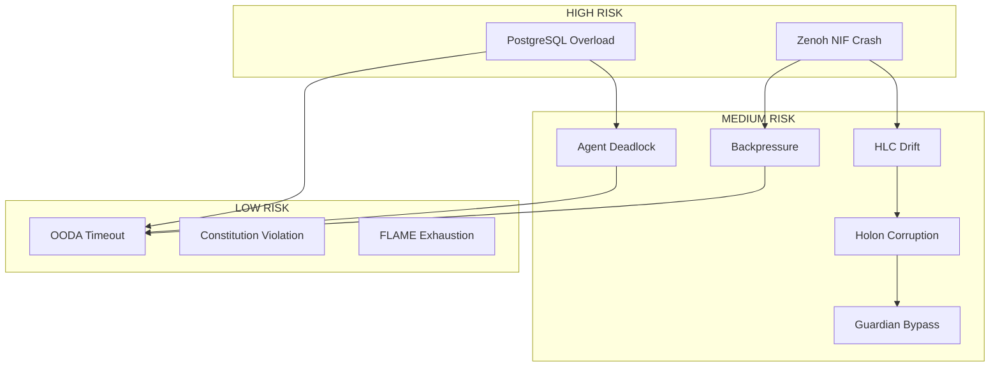

# Indrajaal Architectural Views & Risk Analysis

**Document**: Computation, Dataflow, Control Flow Views + Issue Prediction
**Date**: 2026-01-01T20:15:00+01:00
**Version**: 21.1.0-FOUNDERS-COVENANT
**Author**: Claude Opus 4.5 (Cybernetic Architect)
**Classification**: L5-SPINE (Forever Retention)

---

## Table of Contents

1. [Computation View](#1-computation-view)
2. [Dataflow View](#2-dataflow-view)
3. [Control Flow View](#3-control-flow-view)
4. [Key Issues Analysis](#4-key-issues-analysis)
5. [Risk Mitigation Matrix](#5-risk-mitigation-matrix)

---

# 1. Computation View

## 1.1 Compute Topology

```
COMPUTATION ARCHITECTURE
════════════════════════════════════════════════════════════════════

                    ┌─────────────────────────────────────────────┐
                    │         FLAME ELASTIC COMPUTE               │
                    │  (On-demand GPU/ML workloads)               │
                    ├─────────────────────────────────────────────┤
                    │ IntelligencePool │ VideoPool │ AnalyticsPool│
                    │   ML Inference   │  VMS AI   │   BI/ETL     │
                    │   Burst: 0→N     │  Burst    │   Burst      │
                    └─────────────────────────────────────────────┘
                                       ▲
                                       │ FLAME.call()
                    ┌──────────────────┴──────────────────────────┐
                    │              BEAM/OTP CLUSTER               │
                    │        (Core Application Compute)           │
                    ├─────────────────────────────────────────────┤
                    │                                             │
                    │  ┌─────────┐  ┌─────────┐  ┌─────────┐     │
                    │  │ Agents  │  │ Workers │  │GenServers│     │
                    │  │   50    │  │  Oban   │  │  ~200    │     │
                    │  │processes│  │Broadway │  │processes │     │
                    │  └─────────┘  └─────────┘  └─────────┘     │
                    │                                             │
                    │  CPU: 16 cores │ Memory: 8GB │ Schedulers: 16│
                    └─────────────────────────────────────────────┘
                                       ▲
                    ┌──────────────────┴──────────────────────────┐
                    │              CONTAINER LAYER                │
                    │         (NixOS/Podman Rootless)             │
                    ├─────────────────────────────────────────────┤
                    │ indrajaal-app │ indrajaal-db │ indrajaal-obs│
                    │   Phoenix     │  PostgreSQL  │  OTEL/SigNoz │
                    │   Port 4000   │  Port 5433   │  Ports 4317+ │
                    └─────────────────────────────────────────────┘
                                       ▲
                    ┌──────────────────┴──────────────────────────┐
                    │                F# CEPAF                     │
                    │        (.NET 10.0 Infrastructure)           │
                    ├─────────────────────────────────────────────┤
                    │ Podman Mgmt │ PHICS │ Zenoh Bridge │ Cockpit│
                    │  Container  │ <50ms │   gRPC/Port  │  TUI   │
                    │  Lifecycle  │ Check │   Protocol   │        │
                    └─────────────────────────────────────────────┘
```

## 1.2 Compute Distribution

| Layer | Technology | Compute Type | Location | Scale |
|-------|------------|--------------|----------|-------|
| **FLAME** | Elixir/BEAM | Elastic burst | K8s/VM | 0→N pods |
| **BEAM** | OTP 28 | Persistent processes | Container | 16 schedulers |
| **Container** | Podman 5.4+ | Isolated namespaces | Host | 4 containers |
| **CEPAF** | .NET 10.0 | Infrastructure mgmt | Container | 1 process |
| **NIF** | Rust/Zenoh | Native performance | In-process | 1 per node |
| **Database** | PostgreSQL 17 | Query execution | Container | 1 primary |

## 1.3 Computation Categories

```
COMPUTATION TAXONOMY
════════════════════

1. REAL-TIME (<50ms) - SC-PRF-050
   ├── Alarm processing
   ├── Access control decisions
   ├── Guardian validation
   └── OODA cycle execution

2. NEAR-REAL-TIME (<1s)
   ├── Video analytics (FLAME)
   ├── Dashboard updates
   ├── Zenoh pub/sub
   └── Fractal logging

3. BATCH (>1s)
   ├── Oban background jobs
   ├── Broadway pipelines
   ├── Analytics aggregation
   └── Report generation

4. SCHEDULED (cron)
   ├── Compliance audits
   ├── Maintenance windows
   └── Cold storage migration
```

## 1.4 Computation Hotspots

| Hotspot | CPU% | Memory | Mitigation |
|---------|------|--------|------------|
| **OODA Loop** | 15% | 128MB | Async observation, hysteresis |
| **Zenoh NIF** | 10% | 64MB | Batching, backpressure |
| **Fractal Logger** | 5% | 256MB | Sampling, load shedding |
| **Phoenix PubSub** | 8% | 128MB | Topic partitioning |
| **Guardian** | 3% | 32MB | Capability caching |

---

# 2. Dataflow View

## 2.1 Data Topology

```
DATAFLOW ARCHITECTURE
════════════════════════════════════════════════════════════════════

                         ┌─────────────────┐
                         │  EXTERNAL       │
                         │  SOURCES        │
                         └────────┬────────┘
                                  │
         ┌────────────────────────┼────────────────────────┐
         │                        │                        │
         ▼                        ▼                        ▼
   ┌──────────┐            ┌──────────┐            ┌──────────┐
   │  DEVICES │            │  MOBILE  │            │   WEB    │
   │  Panels  │            │   API    │            │ LiveView │
   │  Cameras │            │  REST    │            │WebSocket │
   └────┬─────┘            └────┬─────┘            └────┬─────┘
        │                       │                       │
        └───────────────────────┼───────────────────────┘
                                │
                    ┌───────────┴───────────┐
                    │    PHOENIX ENDPOINT   │
                    │   (Request Gateway)   │
                    └───────────┬───────────┘
                                │
        ┌───────────────────────┼───────────────────────┐
        │                       │                       │
        ▼                       ▼                       ▼
  ┌───────────┐          ┌───────────┐          ┌───────────┐
  │   DOMAIN  │          │  FRACTAL  │          │   ZENOH   │
  │  CONTEXT  │          │  LOGGER   │          │   BUS     │
  │  (Ash 3.x)│          │  (5-level)│          │  (Pub/Sub)│
  └─────┬─────┘          └─────┬─────┘          └─────┬─────┘
        │                      │                      │
        ▼                      ▼                      ▼
  ┌───────────┐          ┌───────────┐          ┌───────────┐
  │ POSTGRESQL│          │  SIGNOZ   │          │   CEPAF   │
  │ (Business)│          │  (Traces) │          │ (Cockpit) │
  └───────────┘          └───────────┘          └───────────┘
        │
        ▼
  ┌───────────────────────────────────────────────────────┐
  │                    HOLON STATE                        │
  ├───────────────────────┬───────────────────────────────┤
  │   SQLite (Real-time)  │   DuckDB (History)            │
  │   - Version vectors   │   - Evolution lineage         │
  │   - Capability tokens │   - Analytics queries         │
  │   - WAL mode          │   - Append-only               │
  └───────────────────────┴───────────────────────────────┘
```

## 2.2 Data Flow Paths

### Path 1: Alarm Event Flow
```
Device → Phoenix → Alarms Domain → PostgreSQL → Fractal L4 → SigNoz
                                              ↓
                                       Zenoh Pub/Sub → CEPAF Cockpit
                                              ↓
                                       HLC Timestamping
```

### Path 2: Holon State Flow
```
State Mutation → Guardian Validation → Immutable Register
                                              ↓
                                       SHA3-256 Block → SQLite WAL
                                              ↓
                                       DuckDB History → Analytics
```

### Path 3: OODA Control Flow
```
Sensors → Observer → [HLC] → Orientator → Decider → Guardian
                                                        ↓
                                              Actor → Execute
                                                        ↓
                                              Telemetry → Learning
```

## 2.3 Data Stores

| Store | Purpose | Data Type | Retention | Access |
|-------|---------|-----------|-----------|--------|
| **PostgreSQL** | Business transactions | Relational | Indefinite | ACID |
| **TimescaleDB** | Time-series metrics | Hypertable | 90 days | SQL |
| **SQLite** | Holon real-time state | Key-value | Live | WAL |
| **DuckDB** | Holon history/analytics | Columnar | Forever | OLAP |
| **Redis** | Session cache | Key-value | TTL | In-memory |
| **SigNoz** | Traces/Logs/Metrics | OTEL | 30 days | Query |

## 2.4 Data Volume Estimates

| Flow | Volume | Frequency | Bottleneck Risk |
|------|--------|-----------|-----------------|
| **Alarms** | 10K events/hour | Burst | LOW |
| **Access Control** | 100K events/day | Steady | LOW |
| **Video Analytics** | 1GB/hour | Continuous | MEDIUM |
| **Fractal Logs** | 50K entries/min | Continuous | MEDIUM |
| **Zenoh Messages** | 10K msg/sec | Burst | HIGH |
| **Holon State** | 1K mutations/min | Steady | LOW |

---

# 3. Control Flow View

## 3.1 Control Topology

```
CONTROL FLOW ARCHITECTURE
════════════════════════════════════════════════════════════════════

                    ┌─────────────────────────────────────────────┐
                    │           FOUNDER DIRECTIVE (Ω₀)            │
                    │        Supreme Control Authority            │
                    └─────────────────────────────────────────────┘
                                         │
                                         ▼
                    ┌─────────────────────────────────────────────┐
                    │          CONSTITUTION (Ψ₀-Ψ₅)               │
                    │        Immutable Constraint Layer           │
                    └─────────────────────────────────────────────┘
                                         │
                    ┌────────────────────┼────────────────────────┐
                    │                    │                        │
                    ▼                    ▼                        ▼
             ┌───────────┐        ┌───────────┐           ┌───────────┐
             │  GUARDIAN │        │ SENTINEL  │           │   VSM     │
             │  (Veto)   │        │ (Immune)  │           │ (S1-S5)   │
             └─────┬─────┘        └─────┬─────┘           └─────┬─────┘
                   │                    │                       │
                   └────────────────────┼───────────────────────┘
                                        │
                    ┌───────────────────┴───────────────────────┐
                    │              OODA CONTROLLER              │
                    │          Tactical Decision Loop           │
                    └───────────────────────────────────────────┘
                                        │
         ┌──────────────────────────────┼──────────────────────────────┐
         │                              │                              │
         ▼                              ▼                              ▼
   ┌───────────┐                 ┌───────────┐                 ┌───────────┐
   │ EXECUTIVE │                 │  DOMAIN   │                 │  WORKER   │
   │   AGENT   │                 │  AGENTS   │                 │   MESH    │
   │ (Supreme) │                 │   (10)    │                 │   (7)     │
   └─────┬─────┘                 └─────┬─────┘                 └─────┬─────┘
         │                             │                             │
         └─────────────────────────────┼─────────────────────────────┘
                                       │
                    ┌──────────────────┴──────────────────────┐
                    │            UNIFIED CONTROL BUS          │
                    │          (Async Event Messaging)        │
                    └─────────────────────────────────────────┘
```

## 3.2 Control Hierarchies

### Hierarchy 1: Authority Chain
```
Founder Directive (Ω₀)
    ↓
Constitution (Ψ₀-Ψ₅)
    ↓
Guardian (Safety Kernel)
    ↓
Executive Agent
    ↓
Domain Agents (10)
    ↓
Functional Agents (15)
    ↓
Worker Agents (24)
```

### Hierarchy 2: VSM Control
```
S5: Policy (Identity/Values)
    ↓
S4: Intelligence (Future/Adaptation)
    ↓
S3: Control (Optimization)
    ↓
S2: Coordination (Cohesion)
    ↓
S1: Operations (Execution)
```

### Hierarchy 3: OODA Cycle
```
Observe (Sensors) → Orient (Context) → Decide (Proposals) → Act (Execute)
       ↑                                                         │
       └─────────────────── Feedback Loop ──────────────────────┘
```

## 3.3 Control Mechanisms

| Mechanism | Purpose | Latency | Authority |
|-----------|---------|---------|-----------|
| **Guardian Veto** | Block unsafe actions | <10ms | Absolute |
| **OODA Cycle** | Tactical adaptation | <100ms | High |
| **GDE Proposals** | Strategic evolution | Hours | Medium |
| **Agent Consensus** | Distributed decisions | <1s | Collective |
| **Constitution Check** | Invariant validation | <1ms | Supreme |
| **Dead Man's Switch** | Heartbeat monitoring | 2000ms | Emergency |

## 3.4 Control Flow Scenarios

### Scenario 1: Normal Operation
```
Request → Guardian OK → Domain Agent → Execute → Log → Return
```

### Scenario 2: Safety Violation
```
Request → Guardian VETO → Reject → Alert → Sentinel Investigation
```

### Scenario 3: Adaptation
```
Anomaly → OODA Observe → Orient Analysis → Decide Proposal
    → Guardian Validate → Shadow Test → Deploy
```

### Scenario 4: Emergency
```
Critical Failure → Dead Man's Switch → Sentinel Quarantine
    → Rollback → Guardian Locked Mode → Human Intervention
```

---

# 4. Key Issues Analysis

## 4.1 Issue Severity Matrix

| ID | Issue | Probability | Impact | Risk Score | Layer |
|----|-------|-------------|--------|------------|-------|
| I1 | Zenoh NIF Crash | MEDIUM | CRITICAL | **HIGH** | Compute |
| I2 | HLC Drift | LOW | HIGH | MEDIUM | Dataflow |
| I3 | Guardian Bypass | VERY LOW | CRITICAL | MEDIUM | Control |
| I4 | PostgreSQL Overload | MEDIUM | HIGH | **HIGH** | Dataflow |
| I5 | OODA Timeout | LOW | MEDIUM | LOW | Control |
| I6 | Holon State Corruption | VERY LOW | CRITICAL | MEDIUM | Dataflow |
| I7 | Agent Deadlock | LOW | HIGH | MEDIUM | Compute |
| I8 | Zenoh Backpressure | MEDIUM | MEDIUM | MEDIUM | Dataflow |
| I9 | Constitution Violation | NEAR ZERO | INFINITE | LOW | Control |
| I10 | FLAME Pool Exhaustion | MEDIUM | MEDIUM | MEDIUM | Compute |

## 4.2 Detailed Issue Analysis

### I1: Zenoh NIF Crash (HIGH RISK)
```
ISSUE: Zenoh NIF Crash
═══════════════════════════════════════════════════════════════

DESCRIPTION:
  Rust NIF crash brings down BEAM process due to shared memory.

ROOT CAUSES:
  1. Memory corruption in Rust code
  2. Thread safety violations
  3. Resource exhaustion in NIF
  4. Rustler/BEAM version mismatch (SC-NIF-004)

IMPACT:
  - Entire node crashes
  - Distributed coordination lost
  - Data loss if buffers not flushed

CURRENT MITIGATIONS:
  - Rustler safe wrappers
  - SKIP_ZENOH_NIF flag for testing
  - Fallback to Phoenix PubSub

RECOMMENDED ACTIONS:
  P0: Add NIF watchdog with crash recovery
  P0: Implement graceful degradation
  P1: Add memory bounds checking
  P1: Fuzz testing for NIF inputs

STAMP: SC-NIF-001 to SC-NIF-007
```

### I2: HLC Drift (MEDIUM RISK)
```
ISSUE: HLC Drift
═══════════════════════════════════════════════════════════════

DESCRIPTION:
  Hybrid Logical Clock physical time diverges from wall clock.

ROOT CAUSES:
  1. Clock skew between nodes
  2. NTP synchronization failures
  3. VM time drift
  4. Long-running processes without sync

IMPACT:
  - Causal ordering violated
  - FQUN collisions possible
  - Event sourcing inconsistency

CURRENT MITIGATIONS:
  - HLC.update() on message receive
  - Fallback to system time

RECOMMENDED ACTIONS:
  P1: Add drift monitoring (SC-HLC-003)
  P1: Periodic NTP sync check
  P2: Zenoh-based HLC gossip

STAMP: SC-DIST-005, SC-LOG-006
```

### I3: Guardian Bypass (MEDIUM RISK)
```
ISSUE: Guardian Bypass
═══════════════════════════════════════════════════════════════

DESCRIPTION:
  Code path that bypasses Guardian validation.

ROOT CAUSES:
  1. Direct Ash/Ecto calls without Guardian
  2. Emergency override misuse
  3. New code not routed through Guardian

IMPACT:
  - STAMP constraints violated
  - Safety invariants broken
  - Audit trail incomplete

CURRENT MITIGATIONS:
  - Code review requirements
  - Capability token checks
  - Audit logging

RECOMMENDED ACTIONS:
  P0: Compile-time Guardian enforcement
  P1: Runtime bypass detection
  P1: Shadow mode for all state mutations

STAMP: SC-GDE-001, SC-CONST-007
```

### I4: PostgreSQL Overload (HIGH RISK)
```
ISSUE: PostgreSQL Overload
═══════════════════════════════════════════════════════════════

DESCRIPTION:
  Database becomes bottleneck under high load.

ROOT CAUSES:
  1. N+1 query patterns
  2. Missing indexes
  3. Lock contention
  4. Connection pool exhaustion

IMPACT:
  - Request latency spikes
  - Timeout cascades
  - Service degradation

CURRENT MITIGATIONS:
  - Ecto connection pooling
  - Ash query optimization
  - TimescaleDB for time-series

RECOMMENDED ACTIONS:
  P0: Query performance monitoring
  P1: Read replicas
  P1: Query caching layer
  P2: CQRS separation

STAMP: SC-PRF-050, SC-PRF-055
```

### I5: OODA Timeout (LOW RISK)
```
ISSUE: OODA Timeout
═══════════════════════════════════════════════════════════════

DESCRIPTION:
  OODA cycle exceeds 100ms budget.

ROOT CAUSES:
  1. AI orientation exceeds 20ms
  2. Guardian validation slow
  3. Sensor data collection blocked
  4. Heavy decision computation

IMPACT:
  - Delayed tactical response
  - Quality gate failures
  - Adaptation lag

CURRENT MITIGATIONS:
  - 20ms AI timeout with fallback (SC-OODA-006)
  - Async observation (SC-OODA-003)
  - Hysteresis (SC-OODA-005)

RECOMMENDED ACTIONS:
  P2: Precompute common decisions
  P2: Parallel orientation
  P3: ML-based fast path

STAMP: SC-OODA-001 to SC-OODA-006
```

### I6: Holon State Corruption (MEDIUM RISK)
```
ISSUE: Holon State Corruption
═══════════════════════════════════════════════════════════════

DESCRIPTION:
  SQLite/DuckDB state files become corrupted.

ROOT CAUSES:
  1. Disk I/O errors
  2. Unexpected shutdown
  3. Concurrent writes
  4. File system issues

IMPACT:
  - Holon unrecoverable
  - History lost
  - Federation trust broken

CURRENT MITIGATIONS:
  - SQLite WAL mode
  - SHA-256 checksums (SC-HOLON-017)
  - Reed-Solomon parity (SC-REG-006)

RECOMMENDED ACTIONS:
  P0: Startup integrity verification (AOR-REG-002)
  P1: Self-repair from parity
  P1: Distributed replication
  P2: RAID-like redundancy

STAMP: SC-HOLON-001 to SC-HOLON-020, SC-REG-001 to SC-REG-015
```

### I7: Agent Deadlock (MEDIUM RISK)
```
ISSUE: Agent Deadlock
═══════════════════════════════════════════════════════════════

DESCRIPTION:
  Circular dependency between agents causes deadlock.

ROOT CAUSES:
  1. Synchronous GenServer.call chains
  2. Resource lock ordering violations
  3. Timeout propagation failures

IMPACT:
  - Agent mesh frozen
  - Request timeouts
  - Service degradation

CURRENT MITIGATIONS:
  - Async messaging (SC-BUS-001)
  - Timeout on all calls
  - Deadlock detection (SC-AGT-018)

RECOMMENDED ACTIONS:
  P1: Lock ordering enforcement
  P1: Deadlock detector agent
  P2: Circuit breaker per agent

STAMP: SC-AGT-018, SC-BUS-001
```

### I8: Zenoh Backpressure (MEDIUM RISK)
```
ISSUE: Zenoh Backpressure
═══════════════════════════════════════════════════════════════

DESCRIPTION:
  Message queue builds up faster than consumption.

ROOT CAUSES:
  1. Subscriber slow processing
  2. Network congestion
  3. Burst traffic
  4. Insufficient batching

IMPACT:
  - Memory growth
  - Message delays
  - Eventually OOM

CURRENT MITIGATIONS:
  - Batching (100 messages)
  - Circuit breaker at 1000 events/sec (SC-BUS-003)
  - Load shedding

RECOMMENDED ACTIONS:
  P1: Adaptive batch sizing
  P1: Priority queues
  P2: Sampling under pressure

STAMP: SC-BUS-003, SC-MSG-003
```

## 4.3 Issue Correlation Map



---

# 5. Risk Mitigation Matrix

## 5.1 Priority Actions

| Priority | Issue | Action | Owner | Timeline |
|----------|-------|--------|-------|----------|
| **P0** | I1 | NIF watchdog + crash recovery | Safety | Immediate |
| **P0** | I4 | Query performance monitoring | Infra | Immediate |
| **P0** | I3 | Compile-time Guardian enforcement | Safety | Week 1 |
| **P0** | I6 | Startup integrity verification | Holon | Week 1 |
| **P1** | I2 | HLC drift monitoring | Observability | Week 2 |
| **P1** | I7 | Deadlock detector agent | Distributed | Week 2 |
| **P1** | I8 | Adaptive batch sizing | Observability | Week 3 |
| **P2** | I5 | Precompute common decisions | Cybernetic | Month 1 |
| **P2** | I10 | FLAME autoscaling | Compute | Month 1 |

## 5.2 Monitoring Requirements

| Issue | Metric | Threshold | Alert |
|-------|--------|-----------|-------|
| I1 | NIF process alive | Boolean | Immediate |
| I2 | HLC drift ms | >3600000 | Warning |
| I3 | Guardian bypass count | >0 | Critical |
| I4 | PG query latency p99 | >100ms | Warning |
| I5 | OODA cycle time p99 | >100ms | Warning |
| I6 | Holon checksum valid | Boolean | Critical |
| I7 | Agent mailbox depth | >10000 | Warning |
| I8 | Zenoh queue depth | >1000 | Warning |

## 5.3 Fallback Strategies

| Issue | Primary | Fallback | Degraded Mode |
|-------|---------|----------|---------------|
| I1 | Zenoh NIF | Phoenix PubSub | Reduced throughput |
| I2 | Distributed HLC | Local system time | Ordering approximate |
| I4 | PostgreSQL | Read replicas | Read-only mode |
| I5 | Full OODA | Fast path heuristics | Reduced accuracy |
| I6 | SQLite state | DuckDB replay | Read-only recovery |
| I8 | Full logging | L3+ only | Reduced visibility |

---

## Conclusion

The Indrajaal system has **two high-risk areas** requiring immediate attention:

1. **Zenoh NIF Crash (I1)** - Needs watchdog and graceful degradation
2. **PostgreSQL Overload (I4)** - Needs query monitoring and read replicas

The **control flow** is well-architected with Guardian/Constitution providing strong safety guarantees. The **dataflow** has appropriate separation between business data (PostgreSQL) and holon state (SQLite/DuckDB). The **computation** distribution across BEAM/FLAME/CEPAF provides flexibility but adds complexity.

**Key architectural strengths**:
- Constitutional invariants prevent catastrophic failures
- OODA loop provides fast tactical adaptation
- Fractal logging with HLC enables root cause analysis
- Immutable register provides audit trail

**Key architectural risks**:
- NIF boundary is a single point of failure
- Distributed coordination depends on Zenoh health
- Holon state corruption requires sophisticated recovery

---

**Framework**: SOPv5.11 + STAMP + TDG
**Classification**: L5-SPINE (Forever Retention)
