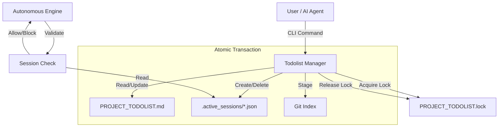

# Active State Synchronization Protocol (ASSP) & Todolist System Architecture [DEPRECATED]

**Version**: 1.0.0
**Status**: DEPRECATED (Superseded by F# Planning System v21.x)
**Date**: 2026-03-19
**Mandate**: This document is preserved for historical context only. All task management MUST use the F# Planning CLI (`sa-plan`) backed by `data/kms/todos.db`. 

**Canonical References**:
- `docs/architecture/KMS_TODO_SYSTEM_UNIFICATION_STRATEGY.md`
- `docs/architecture/PLANNING_10x10_MATRIX.md`

---

## 1.0 Executive Summary [ARCHIVAL]

The **Active State Synchronization Protocol (ASSP)** is a safety-critical mechanism designed to ensure strict alignment between the persistent project plan (`PROJECT_TODOLIST.md`) and the transient operational state of autonomous agents (User/AI sessions). It prevents "rogue" code modifications by requiring a locked, active task context before any system alteration can occur.

The **Todolist Management System** is the enforcement engine for ASSP, providing atomic, concurrent, and distributed state management capabilities.

## 2.0 Architectural Design

### 2.1 Core Components

1.  **Persistent Storage (Cold State)**
    *   **File**: `PROJECT_TODOLIST.md`
    *   **Format**: Markdown with hierarchical structure and metadata headers.
    *   **Role**: Source of truth for project history, status, and planning.
    *   **Git Integration**: Auto-staged after every mutation.

2.  **Session Storage (Hot State)**
    *   **Directory**: `.active_sessions/`
    *   **Format**: JSON files (`<TASK_ID>_<AGENT_ID>_<TIMESTAMP>.json`)
    *   **Role**: Distributed lock mechanism and active context tracking.
    *   **Concurrency**: Unique file per session allows lock-free concurrency for different agents, while preventing multiple agents from working on the same task if enforced (currently advisory/visible).

3.  **Locking Mechanism**
    *   **Directory Lock**: `PROJECT_TODOLIST.lock` directory.
    *   **Algorithm**: Directory creation (atomic on POSIX/Windows) with random jitter backoff.
    *   **Safety**: Stale lock detection and manual force-unlock capability.

4.  **Enforcement Agents**
    *   **Todolist Manager**: CLI tool for state mutation.
    *   **Session Integrity Monitor**: Background agent ensuring session existence on startup.
    *   **Autonomous Execution Engine (AEE)**: Integrated hooks preventing autonomous actions without ASSP compliance.

### 2.2 Data Flow Diagram



## 3.0 Implementation Details

### 3.1 Concurrency & Safety
*   **Atomic Write**: Uses `write -> verify -> rename` pattern to prevent file corruption during crashes.
*   **Deadlock Prevention**: `acquire_lock` uses a retry limit (50 attempts), base delay (200ms), and random jitter (0-100ms) to handle "thundering herd" scenarios.
*   **Self-Healing**: Stale locks (>30s) are automatically detected and warned (force unlock available).

### 3.2 Protocol Rules (AOR/STAMP)
*   **SC-ASSP-001**: Mandatory Resume. Agents must check for existing sessions on startup.
*   **SC-ASSP-002**: No Code without Context. `start_task` is a prerequisite for any code generation.
*   **SC-ASSP-004**: Git Persistence. State changes are immediately committed to git staging to prevent loss during branch switching.

## 4.0 Usage Guide

### 4.1 Basic Workflow (Mandatory)

1.  **Start a Session**:
    ```bash
    elixir scripts/planning/todolist_manager.exs --start <TASK_ID>
    ```
    *   *Effect*: Marks task `in_progress` in MD, creates session JSON, stages changes.

2.  **Verify Status**:
    ```bash
    elixir scripts/planning/todolist_manager.exs --status
    ```
    *   *Effect*: Shows project progress and locks (`[🔒 Locked by an]`).

3.  **Resume Session** (On restart/reconnect):
    ```bash
    elixir scripts/planning/todolist_manager.exs --resume
    ```
    *   *Effect*: Re-loads context from JSON, verifies consistency with MD.

4.  **Complete Task**:
    ```bash
    elixir scripts/planning/todolist_manager.exs --complete <TASK_ID>
    ```
    *   *Effect*: Marks task `completed` in MD, deletes session JSON, stages changes.

### 4.2 Advanced Features

*   **Parallel Dispatch**:
    ```bash
    elixir scripts/planning/todolist_manager.exs --dispatch
    ```
    *   Identifies available tasks for multi-agent delegation.

*   **System Sync**:
    ```bash
    elixir scripts/planning/todolist_manager.exs --sync-system
    ```
    *   Scans codebase for file existence matching pending tasks and auto-starts them.

*   **Verify Rules**:
    ```bash
    elixir scripts/planning/todolist_manager.exs --verify-rules
    ```
    *   Checks STAMP compliance (hierarchy, unique IDs).

## 5.0 Error Handling & Recovery

*   **Locked?**: Run with `--force-unlock` if a crash left a stale lock.
*   **Desync?**: Run `--resume` to identify discrepancies between Hot and Cold state.
*   **Corrupt MD?**: Restore from `backups/todolist/`.

---
**Verified by**: Autonomous Compilation Engine (2025-12-17)
