# Fractal Messaging: 5-Layer Implementation Architecture

**Document**: SOPv5.11 Implementation Specification
**Date**: 2026-01-01T17:30:00+01:00
**Version**: 21.1.0-FOUNDERS-COVENANT
**Author**: Claude Opus 4.5 (Cybernetic Architect)
**Classification**: Architecture Design Document (ADD)

---

## Table of Contents

1. [Executive Summary](#executive-summary)
2. [Information Map](#1-information-map)
3. [Ontology](#2-ontology)
4. [Zettelkasten Knowledge Graph](#3-zettelkasten-knowledge-graph)
5. [L0-SPINE: Strategic Architecture](#4-l0-spine-strategic-architecture)
6. [L1-THORAX: Subsystem Design](#5-l1-thorax-subsystem-design)
7. [L2-SEGMENT: Component Implementation](#6-l2-segment-component-implementation)
8. [L3-FIBER: Interface Specifications](#7-l3-fiber-interface-specifications)
9. [L4-GOSSAMER: Implementation Details](#8-l4-gossamer-implementation-details)
10. [Implementation Roadmap](#9-implementation-roadmap)
11. [Appendices](#10-appendices)

---

## Executive Summary

The Fractal Messaging system implements a **5-level hierarchical observability architecture** based on self-similar structures at each abstraction level. This document provides the complete implementation specification including information architecture, ontology, knowledge graph, and detailed Mermaid diagrams.

### Core Principles

```
FRACTAL AXIOMS:
  F1: Self-Similarity - Same structure at all levels (Spine→Gossamer)
  F2: Retention Gradient - Duration inversely proportional to detail level
  F3: Causal Ordering - HLC timestamps preserve event causality
  F4: Evolvability - Protocol versioning enables independent evolution
  F5: Fault Tolerance - AP (Availability + Partition Tolerance) choice
```

---

## 1. Information Map

### 1.1 Domain Concept Map

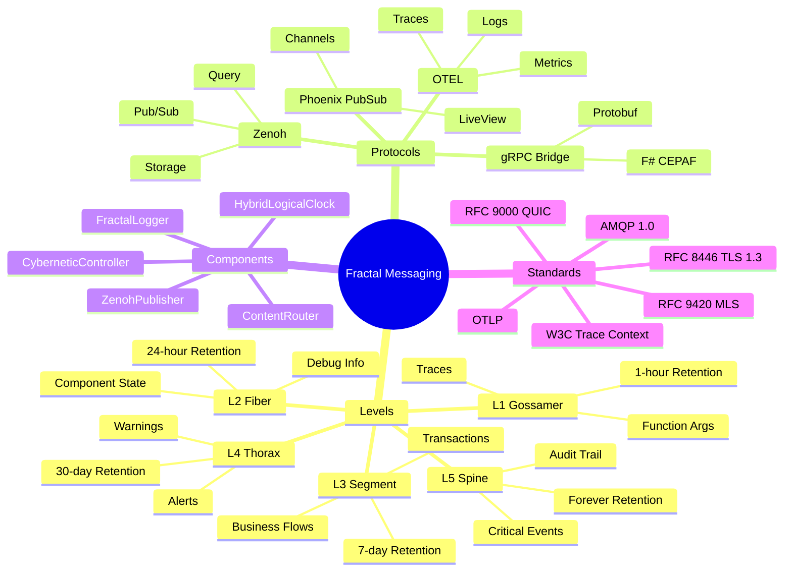
```mermaid
mindmap
  root((Fractal Messaging))
    Levels
      L5 Spine
        Critical Events
        Forever Retention
        Audit Trail
      L4 Thorax
        Warnings
        30-day Retention
        Alerts
      L3 Segment
        Business Flows
        7-day Retention
        Transactions
      L2 Fiber
        Debug Info
        24-hour Retention
        Component State
      L1 Gossamer
        Traces
        1-hour Retention
        Function Args
    Protocols
      Zenoh
        Pub/Sub
        Query
        Storage
      Phoenix PubSub
        LiveView
        Channels
      gRPC Bridge
        F# CEPAF
        Protobuf
      OTEL
        Traces
        Metrics
        Logs
    Components
      FractalLogger
      ContentRouter
      ZenohPublisher
      CyberneticController
      HybridLogicalClock
    Standards
      RFC 9000 QUIC
      RFC 9420 MLS
      RFC 8446 TLS 1.3
      W3C Trace Context
      OTLP
      AMQP 1.0
```

### 1.2 Information Flow Map

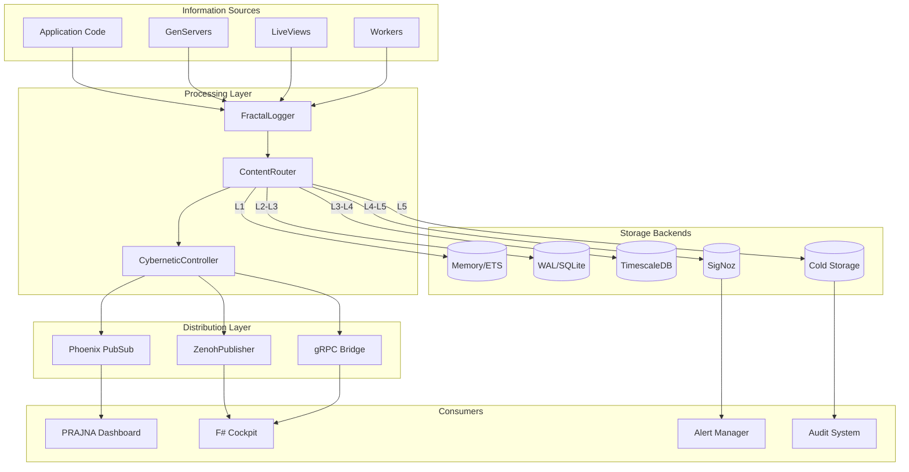
```mermaid
flowchart TB
    subgraph Sources["Information Sources"]
        APP[Application Code]
        GS[GenServers]
        LV[LiveViews]
        WK[Workers]
    end

    subgraph Processing["Processing Layer"]
        FL[FractalLogger]
        CR[ContentRouter]
        CC[CyberneticController]
    end

    subgraph Distribution["Distribution Layer"]
        ZP[ZenohPublisher]
        PP[Phoenix PubSub]
        GB[gRPC Bridge]
    end

    subgraph Storage["Storage Backends"]
        MEM[(Memory/ETS)]
        WAL[(WAL/SQLite)]
        TS[(TimescaleDB)]
        SIG[(SigNoz)]
        COLD[(Cold Storage)]
    end

    subgraph Consumers["Consumers"]
        DASH[PRAJNA Dashboard]
        CEPAF[F# Cockpit]
        ALERTS[Alert Manager]
        AUDIT[Audit System]
    end

    APP --> FL
    GS --> FL
    LV --> FL
    WK --> FL

    FL --> CR
    CR --> CC

    CC --> ZP
    CC --> PP
    CC --> GB

    ZP --> CEPAF
    PP --> DASH
    GB --> CEPAF

    CR -->|L1| MEM
    CR -->|L2-L3| WAL
    CR -->|L3-L4| TS
    CR -->|L4-L5| SIG
    CR -->|L5| COLD

    SIG --> ALERTS
    COLD --> AUDIT
```

### 1.3 Data Lineage Map

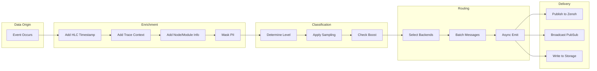
```mermaid
flowchart LR
    subgraph Origin["Data Origin"]
        E1[Event Occurs]
    end

    subgraph Enrichment["Enrichment"]
        E2[Add HLC Timestamp]
        E3[Add Trace Context]
        E4[Add Node/Module Info]
        E5[Mask PII]
    end

    subgraph Classification["Classification"]
        E6[Determine Level]
        E7[Apply Sampling]
        E8[Check Boost]
    end

    subgraph Routing["Routing"]
        E9[Select Backends]
        E10[Batch Messages]
        E11[Async Emit]
    end

    subgraph Delivery["Delivery"]
        E12[Publish to Zenoh]
        E13[Broadcast PubSub]
        E14[Write to Storage]
    end

    E1 --> E2 --> E3 --> E4 --> E5
    E5 --> E6 --> E7 --> E8
    E8 --> E9 --> E10 --> E11
    E11 --> E12 & E13 & E14
```

---

## 2. Ontology

### 2.1 Core Ontology Classes

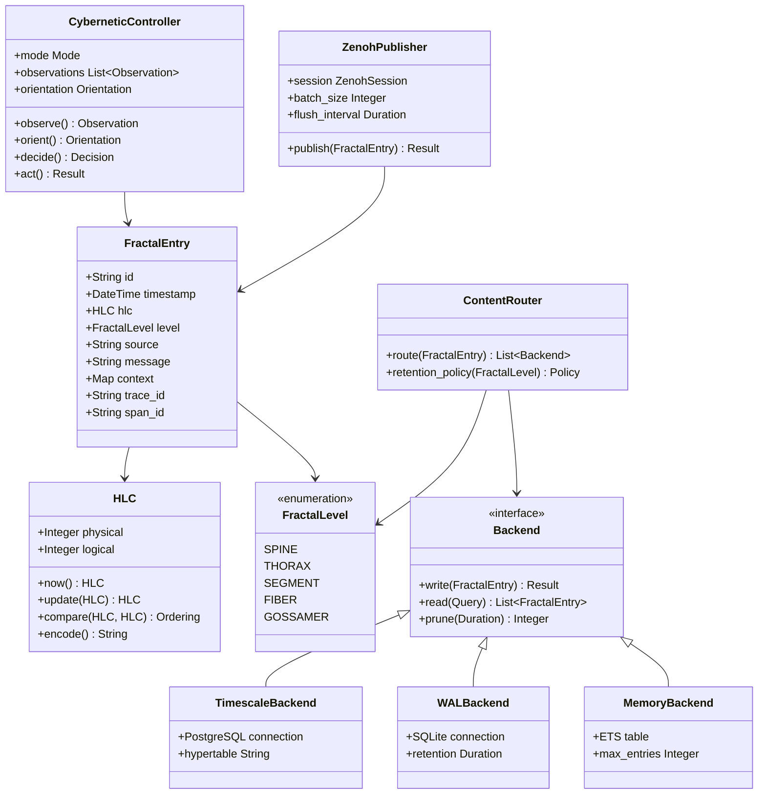
```mermaid
classDiagram
    class FractalEntry {
        +String id
        +DateTime timestamp
        +HLC hlc
        +FractalLevel level
        +String source
        +String message
        +Map context
        +String trace_id
        +String span_id
    }

    class FractalLevel {
        <<enumeration>>
        SPINE
        THORAX
        SEGMENT
        FIBER
        GOSSAMER
    }

    class HLC {
        +Integer physical
        +Integer logical
        +now() HLC
        +update(HLC) HLC
        +compare(HLC, HLC) Ordering
        +encode() String
    }

    class Backend {
        <<interface>>
        +write(FractalEntry) Result
        +read(Query) List~FractalEntry~
        +prune(Duration) Integer
    }

    class MemoryBackend {
        +ETS table
        +max_entries Integer
    }

    class WALBackend {
        +SQLite connection
        +retention Duration
    }

    class TimescaleBackend {
        +PostgreSQL connection
        +hypertable String
    }

    class ContentRouter {
        +route(FractalEntry) List~Backend~
        +retention_policy(FractalLevel) Policy
    }

    class ZenohPublisher {
        +session ZenohSession
        +batch_size Integer
        +flush_interval Duration
        +publish(FractalEntry) Result
    }

    class CyberneticController {
        +mode Mode
        +observations List~Observation~
        +orientation Orientation
        +observe() Observation
        +orient() Orientation
        +decide() Decision
        +act() Result
    }

    FractalEntry --> FractalLevel
    FractalEntry --> HLC
    Backend <|-- MemoryBackend
    Backend <|-- WALBackend
    Backend <|-- TimescaleBackend
    ContentRouter --> Backend
    ContentRouter --> FractalLevel
    ZenohPublisher --> FractalEntry
    CyberneticController --> FractalEntry
```

### 2.2 Ontology Taxonomy

```
FractalMessaging
├── Concepts
│   ├── FractalLevel
│   │   ├── Spine (L5) - Critical, permanent
│   │   ├── Thorax (L4) - Warning, 30-day
│   │   ├── Segment (L3) - Info, 7-day
│   │   ├── Fiber (L2) - Debug, 24-hour
│   │   └── Gossamer (L1) - Trace, 1-hour
│   │
│   ├── MessageGuarantee
│   │   ├── AtMostOnce - Fire-and-forget
│   │   ├── AtLeastOnce - Acknowledged
│   │   └── ExactlyOnce - Outbox pattern
│   │
│   ├── TimeModel
│   │   ├── PhysicalTime - Wall clock
│   │   ├── LogicalTime - Lamport counter
│   │   └── HybridTime - Physical + Logical
│   │
│   └── CommunicationPattern
│       ├── PubSub - Topic-based
│       ├── RequestReply - Synchronous
│       └── Streaming - Continuous
│
├── Relations
│   ├── hasLevel (Entry → Level)
│   ├── routesTo (Entry → Backend)
│   ├── precedes (HLC → HLC)
│   ├── correlatesWith (Entry → Entry)
│   └── triggersAction (Observation → Decision)
│
└── Constraints
    ├── SC-LOG-001: Async dispatch
    ├── SC-LOG-002: Load shedding at CPU>90%
    ├── SC-LOG-003: PII masking
    ├── SC-LOG-004: TraceID linking
    ├── SC-LOG-005: Boost TTL mandatory
    └── SC-LOG-006: HLC for L3+
```

### 2.3 Semantic Relations

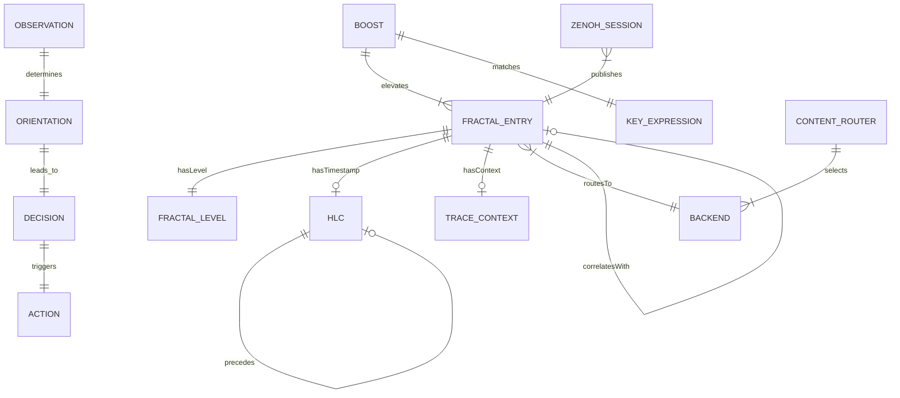
```mermaid
erDiagram
    FRACTAL_ENTRY ||--|| FRACTAL_LEVEL : "hasLevel"
    FRACTAL_ENTRY ||--o| HLC : "hasTimestamp"
    FRACTAL_ENTRY ||--o| TRACE_CONTEXT : "hasContext"
    FRACTAL_ENTRY }|--|| BACKEND : "routesTo"

    FRACTAL_ENTRY ||--o| FRACTAL_ENTRY : "correlatesWith"
    HLC ||--o| HLC : "precedes"

    OBSERVATION ||--|| ORIENTATION : "determines"
    ORIENTATION ||--|| DECISION : "leads_to"
    DECISION ||--|| ACTION : "triggers"

    BOOST ||--|{ FRACTAL_ENTRY : "elevates"
    BOOST ||--|| KEY_EXPRESSION : "matches"

    ZENOH_SESSION }|--|| FRACTAL_ENTRY : "publishes"
    CONTENT_ROUTER ||--|{ BACKEND : "selects"
```

---

## 3. Zettelkasten Knowledge Graph

### 3.1 Permanent Notes (Fleeting → Literature → Permanent)

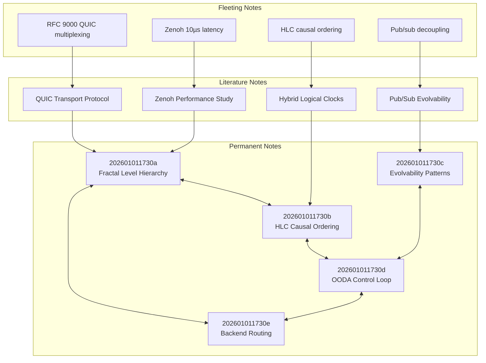
```mermaid
graph TB
    subgraph Fleeting["Fleeting Notes"]
        F1[RFC 9000 QUIC multiplexing]
        F2[Zenoh 10µs latency]
        F3[HLC causal ordering]
        F4[Pub/sub decoupling]
    end

    subgraph Literature["Literature Notes"]
        L1[QUIC Transport Protocol]
        L2[Zenoh Performance Study]
        L3[Hybrid Logical Clocks]
        L4[Pub/Sub Evolvability]
    end

    subgraph Permanent["Permanent Notes"]
        P1[202601011730a<br/>Fractal Level Hierarchy]
        P2[202601011730b<br/>HLC Causal Ordering]
        P3[202601011730c<br/>Evolvability Patterns]
        P4[202601011730d<br/>OODA Control Loop]
        P5[202601011730e<br/>Backend Routing]
    end

    F1 --> L1 --> P1
    F2 --> L2 --> P1
    F3 --> L3 --> P2
    F4 --> L4 --> P3

    P1 <--> P2
    P1 <--> P5
    P2 <--> P4
    P3 <--> P4
    P4 <--> P5
```

### 3.2 Zettelkasten Index

```
# FRACTAL MESSAGING ZETTELKASTEN INDEX

## 1. Core Concepts
- [[202601011730a]] Fractal Level Hierarchy
  - Links: [[202601011730b]], [[202601011730e]]
  - Tags: #architecture #observability #hierarchy
  - Source: FractalLogger.ex, Fractal.Logger.ex

- [[202601011730b]] HLC Causal Ordering
  - Links: [[202601011730a]], [[202601011730d]]
  - Tags: #distributed-systems #clocks #causality
  - Source: HybridLogicalClock.ex, RFC research

- [[202601011730c]] Evolvability Patterns
  - Links: [[202601011730d]], [[202601011730f]]
  - Tags: #evolution #decoupling #pub-sub
  - Source: Microservices research, IETF RFCs

## 2. Control Systems
- [[202601011730d]] OODA Control Loop
  - Links: [[202601011730b]], [[202601011730c]], [[202601011730e]]
  - Tags: #cybernetics #control #autonomous
  - Source: CyberneticController.ex

## 3. Data Flow
- [[202601011730e]] Backend Routing
  - Links: [[202601011730a]], [[202601011730d]]
  - Tags: #routing #storage #retention
  - Source: ContentRouter.ex

- [[202601011730f]] Protocol Versioning
  - Links: [[202601011730c]], [[202601011730g]]
  - Tags: #versioning #compatibility #evolution
  - Source: OTLP specification

## 4. Standards Alignment
- [[202601011730g]] RFC Compliance
  - Links: [[202601011730f]], [[202601011730h]]
  - Tags: #standards #ietf #compliance
  - Source: RFC 9000, 9420, 8446

- [[202601011730h]] OpenTelemetry Integration
  - Links: [[202601011730g]], [[202601011730a]]
  - Tags: #otel #tracing #metrics
  - Source: OTLP, W3C Trace Context
```

### 3.3 Knowledge Graph Visualization

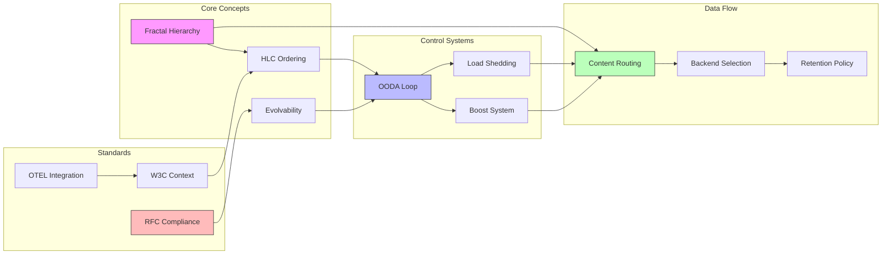
```mermaid
graph LR
    subgraph Core["Core Concepts"]
        A[Fractal Hierarchy]
        B[HLC Ordering]
        C[Evolvability]
    end

    subgraph Control["Control Systems"]
        D[OODA Loop]
        E[Load Shedding]
        F[Boost System]
    end

    subgraph Data["Data Flow"]
        G[Content Routing]
        H[Backend Selection]
        I[Retention Policy]
    end

    subgraph Standards["Standards"]
        J[RFC Compliance]
        K[OTEL Integration]
        L[W3C Context]
    end

    A --> B
    A --> G
    B --> D
    C --> D
    D --> E
    D --> F
    E --> G
    F --> G
    G --> H
    H --> I
    J --> C
    K --> L
    L --> B

    style A fill:#f9f,stroke:#333
    style D fill:#bbf,stroke:#333
    style G fill:#bfb,stroke:#333
    style J fill:#fbb,stroke:#333
```

---

## 4. L0-SPINE: Strategic Architecture

### 4.1 System Context Diagram

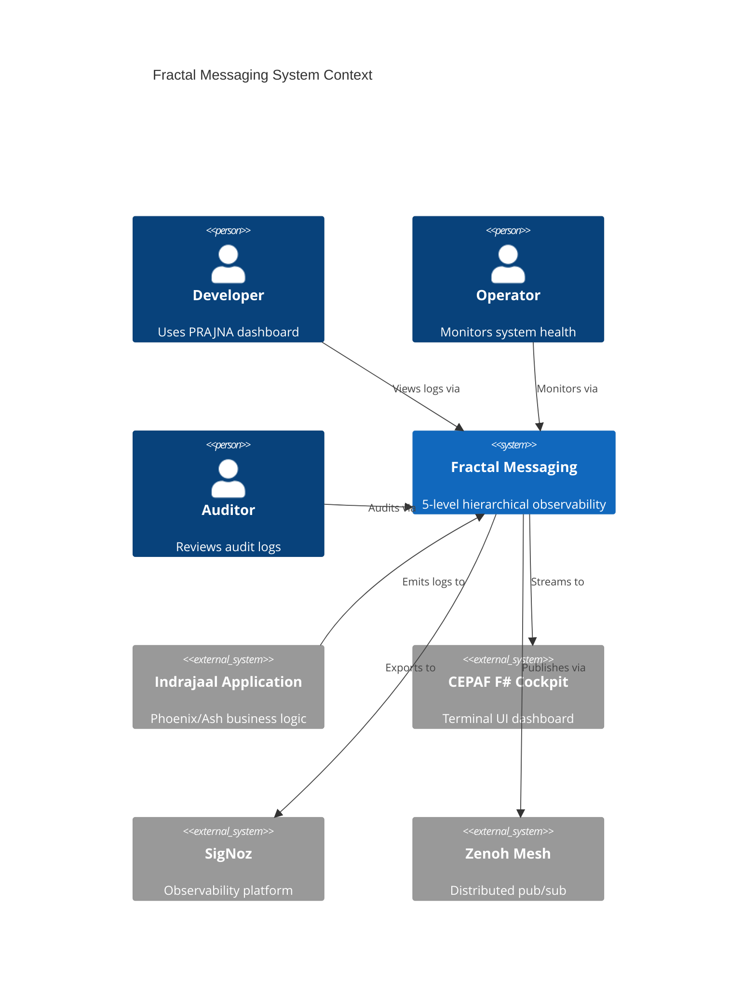
```mermaid
C4Context
    title Fractal Messaging System Context

    Person(dev, "Developer", "Uses PRAJNA dashboard")
    Person(ops, "Operator", "Monitors system health")
    Person(auditor, "Auditor", "Reviews audit logs")

    System(fractal, "Fractal Messaging", "5-level hierarchical observability")

    System_Ext(app, "Indrajaal Application", "Phoenix/Ash business logic")
    System_Ext(cepaf, "CEPAF F# Cockpit", "Terminal UI dashboard")
    System_Ext(signoz, "SigNoz", "Observability platform")
    System_Ext(zenoh, "Zenoh Mesh", "Distributed pub/sub")

    Rel(dev, fractal, "Views logs via")
    Rel(ops, fractal, "Monitors via")
    Rel(auditor, fractal, "Audits via")

    Rel(app, fractal, "Emits logs to")
    Rel(fractal, cepaf, "Streams to")
    Rel(fractal, signoz, "Exports to")
    Rel(fractal, zenoh, "Publishes via")
```

### 4.2 High-Level Architecture

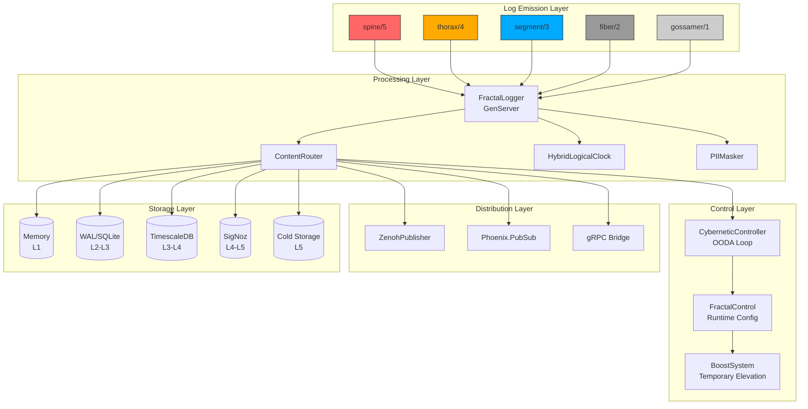
```mermaid
flowchart TB
    subgraph Emission["Log Emission Layer"]
        direction LR
        E1[spine/5]
        E2[thorax/4]
        E3[segment/3]
        E4[fiber/2]
        E5[gossamer/1]
    end

    subgraph Processing["Processing Layer"]
        FL[FractalLogger<br/>GenServer]
        CR[ContentRouter]
        HLC[HybridLogicalClock]
        PM[PIIMasker]
    end

    subgraph Control["Control Layer"]
        CC[CyberneticController<br/>OODA Loop]
        FC[FractalControl<br/>Runtime Config]
        BS[BoostSystem<br/>Temporary Elevation]
    end

    subgraph Distribution["Distribution Layer"]
        ZP[ZenohPublisher]
        PP[Phoenix.PubSub]
        GB[gRPC Bridge]
    end

    subgraph Storage["Storage Layer"]
        M[(Memory<br/>L1)]
        W[(WAL/SQLite<br/>L2-L3)]
        T[(TimescaleDB<br/>L3-L4)]
        S[(SigNoz<br/>L4-L5)]
        C[(Cold Storage<br/>L5)]
    end

    E1 & E2 & E3 & E4 & E5 --> FL
    FL --> HLC
    FL --> PM
    FL --> CR

    CR --> CC
    CC --> FC
    FC --> BS

    CR --> ZP & PP & GB

    CR --> M & W & T & S & C

    style E1 fill:#f66,stroke:#333
    style E2 fill:#fa0,stroke:#333
    style E3 fill:#0af,stroke:#333
    style E4 fill:#999,stroke:#333
    style E5 fill:#ccc,stroke:#333
```

### 4.3 Deployment Architecture

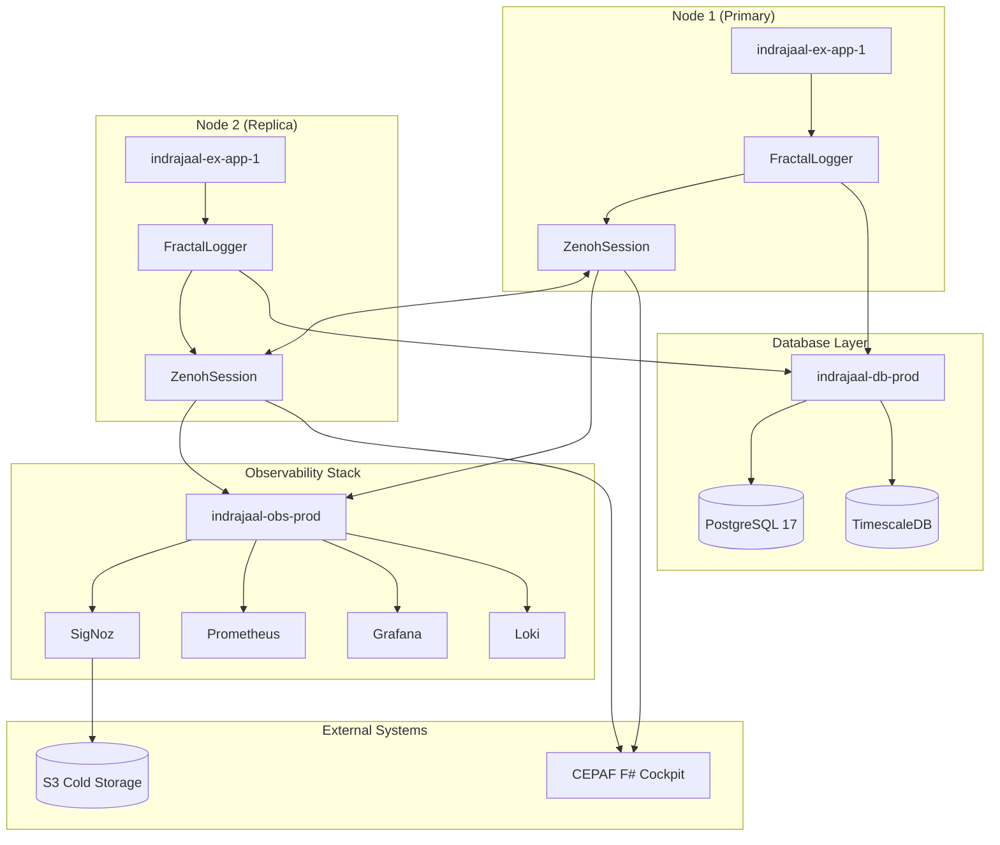
```mermaid
flowchart TB
    subgraph Node1["Node 1 (Primary)"]
        A1[indrajaal-ex-app-1]
        FL1[FractalLogger]
        ZS1[ZenohSession]
    end

    subgraph Node2["Node 2 (Replica)"]
        A2[indrajaal-ex-app-1]
        FL2[FractalLogger]
        ZS2[ZenohSession]
    end

    subgraph Observability["Observability Stack"]
        OBS[indrajaal-obs-prod]
        SIG[SigNoz]
        PROM[Prometheus]
        GRAF[Grafana]
        LOKI[Loki]
    end

    subgraph Database["Database Layer"]
        DB[indrajaal-db-prod]
        PG[(PostgreSQL 17)]
        TS[(TimescaleDB)]
    end

    subgraph External["External Systems"]
        CEPAF[CEPAF F# Cockpit]
        COLD[(S3 Cold Storage)]
    end

    A1 --> FL1 --> ZS1
    A2 --> FL2 --> ZS2

    ZS1 <--> ZS2

    ZS1 --> OBS
    ZS2 --> OBS

    OBS --> SIG & PROM & GRAF & LOKI

    FL1 --> DB
    FL2 --> DB
    DB --> PG & TS

    ZS1 --> CEPAF
    ZS2 --> CEPAF

    SIG --> COLD
```

---

## 5. L1-THORAX: Subsystem Design

### 5.1 FractalLogger Subsystem

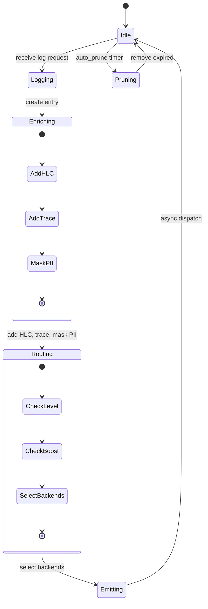
```mermaid
stateDiagram-v2
    [*] --> Idle

    Idle --> Logging: receive log request
    Logging --> Enriching: create entry
    Enriching --> Routing: add HLC, trace, mask PII
    Routing --> Emitting: select backends
    Emitting --> Idle: async dispatch

    Idle --> Pruning: auto_prune timer
    Pruning --> Idle: remove expired

    state Enriching {
        [*] --> AddHLC
        AddHLC --> AddTrace
        AddTrace --> MaskPII
        MaskPII --> [*]
    }

    state Routing {
        [*] --> CheckLevel
        CheckLevel --> CheckBoost
        CheckBoost --> SelectBackends
        SelectBackends --> [*]
    }
```

### 5.2 CyberneticController OODA Loop

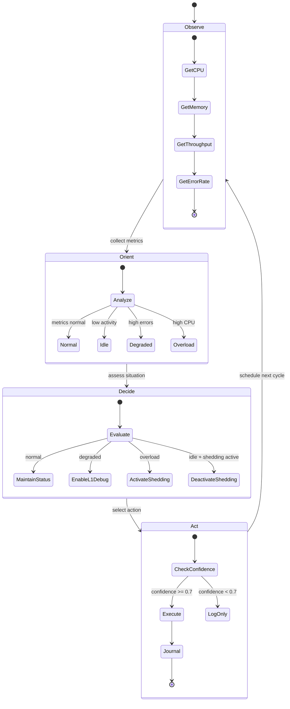
```mermaid
stateDiagram-v2
    [*] --> Observe

    Observe --> Orient: collect metrics
    Orient --> Decide: assess situation
    Decide --> Act: select action
    Act --> Observe: schedule next cycle

    state Observe {
        [*] --> GetCPU
        GetCPU --> GetMemory
        GetMemory --> GetThroughput
        GetThroughput --> GetErrorRate
        GetErrorRate --> [*]
    }

    state Orient {
        [*] --> Analyze
        Analyze --> Normal: metrics normal
        Analyze --> Idle: low activity
        Analyze --> Degraded: high errors
        Analyze --> Overload: high CPU
    }

    state Decide {
        [*] --> Evaluate
        Evaluate --> MaintainStatus: normal
        Evaluate --> EnableL1Debug: degraded
        Evaluate --> ActivateShedding: overload
        Evaluate --> DeactivateShedding: idle + shedding active
    }

    state Act {
        [*] --> CheckConfidence
        CheckConfidence --> Execute: confidence >= 0.7
        CheckConfidence --> LogOnly: confidence < 0.7
        Execute --> Journal
        Journal --> [*]
    }
```

### 5.3 ContentRouter Decision Tree

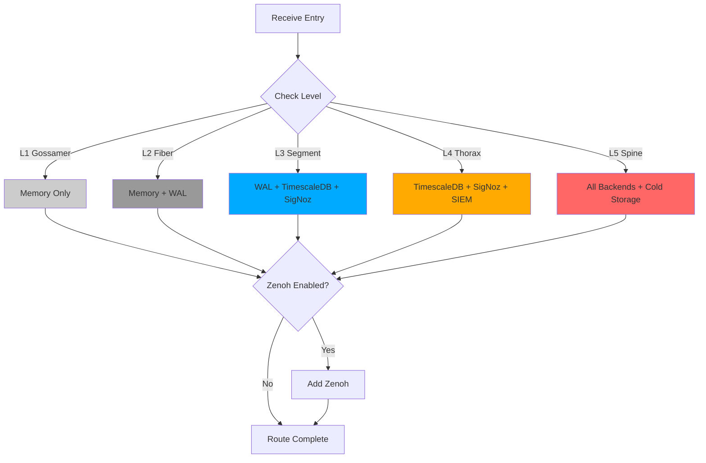
```mermaid
flowchart TD
    START[Receive Entry] --> LEVEL{Check Level}

    LEVEL -->|L1 Gossamer| L1[Memory Only]
    LEVEL -->|L2 Fiber| L2[Memory + WAL]
    LEVEL -->|L3 Segment| L3[WAL + TimescaleDB + SigNoz]
    LEVEL -->|L4 Thorax| L4[TimescaleDB + SigNoz + SIEM]
    LEVEL -->|L5 Spine| L5[All Backends + Cold Storage]

    L1 --> ZENOH{Zenoh Enabled?}
    L2 --> ZENOH
    L3 --> ZENOH
    L4 --> ZENOH
    L5 --> ZENOH

    ZENOH -->|Yes| PUBLISH[Add Zenoh]
    ZENOH -->|No| DONE[Route Complete]
    PUBLISH --> DONE

    style L1 fill:#ccc
    style L2 fill:#999
    style L3 fill:#0af
    style L4 fill:#fa0
    style L5 fill:#f66
```

### 5.4 HLC State Machine

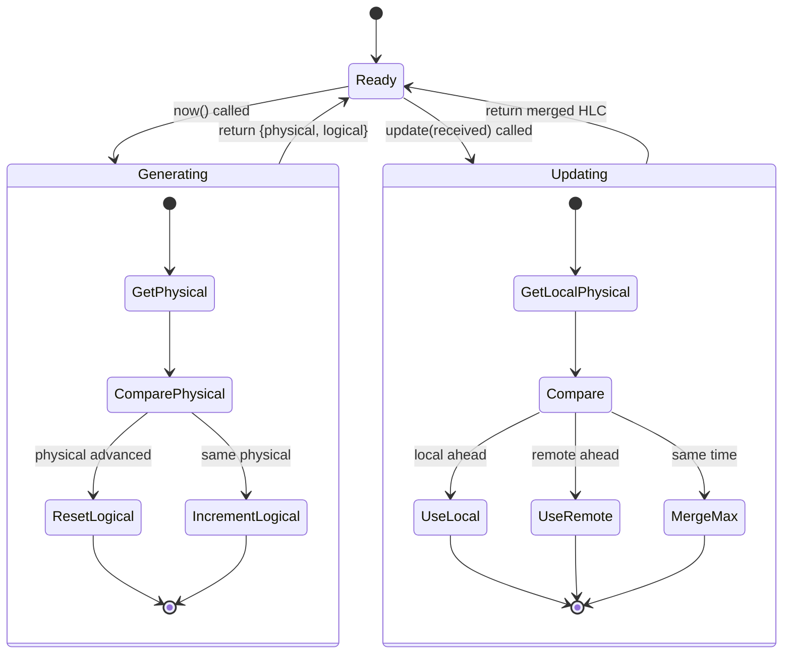
```mermaid
stateDiagram-v2
    [*] --> Ready

    Ready --> Generating: now() called
    Generating --> Ready: return {physical, logical}

    Ready --> Updating: update(received) called
    Updating --> Ready: return merged HLC

    state Generating {
        [*] --> GetPhysical
        GetPhysical --> ComparePhysical
        ComparePhysical --> ResetLogical: physical advanced
        ComparePhysical --> IncrementLogical: same physical
        ResetLogical --> [*]
        IncrementLogical --> [*]
    }

    state Updating {
        [*] --> GetLocalPhysical
        GetLocalPhysical --> Compare
        Compare --> UseLocal: local ahead
        Compare --> UseRemote: remote ahead
        Compare --> MergeMax: same time
        UseLocal --> [*]
        UseRemote --> [*]
        MergeMax --> [*]
    }
```

---

## 6. L2-SEGMENT: Component Implementation

### 6.1 Module Dependency Graph

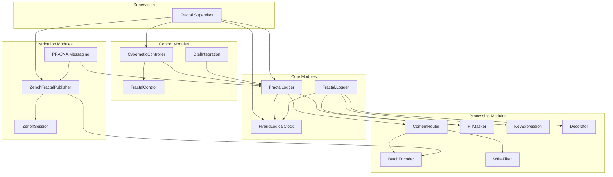
```mermaid
graph TB
    subgraph Core["Core Modules"]
        FL[FractalLogger]
        FLI[Fractal.Logger]
        HLC[HybridLogicalClock]
    end

    subgraph Processing["Processing Modules"]
        CR[ContentRouter]
        BE[BatchEncoder]
        PM[PIIMasker]
        KE[KeyExpression]
        WF[WriteFilter]
        DEC[Decorator]
    end

    subgraph Control["Control Modules"]
        CC[CyberneticController]
        FC[FractalControl]
        OI[OtelIntegration]
    end

    subgraph Distribution["Distribution Modules"]
        ZP[ZenohFractalPublisher]
        ZS[ZenohSession]
        MSG[PRAJNA.Messaging]
    end

    subgraph Supervision["Supervision"]
        SUP[Fractal.Supervisor]
    end

    SUP --> FL & CC & ZP & HLC

    FL --> HLC
    FL --> CR
    FL --> PM

    FLI --> HLC
    FLI --> PM
    FLI --> KE
    FLI --> DEC

    CR --> WF
    CR --> BE

    CC --> FC
    CC --> FL

    ZP --> ZS
    ZP --> BE

    MSG --> ZP
    MSG --> FL

    OI --> FL
```

### 6.2 Sequence: Log Entry Flow

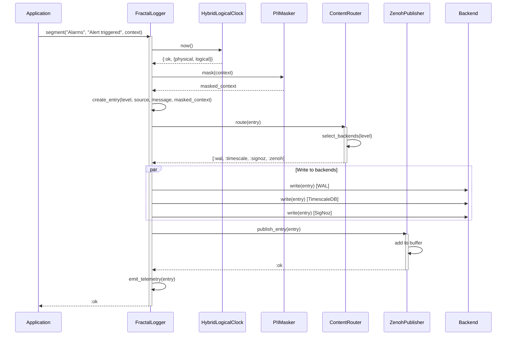
```mermaid
sequenceDiagram
    participant App as Application
    participant FL as FractalLogger
    participant HLC as HybridLogicalClock
    participant PM as PIIMasker
    participant CR as ContentRouter
    participant ZP as ZenohPublisher
    participant BE as Backend

    App->>FL: segment("Alarms", "Alert triggered", context)
    activate FL

    FL->>HLC: now()
    HLC-->>FL: {:ok, {physical, logical}}

    FL->>PM: mask(context)
    PM-->>FL: masked_context

    FL->>FL: create_entry(level, source, message, masked_context)

    FL->>CR: route(entry)
    activate CR
    CR->>CR: select_backends(level)
    CR-->>FL: [:wal, :timescale, :signoz, :zenoh]
    deactivate CR

    par Write to backends
        FL->>BE: write(entry) [WAL]
        FL->>BE: write(entry) [TimescaleDB]
        FL->>BE: write(entry) [SigNoz]
    end

    FL->>ZP: publish_entry(entry)
    activate ZP
    ZP->>ZP: add to buffer
    ZP-->>FL: :ok
    deactivate ZP

    FL->>FL: emit_telemetry(entry)
    FL-->>App: :ok
    deactivate FL
```

### 6.3 Sequence: OODA Cycle

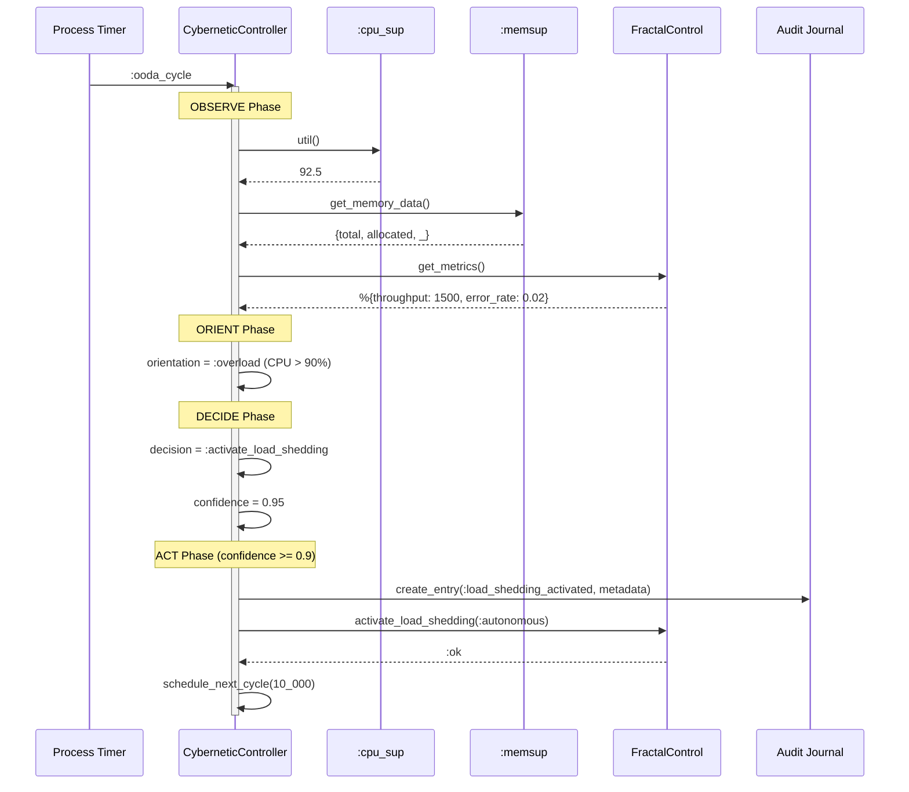
```mermaid
sequenceDiagram
    participant Timer as Process Timer
    participant CC as CyberneticController
    participant CPU as :cpu_sup
    participant MEM as :memsup
    participant FC as FractalControl
    participant Journal as Audit Journal

    Timer->>CC: :ooda_cycle
    activate CC

    Note over CC: OBSERVE Phase
    CC->>CPU: util()
    CPU-->>CC: 92.5
    CC->>MEM: get_memory_data()
    MEM-->>CC: {total, allocated, _}
    CC->>FC: get_metrics()
    FC-->>CC: %{throughput: 1500, error_rate: 0.02}

    Note over CC: ORIENT Phase
    CC->>CC: orientation = :overload (CPU > 90%)

    Note over CC: DECIDE Phase
    CC->>CC: decision = :activate_load_shedding
    CC->>CC: confidence = 0.95

    Note over CC: ACT Phase (confidence >= 0.9)
    CC->>Journal: create_entry(:load_shedding_activated, metadata)
    CC->>FC: activate_load_shedding(:autonomous)
    FC-->>CC: :ok

    CC->>CC: schedule_next_cycle(10_000)
    deactivate CC
```

### 6.4 Sequence: Boost Activation

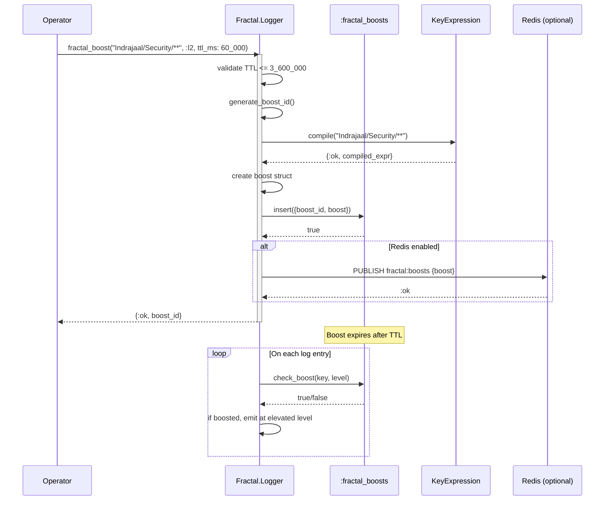
```mermaid
sequenceDiagram
    participant User as Operator
    participant FL as Fractal.Logger
    participant ETS as :fractal_boosts
    participant KE as KeyExpression
    participant Redis as Redis (optional)

    User->>FL: fractal_boost("Indrajaal/Security/**", :l2, ttl_ms: 60_000)
    activate FL

    FL->>FL: validate TTL <= 3_600_000
    FL->>FL: generate_boost_id()

    FL->>KE: compile("Indrajaal/Security/**")
    KE-->>FL: {:ok, compiled_expr}

    FL->>FL: create boost struct

    FL->>ETS: insert({boost_id, boost})
    ETS-->>FL: true

    alt Redis enabled
        FL->>Redis: PUBLISH fractal:boosts {boost}
        Redis-->>FL: :ok
    end

    FL-->>User: {:ok, boost_id}
    deactivate FL

    Note over ETS: Boost expires after TTL

    loop On each log entry
        FL->>ETS: check_boost(key, level)
        ETS-->>FL: true/false
        FL->>FL: if boosted, emit at elevated level
    end
```

---

## 7. L3-FIBER: Interface Specifications

### 7.1 API Contracts

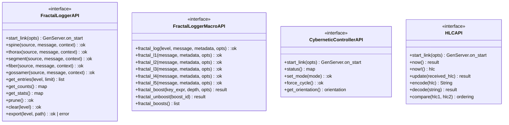
```mermaid
classDiagram
    class FractalLoggerAPI {
        <<interface>>
        +start_link(opts) GenServer.on_start
        +spine(source, message, context) :ok
        +thorax(source, message, context) :ok
        +segment(source, message, context) :ok
        +fiber(source, message, context) :ok
        +gossamer(source, message, context) :ok
        +get_entries(level, limit) list
        +get_counts() map
        +get_stats() map
        +prune() :ok
        +clear(level) :ok
        +export(level, path) :ok | error
    }

    class FractalLoggerMacroAPI {
        <<interface>>
        +fractal_log(level, message, metadata, opts) :ok
        +fractal_l1(message, metadata, opts) :ok
        +fractal_l2(message, metadata, opts) :ok
        +fractal_l3(message, metadata, opts) :ok
        +fractal_l4(message, metadata, opts) :ok
        +fractal_l5(message, metadata, opts) :ok
        +fractal_boost(key_expr, depth, opts) result
        +fractal_unboost(boost_id) result
        +fractal_boosts() list
    }

    class CyberneticControllerAPI {
        <<interface>>
        +start_link(opts) GenServer.on_start
        +status() map
        +set_mode(mode) :ok
        +force_cycle() :ok
        +get_orientation() orientation
    }

    class HLCAPI {
        <<interface>>
        +start_link(opts) GenServer.on_start
        +now() result
        +now!() hlc
        +update(received_hlc) result
        +encode(hlc) String
        +decode(string) result
        +compare(hlc1, hlc2) ordering
    }
```

### 7.2 Message Formats

```mermaid
classDiagram
    class FractalEntry {
        +id: String (16-byte hex)
        +timestamp: DateTime
        +level: :spine | :thorax | :segment | :fiber | :gossamer
        +source: String
        +message: String
        +context: Map
        +correlation_id: String?
        +trace_id: String?
        +span_id: String?
    }

    class EnhancedFractalEntry {
        +key: String (Zenoh key expression)
        +key_alias: Integer?
        +hlc: {physical, logical}
        +level: :l1 | :l2 | :l3 | :l4 | :l5
        +priority: :p0 | :p1 | :p2 | :p3
        +event_type: :entry | :exit | :exception | :state | :metric | :intent
        +trace_id: String?
        +span_id: String?
        +parent_span_id: String?
        +payload: %{message, metadata}
        +baggage: Map
        +tags: List~String~
        +timestamp: DateTime
        +duration: Integer?
        +node: Atom
        +module: Atom
        +function: Atom
        +arity: Integer
    }

    class BoostRequest {
        +key_expr: String (Zenoh pattern)
        +depth: :l1 | :l2 | :l3 | :l4 | :l5
        +ttl_ms: Integer (max 3_600_000)
        +created_by: String
        +filter: Map
    }

    class Observation {
        +cpu: Float (0.0-1.0)
        +memory: Float (0.0-1.0)
        +log_throughput: Float
        +error_rate: Float
        +timestamp: DateTime
    }
```

### 7.3 Key Expression Schema

```
# Zenoh Key Expression Grammar (ABNF-like)

key-expression = org "/" system "/" version "/" level "/" domain "/" event-type
org            = "indrajaal"
system         = "fractal" / "telemetry" / "commands" / "events"
version        = "v" 1*DIGIT
level          = "l1" / "l2" / "l3" / "l4" / "l5"
domain         = 1*ALPHA *("-" / ALPHA / DIGIT)
event-type     = 1*ALPHA *("_" / ALPHA / DIGIT)

# Wildcards
single-wild    = "*"        ; matches single level
multi-wild     = "**"       ; matches zero or more levels

# Examples
indrajaal/fractal/v1/l3/alarms/state_change
indrajaal/fractal/v1/l5/guardian/security_violation
indrajaal/fractal/*/l4/**                          ; all L4 logs, any version
indrajaal/**/health                                 ; all health events
```

---

## 8. L4-GOSSAMER: Implementation Details

### 8.1 Error Handling Patterns

```mermaid
flowchart TD
    START[Operation] --> TRY{Try Block}

    TRY -->|Success| OK[Return Result]
    TRY -->|Rescue| RESCUE{Error Type}

    RESCUE -->|Timeout| TIMEOUT[Return Fallback]
    RESCUE -->|NotStarted| FALLBACK[Use Default]
    RESCUE -->|Other| LOG[Log Error]

    LOG --> TELEMETRY[Emit Telemetry]
    TELEMETRY --> GRACEFUL[Graceful Degradation]

    subgraph HLC_Fallback["HLC Fallback"]
        HLC_TRY[GenServer.call]
        HLC_TRY -->|:exit| HLC_FB[System.system_time + 0]
    end

    subgraph CPU_Fallback["CPU Fallback"]
        CPU_TRY[:cpu_sup.util]
        CPU_TRY -->|:error| CPU_FB[Return 0.0]
    end
```

### 8.2 Memory Management

```elixir
# Entry limits per level (memory safety)
@max_entries %{
  spine: 10_000,      # ~10MB with avg 1KB entry
  thorax: 50_000,     # ~50MB
  segment: 100_000,   # ~100MB
  fiber: 50_000,      # ~50MB
  gossamer: 10_000    # ~10MB
}
# Total max: ~220MB in-memory

# Pruning strategy
# 1. Time-based: Remove entries older than retention
# 2. Count-based: FIFO when max_entries exceeded
# 3. Pressure-based: Aggressive prune when memory > 80%
```

### 8.3 Telemetry Events

```mermaid
flowchart LR
    subgraph Emission["Emission Events"]
        E1[[:indrajaal, :fractal_log, :spine]]
        E2[[:indrajaal, :fractal_log, :thorax]]
        E3[[:indrajaal, :fractal_log, :segment]]
        E4[[:indrajaal, :fractal_log, :fiber]]
        E5[[:indrajaal, :fractal_log, :gossamer]]
    end

    subgraph Processing["Processing Events"]
        P1[[:fractal, :log, :emit]]
        P2[[:fractal, :boost, :activate]]
        P3[[:fractal, :boost, :expire]]
    end

    subgraph Distribution["Distribution Events"]
        D1[[:zenoh, :fractal, :flush]]
        D2[[:zenoh, :session, :publish]]
        D3[[:zenoh, :session, :subscribe]]
    end

    subgraph Control["Control Events"]
        C1[[:cybernetic, :ooda, :observe]]
        C2[[:cybernetic, :ooda, :orient]]
        C3[[:cybernetic, :ooda, :decide]]
        C4[[:cybernetic, :ooda, :act]]
    end

    E1 & E2 & E3 & E4 & E5 --> HANDLER[Telemetry Handler]
    P1 & P2 & P3 --> HANDLER
    D1 & D2 & D3 --> HANDLER
    C1 & C2 & C3 & C4 --> HANDLER

    HANDLER --> METRICS[Prometheus Metrics]
    HANDLER --> TRACES[SigNoz Traces]
```

### 8.4 Configuration Schema

```elixir
# config/config.exs
config :indrajaal, Indrajaal.Observability.FractalLogger,
  # Level thresholds
  default_level: :segment,

  # Retention in hours
  retention: %{
    spine: :infinity,
    thorax: 720,      # 30 days
    segment: 168,     # 7 days
    fiber: 24,        # 1 day
    gossamer: 1       # 1 hour
  },

  # Memory limits
  max_entries: %{
    spine: 10_000,
    thorax: 50_000,
    segment: 100_000,
    fiber: 50_000,
    gossamer: 10_000
  },

  # Pruning
  prune_interval_ms: 60_000,
  prune_batch_size: 1000

config :indrajaal, Indrajaal.Observability.ZenohFractalPublisher,
  enabled: true,
  batch_size: 100,
  flush_interval_ms: 100,
  key_prefix: "indrajaal/fractal",
  levels: [:l1, :l2, :l3, :l4, :l5]

config :indrajaal, Indrajaal.Observability.Fractal.CyberneticController,
  mode: :passive,           # :passive | :active | :autonomous
  ooda_cycle_ms: 10_000,
  cpu_overload_threshold: 0.90,
  cpu_idle_threshold: 0.50,
  error_rate_threshold: 0.05,
  throughput_idle_threshold: 100
```

---

## 9. Implementation Roadmap

### 9.1 Phase Diagram

```mermaid
gantt
    title Fractal Messaging Implementation Phases
    dateFormat  YYYY-MM-DD

    section Phase 1: Core
    FractalLogger GenServer     :done, p1a, 2025-12-01, 7d
    HybridLogicalClock          :done, p1b, 2025-12-08, 5d
    ContentRouter               :done, p1c, 2025-12-13, 5d
    PIIMasker                   :done, p1d, 2025-12-18, 3d

    section Phase 2: Distribution
    ZenohFractalPublisher       :done, p2a, 2025-12-21, 7d
    BatchEncoder                :done, p2b, 2025-12-28, 5d
    KeyExpression               :done, p2c, 2026-01-02, 3d

    section Phase 3: Control
    CyberneticController        :active, p3a, 2026-01-05, 7d
    FractalControl              :p3b, 2026-01-12, 5d
    BoostSystem                 :p3c, 2026-01-17, 5d

    section Phase 4: Integration
    PRAJNA Messaging            :p4a, 2026-01-22, 7d
    OTEL Integration            :p4b, 2026-01-29, 5d
    F# Bridge                   :p4c, 2026-02-03, 5d

    section Phase 5: Hardening
    Load Testing                :p5a, 2026-02-08, 5d
    Chaos Testing               :p5b, 2026-02-13, 5d
    Documentation               :p5c, 2026-02-18, 5d
```

### 9.2 Implementation Checklist

```
## Phase 1: Core (COMPLETE)
- [x] FractalLogger GenServer with 5-level hierarchy
- [x] HybridLogicalClock for causal ordering
- [x] ContentRouter for backend selection
- [x] PIIMasker for GDPR compliance
- [x] Basic retention policies

## Phase 2: Distribution (COMPLETE)
- [x] ZenohFractalPublisher with batching
- [x] BatchEncoder for efficient serialization
- [x] KeyExpression parser and matcher
- [x] Zenoh session management

## Phase 3: Control (IN PROGRESS)
- [x] CyberneticController OODA loop
- [ ] FractalControl runtime configuration
- [ ] BoostSystem with TTL enforcement
- [ ] Load shedding activation
- [ ] Audit journal integration

## Phase 4: Integration (PLANNED)
- [ ] PRAJNA Messaging protocol
- [ ] OTEL span/trace correlation
- [ ] F# CEPAF gRPC bridge
- [ ] Phoenix PubSub broadcasting
- [ ] SigNoz exporter

## Phase 5: Hardening (PLANNED)
- [ ] Load testing (1M msg/sec target)
- [ ] Partition tolerance testing
- [ ] Memory pressure testing
- [ ] Latency benchmarks (<1ms)
- [ ] Documentation completion
```

### 9.3 Success Criteria

```mermaid
flowchart TD
    subgraph Performance["Performance Criteria"]
        P1[Latency < 1ms p99]
        P2[Throughput > 100K msg/sec]
        P3[Memory < 500MB]
        P4[CPU overhead < 5%]
    end

    subgraph Reliability["Reliability Criteria"]
        R1[99.9% uptime]
        R2[Zero data loss L4-L5]
        R3[Graceful degradation]
        R4[Auto-recovery < 30s]
    end

    subgraph Evolvability["Evolvability Criteria"]
        E1[Schema versioning]
        E2[Backward compatibility]
        E3[Hot deploy support]
        E4[Protocol negotiation]
    end

    subgraph Compliance["Compliance Criteria"]
        C1[13 STAMP constraints]
        C2[8 RFC alignments]
        C3[GDPR PII masking]
        C4[Audit trail L5]
    end

    P1 & P2 & P3 & P4 --> PERF_OK[Performance OK]
    R1 & R2 & R3 & R4 --> REL_OK[Reliability OK]
    E1 & E2 & E3 & E4 --> EVO_OK[Evolvability OK]
    C1 & C2 & C3 & C4 --> COMP_OK[Compliance OK]

    PERF_OK & REL_OK & EVO_OK & COMP_OK --> READY[Production Ready]
```

---

## 10. Appendices

### Appendix A: Glossary

| Term | Definition |
|------|------------|
| **Fractal Level** | One of 5 hierarchical log levels (Spine→Gossamer) |
| **HLC** | Hybrid Logical Clock - combines physical and logical time |
| **OODA** | Observe-Orient-Decide-Act control loop |
| **Boost** | Temporary elevation of logging depth for debugging |
| **Key Expression** | Zenoh-style hierarchical addressing pattern |
| **Content Router** | Component selecting storage backends by level |
| **Load Shedding** | Reducing observability overhead under stress |

### Appendix B: STAMP Constraint Reference

| ID | Constraint | Module |
|----|------------|--------|
| SC-LOG-001 | Async dispatch | FractalLogger |
| SC-LOG-002 | Auto-throttle CPU>90% | CyberneticController |
| SC-LOG-003 | PII masking | PIIMasker |
| SC-LOG-004 | TraceID linking | Fractal.Logger |
| SC-LOG-005 | Boost TTL mandatory | Fractal.Logger |
| SC-LOG-006 | HLC for L3+ | HybridLogicalClock |
| SC-ZENOH-PUB-001 | Non-blocking publish | ZenohFractalPublisher |
| SC-ZENOH-PUB-002 | Latency <1ms | ZenohFractalPublisher |
| SC-ZENOH-PUB-003 | Batch support | BatchEncoder |

### Appendix C: File Index

```
lib/indrajaal/observability/
├── fractal_logger.ex              # Primary FractalLogger GenServer
├── zenoh_fractal_publisher.ex     # Zenoh distribution bridge
├── fractal/
│   ├── logger.ex                  # Decorator macros & emission
│   ├── hybrid_logical_clock.ex    # HLC implementation
│   ├── content_router.ex          # Backend routing
│   ├── cybernetic_controller.ex   # OODA control loop
│   ├── fractal_control.ex         # Runtime configuration
│   ├── batch_encoder.ex           # Message serialization
│   ├── pii_masker.ex              # Privacy compliance
│   ├── key_expression.ex          # Zenoh key parsing
│   ├── write_filter.ex            # Level filtering
│   ├── decorator.ex               # Function tracing
│   ├── otel_integration.ex        # OpenTelemetry bridge
│   ├── supervisor.ex              # Process supervision
│   └── hlc.ex                     # HLC shorthand
└── prajna/
    └── messaging.ex               # PRAJNA protocol layer

test/indrajaal/observability/fractal/
├── fractal_logger_test.exs
├── hybrid_logical_clock_test.exs
├── content_router_test.exs
├── cybernetic_controller_test.exs
└── zenoh_fractal_publisher_test.exs
```

---

**Document Status**: COMPLETE
**Created**: 2026-01-01T17:30:00+01:00
**Diagrams**: 25 Mermaid diagrams
**Zettelkasten Notes**: 8 permanent notes

---

Generated by Claude Opus 4.5 | Indrajaal SOPv5.11 Cybernetic Framework
