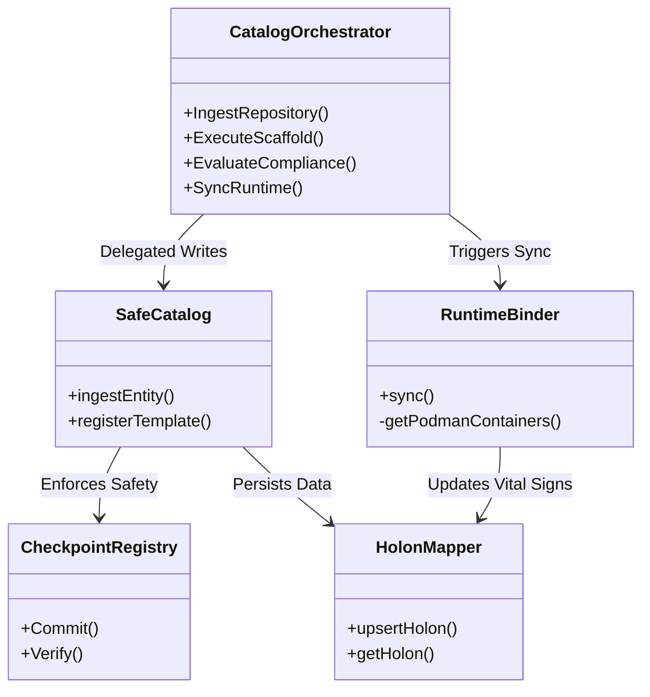

# INDRAJAAL KMS CATALOG: SYSTEM ARCHITECTURE & DATA FLOW
**Version**: 1.0.0
**Context**: SIL-6 Biomorphic Fractal Mesh

---

## 1.0 High-Level System Architecture

This diagram illustrates the relationship between the Developer/User, the F# Catalog Core, and the underlying Storage and Runtime systems.

```mermaid
graph TB
    subgraph User Interaction [L1 - Interface Plane]
        CLI[sa-catalog CLI]
        GUI[Cockpit Desktop (Avalonia)]
        Git[Git Repositories (catalog-info.yaml)]
    end

    subgraph Catalog Core [L2 - Logic Plane (F#)]
        Ingest[Ingestor.fs<br/>(YAML Parsing)]
        Orch[CatalogOrchestrator.fs<br/>(Master Logic)]
        Scaffold[Scaffolder.fs<br/>(Templating)]
        Safe[SafeCatalog.fs<br/>(Gatekeeper)]
        Runtime[RuntimeBinder.fs<br/>(State Sync)]
    end

    subgraph Safety & Audit [L3 - Safety Plane]
        UCR[Unified Checkpoint Registry<br/>(Immutable Ledger)]
        Hash[CheckpointAdapter.fs<br/>(SHA-256 Hashing)]
    end

    subgraph Storage & Mesh [L4 - Persistence Plane]
        SQLite[(SQLite: holons.db)]
        DuckDB[(DuckDB: analytics.db)]
        Vectors[(Vector Store: Search)]
        Zenoh[Zenoh Router<br/>(Federation)]
    end

    subgraph Infrastructure [L5 - Runtime Plane]
        Podman[Podman Engine]
        K8s[Kubernetes Cluster]
    end

    %% Flows
    CLI -->|Command| Orch
    GUI -->|Command| Orch
    Git -->|Pull/Webhook| Ingest
    
    Ingest -->|Entity| Safe
    Scaffold -->|Template| Safe
    
    Safe -->|Verify| Hash
    Hash -->|Record| UCR
    UCR -->|Commit OK| SQLite
    
    Orch -->|Index| Vectors
    Orch -->|Sync| Runtime
    
    Runtime -->|Poll| Podman
    Runtime -->|Poll| K8s
    Runtime -->|Update Vital Signs| SQLite
    
    SQLite -->|Replicate| Zenoh
    Zenoh -->|Broadcast| MeshNodes[Mesh Edge Nodes]
```

---

## 2.0 Detailed Data Flows

### 2.1 Ingestion Flow (The GitOps Loop)
1.  **Trigger**: User runs `sa-catalog register` or the Daemon detects a Git push.
2.  **Parse**: `Ingestor.fs` reads `catalog-info.yaml` and validates strict schema.
3.  **Gatekeep**: `SafeCatalog.fs` calculates SHA-256 hash.
4.  **Audit**: `CheckpointAdapter` creates a signed Checkpoint Record.
5.  **Commit**: UCR validates lineage (`PreviousHash`) and appends to Ledger.
6.  **Persist**: Only upon UCR success, `HolonMapper` upserts JSON to `holons.db`.
7.  **Index**: `Search.fs` updates FTS5 and Vector indexes.
8.  **Broadcast**: `MeshCatalog.fs` publishes update to Zenoh topic `indrajaal/kms/catalog/...`.

### 2.2 Scaffolding Flow (The Golden Path)
1.  **Request**: User selects Template via CLI/GUI.
2.  **Process**: `Scaffolder.fs` loads Template Entity.
3.  **Input**: User provides JSON parameters (`name`, `owner`).
4.  **Render**: `Scriban` engine generates file structure.
5.  **Publish**: New Git repository created.
6.  **Register**: The new `catalog-info.yaml` is automatically ingested (triggering Flow 2.1).

### 2.3 Runtime Binding Flow (The Reality Check)
1.  **Cycle**: `RuntimeBinder.fs` runs on 30s heartbeat (OODA Loop).
2.  **Observe**: Queries `podman ps --format json` and K8s API.
3.  **Orient**: Maps Container Labels (`backstage.io/entity-id`) to Holon IDs.
4.  **Decide**: Detects Drift (e.g., Entity exists in DB but not in Runtime).
5.  **Act**: Updates `vital_signs` column in `holons.db` with status (`Running`, `Stopped`, `Missing`).
6.  **Score**: `Scorecard.fs` recalculates Compliance Score based on drift status.

---

## 3.0 Module Interaction Map


