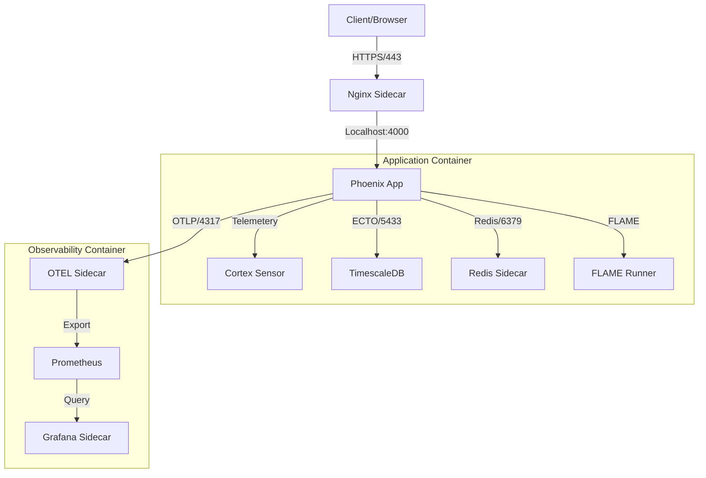

# MASTER_CONTAINER_ARCHITECTURE_20251220.md

**Version**: 11.2.0-COMPLETE (With Validation Framework)
**Date**: 2025-12-20 13:00 CEST
**Classification**: EXHAUSTIVE ARCHITECTURE REFERENCE
**Status**: ACTIVE & VERIFIED
**Author**: Gemini (Cybernetic Architect)
**Compliance**: SOPv5.11, STAMP, TDG, AOR, PHICS, GDE, CAFE, Cortex
**Source Documents Integrated**:
- `container-multi-mode-architecture.md`
- `level-2-container-architecture.md`
- `nixos-container-infrastructure-comprehensive-guide.md`
- `nixos-container-infrastructure-summary.md`
- `three-container-dev-architecture.md`
- `CLAUDE.md` / `CLAUDE-text.md`
- `docs/containers/COMPLETE_CONTAINER_REBUILD_GUIDE.md` (Added v11.2)
- `docs/containers/VALIDATION_FRAMEWORK_COMPLETE.md` (Added v11.2)

---

# 1. Executive Summary (Level 1)

This **Master Container Architecture** serves as the single source of truth for the Indrajaal platform's container infrastructure. It unifies the development, testing, and production environments under a single **5-Level Container Environment Strategy**, enforced by formal verification and autonomic control loops.

The architecture is built upon **NixOS** for immutability, **Podman** for security (rootless), and **PHICS** for development velocity (<50ms hot-reload). It is designed to be **anti-fragile**, self-healing via Cortex/FLAME, and rigorously compliant with **STAMP** safety constraints.

## 1.1 The 5-Level Strategy (SC-CNT-ENV)

| Level | Environment | Objective | Artifact (`podman-compose*.yml`) | Key Constraints |
|-------|-------------|-----------|----------------------------------|-----------------|
| **1** | **Development** | **Velocity** | `podman-compose-3container.yml` | PHICS Enabled (<50ms), Sidecar pattern |
| **2** | **Test** | **Resilience** | `podman-compose-testing.yml` | HA Cluster simulation, Isolation |
| **3** | **Demo** | **Visibility** | `podman-compose.yml` | Full Observability stack |
| **4** | **Production** | **Security** | `podman-compose-secure.yml` | Rootless, Read-only Root, Network Policies |
| **5** | **Mesh** | **Distribution** | `podman-compose-cluster.yml` | Tailscale Identity, FLAME Mesh |

---

# 2. System Architecture (Level 2)

## 2.1 Physical Architecture: The 3-Container Model
To optimize resources (20 CPU, 56GB RAM), the system uses a consolidated 3-container model with logical sidecars sharing network namespaces.

### 2.1.1 Container 1: Application (`indrajaal-app`)
- **Core**: Elixir 1.19.2 + OTP 28 + Phoenix 1.7
- **Sidecars**:
    - `indrajaal-redis`: Session/Cache
    - `indrajaal-nginx`: TLS Termination/Load Balancing
- **Resources**: 12 vCPU, 32GB RAM
- **Ports**: 4000 (HTTP), 4369 (EPMD)

### 2.1.2 Container 2: Database (`indrajaal-db`)
- **Core**: PostgreSQL 17 + TimescaleDB 2.17
- **Features**: Hypertables, Continuous Aggregates
- **Resources**: 4 vCPU, 16GB RAM
- **Ports**: 5433 (Primary), 5432 (Replica)

### 2.1.3 Container 3: Observability (`indrajaal-obs`)
- **Core**: Prometheus + SigNoz Collector
- **Sidecars**:
    - `indrajaal-grafana`: Dashboards
    - `indrajaal-otel`: OpenTelemetry Collector
- **Resources**: 4 vCPU, 8GB RAM
- **Ports**: 9090 (Prom), 3000 (Grafana), 4317/4318 (OTLP)

## 2.2 Logical Architecture: Multi-Mode Containers
To prevent drift, a **single image** supports multiple execution modes via the `CONTAINER_MODE` environment variable.

| Mode | Env Var | Behavior | Entrypoint |
|------|---------|----------|------------|
| **Test** | `CONTAINER_MODE=test` | Repo+PropCheck, No Phoenix | `mix test` |
| **Dev** | `CONTAINER_MODE=dev` | IEx + Phoenix + LiveReload | `iex -S mix phx.server` |
| **Demo** | `CONTAINER_MODE=demo` | Phoenix (No IEx) | `mix phx.server` |
| **Prod** | `CONTAINER_MODE=prod` | Release Binary | `/app/bin/server` |
| **Compile** | `CONTAINER_MODE=compile` | Compilation Only | `mix compile` |

---

# 3. Dataflow & Control Flow (Level 3)

## 3.1 Dataflow Architecture



## 3.2 Control Flow (Startup & Health)

1.  **Orchestrator**: `podman-compose` initiates startup sequence.
2.  **Phase 1 (Data Layer)**: `indrajaal-db` starts.
    -   *Check*: `pg_isready` on port 5433.
3.  **Phase 2 (App Layer)**: `indrajaal-app` starts (depends_on DB).
    -   *Action*: Runs migrations (`mix ecto.migrate`).
    -   *Check*: `/health` endpoint returns 200 OK.
4.  **Phase 3 (Obs Layer)**: `indrajaal-obs` starts (depends_on App).
    -   *Action*: Configures scrape targets.
    -   *Check*: Prometheus target status is UP.
5.  **Phase 4 (Verification)**: `ContainerHealthSensor` (Cortex) verifies 7-phase compliance.

---

# 4. Setup & Generation (Level 4)

## 4.1 NixOS Build Pipeline
All container images are generated deterministically using Nix to ensure bit-for-bit reproducibility.

**Definition**: `nix/containers/sopv51-elixir-app.nix`
```nix
{ pkgs, ... }:
dockerTools.buildImage {
  name = "localhost/indrajaal-sopv51-elixir-app";
  tag = "nixos-25.05-${gitRev}";
  config = {
    Cmd = [ "${multiModeEntrypoint}/bin/container-entrypoint" ];
    Env = [ "CONTAINER_OS=nixos", "PHICS_ENABLED=true" ];
  };
}
```

**Build Command**:
```bash
nix-build containers/sopv51-elixir-app.nix --argstr gitRev $(git rev-parse --short HEAD)
podman load < result
```

## 4.2 PHICS Hot-Reloading Configuration
**Objective**: <50ms code sync latency for development velocity.

-   **Mechanism**: Host `inotify` -> Container `fswatch` -> Phoenix Code Reloader.
-   **Mounts**:
    -   `./lib` -> `/app/lib`
    -   `./config` -> `/app/config`
    -   `./priv` -> `/app/priv`
-   **Latency Target**: < 50ms (Verified via SC-CNT-011).

---

# 5. Verification & Safety (Level 5)

## 5.1 STAMP Safety Constraints
The architecture enforces 72+ safety constraints. Key container-specific constraints:

| ID | Constraint | Implementation | Verification |
|----|------------|----------------|--------------|
| **SC-CNT-009** | **NixOS Containers Only** | `nix-build` usage | `verify_container_versions()` |
| **SC-CNT-010** | **Localhost Registry** | Local load only | Image name check |
| **SC-CNT-011** | **PHICS < 50ms** | Volume mounts | Runtime monitoring |
| **SC-CNT-012** | **Rootless Execution** | Podman user ns | `podman info` check |
| **SC-CNT-014** | **Resource Isolation** | cgroups/limits | `podman stats` check |

## 5.2 Automated Verification Engine
**Script**: `scripts/containers/verify_5level_strategy.exs`

This script parses all 5 `podman-compose-*.yml` files and verifies:
1.  Correct image sources (localhost).
2.  Correct environment variables (PHICS, MIX_ENV).
3.  Security settings (read_only, user).
4.  Resource limits.

**Usage**: `elixir scripts/containers/verify_5level_strategy.exs`

## 5.3 Cortex Autonomic Integration
The container infrastructure is a managed subsystem of the **Cortex** cybernetic brain.

-   **Sensor**: `ContainerHealthSensor`
-   **Metrics**: Health status, Restart count, Resource usage.
-   **Homeostasis**:
    -   *Stress*: High CPU/RAM -> Stress Score increase.
    -   *Response*: FLAME runner spawning (Scale Up).
    -   *Healing*: Auto-restart of unhealthy sidecars.

---

# 6. Operational Procedures

## 6.1 Development Workflow
1.  **Start**: `elixir scripts/env/dev-start.exs` (Level 1).
2.  **Verify**: `elixir scripts/containers/verify_5level_strategy.exs`.
3.  **Code**: Edit files locally; observe immediate reflection in container.

## 6.2 Testing Workflow
1.  **Start**: `podman-compose -f podman-compose-testing.yml up -d` (Level 2).
2.  **Run**: `mix test` (Runs inside `indrajaal-test-runner` service).
3.  **Cleanup**: `podman-compose -f podman-compose-testing.yml down`.

## 6.3 Production Deployment
1.  **Build**: `nix-build ...` (Level 4 Image).
2.  **Deploy**: `podman-compose -f podman-compose-secure.yml up -d`.
3.  **Verify**: `curl http://localhost:4000/health`.

## 6.4 Emergency Recovery
**Scenario**: Container drift or corruption.
**Procedure**:
```bash
# 1. Nuclear Cleanup
podman stop -a
podman rm -a
podman volume prune -f

# 2. Rebuild Images
./scripts/containers/build_nixos_containers.exs

# 3. Restart Verification
elixir scripts/containers/verified_nixos_setup.exs --comprehensive
```

---

# 7. Integration Points

## 7.1 Kubernetes (Level 4/5)
For production orchestration, `podman-compose-secure.yml` maps to Kubernetes manifests:
-   **Deployment**: `indrajaal-app` (Replicas: 3)
-   **StatefulSet**: `indrajaal-db` (Volume Claims)
-   **Service**: LoadBalancer for Nginx.

## 7.2 Tailscale Mesh (Level 5)
-   **Identity**: Each container gets a Tailscale identity (`*.tailnet.ts.net`).
-   **Discovery**: `libcluster` uses DNS strategy on the Tailscale subnet.
-   **Security**: mTLS enforced by Tailscale wireguard protocol.

---

# 8. Implementation Deep Dive (Detailed Reference)

## 8.1 Multi-Mode Entrypoint Script
This script is the core of the **Multi-Mode** logic, enabling one image to serve all environments.

**File**: `scripts/container/multi_mode_entrypoint.sh`
```bash
#!/usr/bin/env bash
# File: scripts/container/multi_mode_entrypoint.sh
# Purpose: Mode-aware container entrypoint
# STAMP: SC-CNT-TEST-001, SC-CNT-TEST-004

set -e

# Default mode
MODE="${CONTAINER_MODE:-demo}"
MIX_ENV_OVERRIDE="${MIX_ENV:-}"

log() { echo "[$(date '+%Y-%m-%dT%H:%M:%S%z')] ENTRYPOINT: $*"; }

log "Starting container in '$MODE' mode"

# Set MIX_ENV based on mode (if not explicitly overridden)
if [ -z "$MIX_ENV_OVERRIDE" ]; then
  case "$MODE" in
    test)    export MIX_ENV=test ;;
    dev)     export MIX_ENV=dev ;;
    demo)    export MIX_ENV=demo ;;
    prod)    export MIX_ENV=prod ;;
    compile) export MIX_ENV=prod ;;
    *)       export MIX_ENV=demo ;;
  esac
fi

# Ensure workspace is ready
cd /workspace

# Mode-specific execution
case "$MODE" in
  test)
    export PHX_SERVER=false
    mix deps.get --only test
    mix compile
    exec mix test "$@"
    ;;
  dev)
    export PHX_SERVER=true
    mix deps.get
    exec iex -S mix phx.server
    ;;
  demo)
    export PHX_SERVER=true
    mix deps.get
    mix ecto.create --quiet 2>/dev/null || true
    mix ecto.migrate
    exec mix phx.server
    ;;
  prod)
    export PHX_SERVER=true
    if [ -f "/app/bin/server" ]; then
      exec /app/bin/server
    else
      exec mix phx.server
    fi
    ;;
  compile)
    mix deps.get
    exec mix compile --warnings-as-errors
    ;;
  *)
    log "ERROR: Unknown mode '$MODE'"
    exit 1
    ;;
esac
```

## 8.2 SSL Certificate Management (Symlink Strategy)
Erlang/OTP requires SSL certificates in specific locations. This script ensures they exist in the container.

**Problem**: Erlang/OTP looks for SSL certificates in multiple standard locations, but containers may not have them.
**Solution**: Multi-path symlink strategy.

```bash
# Certificate paths Erlang checks (in order):
CERT_PATHS=(
  "/etc/ssl/certs/ca-bundle.crt"
  "/etc/pki/tls/certs/ca-bundle.crt"
  "/etc/ssl/cert.pem"
  "/etc/ssl/certs/ca-certificates.crt"
)

# NixOS provides certificates at:
NIXOS_CERTS="/etc/ssl/certs/ca-bundle.crt"

# Create symlinks for all paths
for cert_path in "${CERT_PATHS[@]}"; do
  mkdir -p "$(dirname "$cert_path")"
  ln -sf "$NIXOS_CERTS" "$cert_path"
done
```

---

# 9. Configuration Reference (Env Vars)

## 9.1 Database (indrajaal-db)
| Variable | Value | Purpose |
|----------|-------|---------|
| `POSTGRES_DB` | `indrajaal_dev` | DB Name |
| `TS_TUNE_MEMORY` | `8GB` | TimescaleDB Memory |
| `TS_TUNE_NUM_CPUS` | `4` | TimescaleDB CPU |
| `POSTGRES_SHARED_BUFFERS` | `4GB` | PG Tuning |

## 9.2 Application (indrajaal-app)
| Variable | Value | Purpose |
|----------|-------|---------|
| `ELIXIR_ERL_OPTIONS` | `+S 16 +A 32 +K true +P 1048576` | BEAM Tuning |
| `ERL_MAX_PORTS` | `524288` | High connection count |
| `PHICS_ENABLED` | `true` | Hot reload |
| `CONTAINER_ENFORCEMENT` | `true` | Strict mode |

## 9.3 Observability (indrajaal-obs)
| Variable | Value | Purpose |
|----------|-------|---------|
| `GF_SECURITY_ADMIN_PASSWORD` | `admin` | Grafana Auth |
| `OTEL_EXPORTER_OTLP_ENDPOINT` | `http://localhost:9090` | Telemetry target |

---

# 10. Advanced Recovery & Validation (Added v11.2)

## 10.1 Complete Rebuild Protocol (Nuclear Option)
When all else fails, use this verified procedure from `COMPLETE_CONTAINER_REBUILD_GUIDE.md`:

1.  **Stop & Clean**: `podman stop -a && podman rm -a`
2.  **Network Re-init**: `podman network create indrajaal-demo-network`
3.  **Volume Re-init**: `podman volume create postgres_data redis_data app_deps app_build`
4.  **Rebuild All**: Execute `./scripts/containers/complete_environment_rebuild.sh`
5.  **Validate**: Run `./scripts/containers/comprehensive_validation.sh`

## 10.2 4-Layer Validation Framework
Based on `VALIDATION_FRAMEWORK_COMPLETE.md`, the system must pass 4 sequential gates:

1.  **Layer 1: TDG Pre-Implementation**: Checks config syntax, file existence, and port conflicts.
2.  **Layer 2: STAMP Safety Analysis**: Verifies resource isolation and security constraints.
3.  **Layer 3: Architecture Integrity**: Ensures naming conventions and topology consistency.
4.  **Layer 4: Integration Testing**: Full end-to-end functionality verification.

**Master Validation Command**:
```bash
./scripts/validation/master_validation_suite.sh
```

---

**References**:
-   `CLAUDE.md`: System Axioms & Constraints.
-   `GEMINI.md`: Formal Mathematical Specifications.
-   `docs/journal/20251220-1030-container-verification-completion.md`: Verification Log.