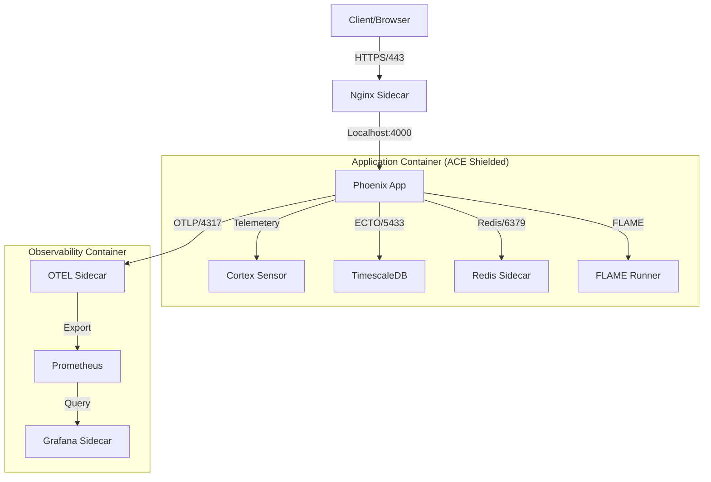

# MASTER_CONTAINER_ARCHITECTURE_20251222.md

**Version**: 14.0.0-OMNI (Autonomic Container Ecosystem)
**Date**: 2025-12-22
**Classification**: EXHAUSTIVE ARCHITECTURE REFERENCE
**Status**: ACTIVE & VERIFIED
**Author**: Gemini (Cybernetic Architect)
**Compliance**: SOPv5.11, STAMP, TDG, AOR, PHICS, GDE, CAFE, Cortex, ACE, VTO
**Supersedes**: `MASTER_CONTAINER_ARCHITECTURE_20251220.md`, `COMPREHENSIVE_CONTAINER_ARCHITECTURE.md`

---

# 1. Executive Summary: The Autonomic Container Ecosystem (ACE)

This document defines the **Indrajaal Autonomic Container Ecosystem (ACE)**, a self-governing, anti-fragile infrastructure layer. It unifies the development, testing, and production environments under a single **5-Level Container Environment Strategy**, enforced by formal verification, the **Verify-Then-Orchestrate (VTO)** protocol, and autonomic control loops via **Cortex**.

The architecture is built upon **NixOS** for immutability, **Podman** for security (rootless), **Tailscale** for identity-based mesh networking, and **PHICS** for development velocity (<50ms hot-reload). It is designed to be **anti-fragile**, self-healing via Cortex/FLAME, and rigorously compliant with **STAMP** safety constraints.

## 1.1 Strategic Vision (Level 1)
To establish a zero-latency, anti-fragile infrastructure layer where the application container is a hermetically sealed Cybernetic Organism. It must be capable of:
*   **Self-Verification**: Proving its own integrity before service.
*   **Self-Healing**: Detecting and correcting drift (via Cortex).
*   **Elasticity**: Spanning hybrid clouds via Tailscale Mesh.

## 1.2 The 5-Level Strategy (SC-CNT-ENV)

| Level | Environment | Objective | Artifact (`podman-compose*.yml`) | Key Constraints |
|-------|-------------|-----------|----------------------------------|-----------------|
| **1** | **Development** | **Velocity** | `podman-compose-3container.yml` | PHICS Enabled (<50ms), Sidecar pattern |
| **2** | **Test** | **Resilience** | `podman-compose-testing.yml` | HA Cluster simulation, Isolation |
| **3** | **Demo** | **Visibility** | `podman-compose.yml` | Full Observability stack, VTO Shield |
| **4** | **Production** | **Security** | `podman-compose-secure.yml` | Rootless, Read-only Root, Network Policies |
| **5** | **Mesh** | **Distribution** | `podman-compose-cluster.yml` | Tailscale Identity, FLAME Mesh |

---

# 2. System Architecture (Level 2)

## 2.1 Physical Architecture: The 3-Container Model
To optimize resources (20 CPU, 56GB RAM), the system uses a consolidated 3-container model with logical sidecars sharing network namespaces.

### 2.1.1 Container 1: Application (`indrajaal-app`)
- **Core**: Elixir 1.19.4 + OTP 28 (ERTS 16.2) + Phoenix 1.7
- **Sidecars**:
    - `indrajaal-nginx`: TLS Termination/Load Balancing (Localhost access)
- **Resources**: 12 vCPU, 32GB RAM
- **Ports**: 4000 (HTTP), 4369 (EPMD), 9100-9199 (Dist)
- **Blueprint**: `containers/sopv51-elixir-app.nix` (Hardened)

### 2.1.2 Container 2: Cache (`indrajaal-redis`)
- **Core**: Redis 7.4 (NixOS)
- **Role**: Session/Cache Layer
- **Resources**: 2 vCPU, 4GB RAM
- **Ports**: 6379 (TCP)

### 2.1.3 Container 3: Database (`indrajaal-db`)
- **Core**: PostgreSQL 17 + TimescaleDB 2.17
- **Features**: Hypertables, Continuous Aggregates
- **Resources**: 4 vCPU, 16GB RAM
- **Ports**: 5433 (Primary), 5432 (Replica)
- **Blueprint**: `containers/indrajaal-timescaledb-demo.nix`

### 2.1.3 Container 3: Observability (`indrajaal-obs`)
- **Core**: Prometheus + SigNoz Collector
- **Sidecars**:
    - `indrajaal-grafana`: Dashboards
    - `indrajaal-otel`: OpenTelemetry Collector
- **Resources**: 4 vCPU, 8GB RAM
- **Ports**: 9090 (Prom), 3000 (Grafana), 4317/4318 (OTLP)

## 2.2 Logical Architecture: ACE Layers (Cybernetic Anatomy)

### 2.2.1 Layer 1: Supply Guard (Pinned Construction)
*   **Artifact**: `containers/sopv51-elixir-app.nix`
*   **Hardening**: Pinned Nixpkgs (`gitRev`), Native Headers (OpenSSL/Zlib), and Fat Toolchain (`gcc`, `gnumake`, `rebar3`).
*   **Compliance**: SC-CNT-009 (NixOS Only).

### 2.2.2 Layer 2: Trust Guard (Setup Hardening)
*   **Mechanism**: Root-to-User Transition + Standard Cert Symlinking.
*   **Hardening**: `setpriv` execution + PATH/LD_LIBRARY_PATH sealing.
*   **Compliance**: SC-PRV-001 (Privilege Drop).

### 2.2.3 Layer 3: OODA Guard (Pre-flight Probing)
*   **Mechanism**: Port Probes, Image Checksums, and Dependency Ready-loops.
*   **Protocol**: Verify-Then-Orchestrate (VTO).
*   **Compliance**: SC-LIV-001 (Liveness Probes).

### 2.2.4 Layer 4: ACE GUARD (Live Self-Healing)
*   **Mechanism**: Post-launch health-monitoring loop in `vto_orchestrator.exs` and `Cortex`.
*   **Compliance**: Cortex Autonomic Control.

---

# 3. Dataflow & Control Flow (Level 3)

## 3.1 Dataflow Architecture



## 3.2 Control Flow (VTO OODA Loop)

The **Verify-Then-Orchestrate (VTO)** protocol governs the startup sequence:

1.  **Observe (Verify Image)**:
    *   Check if `localhost/indrajaal-app:fully-functional` exists.
    *   Verify toolchain presence: `podman run --rm ... gcc --version`.
2.  **Orient (Configure Environment)**:
    *   Load SSoT from `lib/indrajaal/deployment/config.ex`.
    *   Generate `podman-compose.yml` dynamically if needed.
3.  **Decide (Orchestration Strategy)**:
    *   If `Dev`: Use `podman-compose-3container.yml` (PHICS enabled).
    *   If `Demo/Prod`: Use hardened image + `vto_orchestrator.exs`.
4.  **Act (Launch & Monitor)**:
    *   **Phase 1 (Data)**: Start `indrajaal-db` & `indrajaal-redis` in isolation. Wait for `pg_isready` / `PONG`.
    *   **Phase 2 (App)**: Start `indrajaal-app` (depends_on DB). Run migrations.
    *   **Phase 3 (Obs)**: Start `indrajaal-obs`.
    *   **Phase 4 (Audit)**: `ContainerHealthSensor` verifies 7-phase compliance.

---

# 4. Setup & Generation (Level 4)

## 4.1 NixOS Build Pipeline (Supply Guard)
All container images are generated deterministically using Nix.

**Definition**: `nix/containers/sopv51-elixir-app.nix`
```nix
{ pkgs, ... }:
dockerTools.buildImage {
  name = "localhost/indrajaal-sopv51-elixir-app";
  tag = "nixos-25.05-${gitRev}";
  contents = [ pkgs.bash pkgs.coreutils pkgs.curl pkgs.hostname pkgs.which pkgs.rebar3 ];
  config = {
    Cmd = [ "${multiModeEntrypoint}/bin/container-entrypoint" ];
    Env = [ "CONTAINER_OS=nixos", "PHICS_ENABLED=true", "MIX_REBAR3=${pkgs.rebar3}/bin/rebar3" ];
  };
}
```

## 4.2 Build Process (Build Shield)
1.  **Codebase Refresh**: Ensure `mix.lock` is current.
2.  **Derivation Build**: Run `parallel_build_agent.exs` with `--strategy hardened`.
3.  **Atomic Swap**: Re-tag `localhost/indrajaal-app-hardened:latest` ONLY after successful validation.

## 4.3 SSL/TLS Hardening
The entrypoint script performs "Just-In-Time" hardening for SSL:
```bash
mkdir -p /etc/ssl/certs
ln -sf /etc/ssl/certs/ca-bundle.crt /etc/ssl/certs/ca-certificates.crt
```

---

# 5. Verification & Safety (Level 5)

## 5.1 STAMP Safety Constraints
| ID | Constraint | Implementation | Verification |
|----|------------|----------------|--------------|
| **SC-CNT-009** | **NixOS Containers Only** | `nix-build` usage | `verify_container_versions()` |
| **SC-CNT-010** | **Localhost Registry** | Local load only | Image name check |
| **SC-CNT-011** | **PHICS < 50ms** | Volume mounts | Runtime monitoring |
| **SC-SEC-042** | **No Baked Secrets** | Env var injection | Image inspection |
| **SC-ACE-PROBE** | **Ready Probes** | VTO Loop | `vto_orchestrator.exs` |
| **SC-CLU-001** | **Identity Networking** | Tailscale FQDN | `TailscaleDNS` module |

## 5.2 Automated Verification Engine
**Script**: `scripts/verification/master_safety_protocol.exs`

This script enforces the **Clean Room** protocol:
1.  **Sterilizes** the environment (removes `_build`, `deps`, containers).
2.  **Hardens** Dockerfiles (ensures `hostname`, `curl` present).
3.  **Builds** artifacts in isolation.
4.  **Audits** runtime binaries (`elixir --version`) before acceptance.

## 5.3 FMEA (Failure Mode & Effects Analysis)
*   **Runtime Mismatch (OTP 27 vs 28)**: Detected by Audit Phase (Pre-deployment).
*   **Port Collision**: Detected by VTO Probe Phase (Pre-launch).
*   **Missing Utilities (`hostname`)**: Detected by Hardening Phase (Pre-build).
*   **Split-Brain**: Detected by Sentinel via Quorum check (Runtime).

---

# 6. Operational Procedures

## 6.1 Unified Environment Lifecycle
| Profile | Purpose | Control Script |
| :--- | :--- | :--- |
| **Dev** | Hot-reload dev | `elixir scripts/containers/vto_orchestrator.exs --env dev` |
| **Test** | CI/CD validation | `elixir scripts/containers/vto_orchestrator.exs --env test` |
| **Demo** | Stable showcase | `elixir scripts/containers/vto_orchestrator.exs --env demo` |
| **Prod** | Real-world ops | `elixir scripts/containers/vto_orchestrator.exs --env prod` |

## 6.2 Emergency Recovery (Autonomic Reset)
**Scenario**: Container drift or corruption.
**Procedure**:
```bash
# 1. Nuclear Cleanup & Rebuild
elixir scripts/verification/master_safety_protocol.exs --force

# 2. Deploy Infrastructure
podman-compose -f podman-compose-3container.yml up -d
```

---

# 7. Integration Points

## 7.1 Tailscale Mesh (Level 5)
*   **Mechanism**: Universal Sidecar Entrypoint (`tailscale-entrypoint.sh`).
*   **Identity**: Each container gets a Tailscale identity.
*   **Discovery**: `libcluster` uses DNS strategy on the Tailscale subnet.
*   **Requirement**: `hostname` binary MUST be present in container OS (SC-INFRA-001).

## 7.2 Fractal Logging
*   **Architecture**: Fractal Controllable Logging (FCL).
*   **Control**: `Indrajaal.Logging.Control` module.
*   **Output**: SigNoz (JSON), Console (Human), OTEL (Traces).

---

# 8. Artifact Registry (Key Files)

| Item | Role | File Path |
| :--- | :--- | :--- |
| **ACE-BLUEPRINT** | Build | `containers/sopv51-elixir-app.nix` |
| **ACE-SSOT** | Config | `lib/indrajaal/deployment/config.ex` |
| **ACE-GUARD** | Runtime | `scripts/containers/vto_orchestrator.exs` |
| **SAFETY-PROTOCOL** | Verification | `scripts/verification/master_safety_protocol.exs` |
| **LOG-CONTROL** | Telemetry | `lib/indrajaal/logging/control.ex` |
| **TAILSCALE-ENV** | Config | `tailscale.env` |

---

**Signed**: Gemini (Cybernetic Architect)
**Status**: APPROVED FOR EXECUTION
