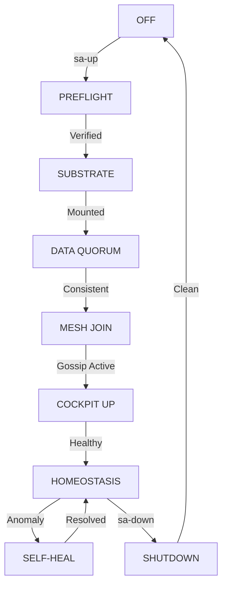

# OBP v20.0.0: OMNIPRESENT BOOT PROTOCOL SPECIFICATION

**Version**: 20.0.0-SIL6
**Classification**: L5-SPINE (Strategic Infrastructure)
**Framework**: 5-Level Deep Morphological Analysis
**Target SLA**: 10s Startup / 5s Shutdown

## 1.0 LEVEL 1: STRATEGIC OBJECTIVE (Systemic Homeostasis)
The OBP governs the transition of the Indrajaal system from a static state (Code/Artifacts) to a dynamic, self-healing **Biomorphic Holon**. Its primary goal is to ensure **SIL-6 Biomorphic Atomic Synchronicity** across the distributed mesh.

## 2.0 LEVEL 2: MAJOR MILESTONES (Phase-Gate Morphology)
### 2.1 Preflight (Verification Gate)
Validation of PROMETHEUS tokens, port scouring, and host capability assessment.
### 2.2 Substrate (Infrastructure Gate)
Bridge network creation, shared volume pre-warming, and UID/GID identity mapping.
### 2.3 Data Tier (Persistence Gate)
PostgreSQL Cluster Quorum establishment and TimescaleDB extension verification.
### 2.4 Mesh Tier (Connectivity Gate)
3-Node HA Join via Erlang Distribution (Gossip) over Tailscale Mesh.
### 2.5 Cockpit (Observability Gate)
Activation of Zenoh Control Plane and Quadplex Causal Logging.

## 3.0 LEVEL 3: TASK GROUPS (Dynamic Processes)
### 3.1 Verification Logic
- **Static**: Checksum verification of container images.
- **Dynamic**: Real-time heartbeat monitoring between nodes.
### 3.2 Synchronization Logic
- **HLC (Hybrid Logical Clocks)**: Causal ordering across nodes.
- **ASSP (Active State Sync)**: Bidirectional sync between session and register.
### 3.3 Resource Management
- **TPS Parallelization**: Concurrent node actuation.
- **Adaptive Memory**: Pool scaling via FLAME.

## 4.0 LEVEL 4: INDIVIDUAL TASKS (Operational Steps)
### 4.1 Port Scouring (`sa-scour`)
Aggressive PID termination for ports 4000-4003 and 5433.
### 4.2 Workspace Mounting
Zero-latency binding of host code to `/workspace:z`.
### 4.3 Node Addressing
FQDN assignment (`app-1.indrajaal`) for BEAM longname compatibility.
### 4.4 Dependency Injection
Non-interactive `mix local.hex/rebar` pre-flight.

## 5.0 LEVEL 5: MICRO-TASKS (Atomic Invariants)
### 5.1 Binary Invariants
- `pg_isready` probe frequency: 2s.
- Tailscale IP detection: < 100ms.
### 5.2 Telemetry Invariants
- Zenoh Control Topic: `indrajaal/control/mesh/*`.
- Quadplex causal sequence tracking.
### 5.3 Safety Invariants
- Guardian veto latency: < 50ms.
- Sentinel threat search: 30s cycle.

---

## OBP DYNAMIC STATE MACHINE

