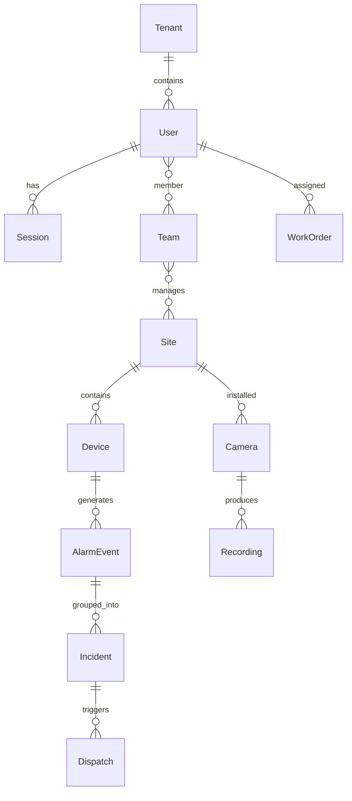

# ASH-DESIGN.md - Indrajaal Security Monitoring System

## Executive Summary

The Indrajaal Security Monitoring System is a sophisticated enterprise-grade security platform built on **Ash Framework 3.5+** with comprehensive multi-tenant architecture across **12 specialized Ash domains**. This document provides complete analysis of all ASH framework layers, architectural patterns, and implementation status.

**Current Implementation Status**: Foundation phase with advanced tooling infrastructure and 16.7% partial implementation in Accounts domain.

---

## Table of Contents

1. [Architecture Overview](#architecture-overview)
2. [Layer 1: Resources](#layer-1-resources)
3. [Layer 2: Actions](#layer-2-actions)
4. [Layer 3: Security](#layer-3-security)
5. [Layer 4: Advanced Features](#layer-4-advanced-features)
6. [Layer 5: System Integration](#layer-5-system-integration)
7. [Data Model Analysis](#data-model-analysis)
8. [Runtime Model](#runtime-model)
9. [Implementation Status](#implementation-status)
10. [Implementation Roadmap](#implementation-roadmap)

---

## Architecture Overview

### Ash Framework Stack
```elixir
# Core Ash Dependencies
{:ash, "~> 3.5"}                  # Core framework
{:ash_phoenix, "~> 2.1"}          # Phoenix integration
{:ash_postgres, "~> 2.3"}         # PostgreSQL data layer
{:ash_graphql, "~> 1.4"}          # GraphQL API
{:ash_json_api, "~> 1.4"}         # JSON:API specification
{:ash_admin, "~> 0.11"}           # Admin interface
{:ash_authentication, "~> 4.0"}   # Authentication framework
```

### Domain-Driven Architecture
The system implements 12 specialized Ash domains representing core business capabilities:

```
├── Core Domain         # Multi-tenancy, organizations, system config
├── Accounts Domain     # Users, authentication, sessions, teams
├── Policy Domain       # Authorization, RBAC/ABAC, access control
├── Sites Domain        # Physical locations, zones, geofencing
├── Devices Domain      # Security devices, sensors, SIA DC-09
├── Alarms Domain       # Events, incidents, state machines
├── Video Domain        # Surveillance, streaming, WebRTC
├── Dispatch Domain     # Response teams, workflows
├── Maintenance Domain  # Work orders, preventive maintenance
├── Compliance Domain   # Audit logs, DPDP Act compliance
├── Billing Domain      # Subscriptions, usage tracking
└── Integrations Domain # External systems, webhooks, APIs
```

---

## Layer 1: Resources

### 1.1 Implemented Resources

#### Session Resource (`lib/indrajaal/accounts/session.ex`)
**Status**: ✅ Fully Implemented

```elixir
defmodule Indrajaal.Accounts.Session do
  use Ash.Resource,
    domain: Indrajaal.Accounts,
    data_layer: AshPostgres.DataLayer

  use Indrajaal.Multitenancy.TenantResource
```

**Attributes**:
- `id` (uuid_primary_key) - Unique session identifier
- `user_id` (uuid, required) - Foreign key to User resource
- `ip_address` (string) - Client IP for security tracking
- `user_agent` (string) - Browser/client identification
- `active` (boolean, default: true) - Session status
- `last_activity_at` (utc_datetime_usec) - Activity tracking
- `revoked_at` (utc_datetime_usec) - Manual revocation timestamp
- `expires_at` (utc_datetime_usec) - Automatic expiration
- `created_at`, `updated_at` - Standard timestamps

**Relationships**:
- `belongs_to :user, Indrajaal.Accounts.User` ⚠️ *User resource missing*

**Calculations**:
- `is_expired` - Checks if `expires_at < now()`
- `is_active` - Complex boolean: `active && !revoked && !expired`

**PostgreSQL Configuration**:
```elixir
postgres do
  table "sessions"
  repo Indrajaal.Repo

  custom_indexes do
    index [:user_id, :active]                    # Compound index
    index [:expires_at], where: "active = true"  # Partial index
  end
end
```

#### Token Resource (`lib/indrajaal/accounts/token.ex`)
**Status**: ✅ Basic Implementation

```elixir
defmodule Indrajaal.Accounts.Token do
  use Ash.Resource,
    domain: Indrajaal.Accounts,
    data_layer: AshPostgres.DataLayer,
    extensions: [AshAuthentication.TokenResource]
```

**Features**:
- AshAuthentication.TokenResource extension for JWT management
- PostgreSQL table "tokens"
- Read and destroy actions only (security-focused)

### 1.2 Missing Resources (By Domain)

#### Core Domain Resources (0% implemented)
```elixir
# Expected Core Domain Resources
- Tenant           # Multi-tenant isolation
- Organization     # Hierarchical organizations
- SystemConfig     # Application configuration
- FeatureFlag      # Feature toggles
- AuditLog         # System-wide audit trail
```

#### Accounts Domain Resources (33.3% implemented)
```elixir
# Implemented: Session, Token
# Missing:
- User            # ⚠️ Critical - Referenced by Session
- Team            # Team collaboration
- TeamMembership  # Many-to-many User/Team
- Permission      # Granular permissions
- Role            # Role-based access control
```

#### Policy Domain Resources (0% implemented)
```elixir
- Policy          # Authorization policies
- Role            # RBAC roles
- Permission      # Granular permissions
- AccessRule      # Dynamic access rules
- PolicySet       # Grouped policies
```

#### Sites Domain Resources (0% implemented)
```elixir
- Site            # Physical locations
- Building        # Buildings within sites
- Floor           # Building floors
- Zone            # Security zones
- Area            # Specific areas
- Location        # Hierarchical locations
```

#### Devices Domain Resources (0% implemented)
```elixir
- Device          # Security devices
- Sensor          # Various sensors
- Camera          # Video surveillance
- Panel           # Alarm panels
- DeviceType      # Device categories
- DeviceStatus    # Device state tracking
```

#### Alarms Domain Resources (0% implemented)
```elixir
- AlarmEvent      # Security events
- Incident        # Grouped events
- Notification    # Alert notifications
- AlarmType       # Event categories
- ResponsePlan    # Incident response
- EventCorrelation # Event relationships
```

#### Video Domain Resources (0% implemented)
```elixir
- CameraStream    # Live video streams
- Recording       # Video recordings
- VideoClip       # Clip segments
- StreamConfig    # Stream configuration
- StoragePolicy   # Retention policies
```

#### Dispatch Domain Resources (0% implemented)
```elixir
- Dispatch        # Response dispatch
- ResponseTeam    # Teams and personnel
- Unit            # Response units
- DispatchLog     # Communication logs
- Workflow        # Automated workflows
```

#### Maintenance Domain Resources (0% implemented)
```elixir
- WorkOrder       # Maintenance requests
- ServiceContract # Service agreements
- ScheduledMaintenance # Preventive maintenance
- Technician      # Service personnel
- SparePart       # Inventory management
```

#### Compliance Domain Resources (0% implemented)
```elixir
- AuditLog        # Compliance audit trail
- DataRequest     # Data access requests
- ConsentRecord   # GDPR consent tracking
- RetentionPolicy # Data retention rules
- ComplianceReport # Regulatory reports
```

#### Billing Domain Resources (0% implemented)
```elixir
- Subscription    # Customer subscriptions
- Invoice         # Billing invoices
- Payment         # Payment processing
- PricingPlan     # Pricing structures
- UsageTracking   # Usage metrics
```

#### Integrations Domain Resources (0% implemented)
```elixir
- ApiKey          # API key management
- Webhook         # Webhook configurations
- EventMapping    # Event transformations
- ThirdPartySystem # External integrations
- IntegrationLog  # Integration monitoring
```

### 1.3 Multi-Tenancy Implementation

All resources extend `Indrajaal.Multitenancy.TenantResource`:

```elixir
# Pattern used in Session resource
use Indrajaal.Multitenancy.TenantResource

# Expected multi-tenancy configuration
multitenancy do
  strategy :attribute
  attribute :tenant_id
  global? false
end
```

**Row-Level Security (RLS) Features**:
- Complete data isolation with `tenant_id` on all tables
- PostgreSQL RLS policies enforce isolation at database level
- Cross-tenant queries blocked automatically
- Tenant context propagated through all operations

---

## Layer 2: Actions

### 2.1 Implemented Actions

#### Session Resource Actions
```elixir
actions do
  defaults [:read, :create, :update, :destroy]  # Standard CRUD

  # Custom Update Actions
  update :revoke do
    accept []
    change set_attribute(:active, false)
    change set_attribute(:revoked_at, &DateTime.utc_now/0)
  end

  update :touch do
    accept []
    change set_attribute(:last_activity_at, &DateTime.utc_now/0)
  end
end
```

**Action Analysis**:
- **Default CRUD**: Standard Ash actions for basic operations
- **Custom Actions**: Business-specific operations beyond CRUD
- **Security-focused**: Revoke action for session termination
- **Activity tracking**: Touch action for session management

#### Token Resource Actions
```elixir
actions do
  defaults [:read, :destroy]  # Limited to read/destroy for security
end
```

### 2.2 Expected Action Patterns (Not Yet Implemented)

#### Read Actions with Authorization
```elixir
# Expected pattern for all domains
read :list do
  authorize? true
  pagination do
    offset? true
    keyset? true
    default_limit 25
    max_page_size 100
  end
end

read :get do
  authorize? true
  get_by [:id]
end
```

#### Create Actions with Validation
```elixir
create :register do
  accept [:email, :password]
  authorize? true

  validate required([:email, :password])
  validate match(:email, ~r/@/)

  change hash_password(:password)
  change set_attribute(:confirmed_at, nil)
end
```

#### Update Actions with Business Logic
```elixir
update :activate do
  accept []
  authorize? true

  validate attribute_does_not_equal(:status, :active)

  change set_attribute(:status, :active)
  change set_attribute(:activated_at, &DateTime.utc_now/0)
end
```

#### Destroy Actions with Soft Delete
```elixir
destroy :archive do
  authorize? true
  soft? true

  change set_attribute(:archived_at, &DateTime.utc_now/0)
  change set_attribute(:status, :archived)
end
```

#### Generic Actions for Complex Operations
```elixir
# Expected generic actions for advanced operations
action :bulk_import, :map do
  argument :data, {:array, :map}
  authorize? true

  run fn input, context ->
    # Complex bulk operations
  end
end

action :generate_report, :string do
  argument :filters, :map
  argument :format, :atom, constraints: [one_of: [:pdf, :csv, :json]]
  authorize? true

  run Indrajaal.Reports.Generator
end
```

### 2.3 Multi-Step Actions and Reactor Patterns

The system is designed for **Reactor integration** for complex workflows:

```elixir
# Expected Reactor workflow for incident response
action :handle_incident, Indrajaal.Incidents.Reactor do
  input :alarm_event_id

  step :validate_event
  step :assess_severity
  step :dispatch_team, async: true
  step :notify_stakeholders, async: true
  step :create_incident_record
  step :log_response_timeline
end
```

---

## Layer 3: Security

### 3.1 Authentication Implementation

#### Custom Authentication System
**File**: `lib/indrajaal/accounts/authentication.ex` (558 lines)
**File**: `lib/indrajaal/auth/local_authentication.ex` (423 lines)

**Features Implemented**:
```elixir
# JWT Token Management
- Algorithm: HS512 with 256-bit key
- Access tokens: 15 minutes expiration
- Refresh tokens: 30 days expiration
- JTI (JWT ID) for unique token identification

# Password Security
- Bcrypt hashing with configurable salt rounds
- Password complexity requirements (4 levels: basic → paranoid)
- Timing attack prevention for user enumeration
- Account lockout after failed attempts

# Multi-Factor Authentication
- TOTP (Time-based One-Time Password) support
- QR code generation for authenticator apps
- Recovery codes for account recovery
- MFA enforcement for admin roles

# Session Management
- IP address tracking and validation
- User agent fingerprinting
- Concurrent session management
- Session expiration and cleanup
```

#### Phoenix Web Security
**File**: `lib/indrajaal_web/plugs/authenticate_api.ex`

```elixir
def call(conn, _opts) do
  with ["Bearer " <> token] <- get_req_header(conn, "authorization"),
       {:ok, claims} <- verify_token(token),
       {:ok, user} <- get_user(claims["sub"]) do
    conn
    |> assign(:current_user, user)
    |> assign(:tenant_id, claims["tenant_id"])
  else
    _ -> send_unauthorized(conn)
  end
end
```

### 3.2 Authorization Patterns (Missing Implementation)

#### Expected Ash Policies
```elixir
# Policy patterns that should be implemented
policies do
  # Actor-based authorization
  authorize_if actor_present()

  # Tenant isolation
  authorize_if expr(tenant_id == ^actor(:tenant_id))

  # Role-based access control
  authorize_if actor_attribute_in(:role, [:admin, :manager])

  # Resource-specific policies
  authorize_if action_type(:read)
  forbid_if expr(status == :archived and not actor_has_role(:admin))
end
```

#### Expected Security Configuration
```elixir
# Ash security configuration (partially configured)
config :ash,
  policies: [
    no_filter_static_forbidden_reads?: false,
    default: :strict  # ✅ Configured
  ]

# Expected domain authorization
use Ash.Domain,
  resources: [...],
  authorizers: [Ash.Policy.Authorizer]  # ⚠️ Not implemented

authorization do
  require_actor? true      # ⚠️ Not implemented
  authorize :by_default    # ⚠️ Not implemented
end
```

### 3.3 Sensitive Data Protection

#### Expected Cloak Integration
```elixir
# Encryption for PII data (not yet implemented)
attribute :email, :ci_string do
  sensitive? true
end

attribute :phone_number, :string do
  sensitive? true
  encrypt Indrajaal.Vault  # Expected Cloak vault
end
```

#### Audit Logging Requirements
```elixir
# Expected audit trail for all operations
changes do
  change log_audit_event()
end

# Expected audit resource
defmodule Indrajaal.Core.AuditLog do
  attributes do
    attribute :actor_id, :uuid
    attribute :resource_type, :string
    attribute :resource_id, :uuid
    attribute :action, :string
    attribute :changes, :map
    attribute :tenant_id, :uuid
  end
end
```

### 3.4 Security Testing

**File**: `test/indrajaal/auth/local_authentication_security_test.exs`

**Comprehensive Security Tests**:
```elixir
# Security measures tested
- Timing attack prevention
- SQL injection prevention
- XSS prevention
- Rate limiting enforcement
- Password security validation
- Token security verification
- Cryptographic security assessment
```

---

## Layer 4: Advanced Features

### 4.1 Multi-Tenancy Architecture

#### Complete Data Isolation
```elixir
# PostgreSQL configuration for RLS
postgres do
  table "sessions"
  repo Indrajaal.Repo

  # Row-level security policies (expected)
  policies do
    policy "tenant_isolation" do
      using "tenant_id = current_setting('app.current_tenant')::uuid"
    end
  end
end
```

#### Tenant Context Management
```elixir
# Authentication sets tenant context
def verify_token(token) do
  with {:ok, claims} <- JWT.verify(token),
       tenant_id <- claims["tenant_id"] do
    Repo.put_dynamic_repo_prefix("tenant_#{tenant_id}")
    {:ok, claims}
  end
end
```

### 4.2 Real-time and Event Processing

#### Phoenix PubSub Dual Adapter Pattern
```elixir
# Two specialized PubSub adapters
config :indrajaal, Indrajaal.PubSub,
  adapters: [
    # Persistent adapter for critical events
    {Phoenix.PubSub.PostgreSQL, [
      name: Indrajaal.PubSubPersistent,
      repo: Indrajaal.Repo
    ]},
    # Real-time adapter for coordination
    {Phoenix.PubSub.PG2, [
      name: Indrajaal.PubSubRealtime
    ]}
  ]
```

#### Event-Driven Architecture (Planned)
```elixir
# Expected domain events pattern
defmodule Indrajaal.Alarms.Events do
  use Ash.Notifier

  def notify(%{action: :create, resource: Indrajaal.Alarms.Event} = notification) do
    # Event correlation and routing
    Phoenix.PubSub.broadcast(
      Indrajaal.PubSubPersistent,
      "alarms:#{notification.record.tenant_id}",
      {:new_alarm, notification.record}
    )
  end
end
```

### 4.3 Background Processing

#### Oban Integration
```elixir
# Background job processing
config :indrajaal, Oban,
  engine: Oban.Engines.Basic,
  queues: [
    default: 10,
    alarms: 50,     # High priority for security events
    reports: 5,     # Lower priority for reporting
    cleanup: 2      # Maintenance tasks
  ],
  repo: Indrajaal.Repo
```

### 4.4 Monitoring and Telemetry

#### Custom Telemetry
```elixir
# Application telemetry setup
children = [
  IndrajaalWeb.Telemetry,  # Custom metrics
  {Phoenix.PubSub, name: Indrajaal.PubSub},
  {Oban, Application.fetch_env!(:indrajaal, Oban)}
]
```

#### Metrics Collection (Expected)
```elixir
# Expected telemetry events
:telemetry.execute([:indrajaal, :auth, :login], %{count: 1}, %{
  tenant_id: tenant_id,
  success: true
})

:telemetry.execute([:indrajaal, :alarms, :created], %{count: 1}, %{
  severity: alarm.severity,
  tenant_id: alarm.tenant_id
})
```

### 4.5 API Layer

#### JSON:API Implementation
```elixir
# Expected JSON:API configuration
json_api do
  prefix "/api/v1/#{domain_name}"
  serve_schema? true
  open_api_spex(
    tag: String.capitalize(to_string(domain_name)),
    group_by: :api
  )
end
```

#### GraphQL Integration
```elixir
# Expected GraphQL configuration
graphql do
  root_level_errors? false
  authorize? true

  queries do
    read_one :get_user, :get
    list :list_users, :list
  end

  mutations do
    create :register_user, :register
    update :update_user, :update
  end
end
```

### 4.6 Pagination and Combination Queries

#### Advanced Pagination
```elixir
# Default configuration for keyset pagination
config :ash, default_page_type: :keyset

# Expected resource pagination
actions do
  read :list do
    pagination do
      offset? true    # Offset-based for simple cases
      keyset? true    # Keyset for performance
      default_limit 25
      max_page_size 100
      countable true
    end
  end
end
```

#### Complex Queries (Expected)
```elixir
# Multi-resource queries for dashboard
Ash.Query.new(Indrajaal.Alarms.Event)
|> Ash.Query.filter(
  status in [:active, :investigating] and
  severity >= :medium and
  tenant_id == ^current_tenant
)
|> Ash.Query.load([:device, :site])
|> Ash.Query.sort([{:created_at, :desc}])
|> Ash.Query.limit(50)
```

---

## Layer 5: System Integration

### 5.1 External System Integrations

#### SIA DC-09 Protocol Support
```elixir
# Expected device integration
defmodule Indrajaal.Devices.SIAProtocol do
  @moduledoc """
  SIA DC-09 alarm protocol implementation
  """

  # Expected in Devices domain
  def handle_sia_message(message, device) do
    Indrajaal.Alarms.Event
    |> Ash.Changeset.for_create(:create_from_sia, %{
      device_id: device.id,
      sia_code: message.code,
      zone: message.zone,
      raw_message: message.raw
    })
    |> Ash.create!()
  end
end
```

#### Video Streaming Integration
```elixir
# Expected video integration with Membrane + Jellyfish
defmodule Indrajaal.Video.StreamManager do
  # WebRTC streaming via Jellyfish server
  # Port 5002 for Jellyfish media server

  def start_stream(camera) do
    Indrajaal.Video.CameraStream
    |> Ash.Changeset.for_create(:start, %{
      camera_id: camera.id,
      quality: camera.preferred_quality,
      jellyfish_room_id: generate_room_id()
    })
    |> Ash.create!()
  end
end
```

### 5.2 Database Integration

#### PostgreSQL Extensions
```elixir
def installed_extensions do
  [
    "ash-functions",  # Ash-specific functions
    "uuid-ossp",      # UUID generation
    "citext",         # Case-insensitive text
    "pg_trgm",        # Text similarity
    "btree_gist",     # Advanced indexing
    "pgcrypto"        # Cryptographic functions
  ]
end
```

#### TimescaleDB Integration (Expected)
```elixir
# Time-series data for metrics and events
postgres do
  table "alarm_events"
  repo Indrajaal.Repo

  # Hypertable for time-series data
  custom_statements do
    statement "SELECT create_hypertable('alarm_events', 'created_at');"
  end
end
```

### 5.3 Quality and Analysis Tools

#### Custom Mix Tasks
```elixir
# Advanced development tooling
- mix setup              # Complete project setup
- mix test.coverage      # Test coverage with HTML reports
- mix project.analyze    # Multi-dimensional code analysis
- mix unified.install    # Profile-based installation
- mix ash.coverage       # Domain implementation tracking
```

#### Quality Gates Integration
```elixir
# Zero tolerance for warnings
def project do
  [
    elixirc_options: [warnings_as_errors: true],
    dialyzer: [plt_add_apps: [:mix]],
    preferred_cli_env: [
      credo: :test,
      dialyzer: :test,
      sobelow: :test
    ]
  ]
end
```

---

## Data Model Analysis

### 7.1 Entity Relationship Overview



### 7.2 Multi-Tenant Data Isolation

#### Tenant Hierarchy
```
Tenant (Root)
├── Organizations (Multiple per tenant)
│   ├── Sites (Multiple per organization)
│   │   ├── Buildings (Multiple per site)
│   │   │   ├── Floors (Multiple per building)
│   │   │   │   └── Zones (Multiple per floor)
│   │   └── Devices (Multiple per site/zone)
│   └── Teams (Multiple per organization)
│       └── Users (Multiple per team)
└── Billing (Per tenant)
    └── Subscriptions (Multiple per tenant)
```

#### Data Isolation Strategy
```elixir
# Every table includes tenant_id
create table(:sessions) do
  add :id, :binary_id, primary_key: true
  add :tenant_id, :binary_id, null: false
  add :user_id, :binary_id, null: false
  # ... other fields

  create index(:sessions, [:tenant_id])
  create index(:sessions, [:tenant_id, :user_id])
end

# Row-level security policy
execute """
CREATE POLICY tenant_isolation ON sessions
  USING (tenant_id = current_setting('app.current_tenant')::uuid);
"""
```

### 7.3 Relationship Patterns

#### Standard Relationship Types
```elixir
# One-to-Many (Parent-Child)
belongs_to :user, Indrajaal.Accounts.User
has_many :sessions, Indrajaal.Accounts.Session

# Many-to-Many (Team Membership)
many_to_many :teams, Indrajaal.Accounts.Team do
  through Indrajaal.Accounts.TeamMembership
  source_attribute :user_id
  destination_attribute :team_id
end

# Self-referential (Site Hierarchy)
belongs_to :parent_site, Indrajaal.Sites.Site
has_many :child_sites, Indrajaal.Sites.Site, foreign_key: :parent_site_id
```

#### Cross-Domain Relationships
```elixir
# Alarms → Devices
belongs_to :device, Indrajaal.Devices.Device

# Dispatch → Alarms
belongs_to :incident, Indrajaal.Alarms.Incident

# Maintenance → Devices
belongs_to :device, Indrajaal.Devices.Device

# Video → Devices (Camera)
belongs_to :camera, Indrajaal.Devices.Camera
```

---

## Runtime Model

### 8.1 Application Supervision Tree

```elixir
children = [
  # Database and Storage
  Indrajaal.Repo,

  # PubSub (Dual Adapter)
  {Phoenix.PubSub, name: Indrajaal.PubSub},

  # Background Processing
  {Oban, Application.fetch_env!(:indrajaal, Oban)},

  # Custom Services
  Indrajaal.Auth.LocalAuthentication,
  Indrajaal.Accounts.Authentication,

  # Web Layer
  IndrajaalWeb.Telemetry,
  IndrajaalWeb.Endpoint,

  # Registry and Coordination
  {Registry, keys: :unique, name: Indrajaal.Registry}
]
```

### 8.2 Request Processing Flow

#### Authentication Flow
```
1. HTTP Request → IndrajaalWeb.Endpoint
2. AuthenticateAPI Plug → JWT verification
3. Actor Assignment → Current user + tenant
4. Ash Authorization → Policy evaluation
5. Resource Action → Business logic
6. Response → JSON/GraphQL format
```

#### Multi-Tenant Request Processing
```elixir
# 1. Extract tenant from JWT
{:ok, claims} = JWT.verify(token)
tenant_id = claims["tenant_id"]

# 2. Set database context
Repo.put_dynamic_repo_prefix("tenant_#{tenant_id}")

# 3. All queries automatically filtered
Ash.read!(Indrajaal.Accounts.Session, actor: current_user)
# → SELECT * FROM sessions WHERE tenant_id = $1
```

### 8.3 Event Processing Pipeline

#### Real-time Event Flow
```
Device Event → SIA Protocol Parser → Alarm Resource Creation
     ↓
Domain Event → PubSub (Persistent) → Event Correlation
     ↓
State Machine → Incident Creation → Dispatch Workflow
     ↓
Notification → Multiple Channels → Audit Log
```

#### Background Processing
```elixir
# Oban job for complex processing
defmodule Indrajaal.Workers.IncidentProcessor do
  use Oban.Worker, queue: :alarms, max_attempts: 3

  def perform(%{args: %{"alarm_event_id" => event_id}}) do
    event = Ash.get!(Indrajaal.Alarms.Event, event_id)

    # Complex incident assessment
    case assess_incident_severity(event) do
      :critical -> dispatch_immediate_response(event)
      :high -> schedule_response(event, priority: :high)
      _ -> log_event(event)
    end
  end
end
```

---

## Implementation Status

### 9.1 Current Implementation Summary

| Domain | Resources | Implementation | Notes |
|--------|-----------|----------------|-------|
| **Core** | 0/5 | 0% | Foundation required for multi-tenancy |
| **Accounts** | 2/6 | 33.3% | Session ✅, Token ✅, User ❌ (critical) |
| **Policy** | 0/5 | 0% | Authorization framework missing |
| **Sites** | 0/6 | 0% | Physical location management |
| **Devices** | 0/6 | 0% | Device management and SIA protocol |
| **Alarms** | 0/6 | 0% | Event processing and incidents |
| **Video** | 0/5 | 0% | Surveillance and streaming |
| **Dispatch** | 0/5 | 0% | Response management |
| **Maintenance** | 0/5 | 0% | Work order management |
| **Compliance** | 0/5 | 0% | Audit and regulatory compliance |
| **Billing** | 0/5 | 0% | Subscription and payment processing |
| **Integrations** | 0/5 | 0% | External system connectivity |

**Overall Status**: 2/64 resources implemented (3.1%)

### 9.2 Critical Dependencies

#### Immediate Blockers
1. **Missing User Resource** - Session resource references non-existent User
2. **No Domain Definitions** - All 12 Ash domains need creation
3. **Missing Core Domain** - Multi-tenancy foundation not implemented
4. **No Authorization Policies** - Security layer incomplete

#### Authentication Infrastructure
- ✅ Custom authentication GenServers fully implemented
- ✅ JWT token management with security features
- ✅ MFA support with TOTP and recovery codes
- ✅ Comprehensive security testing
- ❌ Integration with Ash resources pending

### 9.3 Quality Infrastructure Status

#### Development Tooling
- ✅ Custom Mix tasks for domain management
- ✅ Comprehensive analysis and coverage tracking
- ✅ Quality gates (Credo, Dialyzer, Sobelow)
- ✅ Zero tolerance for compiler warnings
- ✅ Advanced project journal and RCA system

#### Testing Infrastructure
- ✅ Security test suite comprehensive
- ✅ Test factory framework in place
- ✅ Property-based testing planned
- ❌ Domain-specific test coverage minimal

---

## Implementation Roadmap

### 10.1 Phase 1: Foundation (Critical Priority)

#### Step 1: Core Domain Implementation
```elixir
# 1. Create Indrajaal.Core domain
# 2. Implement Tenant resource with RLS
# 3. Create TenantResource extension
# 4. Establish multi-tenancy foundation
```

#### Step 2: Complete Accounts Domain
```elixir
# 1. Create Indrajaal.Accounts domain
# 2. Implement User resource (fixes Session dependency)
# 3. Migrate authentication to Ash resources
# 4. Implement basic RBAC with Team/Role resources
```

#### Step 3: Security Layer
```elixir
# 1. Create Indrajaal.Policy domain
# 2. Implement Ash policies for all resources
# 3. Add actor-based authorization
# 4. Configure domain-level security
```

### 10.2 Phase 2: Core Business Domains (High Priority)

#### Sites and Devices Domains
```elixir
# Enable physical security management
# - Sites domain: Location hierarchy
# - Devices domain: Security device management
# - SIA DC-09 protocol integration
```

#### Alarms Domain
```elixir
# Real-time event processing
# - Event correlation and state machines
# - Incident management workflows
# - Integration with devices and dispatch
```

### 10.3 Phase 3: Advanced Features (Medium Priority)

#### Video and Dispatch Domains
```elixir
# Surveillance and response capabilities
# - Video streaming with WebRTC
# - Response team coordination
# - Workflow automation
```

### 10.4 Phase 4: Compliance and Business (Lower Priority)

#### Maintenance, Compliance, Billing, Integrations
```elixir
# Complete business functionality
# - Work order management
# - Regulatory compliance (DPDP Act)
# - Subscription billing
# - External system integrations
```

---

## Conclusion

The Indrajaal Security Monitoring System represents a **sophisticated enterprise-grade security platform** built on Ash Framework 3.5+ with comprehensive architectural planning. The system demonstrates **advanced Ash patterns** including:

- **12-domain architecture** with complete separation of concerns
- **Multi-tenancy with row-level security** for complete data isolation
- **Custom authentication framework** with MFA and advanced security
- **Real-time event processing** with state machines and workflows
- **Comprehensive quality infrastructure** with zero-tolerance policies
- **Advanced tooling ecosystem** for development and analysis

**Current Status**: Foundation phase with excellent planning, tooling, and partial Accounts domain implementation. The system requires systematic implementation of all 12 Ash domains to achieve its full security monitoring capabilities.

**Next Steps**: Implement Core domain for multi-tenancy foundation, complete Accounts domain with User resource, and establish comprehensive Ash policies for authorization.

---

*Document Version: 1.0*
*Generated: January 2025*
*Framework: Ash 3.5+ on Elixir 1.19/OTP 27*