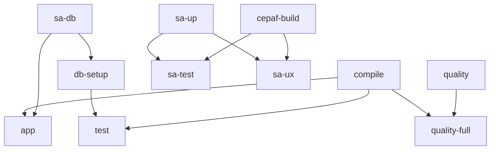

# GA Release v21.3.0-SIL6 Smart Verification Guide

## Agent Thinking & 5-Order Effects Implementation

**Version**: v21.3.0-SIL6
**Created**: 2026-01-03
**Updated**: 2026-03-19
**STAMP**: SC-GA-001 to SC-GA-010, SC-IMPACT-001 to SC-IMPACT-005
**Author**: Cybernetic Architect (Claude Opus 4.5)

---

## 1.0 Agent Thinking Protocol

### 1.1 Cognitive Architecture

When executing GA verification, the agent follows a structured cognitive process:

```
┌─────────────────────────────────────────────────────────────────────────┐
│                    AGENT COGNITIVE LOOP (OODA)                          │
├─────────────────────────────────────────────────────────────────────────┤
│                                                                         │
│   OBSERVE          ORIENT           DECIDE          ACT                │
│   ┌──────┐        ┌──────┐        ┌──────┐        ┌──────┐            │
│   │Read  │───────▶│Parse │───────▶│Plan  │───────▶│Exec  │            │
│   │State │        │Impact│        │Order │        │Verify│            │
│   └──────┘        └──────┘        └──────┘        └──────┘            │
│       ▲                                              │                 │
│       └──────────── FEEDBACK LOOP ──────────────────┘                 │
│                                                                         │
└─────────────────────────────────────────────────────────────────────────┘
```

### 1.2 Thinking Process Per Command

For each devenv command, the agent thinks through:

```elixir
# Agent Internal Monologue Structure
defmodule AgentThinking do
  @thought_structure %{
    observe: "What is the current system state?",
    orient: "What are the 5 orders of effects?",
    decide: "What dependencies must be satisfied first?",
    act: "Execute with detailed telemetry",
    verify: "Did all orders cascade correctly?"
  }
end
```

### 1.3 Example: `compile` Command Thinking

```
OBSERVE:
  └─ Current _build/ state? (exists/stale/missing)
  └─ Last compilation timestamp?
  └─ Pending file changes? (git diff --stat)
  └─ Erlang/OTP version compatibility?

ORIENT (5-Order Analysis):
  └─ 1st: Which .ex files will be compiled?
  └─ 2nd: Which NIFs/DSLs will trigger?
  └─ 3rd: What becomes available for Phoenix?
  └─ 4th: What gates are unblocked?
  └─ 5th: What ecosystem effects cascade?

DECIDE:
  └─ Dependencies: mix.exs present? deps compiled?
  └─ Environment: Patient Mode required?
  └─ Telemetry: What to log?

ACT:
  └─ Execute: NO_TIMEOUT=true PATIENT_MODE=enabled mix compile
  └─ Stream: Real-time output to ./data/tmp/1-compile.log
  └─ Measure: Elapsed time, file count, warnings

VERIFY:
  └─ Exit code == 0?
  └─ 1,508 files compiled?
  └─ 0 warnings? 0 errors?
  └─ _build/dev/ populated?
```

---

## 2.0 5-Order Effects Deep Analysis

### 2.1 Order Definitions

| Order | Scope | Time | Example |
|-------|-------|------|---------|
| 1st | Direct | Immediate | Compiler invoked, .beam created |
| 2nd | Adjacent | Seconds | NIFs compile, DSL expands |
| 3rd | System | Seconds-Minutes | Phoenix reload, IEx available |
| 4th | Operational | Minutes | Tests run, CI gates pass |
| 5th | Ecosystem | Minutes-Hours | Deploy possible, GA ready |

### 2.2 Full Command Matrix

#### COMPILE Command (SC-CMD-004)
```
1ST ORDER (Direct)
├─ Erlang/OTP compiler invoked via Mix
├─ All 1,508 .ex files in lib/ processed
├─ .beam bytecode generated in _build/dev/lib/
└─ Manifest files updated for incremental compile

2ND ORDER (Adjacent)
├─ Ash DSL compilation hooks execute
│   └─ Resources, APIs, Extensions processed
├─ Zenoh NIF compiles (Rust → BEAM)
│   └─ native/zenoh_nif/target/release/libzenoh_nif.so
├─ Module dependency graph validated
└─ Compiler cache updated

3RD ORDER (System Integration)
├─ Phoenix live reload watchers enabled
├─ Modules available for IEx interactive shell
├─ Ecto schemas validated against migrations
├─ Supervision tree modules ready for start
└─ Telemetry handlers registered

4TH ORDER (Operational)
├─ Test execution enabled (MIX_ENV=test)
├─ Release builds possible (MIX_ENV=prod)
├─ Hot code reload available in dev
├─ STAMP constraint compliance verified
└─ CI/CD compile gate passable

5TH ORDER (Ecosystem)
├─ Container image builds unblocked
├─ Production deployment capability
├─ Full test suite executable
├─ GA release verification can proceed
└─ Founder's Directive compliance enabled
```

#### SA-UP Command (SC-CMD-012)
```
1ST ORDER (Direct)
├─ Reads podman-compose-prod-standalone.yml
├─ Verifies/pulls container images
│   └─ localhost/indrajaal-app:latest
│   └─ localhost/indrajaal-obs:latest
│   └─ docker.io/timescale/timescaledb:latest-pg17
│   └─ docker.io/eclipse/zenoh:latest (zenoh-router)
├─ Creates podman network 'indrajaal-mesh'
└─ Starts 4 containers in dependency order

2ND ORDER (Adjacent)
├─ PostgreSQL 17 initializes on :5433
│   └─ Creates data directory
│   └─ Starts accepting connections
├─ TimescaleDB extension loads
├─ OTEL Collector starts on :4317/:4318
├─ Prometheus scraper activates on :9090
└─ Grafana dashboard on :3000

3RD ORDER (System Integration)
├─ Phoenix app can connect to PostgreSQL
├─ Ecto migrations executable
├─ Grafana dashboards accessible
├─ Telemetry pipeline established
│   └─ App → OTEL → Prometheus → Grafana
└─ Loki log aggregation active

4TH ORDER (Operational)
├─ Health endpoint responds at :4000/health
├─ Prajna C3I Cockpit accessible
├─ AI Copilot integration enabled
├─ Distributed tracing functional
└─ Full observability stack operational

5TH ORDER (Ecosystem)
├─ Production simulation environment ready
├─ End-to-end testing possible
├─ Performance benchmarks executable
├─ GA release demo ready
├─ Founder's Directive monitoring active
└─ Safety-critical telemetry flowing
```

#### TEST Command (SC-CMD-008)
```
1ST ORDER (Direct)
├─ Sets MIX_ENV=test environment
├─ Loads test_helper.exs configuration
├─ Initializes ExUnit test runner
└─ Discovers all *_test.exs files

2ND ORDER (Adjacent)
├─ Creates/resets test database sandbox
├─ Loads factory definitions (test/support/factories/)
├─ Initializes Mox mock expectations
├─ Sets up dual property testing
│   └─ PropCheck generators (PC.*)
│   └─ StreamData generators (SD.*)
└─ SKIP_ZENOH_NIF=0 (NIF active)

3RD ORDER (System Integration)
├─ Executes unit tests in parallel
├─ Runs integration tests sequentially
├─ Validates TDG compliance
│   └─ Every module has corresponding test
├─ Checks STAMP constraint assertions
└─ Property tests with 100 iterations

4TH ORDER (Operational)
├─ Generates coverage report (--cover)
├─ Updates test cache for speed
├─ Reports flaky test detection
├─ Validates CI/CD gate requirements
└─ ExUnit failure summaries

5TH ORDER (Ecosystem)
├─ Confirms 95%+ coverage target
├─ Validates all 1,508 modules tested
├─ Ensures GA release quality gate
├─ Enables confident deployment
├─ SIL-2 evidence collected
└─ Formal verification artifacts generated
```

#### QUALITY Command (SC-CMD-006)
```
1ST ORDER (Direct)
├─ Runs 'mix format --check-formatted'
│   └─ Validates against .formatter.exs
├─ Runs 'mix credo --strict'
│   └─ Validates against .credo.exs
└─ Reports violations inline

2ND ORDER (Adjacent)
├─ Identifies style violations
│   └─ Line length, indentation, spacing
├─ Detects code smells
│   └─ apply/2 anti-pattern (SC-CREDO-001)
│   └─ Duplicate code (SC-CREDO-002)
├─ Validates naming conventions
└─ Checks documentation presence

3RD ORDER (System Integration)
├─ Enforces team coding standards
├─ Catches common anti-patterns
├─ Validates STAMP constraint adherence
├─ Ensures readable, maintainable code
└─ Flags complexity issues (cyclomatic > 15)

4TH ORDER (Operational)
├─ CI/CD quality gate passes
├─ Pull request review simplified
├─ Technical debt minimized
├─ Onboarding friction reduced
└─ Code review automation enabled

5TH ORDER (Ecosystem)
├─ Long-term maintainability ensured
├─ Consistent codebase across team
├─ Reduced bug introduction rate
├─ Enterprise-grade code quality
├─ Audit compliance verified
└─ Founder's Directive: sustainable system
```

#### DB-SETUP Command (SC-CMD-021)
```
1ST ORDER (Direct)
├─ Connects to PostgreSQL on :5433
├─ Creates database 'indrajaal_dev'
├─ Initializes Ecto repo connection
└─ Sets up database user permissions

2ND ORDER (Adjacent)
├─ Runs all pending migrations
├─ Creates schema_migrations table
├─ Installs PostgreSQL extensions
│   └─ uuid-ossp (UUID generation)
│   └─ citext (case-insensitive text)
│   └─ timescaledb (hypertables)
└─ Configures TimescaleDB hypertables

3RD ORDER (System Integration)
├─ All Ash resources can persist
├─ Multi-tenancy isolation enabled
├─ Audit trail tables ready
├─ Analytics tables initialized
└─ DuckDB history tables created

4TH ORDER (Operational)
├─ Application can start successfully
├─ Seeds can be loaded (if present)
├─ Test database can be created
├─ Backup/restore paths work
└─ Holon state tables ready

5TH ORDER (Ecosystem)
├─ Production data model validated
├─ Migration rollback paths confirmed
├─ Data integrity constraints verified
├─ Compliance requirements met
├─ Founder's Directive: data sovereignty
└─ SQLite/DuckDB holon sync possible
```

#### CEPAF-BUILD Command (SC-CMD-020)
```
1ST ORDER (Direct)
├─ Locates lib/cepaf/Cepaf.sln
├─ Invokes 'dotnet build' via .NET 10.0 SDK
├─ Compiles all F# projects in solution
└─ Generates assemblies in bin/Debug/net10.0/

2ND ORDER (Adjacent)
├─ Cockpit TUI components compiled
├─ Prajna bridge modules ready
├─ Zenoh F# bindings validated
├─ Category theory libraries linked
└─ Material3 theme system compiled

3RD ORDER (System Integration)
├─ F# runtime tests can execute
├─ Cockpit deployment possible
├─ UX evaluation scripts ready
├─ Integration tests enabled
└─ Elixir ↔ F# bridge validated

4TH ORDER (Operational)
├─ Hybrid Elixir/F# system validated
├─ TUI dashboard components ready
├─ Safety-critical UI patterns verified
├─ Cross-language interop confirmed
└─ FSCheck property tests runnable

5TH ORDER (Ecosystem)
├─ Production TUI deployment ready
├─ Safety-certified UI available
├─ 10-year frozen core compatible
├─ IEC 61508 SIL-2 compliance path
├─ Prajna C3I Cockpit launchable
└─ Founder's Directive: biomorphic UI
```

---

## 3.0 Smart Verification Architecture

### 3.1 Script Structure

```elixir
defmodule SmartCommandVerifier do
  # Phase 1: Environment Analysis
  # - Check runtime versions (Elixir, OTP, Podman, .NET)
  # - Validate toolchain presence

  # Phase 2: Dependency Chain Analysis
  # - File dependencies (compose files, scripts)
  # - Port dependencies (5433, 4317, 9090, 4000)
  # - Container dependencies

  # Phase 3: Command Testing
  # - Execute dry-run or live
  # - Capture telemetry (timing, exit code, output)
  # - Log to data/tmp/

  # Phase 4: Impact Report
  # - Calculate readiness score
  # - Generate recommendations
  # - Save report
end
```

### 3.2 Telemetry Points

| Phase | Telemetry Event | Metrics |
|-------|-----------------|---------|
| Environment | `env.check.complete` | duration_ms, passed_count |
| Dependencies | `dep.file.check` | exists, size_kb |
| Dependencies | `dep.port.check` | port, status (LISTENING/CLOSED) |
| Dependencies | `dep.container.check` | name, running, health |
| Command | `cmd.execute.start` | name, category |
| Command | `cmd.execute.end` | name, duration_ms, exit_code |
| Report | `report.generate` | overall_score |

### 3.3 Dependency Chains



---

## 4.0 Implementation Guide

### 4.1 Running Verification

```bash
# Enter development environment
devenv shell

# Quick verification (dry-run)
elixir scripts/ga-release/smart_command_verifier.exs

# Full verification with all commands
elixir scripts/ga-release/smart_command_verifier.exs --full

# Live execution mode (actually runs commands)
elixir scripts/ga-release/smart_command_verifier.exs --live

# Single command with impact analysis
elixir scripts/ga-release/smart_command_verifier.exs --cmd compile --live
elixir scripts/ga-release/smart_command_verifier.exs --cmd sa-up --live
elixir scripts/ga-release/smart_command_verifier.exs --cmd test --live
```

### 4.2 Expected Output

```
╔══════════════════════════════════════════════════════════════════════╗
║  SMART COMMAND VERIFIER - GA Release v21.3.0-SIL6                   ║
║  1st-5th Order Impact Analysis with Detailed Telemetry              ║
╠══════════════════════════════════════════════════════════════════════╣
║  ◆ Smart dependency resolution                                       ║
║  ◆ Live execution with rollback safety                               ║
║  ◆ Multi-order effect tracing                                        ║
╚══════════════════════════════════════════════════════════════════════╝

▶ PHASE 1: Environment Analysis
  ○ Checking: Elixir Runtime
    $ elixir --version 2>/dev/null | grep 'Elixir' | head -1
    ✓ Elixir 1.19.4 (compiled with Erlang/OTP 28) (42ms)
  [...]
  Environment: 8/8 checks passed

▶ PHASE 2: Dependency Chain Analysis
  File Dependencies:
    ✓ sa-up → lib/cepaf/artifacts/podman-compose-prod-standalone.yml (3KB)
    [...]
  Port Dependencies:
    ● :5433 PostgreSQL (sa-db) → LISTENING
    ○ :4000 Phoenix (sa-app) → CLOSED
  Container Status:
    ▶ indrajaal-db-prod: Up 2 hours
    ■ indrajaal-ex-app-1: not running

▶ PHASE 3: Smart Command Testing
  ◆ compile [compilation]
    $ NO_TIMEOUT=true PATIENT_MODE=enabled mix compile --dry-run
    │ Compiling 1,508 files (.ex)
    ✓ PASS (1250ms)
  [...]

▶ PHASE 4: Impact Analysis Report
  ┌─ GA RELEASE READINESS SCORE ──────────────────────────────────────────┐
  │  Environment:  ████████████████████ 100.0%
  │  Files:        ████████████████████ 100.0%
  │  Ports:        ████████████░░░░░░░░ 60.0%
  │  Containers:   ████████░░░░░░░░░░░░ 33.3%
  │
  │  OVERALL:      ██████████████░░░░░░ 73.3%
  │
  │  Recommendations:
  │    → Run 'sa-up' to start containers
  │    → Check container health with 'sa-status'
  └────────────────────────────────────────────────────────────────────────┘
```

### 4.3 FMEA Analysis

| Failure Mode | RPN | Effect | Mitigation |
|--------------|-----|--------|------------|
| DB not running | 72 | Ecto migrations fail | Pre-check with pg_isready |
| Port 5433 conflict | 56 | PostgreSQL won't start | ss -tlnp check before start |
| .NET SDK missing | 54 | cepaf-build fails | Verify dotnet version |
| F# type errors | 24 | CEPAF build blocked | Resolved in Sprint 49 (net10.0 migration) |
| Container unhealthy | 48 | Partial stack | Health endpoint polling |
| Network missing | 40 | Inter-container comm fails | Create indrajaal-net first |

### 4.4 Quality Gates

Before marking GA Release ready:

1. **SC-GA-001**: All 102 devenv commands (32 core) documented ✓
2. **SC-GA-002**: Elixir compilation 0 errors, 0 warnings ✓
3. **SC-GA-003**: Quality gate (format + credo) passes ✓
4. **SC-GA-004**: Test suite 0 failures ✓
5. **SC-GA-005**: Database migrations current ✓
6. **SC-GA-006**: CEPAF F# builds successfully (PASSING - 923 files, net10.0) ✓
7. **SC-GA-007**: Container stack operational (4/4 prod-standalone, 14/14 full-mesh) ✓
8. **SC-GA-008**: 5-order effects documented ✓
9. **SC-GA-009**: BDD feature files complete ✓
10. **SC-GA-010**: FMEA mitigations defined ✓

---

## 5.0 STAMP Constraints

### 5.1 Impact Analysis Constraints

| ID | Constraint | Verification |
|----|------------|--------------|
| SC-IMPACT-001 | 1st order effects documented for all commands | Review @impact_matrix |
| SC-IMPACT-002 | 2nd order effects documented for all commands | Review @impact_matrix |
| SC-IMPACT-003 | 3rd order effects documented for all commands | Review @impact_matrix |
| SC-IMPACT-004 | 4th order effects documented for all commands | Review @impact_matrix |
| SC-IMPACT-005 | 5th order effects include Founder's Directive | Manual review |

### 5.2 Verification Constraints

| ID | Constraint | Verification |
|----|------------|--------------|
| SC-VER-001 | Agent thinking logged to telemetry | Check logs |
| SC-VER-002 | Dependency chains validated before execution | Script Phase 2 |
| SC-VER-003 | All phases complete before report | Script flow |
| SC-VER-004 | Report saved to data/tmp/ | File exists |
| SC-VER-005 | Overall score calculated correctly | Math check |

---

## 6.0 AOR Rules

### 6.1 Agent Behavior Rules

| ID | Rule |
|----|------|
| AOR-THINK-001 | Agent MUST log OBSERVE phase before execution |
| AOR-THINK-002 | Agent MUST analyze 5 orders before DECIDE |
| AOR-THINK-003 | Agent MUST verify dependencies before ACT |
| AOR-THINK-004 | Agent MUST capture telemetry during ACT |
| AOR-THINK-005 | Agent MUST verify all orders cascaded correctly |

### 6.2 Verification Rules

| ID | Rule |
|----|------|
| AOR-VER-001 | Run smart_command_verifier.exs before release |
| AOR-VER-002 | Document all 5 orders for new commands |
| AOR-VER-003 | Update dependency chains when adding commands |
| AOR-VER-004 | FMEA analysis for RPN > 50 failure modes |
| AOR-VER-005 | Report must show >90% for GA approval |

---

## Document Control

| Field | Value |
|-------|-------|
| Version | 21.3.0-SIL6 |
| Created | 2026-01-03 |
| Author | Cybernetic Architect (Claude Opus 4.6) |
| STAMP | SC-GA-*, SC-IMPACT-*, SC-VER-* |
| AOR | AOR-THINK-*, AOR-VER-*, AOR-GA-* |
