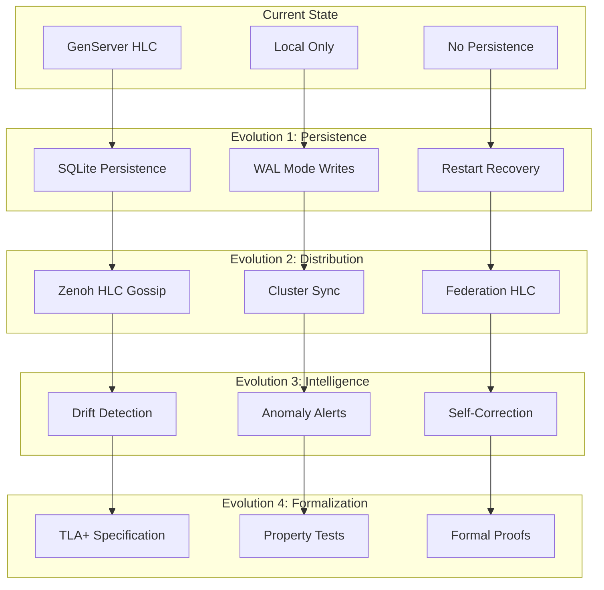

# Hybrid Logical Clock (HLC) Comprehensive System Analysis

**Date**: 2026-01-01T19:00:00+01:00
**Author**: Claude Opus 4.5 (Cybernetic Architect)
**Classification**: L4-THORAX (30-day retention)
**Status**: COMPLETE

---

## Executive Summary

Hybrid Logical Clocks (HLC) are a foundational timing mechanism throughout the Indrajaal system, providing **causal ordering** across distributed components without requiring clock synchronization. This analysis documents current usage, benefits, requirements, expansion opportunities, and evolutionary vectors.

---

## 1. Current HLC Usage Across System

### 1.1 Core Implementations

| Component | Language | Location | Purpose |
|-----------|----------|----------|---------|
| HybridLogicalClock | Elixir | `lib/indrajaal/observability/fractal/hybrid_logical_clock.ex` | Primary GenServer-based HLC |
| HLC Module | Elixir | `lib/indrajaal/observability/fractal/hlc.ex` | Lightweight wrapper/utilities |
| HLC.fs | F# | `lib/cepaf/src/Cepaf/Observability/Fractal/HLC.fs` | F# native implementation |

### 1.2 Components Using HLC

```
HLC DEPENDENCY GRAPH (38 Files in lib/, 10 in test/)
=======================================================

OBSERVABILITY (Core - 8 modules)
├── fractal_control.ex ──► SC-LOG-006 timestamp compliance
├── logger.ex ──► Fractal entry timestamps (L3+)
├── batch_encoder.ex ──► Batch message ordering
├── content_router.ex ──► Event sequencing
├── write_filter.ex ──► Time-sensitive filtering
├── otel_integration.ex ──► OTEL span correlation
├── supervisor.ex ──► Agent health timestamps
└── hlc.ex ──► Utility wrapper

EVENT SOURCING (2 modules)
├── event_store.ex ──► Append-only event timestamps
└── time_travel.ex ──► Temporal navigation/replay

DISTRIBUTED (3 modules)
├── fqun.ex ──► Unique instance IDs (HLC ⊕ RandomSuffix)
├── kpi_dashboard_agent.ex ──► Metric timestamps
└── fractal_agent.ex ──► Agent coordination

KMS (Knowledge Management - 1 module)
└── kms.ex ──► Knowledge artifact versioning

CEPAF F# (10 modules)
├── HLC.fs ──► Native F# implementation
├── ZenohFractalPublisher.fs ──► Cross-language HLC
├── OTELIntegration.fs ──► Tracing correlation
├── FractalControl.fs ──► Level management
├── WriteFilter.fs ──► Filtering
├── BatchEncoder.fs ──► Encoding
├── Types.fs ──► Type definitions
├── DomainUnits.fs ──► Unit types
└── Tests (3 files) ──► Property testing
```

### 1.3 How HLC Is Used

#### 1.3.1 Fractal Logging (Primary Usage)
```elixir
# lib/indrajaal/observability/fractal/logger.ex:63
@type fractal_entry :: %{
  key: String.t(),
  hlc: HLC.timestamp(),    # ◄── HLC REQUIRED for L3+
  level: fractal_level(),
  ...
}

# SC-LOG-006: L3+ logs MUST use HLC timestamps
# L1-L2: Optional (high-volume, low-importance)
# L3-L5: Mandatory (business flows, critical events)
```

#### 1.3.2 FQUN Instance IDs (Distributed Identity)
```elixir
# lib/indrajaal/distributed/fqun.ex:49
# Instance := HLCTimestamp ⊕ RandomSuffix
#
# Example: intelitor/agent/domain/cybernetic/ooda_controller@node#1735750800000.42

defp generate_instance_id do
  case HLC.now() do
    {:ok, {physical, logical}} -> "#{physical}.#{logical}"
    _ -> "#{System.system_time(:millisecond)}.0"
  end
end
```

#### 1.3.3 Event Sourcing (Causality)
```elixir
# lib/indrajaal/cybernetic/event_sourcing/event_store.ex:22
# E = {id, stream, type, data, metadata, hlc_timestamp, causal_deps}
#
# Causal ordering: event₁ → event₂ ⟺ hlc(event₁) < hlc(event₂)
```

#### 1.3.4 Time Travel Navigation
```elixir
# lib/indrajaal/cybernetic/event_sourcing/time_travel.ex:36
@type time_point ::
  {:version, non_neg_integer()} |
  {:hlc, non_neg_integer()} |    # ◄── HLC-based navigation
  {:datetime, DateTime.t()}
```

---

## 2. Benefits of HLC

### 2.1 Primary Benefits

| Benefit | Description | Constraint |
|---------|-------------|------------|
| **Causal Ordering** | Events ordered by causality, not wall-clock | SC-EVT-002 |
| **No NTP Dependency** | Works without synchronized clocks | SC-DIST-005 |
| **Collision-Free IDs** | Globally unique with {physical, logical, node} | SC-DIST-001 |
| **Sub-Millisecond Resolution** | Logical counter handles rapid events | - |
| **Distributed Sync** | `update/1` merges remote timestamps | AOR-HLC-001 |
| **Deterministic Replay** | Enables time-travel debugging | SC-TT-001 |

### 2.2 Mathematical Properties

```
FORMAL SPECIFICATION:
======================

HLC := (physical, logical, node_id)

where:
  physical ∈ ℕ (milliseconds since epoch)
  logical ∈ ℕ (counter for same physical time)
  node_id ∈ String (machine identifier)

ORDERING RELATION:
  hlc₁ < hlc₂ ⟺
    physical(hlc₁) < physical(hlc₂) ∨
    (physical(hlc₁) = physical(hlc₂) ∧ logical(hlc₁) < logical(hlc₂)) ∨
    (physical(hlc₁) = physical(hlc₂) ∧ logical(hlc₁) = logical(hlc₂) ∧
     node_id(hlc₁) < node_id(hlc₂))

MONOTONICITY INVARIANT:
  ∀ t₁, t₂: t₁ < t₂ ⟹ now(t₁) < now(t₂)

CAUSALITY PRESERVATION:
  send(m) → receive(m) ⟹ hlc(send) < hlc(receive)
```

### 2.3 Comparison with Alternatives

| Mechanism | Pros | Cons | Use Case |
|-----------|------|------|----------|
| **Wall Clock** | Simple, universal | Clock skew, NTP dependency | Human-readable timestamps |
| **Lamport Clock** | Causal ordering | No physical time, counter-only | Simple causality |
| **Vector Clock** | True concurrency detection | O(n) space per message | Small clusters |
| **HLC** | Physical + causal, O(1) space | Slightly more complex | **Distributed systems** |

---

## 3. Requirements for HLC to Function Correctly

### 3.1 Infrastructure Requirements

```
REQUIRED INFRASTRUCTURE:
=========================

1. GenServer Process (Elixir)
   └── lib/indrajaal/observability/fractal/hybrid_logical_clock.ex
   └── Started in Application.start/2 or Supervisor

2. Thread-Safe State (F#)
   └── lib/cepaf/src/Cepaf/Observability/Fractal/HLC.fs
   └── lock state.Lock for all operations

3. Clock Source
   └── System.system_time(:millisecond) in Elixir
   └── DateTimeOffset.UtcNow.ToUnixTimeMilliseconds() in F#

4. Network Transport (for distributed sync)
   └── Zenoh pub/sub for HLC propagation
   └── Phoenix PubSub for local cluster
```

### 3.2 Operational Requirements

| Requirement | Constraint | Verification |
|-------------|------------|--------------|
| **Monotonicity** | HLC MUST never decrease | AOR-HLC-001 |
| **Performance** | Generation < 1ms | SC-DIST-005 |
| **Persistence** | Survive node restart | AOR-HLC-002 |
| **Fallback** | Graceful degradation if GenServer down | Implemented |
| **Drift Tolerance** | Accept up to 1 hour clock drift | Configurable |

### 3.3 STAMP Constraints

```
SC-DIST-005: HLC generation MUST complete < 1ms
SC-DIST-010: FQUN MUST contain HLC timestamp
SC-LOG-006: L3+ logs MUST use HLC timestamps
SC-EVT-003: HLC timestamps MUST be monotonic
SC-TT-001: Time travel MUST be deterministic (HLC-based)
```

### 3.4 AOR Rules

```
AOR-HLC-001: HLC MUST be monotonically increasing
AOR-HLC-002: HLC MUST survive node restart via persistence
AOR-HLC-003: HLC update() MUST be called on message receive
AOR-HLC-004: HLC drift > 1 hour SHOULD trigger alert
```

---

## 4. Additional Components That Can Use HLC

### 4.1 Currently Not Using HLC (Candidates)

```
HIGH VALUE CANDIDATES:
======================

1. ALARMS DOMAIN
   └── lib/indrajaal/alarms/*.ex
   └── Alarm creation, acknowledgement, resolution timestamps
   └── BENEFIT: Causal ordering of alarm state transitions

2. ACCESS CONTROL EVENTS
   └── lib/indrajaal/access_control/*.ex
   └── Entry/exit events, credential scans
   └── BENEFIT: Anti-passback verification with causality

3. VIDEO ANALYTICS
   └── lib/indrajaal/video/*.ex
   └── Frame timestamps, detection events
   └── BENEFIT: Multi-camera event correlation

4. AUDIT TRAIL
   └── lib/indrajaal/compliance/audit_log.ex
   └── Compliance events, regulatory timestamps
   └── BENEFIT: Tamper-evident audit chain

5. MESH COORDINATION
   └── lib/indrajaal/mesh/*.ex
   └── State teleportation, node discovery
   └── BENEFIT: Consistent distributed state

6. OBAN JOBS
   └── Job scheduling, execution ordering
   └── BENEFIT: Distributed job queue ordering

7. GUARDIAN SAFETY KERNEL
   └── lib/indrajaal/safety/guardian.ex
   └── Safety event sequence
   └── BENEFIT: Provable safety event ordering

8. IMMUTABLE REGISTER
   └── lib/indrajaal/core/holon/immutable_register.ex
   └── Block timestamps
   └── BENEFIT: Blockchain-like causal chain
```

### 4.2 Integration Patterns

```elixir
# Pattern 1: Direct HLC Usage
alias Indrajaal.Observability.Fractal.HybridLogicalClock, as: HLC

def create_alarm(params) do
  {:ok, hlc} = HLC.now()
  %Alarm{
    id: generate_id(),
    created_hlc: hlc,
    ...
  }
end

# Pattern 2: Event Sourcing Integration
def append_event(stream, type, data) do
  {:ok, hlc} = HLC.now()
  EventStore.append(stream, type, data, hlc_timestamp: hlc)
end

# Pattern 3: Distributed Sync
def receive_message(msg) do
  remote_hlc = msg.hlc
  {:ok, local_hlc} = HLC.update(remote_hlc)
  process(msg, local_hlc)
end
```

---

## 5. Evolutionary Vectors and System Behavior Improvements

### 5.1 Current Limitations

```
IDENTIFIED LIMITATIONS:
=======================

1. NO PERSISTENCE
   └── HLC state lost on restart
   └── Risk: Counter reset, potential ordering gaps
   └── Solution: Persist to SQLite on each tick

2. NO DRIFT DETECTION
   └── Clock skew not monitored
   └── Risk: Large drift causes ordering anomalies
   └── Solution: Compare with NTP, alert on drift

3. SINGLE-NODE ONLY
   └── No cluster-wide HLC coordination
   └── Risk: Concurrent events on different nodes
   └── Solution: Zenoh-based HLC gossip

4. NO BOUNDED BUFFER
   └── Logical counter unbounded
   └── Risk: Integer overflow (theoretical)
   └── Solution: Wrap at 2^16, increment physical

5. ELIXIR/F# DIVERGENCE
   └── Separate implementations
   └── Risk: Subtle behavioral differences
   └── Solution: Shared specification, cross-tests
```

### 5.2 Evolutionary Vectors



### 5.3 Specific Improvements

#### 5.3.1 HLC Persistence (High Priority)
```elixir
# Proposed: Persist HLC on each tick to SQLite
defmodule Indrajaal.Observability.Fractal.HLC.Persistence do
  use GenServer

  @persist_interval 1000  # 1 second

  def handle_info(:persist, state) do
    # Write to SQLite in WAL mode
    SQLite.execute(state.db,
      "INSERT INTO hlc_state (physical, logical, node) VALUES (?, ?, ?)",
      [state.physical, state.logical, state.node])

    Process.send_after(self(), :persist, @persist_interval)
    {:noreply, state}
  end

  def init(_) do
    # Recover from SQLite on startup
    case SQLite.query("SELECT MAX(physical), MAX(logical) FROM hlc_state") do
      [{physical, logical}] ->
        {:ok, %{physical: physical, logical: logical + 1}}
      _ ->
        {:ok, %{physical: System.system_time(:millisecond), logical: 0}}
    end
  end
end
```

#### 5.3.2 Distributed HLC Sync (Medium Priority)
```elixir
# Proposed: Zenoh-based HLC gossip
defmodule Indrajaal.Observability.Fractal.HLC.DistributedSync do
  @zenoh_topic "intelitor/hlc/gossip"
  @gossip_interval 5000  # 5 seconds

  def gossip_hlc() do
    {:ok, local_hlc} = HLC.now()
    ZenohSession.publish(@zenoh_topic, encode(local_hlc))
  end

  def receive_gossip(remote_hlc) do
    # Merge remote HLC to maintain causality
    HLC.update(decode(remote_hlc))
  end
end
```

#### 5.3.3 Drift Detection (Medium Priority)
```elixir
# Proposed: Monitor clock drift
defmodule Indrajaal.Observability.Fractal.HLC.DriftMonitor do
  @max_drift_ms 3_600_000  # 1 hour
  @check_interval 60_000   # 1 minute

  def check_drift() do
    {:ok, {physical, _}} = HLC.now()
    wall_clock = System.system_time(:millisecond)
    drift = abs(physical - wall_clock)

    if drift > @max_drift_ms do
      Logger.error("[HLC] Clock drift detected: #{drift}ms")
      :telemetry.execute([:hlc, :drift, :alert], %{drift_ms: drift})
    end
  end
end
```

#### 5.3.4 Formal Verification (Low Priority)
```
# Proposed: TLA+ Specification
---- MODULE HybridLogicalClock ----
EXTENDS Integers, Sequences

CONSTANTS Nodes, MaxLogical

VARIABLES physical, logical, messages

TypeInvariant ==
  /\ physical \in [Nodes -> Nat]
  /\ logical \in [Nodes -> 0..MaxLogical]

Monotonicity ==
  \A n \in Nodes:
    []( physical'[n] >= physical[n] \/
        (physical'[n] = physical[n] /\ logical'[n] > logical[n]) )

CausalOrdering ==
  \A m \in messages:
    m.send_hlc < m.receive_hlc

====
```

### 5.4 System Behaviors Improved by HLC Evolution

| Behavior | Current | With HLC Evolution |
|----------|---------|-------------------|
| **Alarm Correlation** | Wall-clock based | Causal chain with HLC |
| **Audit Immutability** | Timestamp ordering | Provable causal sequence |
| **Distributed State** | Eventual consistency | Causal consistency |
| **Time Travel Debug** | Version-based only | HLC + causality navigation |
| **Multi-Node Events** | Potential misordering | Guaranteed causal order |
| **Compliance Proof** | Timestamp evidence | Mathematical causality proof |

---

## 6. Implementation Roadmap

### Phase 1: Persistence (P0)
- Add SQLite persistence for HLC state
- Implement restart recovery
- Add checkpoint/restore

### Phase 2: Distribution (P1)
- Zenoh HLC gossip protocol
- Cluster-wide sync
- Federation support

### Phase 3: Monitoring (P1)
- Drift detection
- Anomaly alerting
- Metrics dashboard

### Phase 4: Expansion (P2)
- Alarms domain integration
- Access control integration
- Immutable register integration

### Phase 5: Formalization (P3)
- TLA+ specification
- Property-based tests
- Formal proofs

---

## 7. STAMP Constraints Summary

| ID | Constraint | Status |
|----|------------|--------|
| SC-DIST-005 | HLC generation < 1ms | Implemented |
| SC-DIST-010 | FQUN contains HLC | Implemented |
| SC-LOG-006 | L3+ logs use HLC | Implemented |
| SC-EVT-003 | HLC monotonic | Implemented |
| SC-TT-001 | Deterministic time travel | Implemented |
| SC-HLC-001 | HLC persistence | **TODO** |
| SC-HLC-002 | Distributed sync | **TODO** |
| SC-HLC-003 | Drift monitoring | **TODO** |

---

## 8. Conclusion

HLC is a **critical infrastructure component** providing causal ordering throughout the Indrajaal distributed system. Current implementation covers observability, event sourcing, FQUN generation, and time travel. Key evolutionary vectors include:

1. **Persistence** - Survive restarts without ordering gaps
2. **Distribution** - Cluster-wide causal consistency
3. **Monitoring** - Drift detection and alerting
4. **Expansion** - Alarms, access control, audit trail
5. **Formalization** - TLA+ proofs for safety-critical guarantees

The polyglot implementation (Elixir + F#) ensures HLC is available across the full stack, with Zenoh providing the distribution backbone.

---

**References**:
- Lamport, L. (1978). "Time, Clocks, and the Ordering of Events"
- Kulkarni et al. (2014). "Logical Physical Clocks and Consistent Snapshots"
- Zenoh Protocol Specification (2024)

**STAMP Compliance**: SC-DIST-*, SC-LOG-006, SC-EVT-*, SC-TT-001
**Framework**: SOPv5.11 + STAMP + TDG
