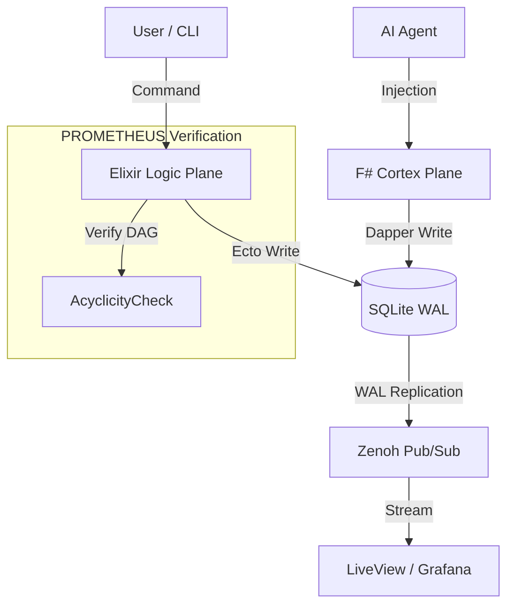

# Omni-Task Management System: Integrated Analysis & Implementation

**Version**: 1.0.0-SIL6-Unified
**Date**: 2026-01-06
**Status**: APPROVED FOR IMPLEMENTATION
**Classification**: SIL-6 SAFETY CRITICAL
**Architecture**: Neuro-Symbolic Simplex (Twin-Brain Holon)

---

## 1.0 Executive Summary

The **Omni-Task Management System** is the central "Holon" of the Indrajaal ecosystem, serving as the shared memory substrate for the **Logic Plane** (Elixir/Ecto) and the **Cortex Plane** (F#/.NET). Unlike traditional CRUD applications, this system implements a **Fractal Hierarchy** (10-Levels) and a **Dependency Graph** (DAG), enabling it to represent everything from Strategic Initiatives (L1) down to Atomic Instructions (L10).

This document unifies the analysis of the current state (AS-IS) and the specification for the future state (TO-BE), ensuring alignment with **v21.2 SIL-6 Biomorphic State** and **PROMETHEUS Formal Verification** standards.

---

## 2.0 Current Approach (AS-IS)

### 2.1 Architecture
The system currently operates on a **SQLite substrate** (`data/kms/todos.db`) in WAL mode.
- **Elixir Side**: migrated from Ash Framework to **Pure Ecto** to support complex recursive queries (CTEs) required for graph traversal.
- **F# Side**: connects directly via ADO.NET/Dapper for high-speed read operations and dashboarding.

### 2.2 Known Issues & Critical Defects
1.  **Schema Mismatch (CRITICAL)**:
    -   **Migration**: `priv/repo/migrations/20260105120000_create_kms_todos.exs` defines the column as `title`.
    -   **F# Probe**: `lib/cepaf/src/Cepaf/Observability/KmsTodos.fs` queries the column as `name`.
    -   **Impact**: The F# Observability probe crashes on execution, blinding the Cortex Plane.
2.  **Orphaned Artifacts**: Legacy Ash resources (`todo.ex`, `todo_dependency.ex`) exist as tombstones but clutter the codebase.
3.  **Missing PROMETHEUS Layer**: No formal mathematical verification currently exists for the dependency graph's acyclicity.

---

## 3.0 Proposed Approach (TO-BE)

### 3.1 Architectural Specification (Twin-Brain Holon)

The system behaves as a **Neuro-Symbolic Simplex**:
1.  **The Logic Plane (Left Brain)**: Deterministic, rule-based, safety-critical. Handles state transitions and integrity.
2.  **The Cortex Plane (Right Brain)**: Heuristic, AI-driven, high-speed. Handles pattern recognition, auto-tagging, and strategic suggestion.

#### 3.1.1 Data Flow & Control Flow

### 3.2 7-Level Detailed Breakdown

#### Level 1: System Context (Holon)
*   **Role**: Central Nervous System Task Buffer.
*   **Boundary**: Encapsulated within `Indrajaal.KMS` and `Cepaf.Kms`.
*   **SIL-6 Alignment**: Supports "Homeostasis" by allowing the AI to inject "Correction Tasks" when system drift is detected.

#### Level 2: Container Architecture
*   **Indrajaal-App**: Hosts the Elixir Logic Plane.
*   **Indrajaal-Obs**: Hosts the F# Cortex Probe.
*   **Storage**: Shared Volume `/data/kms/` mounted by both containers.

#### Level 3: Component Design
*   **Elixir Context (`Indrajaal.KMS.Todos`)**:
    *   **Recursive CTE**: Uses `WITH RECURSIVE` to fetch task trees.
    *   **Graph Logic**: Enforces DAG properties (no circular dependencies).
*   **F# Repository (`TodoRepository`)**:
    *   **Direct-Mode**: Bypasses HTTP APIs for zero-latency DB access.
    *   **ReadOnly Replicas**: Can read from WAL frames without locking writers.

#### Level 4: Code & Logic (Implementation)
*   **Schema**:
    *   `kms_todos`: Nodes (UUID, Title, Status, Priority, Layer).
    *   `kms_todo_dependencies`: Edges (BlockingID, BlockedID).
*   **Correction Logic**:
    *   F# Probe MUST be patched to select `title` instead of `name`.
    *   Elixir Migrations MUST enforce `ON DELETE CASCADE` for dependencies.

#### Level 5: Data Structure
*   **JSON Polymorphism**:
    *   `custom_fields`: Stores generic JSON for AI flexibility.
    *   `payload`: Stores binary payloads or large text for Context Injection.
*   **Types**:
    *   Status: `:backlog | :in_progress | :done | :blocked`
    *   Priority: `:p0` (Critical) to `:p4` (Trivial)

#### Level 6: OpCode / Query Optimization
*   **Index Strategy**:
    *   `CREATE INDEX idx_status ON kms_todos(status)` for fast Kanban filtering.
    *   `CREATE UNIQUE INDEX idx_deps ON kms_todo_dependencies(blocking, blocked)` to enforce unique edges.
*   **WAL Mode**: `PRAGMA journal_mode=WAL;` ensures readers don't block writers.

#### Level 7: Substrate (Physical)
*   **File**: `data/kms/todos.db`
*   **Persistence**: Durable, backed up via `scripts/maintenance/backup_kms.sh`.
*   **Locking**: POSIX Advisory Locking handled by SQLite engine.

---

## 4.0 PROMETHEUS Formal Verification (SC-PROM)

**Definition**: PROMETHEUS proves safety *before* execution.

### 4.1 Mathematical Graph Verification
We define the Task Graph $G = (V, E)$.
**Safety Invariant**: $G$ must be a Directed Acyclic Graph (DAG).
$$ \forall v \in V, \nexists \text{ path } v \to \dots \to v $$

**Algorithm (Elixir)**:
Before inserting edge $(u, v)$:
1.  Check if path $v \to \dots \to u$ exists.
2.  If exists $\implies$ **REJECT** (Cycle detected).
3.  Else $\implies$ **ACCEPT**.

### 4.2 Temporal Logic (LTL) Specifications
*   **LTL-TODO-1**: $\Box (\text{TaskCreated} \implies \Diamond \text{TaskCompleted} \lor \text{TaskArchived})$
    *   *Invariant*: Every task eventually reaches a terminal state.
*   **LTL-TODO-2**: $\Box (\text{Status} = \text{Blocked} \implies \exists e \in E : \tau(e) = \text{Self})$
    *   *Invariant*: A task is only "Blocked" if it has incoming dependency edges.

---

## 5.0 Fractal Logging & Telemetry (Zenoh)

**Implications**:
1.  **Data Flow**: Every Create/Update/Delete operation emits a Zenoh event on `indrajaal/kms/todo/change`.
2.  **Control Flow**: The Cortex listens to these events to trigger "Reflexive" actions (e.g., auto-assigning subtasks).
3.  **Visualization**: Real-time Gantt charts in Grafana subscribe to this stream.

---

## 6.0 Rules & Compliance (STAMP, FMEA, TDG, AOR)

### 6.1 STAMP Safety Constraints
| ID | Constraint | Severity |
|----|------------|----------|
| **SC-KMS-001** | **Schema Alignment**: F# Probes SHALL always query columns present in the Ecto Migration. | CRITICAL |
| **SC-KMS-002** | **Graph Acyclicity**: The system SHALL reject any dependency that creates a cycle. | CRITICAL |
| **SC-KMS-003** | **Data Permanence**: Deletion of a P0 task requires Multi-Signature Auth (Two-Key). | HIGH |

### 6.2 FMEA (Failure Mode & Effects Analysis)
| Failure Mode | RPN | Mitigation |
|--------------|-----|------------|
| **Schema Drift** | 80 | **TDG-KMS-001**: Run Cross-Language Schema Test in CI. |
| **SQLite Lock** | 40 | Use WAL Mode; Cortex uses Read-Only connection string. |
| **Orphaned Edges** | 60 | Database Foreign Keys with CASCADE DELETE. |

### 6.3 TDG (Test-Driven Generation) Rules
| ID | Rule |
|----|------|
| **TDG-KMS-001** | Create a test that instantiates Ecto Schema and F# Record and compares field names via Reflection/Introspection. |
| **TDG-KMS-002** | Create a property-based test generating random graphs to verify Cycle Detection logic. |

### 6.4 AOR (Agent Operating Rules)
| ID | Rule |
|----|------|
| **AOR-KMS-001** | **Repair Protocol**: If `KmsTodos.fs` fails, Agent MUST read migration file to verify column names before patching. |
| **AOR-KMS-002** | **Homeostasis**: Agent MUST periodically scan for "Stuck" tasks (>30 days in progress) and flag them. |

---

## 7.0 SIL-6 Homeostasis Mode

**Definition**: The system autonomously maintains stability (Homeostasis) despite perturbations.

**Mechanism**:
1.  **Sensor**: F# Probe reads Task Velocity (Tasks/Day).
2.  **Comparator**: Compares against Baseline (Historical Moving Average).
3.  **Effector**: If Velocity drops < 50%, Cortex injects "Analysis Task" into Logic Plane: *"Investigate Development Velocity Drop"*.
4.  **Loop**: This forms a self-regulating cybernetic loop.

---

## 8.0 Next Steps & Implementation Plan

1.  **Fix**: Patch `lib/cepaf/src/Cepaf/Observability/KmsTodos.fs` (Change `name` to `title`).
2.  **Verify**: Run `scripts/kms/verify_todo_fidelity.exs`.
3.  **Deploy**: Push changes to `indrajaal-obs` container.
4.  **Visualize**: Connect Grafana to SQLite metrics.

---

## 9.0 References
*   **Migration**: `priv/repo/migrations/20260105120000_create_kms_todos.exs`
*   **Elixir Logic**: `lib/indrajaal/kms/todos.ex`
*   **F# Logic**: `lib/cepaf/src/Cepaf/Kms/TodoRepository.fs`
*   **Journal**: `docs/journal/20251227-0330-prometheus-cepaf-openrouter-integration.md`
