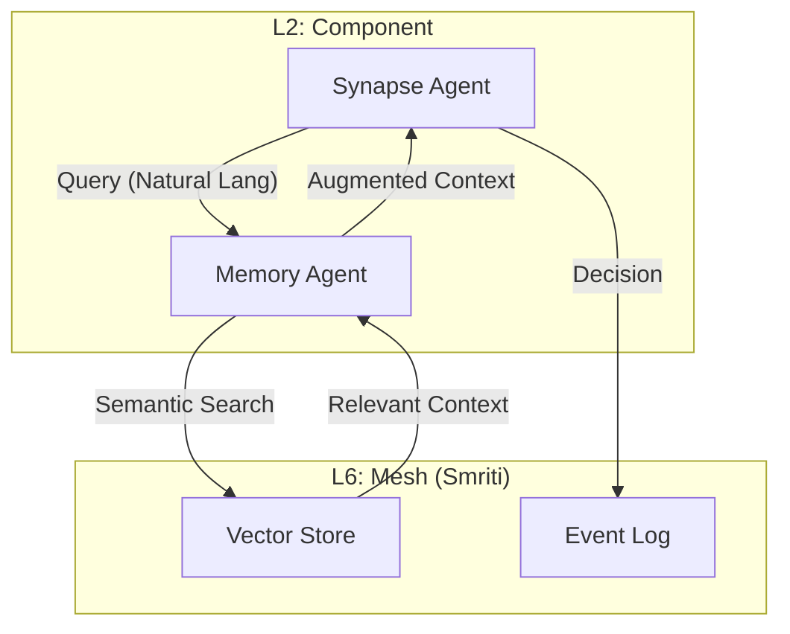

# PRAJNA PHASE 5: THE COGNITIVE FABRIC (STRATEGY & EXECUTION)
**Classification**: STRATEGIC EXECUTION PLAN
**Status**: ACTIVE
**Phase**: 5 (L1-L3)
**Criticality**: P1 (HIGH)
**Date**: 2026-01-15

---

## 1.0 STRATEGIC INTENT
**"Memory is Intelligence"**

Phase 5 transforms the Prajna Cockpit from a "Smart Agent" (Synapse) to a "Wise Agent" by integrating **Long-Term Memory (Smriti)**. This enables **RAG (Retrieve-Augment-Generate)** workflows, allowing the AI to ground its decisions in historical data, reducing hallucinations and increasing context-awareness.

**Core Objective**: Implement a `MemoryAgent` that indexes system events and providing a semantic search interface for `Synapse`.

---

## 2.0 CRITICALITY & RISK ANALYSIS (FMEA)

### 2.1 Criticality: HIGH (P1)
*   **Why**: Without memory, the AI is amnesic. It cannot learn from past mistakes (Guardian vetos) or reference architectural docs.
*   **Impact**: Low accuracy, repetitive errors, high token costs (re-explaining context).

### 2.2 Failure Modes (Risk Matrix)
| Failure Mode | Severity | Probability | Detection | Mitigation |
| :--- | :--- | :--- | :--- | :--- |
| **Hallucination** | HIGH | MEDIUM | Guardian | **Grounding**: Inject retrieved context into prompts. |
| **Memory Corruption** | HIGH | LOW | Checksums | **Immutable Ledger**: Append-only event log. |
| **Retrieval Latency** | MEDIUM | HIGH | OODA Timer | **Vector Cache**: In-memory hot/cold tiering. |
| **Token Explosion** | MEDIUM | HIGH | Cost Audit | **Context Pruning**: Summarize retrieved data before injection. |

---

## 3.0 ARCHITECTURE (COGNITIVE FABRIC)

### 3.1 The Memory Agent
*   **Role**: Librarian of the system.
*   **Interface**: `Remember(Fact)`, `Recall(Query)`, `Forget(Id)`.
*   **Backend**: For Phase 5, we use a **Simple Vector Mock** (Cosine Similarity on Keyword Embeddings) to prove the architecture without heavy deps (Faiss/Qdrant). *Real embedding integration moves to Phase 7.*

---

## 4.0 EXECUTION PLAN (10x10 ALIGNED)

### 4.1 Step 1: Define Memory Domain (L1)
*   Create `MemoryTypes.fs`: `MemoryItem`, `Vector`, `RecallRequest`.
*   Define `IMemoryStore` interface.

### 4.2 Step 2: Implement Memory Agent (L2)
*   Create `MemoryAgent.fs`: MailboxProcessor managing the store.
*   Implement "Keyword Embedding" (Hash-based or simple frequency) for MVP.

### 4.3 Step 3: Wire Synapse (L3)
*   Update `Synapse.fs`:
    *   Before `SuggestFix`, call `MemoryAgent.Recall(error)`.
    *   Inject `RecallResult` into OpenRouter `SystemPrompt`.

### 4.4 Step 4: Verification (L9)
*   Update `Phase3Verification.fs` to `Phase5Verification.fs`.
*   **Test Case**: "The Amnesia Test".
    1.  Teach system: "Error 500 means DB is down."
    2.  Query system: "I see Error 500."
    3.  Expectation: "Based on memory, DB is down."

---

## 5.0 NEXT STEPS
1.  Implement `MemoryTypes.fs`.
2.  Implement `MemoryAgent.fs`.
3.  Integrate with `Synapse`.
4.  Run Verification.
