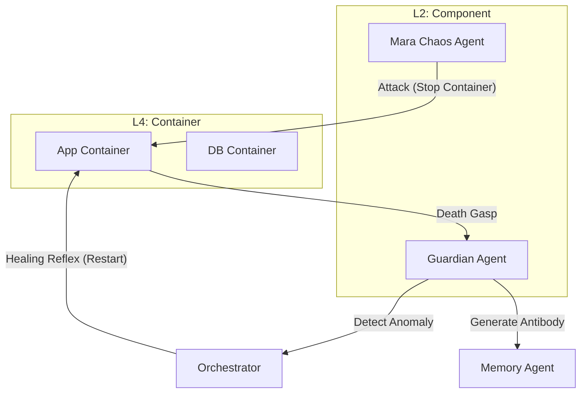

# PRAJNA PHASE 6: THE IMMUNE RESPONSE (STRATEGY & EXECUTION)
**Classification**: SAFETY-CRITICAL EXECUTION PLAN
**Status**: ACTIVE
**Phase**: 6 (L4-L6)
**Criticality**: P0 (CRITICAL)
**Date**: 2026-01-15

---

## 1.0 STRATEGIC INTENT
**"Anti-Fragility through Controlled Chaos"**

Phase 6 implements the **Immune System** of Indrajaal. It moves the system from "Safety" (preventing known bad actions) to "Resilience" (recovering from unknown failures). By introducing a Chaos Agent (`Mara`), we force the system to exercise its healing reflexes in a controlled environment.

**Core Objective**: Implement the `Mara` Chaos Agent and the `Antibody` logic in `Guardian` to detect and mitigate recurring failure patterns.

---

## 2.0 CRITICALITY & RISK ANALYSIS (FMEA)

### 2.1 Criticality: CRITICAL (P0)
*   **Why**: A system that cannot survive its own failure is fragile. Chaos engineering is the only way to verify SIL-6 biomorphic resilience.
*   **Impact**: Prevents cascading failures, ensures HA (High Availability) targets are met.

### 2.2 Failure Modes (Risk Matrix)
| Failure Mode | Severity | Probability | Detection | Mitigation |
| :--- | :--- | :--- | :--- | :--- |
| **Runaway Chaos** | CRITICAL | LOW | Guardian | **Kill Switch**: Mara MUST have a hard-coded lease/timeout. |
| **False Positive Defense** | HIGH | MEDIUM | Orchestrator | **Quorum**: Immune response requires 2oo3 agent consensus. |
| **Resource Exhaustion** | MEDIUM | HIGH | Metrics | **Rate Limiting**: Limit chaos events per hour. |

---

## 3.0 ARCHITECTURE (IMMUNE SYSTEM)

### 3.1 The Mara Agent (Chaos Monkey)
*   **Role**: The "Infection".
*   **Actions**: `StopContainer`, `SimulateLatency`, `CorruptState`.
*   **Safety**: Only operates on non-critical nodes in Shadow Mode.

### 3.2 The Antibody Logic
*   **Role**: The "Memory of the Immune System".
*   **Mechanism**: When a specific failure pattern repeats, `Guardian` generates an `Antibody` (a temporary, strict rule) to block the stimulus or pre-emptively mitigate it.

---

## 4.0 EXECUTION PLAN (10x10 ALIGNED)

### 4.1 Step 1: Implement Mara Agent (L2)
*   Create `MaraAgent.fs`: Uses `Podman` FFI to perturb the system.
*   Define `ChaosEvent` types.

### 4.2 Step 2: Enhance Guardian with Antibodies (L3)
*   Update `Safety.fs`: 
    *   Add `Antibody` storage.
    *   Implement `DetectPattern` logic.

### 4.3 Step 3: Implement Healing Reflex (L4)
*   Update `Orchestrator.fs`:
    *   Listen for `ContainerExited` events via Zenoh.
    *   Issue `Restart` command if the node is in the `HA_SET`.

### 4.4 Step 4: Verification (L9)
*   Create `Phase6Verification.fs`.
*   **Test Case**: "The Hydra Test".
    1.  Mara kills Node A.
    2.  System detects and restarts Node A.
    3.  Guardian recognizes Mara's pattern and blocks the next attack.

---

## 5.0 NEXT STEPS
1.  Implement `MaraAgent.fs`.
2.  Enhance `Safety.fs` (Antibodies).
3.  Implement Healing logic in `Orchestrator.fs`.
