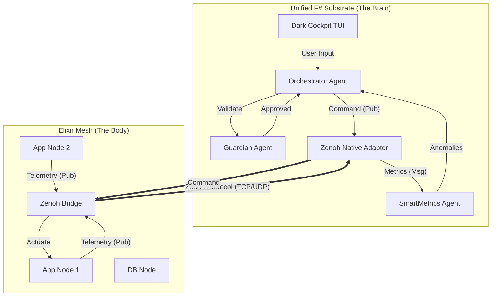

# PRAJNA MIGRATION PHASE 2: NERVOUS SYSTEM INTEGRATION
**Classification**: SAFETY-CRITICAL SPECIFICATION
**Status**: DRAFT
**Version**: 2.0.0 (Phase 2)
**Date**: 2026-01-15

---

## 1.0 LEVEL 1: CONCEPT & STRATEGIC INTENT
**"Connecting the Brain to the Body"**

With the **Cognitive Kernel** (Orchestrator, Safety, Metrics) successfully ported to the Unified F# Substrate (Phase 1), the "Brain" is currently isolated in a box. Phase 2 aims to establish the **Nervous System**—a high-performance, real-time data link between the F# Cockpit and the distributed Elixir Mesh using **Zenoh**.

**Core Objectives:**
1.  **Zero-Copy Telemetry**: Ingest high-volume sensor data from Elixir nodes directly into F# `SmartMetrics` without serialization overhead.
2.  **Command Actuation**: Enable the F# `Orchestrator` to push safety-critical commands (ARM/FIRE) to Elixir actuators via the mesh.
3.  **State Synchronization**: Real-time replication of the `KMS` (Knowledge Management System) state into the Cockpit.

---

## 2.0 LEVEL 2: SPECIFICATION (REQUIREMENTS)

### 2.1 Performance Requirements
*   **REQ-PERF-001**: End-to-End Latency (Sensor $\to$ F# UI) SHALL be $< 5ms$.
*   **REQ-PERF-002**: Throughput SHALL support $> 10,000$ telemetry messages/sec per node.
*   **REQ-PERF-003**: The F# process CPU usage SHALL NOT increase by $> 5\%$ during idle mesh monitoring.

### 2.2 Functional Requirements
*   **REQ-FUNC-001**: The F# application MUST natively bind to `libzenoh` (Rust) without JVM intermediate layers.
*   **REQ-FUNC-002**: `Orchestrator` MUST automatically discover all mesh participants (`indrajaal-app`, `indrajaal-db`).
*   **REQ-FUNC-003**: Network partitions MUST be detected within $100ms$ (Heartbeat timeout).

### 2.3 Safety Requirements (STAMP)
*   **REQ-SAFE-001 (SC-ZEN-001)**: Command messages MUST be cryptographically signed (Ed25519) to prevent spoofing.
*   **REQ-SAFE-002 (SC-ZEN-002)**: Telemetry streams MUST be read-only for the Cockpit (Unidirectional flow).
*   **REQ-SAFE-003 (SC-ZEN-003)**: A "Dead Man's Switch" signal MUST be broadcast every $50ms$; silence triggers fail-safe mode in Elixir nodes.

---

## 3.0 LEVEL 3: ARCHITECTURE (SYSTEM VIEW)

### 3.1 The Bicameral Topology



### 3.2 Key Architectural Decisions
1.  **Native Interop**: Use `Zenoh.Net` (C# bindings wrapping Rust) directly in F# to avoid managed overhead.
2.  **Topic Taxonomy**:
    *   `indrajaal/telemetry/{node_id}/{metric}` (Pub: Elixir, Sub: F#)
    *   `indrajaal/command/{target_id}` (Pub: F#, Sub: Elixir)
    *   `indrajaal/safety/heartbeat` (Pub: F#, Sub: All)

---

## 4.0 LEVEL 4: DESIGN (COMPONENT VIEW)

### 4.1 Module: `Cepaf.Cockpit.Zenoh.Native`
**Responsibility**: Low-level FFI interaction with `libzenoh.so`.
*   `type ZenohSession`: Handle to the rust library instance.
*   `type SubscriberId`: Resource handle for subscriptions.
*   `open()`: Initialize session with config.
*   `declare_subscriber()`: Create hot path for incoming data.

### 4.2 Module: `Cepaf.Cockpit.Zenoh.Bridge`
**Responsibility**: Translating raw bytes to F# Domain types.
*   **Input**: `byte[]` from Zenoh.
*   **Transformation**: JSON/MessagePack deserialization $\to$ `Domain.SmartMetric`.
*   **Output**: `MailboxProcessor.Post(ProcessTelemetry(...))` to Orchestrator.

### 4.3 Module: `Cepaf.Cockpit.KmsSubscriber`
**Responsibility**: Maintaining the "World Model".
*   Subscribes to `indrajaal/kms/state/**`.
*   Updates local SQLite cache or in-memory `CockpitState` map.
*   Triggers UI refreshes on significant state changes.

---

## 5.0 LEVEL 5: IMPLEMENTATION PLAN

### 5.1 Step 1: Zenoh Binding Setup
1.  Add `Zenoh.Net` NuGet package (or compile local Rust bindings if customized).
2.  Create `ZenohService` class in `Cepaf.Cockpit`.
3.  Implement `IDisposable` to ensure clean shutdown of Rust resources.

### 5.2 Step 2: Telemetry Ingestion Loop
```fsharp
// Pseudo-code for Ingestion Agent
let startIngestion (session: ZenohSession) (orchestrator: IOrchestrator) = 
    session.Subscribe("indrajaal/telemetry/**", fun msg ->
        let metric = deserialize<SmartMetric>(msg.Payload)
        orchestrator.Post(ProcessTelemetry(metric.NodeId, metric))
    )
```

### 5.3 Step 3: Command Dispatcher
```fsharp
// Pseudo-code for Command Dispatch
member this.SendCommand(cmd: CommandRecord) = 
    let payload = serialize(cmd)
    let topic = sprintf "indrajaal/command/%s" cmd.TargetNodeId
    session.Put(topic, payload)
```

---

## 6.0 LEVEL 6: TESTING STRATEGY

### 6.1 Integration Testing (The "Lobotomy" Test)
*   **Scenario**: Sever the network link between F# and Elixir.
*   **Expectation**:
    1.  F# UI shows "DISCONNECTED" status (Red) within 100ms.
    2.  `CircuitBreaker` module trips to `Open` state.
    3.  Elixir nodes enter "Safe Mode" (Hold last known state).

### 6.2 Load Testing (The "Firehose" Test)
*   **Tool**: `zenoh-performance-test`.
*   **Action**: Blast 100k msgs/sec on telemetry topics.
*   **Expectation**: F# UI remains responsive (60fps); internal bounded mailbox drops excess frames rather than crashing memory.

### 6.3 Safety Verification (STAMP)
*   **Constraint**: `SC-ZEN-001` (Signed Commands).
*   **Test**: Inject unsigned packet on command topic.
*   **Expectation**: Elixir node rejects packet; F# receives security alert event.

---

## 7.0 LEVEL 7: BDD USE CASES (SCENARIOS)

### Feature: Telemetry Visualization
**User Story**: As a Site Reliability Engineer, I need to see real-time CPU spikes so I can prevent thermal throttling.

```gherkin
Scenario: Real-time CPU Spike Visualization
  Given the Zenoh mesh is connected
  And the "App-Node-1" is broadcasting CPU metrics
  When "App-Node-1" CPU usage jumps from 40% to 95%
  Then the F# Cockpit "SmartMetrics" agent receives the update within 5ms
  And the "Nodes Panel" bar chart turns from Green to Red
  And the "Trend Vector" changes to "RisingFast" (↑↑)
  And a "High Load" anomaly event is logged to the Audit Trail
```

### Feature: Safety-Critical Command Execution
**User Story**: As a Safety Officer, I need to emergency stop a hydraulic press via the digital twin.

```gherkin
Scenario: Two-Key Turn Emergency Stop
  Given the "Hydraulic-Press-1" node is in state "Running"
  And the F# Orchestrator is connected via Zenoh
  When I select "Hydraulic-Press-1" and press "Space" (ARM)
  Then the UI shows "ARMED - CONFIRM?" in Amber
  And NO command is sent to the mesh yet
  
  When I press "Enter" (FIRE) within 5 seconds
  Then the UI shows "EXECUTING..." in Blue
  And a signed "EmergencyStop" command is published to "indrajaal/command/Hydraulic-Press-1"
  
  When the Elixir node acknowledges the stop
  Then the UI shows "COMPLETE" in Green
  And the "Hydraulic-Press-1" status updates to "Stopped"
```

### Feature: Network Partition Handling
**User Story**: As a System Operator, I need to know immediately if the control link is severed.

```gherkin
Scenario: Dead Man's Switch Activation
  Given the system is in normal operation
  When the network cable is disconnected
  Then the F# "HeartbeatMonitor" detects silence after 100ms
  And the Global Status changes to "CRITICAL - MESH PARTITION"
  And all node indicators turn to "Stale" (Gray)
  And the "CircuitBreaker" prevents new command issuance
```
