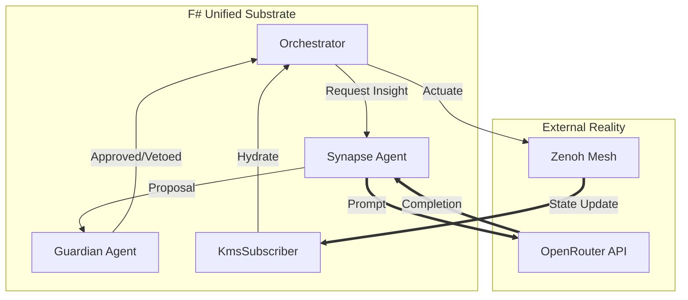

# PRAJNA MIGRATION PHASE 3: COGNITIVE EXPANSION
**Classification**: SAFETY-CRITICAL SPECIFICATION
**Status**: DRAFT
**Version**: 3.0.0 (Phase 3)
**Date**: 2026-01-15

---

## 1.0 LEVEL 1: CONCEPT & STRATEGIC INTENT
**"Awakening the Digital Twin"**

Phase 3 transitions the Prajna Cockpit from a passive observer (Phase 2) to an **active cognitive agent**. It establishes the "Cosmic Imperative" layers (L8-L9) by connecting the F# Brain to two external sources of truth:
1.  **The KMS (Knowledge Management System)**: The persistent "World Model" stored in the Elixir mesh.
2.  **The Cortex (OpenRouter)**: The "Higher Intelligence" providing heuristic analysis and decision support.

**Core Objectives:**
1.  **World Model Hydration**: The F# Cockpit must mirror the Elixir KMS state in real-time ($< 100ms$ lag).
2.  **Neuro-Symbolic Control**: Implement the **Simplex Architecture**, where non-deterministic AI proposals (Cortex) are verified by deterministic safety rules (Guardian) before execution.
3.  **Autonomous Evolution**: Allow the system to propose and validate its own code changes (GDE).

---

## 2.0 LEVEL 2: SPECIFICATION (REQUIREMENTS)

### 2.1 Functional Requirements
*   **REQ-FUNC-001**: `KmsSubscriber` MUST consume `indrajaal/kms/state/**` topics and update the local `CockpitState`.
*   **REQ-FUNC-002**: `OpenRouterClient` MUST provide a typed interface to LLM providers with exponential backoff.
*   **REQ-FUNC-003**: `Synapse` agent MUST mediate between the `Orchestrator` and `OpenRouter`, maintaining context window hygiene.

### 2.2 Safety Requirements (STAMP - SC-NEURO)
*   **REQ-SAFE-001 (SC-NEURO-001)**: **Simplex Principle**: AI outputs SHALL NEVER be executed directly. They MUST pass through `Guardian.validate()`.
*   **REQ-SAFE-002 (SC-NEURO-004)**: **Shadow Mode**: New decision logic MUST run in "Shadow Mode" (logging only) until verified.
*   **REQ-SAFE-003 (SC-KMS-001)**: **State Integrity**: KMS updates MUST be cryptographically verified (Zenoh signatures) before application.

---

## 3.0 LEVEL 3: ARCHITECTURE (BICAMERAL MIND)



### 3.1 The Synapse Agent
The `Synapse` is the bridge between the deterministic runtime and the probabilistic AI. It manages:
*   **Context Assembly**: Gathering relevant state from `Orchestrator` to form prompts.
*   **Token Budgeting**: Ensuring AI costs remain within L5 limits.
*   **Hallucination Check**: Basic schema validation of AI responses.

---

## 4.0 LEVEL 4: DESIGN (COMPONENT VIEW)

### 4.1 Module: `Cepaf.Cockpit.Zenoh.KmsSubscriber`
**Status**: Existing but commented out. Needs migration to `ZenohService` pattern.
*   **Topics**: `indrajaal/kms/nodes`, `indrajaal/kms/alarms`, `indrajaal/kms/topology`.
*   **Action**: Updates the `CockpitState` atom inside `Orchestrator`.

### 4.2 Module: `Cepaf.Cockpit.AI.OpenRouter`
**Status**: New.
*   **Responsibility**: HTTP Client for OpenRouter.ai.
*   **Features**: Model selection, budget tracking, retry logic.

### 4.3 Module: `Cepaf.Cockpit.Cortex.Synapse`
**Status**: New.
*   **Input**: `AnalyzeState(CockpitState)`, `SuggestFix(ErrorLog)`.
*   **Output**: `Proposal(Action)`.

---

## 5.0 LEVEL 5: IMPLEMENTATION PLAN

### 5.1 Step 1: KMS Integration
1.  Uncomment and refactor `KmsSubscriber.fs`.
2.  Bind to `ZenohService` for subscription.
3.  Define `KmsEvent` DU for state updates.

### 5.2 Step 2: OpenRouter Client
1.  Create `OpenRouterTypes.fs` (Request/Response schemas).
2.  Implement `OpenRouterClient.fs` using `HttpClient` (or `Zenoh` if proxying through Elixir, but direct F# is preferred for latency).
    *   *Decision*: F# will call OpenRouter directly to demonstrate "Brain in a Box" capability, but respect `OPENROUTER_API_KEY` from env.

### 5.3 Step 3: Synapse Agent
1.  Create `Synapse.fs`.
2.  Implement "Shadow Mode" logic.
3.  Connect to `Guardian` for the Simplex loop.

---

## 6.0 LEVEL 6: TESTING STRATEGY

### 6.1 The "Dreaming" Test (Simulation)
*   **Scenario**: Feed the system a simulated "Critical Alarm".
*   **Expectation**:
    1.  `KmsSubscriber` sees alarm.
    2.  `Synapse` analyzes it and proposes "Scale Up".
    3.  `Guardian` approves/vetoes based on `Safety.Envelope`.
    4.  Action is logged (Shadow Mode) or executed.

---

## 7.0 LEVEL 7: BDD USE CASES

### Feature: Autonomous Remediation
**User Story**: As an Operator, I want the system to suggest fixes for common errors.

```gherkin
Scenario: AI Proposal Generation
  Given the system is in "Shadow Mode"
  When a "High Memory" alert is received via KMS
  Then the Synapse Agent should generate a "GarbageCollect" proposal
  And the Guardian should Validate the proposal
  And the Orchestrator should Log the proposal (without executing)
```
