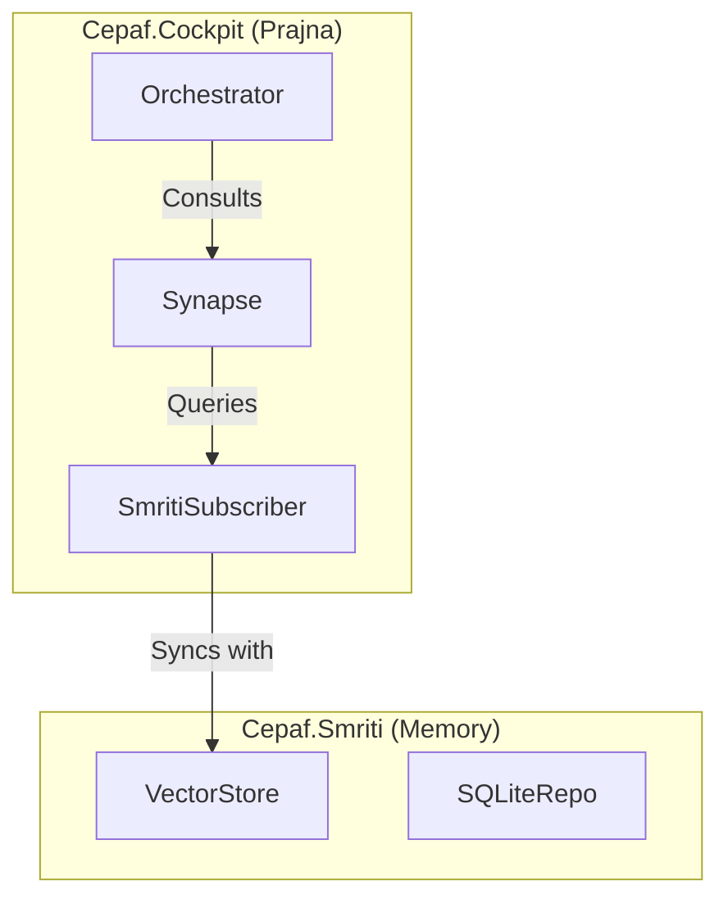

# PRAJNA MIGRATION PHASE 4: CONSOLIDATION & SMRITI UNIFICATION
**Classification**: MAINTENANCE & STANDARDIZATION
**Status**: DRAFT
**Version**: 4.0.0 (Phase 4)
**Date**: 2026-01-15

---

## 1.0 LEVEL 1: CONCEPT & STRATEGIC INTENT
**"Naming is Power"**

The final phase of the Prajna migration unifies the nomenclature of the system. The temporary "ZKMS" (Zenoh Knowledge Management System) designation is officially retired in favor of **SMRITI** (Sanskrit: *Remembrance*). This aligns the F# Unified Substrate with the core Indrajaal ontology (Prajna = Wisdom, Smriti = Memory).

**Core Objectives:**
1.  **Semantic Unity**: Eliminate cognitive dissonance caused by mixed naming (KMS vs ZKMS vs Smriti).
2.  **Codebase Hygiene**: Remove dead code, legacy Elixir bridges, and temporary shims used during migration.
3.  **Final Polish**: Ensure all namespaces, project files, and documentation reflect the target architecture.

---

## 2.0 LEVEL 2: SPECIFICATION (REQUIREMENTS)

### 2.1 Refactoring Requirements
*   **REQ-REF-001**: All F# namespaces matching `Cepaf.Zkms.*` or `Cepaf.Cockpit.Zenoh.Kms*` SHALL be renamed to `Cepaf.Smriti.*`.
*   **REQ-REF-002**: The `Cepaf.KmsCatalog` project SHALL be renamed to `Cepaf.Smriti`.
*   **REQ-REF-003**: `KmsSubscriber.fs` SHALL be renamed to `SmritiSubscriber.fs`.

### 2.2 Cleanup Requirements
*   **REQ-CLN-001**: Remove `Zenoh/KmsSubscriber.fs` (old location) if it was duplicated.
*   **REQ-CLN-002**: Ensure no "ZKMS" strings remain in user-facing outputs or logs (except for legacy compatibility if strictly needed).

---

## 3.0 LEVEL 3: ARCHITECTURE (FINAL STATE)



---

## 4.0 LEVEL 4: IMPLEMENTATION PLAN

### 4.1 Step 1: Project Renaming
1.  Rename `Cepaf.KmsCatalog` directory and `.fsproj` to `Cepaf.Smriti`.
2.  Update solution references in `Cepaf.sln` and `Cepaf.Cockpit.fsproj`.

### 4.2 Step 2: Namespace Refactoring
1.  Find/Replace `namespace Cepaf.KmsCatalog` -> `namespace Cepaf.Smriti`.
2.  Find/Replace `namespace Cepaf.Cockpit.Zenoh.KmsSubscriber` -> `namespace Cepaf.Cockpit.Smriti`.

### 4.3 Step 3: Verification
1.  Build entire solution.
2.  Run `Phase3Verification` (updated to use new names) to ensure no regression.

---

## 5.0 LEVEL 6: TESTING STRATEGY

### 5.1 The "Identity" Test
*   **Scenario**: Verify that the system identifies itself correctly.
*   **Action**: Run `dotnet run -- --version`.
*   **Expectation**: Output contains "Smriti" and no "ZKMS".

### 5.2 Regression Suite
*   Run `Phase2Verification` and `Phase3Verification` to ensure the renaming didn't break connectivity or cognitive functions.

---

## 6.0 LEVEL 7: BDD SCENARIOS

### Feature: Semantic Consistency
**User Story**: As a Developer, I want consistent naming so I don't get confused.

```gherkin
Scenario: Smriti Namespace Usage
  Given I am looking at the "World Model" code
  Then the namespace should be "Cepaf.Smriti"
  And the primary subscriber should be "SmritiSubscriber"
  And "KMS" should not appear in new code files
```
