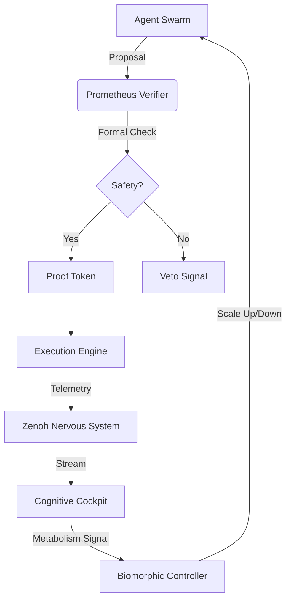

# PROMETHEUS Technical Specification: Nervous System & Verification Layer

**Version**: 5.1 (Deep Pass Updated)
**Date**: 2026-01-01
**Context**: Task 26.0 - PROMETHEUS & Biomorphic Activation
**Reference**: `docs/plans/20260101-prometheus-biomorphic-implementation-plan.md`

---

## 1.0 System Architecture (Level 5 Detail)

### 1.1 The Neuro-Symbolic Loop


---

## 2.0 Nervous System Specification (Zenoh NIF)

### 2.1 Rust Interface (`native/zenoh_nif/src/lib.rs`)
The NIF MUST expose the following symbols to Elixir. All I/O operations MUST use `DirtyIo` schedulers to prevent BEAM scheduler collapse (SC-NIF-001).

```rust
// Symbol Mapping
["zenoh_open_session", 1, zenoh_open_session, Scheduler::DirtyIo],
["zenoh_close_session", 1, zenoh_close_session, Scheduler::DirtyIo],
["zenoh_declare_publisher", 2, zenoh_declare_publisher, Scheduler::DirtyIo],
["zenoh_publisher_put", 2, zenoh_publisher_put, Scheduler::DirtyIo],
["zenoh_declare_subscriber", 3, zenoh_declare_subscriber, Scheduler::DirtyIo], // (Ref, Key, Pid)
```

### 2.2 Elixir Bridge (`lib/indrajaal/native/zenoh.ex`)
**Type Specification**:
```elixir
@type session_ref :: reference()
@type publisher_ref :: reference()
@type subscriber_ref :: reference()
@type key_expr :: String.t()
@type payload :: binary()

@callback open_session(keyword()) :: {:ok, session_ref()} | {:error, term()}
@callback put(publisher_ref(), payload()) :: :ok | {:error, term()}
```

**Fractal Key Structure**:
*   `Indrajaal/Domain/{DomainName}/Log/{Level}`
*   `Indrajaal/Agent/{AgentID}/Thinking`
*   `Indrajaal/System/Metabolism/Heartbeat`

---

## 3.0 PROMETHEUS Verification Engine

### 3.1 Mathematical Core (`Indrajaal.Prometheus.Verifier`)
**Objective**: Prove DAG Acyclicity and STAMP Constraint Satisfaction within strict latency budgets.

**Constraints**:
*   **SC-PROM-005**: Verification MUST complete within **5ms** (p99).
*   **SC-PROM-006**: Executive Agents MAY bypass verification with `override: true` (Audit Logged).

**Algorithm 1: DAG Safety (Kahn's Algorithm variant)**
Input: `Graph G = (V, E)`
1.  Compute in-degrees for all $v \in V$.
2.  Initialize queue $Q$ with all $v$ where $in\_degree(v) = 0$.
3.  While $Q$ is not empty:
    *   Pop $u$. Add to sorted list $L$.
    *   For each neighbor $v$ of $u$: decrement $in\_degree(v)$. If 0, push to $Q$.
4.  If $|L| \neq |V|$, **Cycle Detected** -> **REJECT**.
5.  Else -> **ACCEPT**.

**Algorithm 2: STAMP Satisfaction**
Input: `Action A`, `Constraints C`
1.  For each $c \in C$:
    *   Eval $c(A)$. If false, return `{:error, c}`.
2.  Return `{:ok, %ProofToken{id: uuid, timestamp: now}}`.

### 3.2 Proof Token (`Indrajaal.Prometheus.ProofToken`)
An opaque struct required by the Execution Engine.
```elixir
defstruct [:id, :issuer, :claims, :signature, :timestamp, :ttl]
```
*   **TTL**: Tokens expire after 500ms to prevent replay attacks (2nd Order Effect mitigation).

---

## 4.0 Biomorphic Controller (Metabolism)

### 4.1 Token Bucket Logic (`Indrajaal.Prometheus.Metabolism`)
*   **Capacity**: 1,000,000 TPM (Tokens Per Minute).
*   **Refill Rate**: 16,666 tokens/sec.
*   **Cost Function**:
    *   `thinking`: 100 tokens.
    *   `action`: 500 tokens.
    *   `verify`: 50 tokens.

### 4.2 Scaling Function (With Hysteresis)
$$ N_{target} = \min(N_{max}, N_{base} + \lfloor \frac{E_{current}}{E_{cost\_per\_agent}} \times \alpha \rfloor) $$
Where $\alpha = 0.8$ (Safety Margin).

**Hysteresis (Oscillation Prevention)**:
*   Scale Up: Immediate if $E_{current} > E_{threshold}$.
*   Scale Down: Delayed by 30s (Rolling Average) to prevent thrashing.

---

## 5.0 Data Flow & Telemetry

### 5.1 Telemetry Events
*   `[:indrajaal, :prometheus, :verify, :start]`
*   `[:indrajaal, :prometheus, :verify, :success]`
*   `[:indrajaal, :prometheus, :verify, :failure]`
*   `[:indrajaal, :zenoh, :put]`

### 5.2 Dashboard Data Contract
The Dashboard pulls state via `Indrajaal.Prometheus.Cockpit.get_state/0`.
**Return**:
```json
{
  "metabolism": { "energy": 850000, "load": 0.15 },
  "swarm": { "count": 12, "state": "expanding" },
  "proofs": { "verified": 145, "rejected": 2 }
}
```

---

## 6.0 Comprehensive Test Plan

### 6.1 Unit Tests
*   **VerifierTest**: Feed cyclic and acyclic graphs. Assert Rejection/Acceptance.
*   **MetabolismTest**: Drain token bucket. Verify `should_throttle?` returns true.

### 6.2 Integration Tests
*   **ZenohLoopback**: Pub -> Sub. Verify payload integrity.
*   **AgentLifecycle**: Spawn Agent -> Request Action -> Verify -> Execute -> Scale Down.

### 6.3 Property Tests (TDG)
*   **GraphProp**: Generate random DAGs. Verify topological sort correctness.
*   **TokenProp**: Generate random load patterns. Verify bucket never goes negative.

```